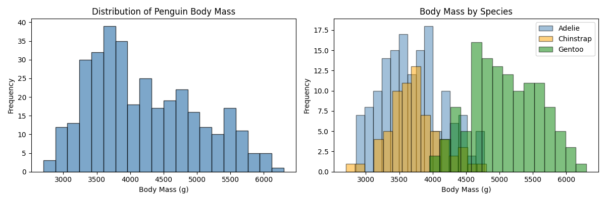
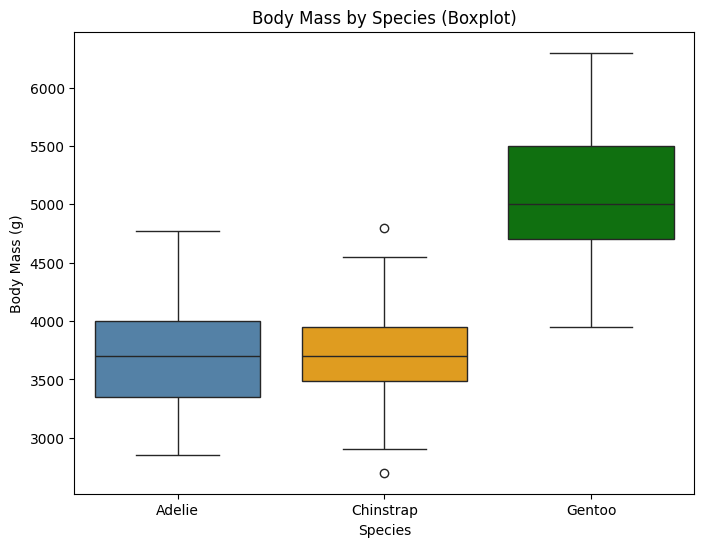
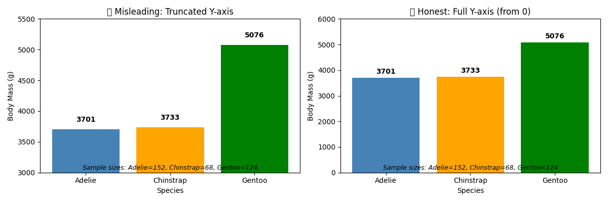

# Week 02：一页分布报告 —— 从"一个均值"到"看见数据的形状"

> "可视化最大的价值，在于迫使我们注意到那些从未料想会看到的东西。"
> —— John Tukey

近年来，"让 AI 先跑一遍 EDA" 已经成了很多人的起手式：上传 CSV，几秒钟就能得到一堆图表、相关性矩阵，甚至"初步结论"。GitHub Copilot 在 2026 年用户已超过 2000 万开发者，AI 正在编写约 46% 的代码。这很诱人，也很危险。

因为 AI 可以比你更快地算出一个均值、画出一张分布图，却不会替你问：这份数据到底在讲谁？均值和中位数选哪个才合适？这张图是不是把 Y 轴截断了？如果你连"数据长什么样"都没看清楚，后面的任何结论——无论 p 值多小、模型多复杂——都可能建在沙滩上。

<!-- 参考（访问日期：2026-02-15）：
- https://www.wearetenet.com/blog/github-copilot-usage-data-statistics
- https://itbrief.news/story/github-copilot-users-surpass-20-million-as-ai-tools-surge-in-demand
-->

本周我们不急着让 AI 帮我们画图。从集中趋势、离散程度、分布形状开始，先把统计直觉建立起来。然后我们用可视化把数据的故事讲清楚——不是"好看就行"，而是"诚实优先"。

---

## 前情提要

上一周你学会了先问"我想回答什么问题"，然后用数据卡把数据的边界写清楚。你知道了 Palmer Penguins 数据集有 344 行、7 列，知道了哪些字段有缺失值、缺失率是多少。这些信息是地基——但地基只是地基，你还没看到"数据长什么样"。

小北看了一眼数据卡，问："我知道 bill_length_mm 的缺失率是 2.4%，但我不知道它大概是多少毫米，也不知道三种企鹅的嘴峰长度是不是差很多。"

这正是本周要解决的问题：**用描述统计和可视化，把"数据长什么样"这个问题回答清楚**。

---

## 本章学习目标

完成本周学习后，你将能够：
1. 计算并解释集中趋势指标（均值、中位数、众数），知道什么时候该用哪个
2. 计算并解释离散程度指标（方差、标准差、极差、IQR），理解"波动"的意义
3. 用直方图和箱线图观察分布形状，识别偏度和异常值
4. 判断一张图是否"诚实"：避免 Y 轴截断、面积误导等常见陷阱
5. 在 StatLab 报告中加入描述统计和可视化，生成"一页分布报告"

---
<!--
贯穿案例：一次用户留存分析的误会

案例演进路线：
- 第 1 节（数据卡回顾）→ 确认样本是谁、时间范围是什么、字段怎么来的
- 第 2 节（集中趋势）→ 留存率看均值还是中位数？为什么（异常值的影响）
- 第 3 节（分布与分组）→ 不同渠道/不同城市分布有没有长尾（直方图、密度图）
- 第 4 节（离散程度与箱线图）→ 用箱线图识别异常值，解释 IQR 的意义
- 第 5 节（诚实可视化）→ 用一张图把误会讲清楚，并解释图的边界（避免误导）

最终成果：读者拥有一份"一页分布报告"，包含关键统计量和 2-3 张诚实的可视化图表

数据集：使用用户留存数据（或沿用 Penguins 数据，同时展示两种案例风格）

---

认知负荷预算：
- 本周新概念（4 个，预算上限 4 个）：
  1. 集中趋势（均值/中位数/众数）
  2. 离散程度（方差/标准差/IQR）
  3. 分布形状（偏度/峰度）
  4. 诚实可视化原则
- 结论：✅ 在预算内

回顾桥设计（至少 2 个）：
- [数据类型]（来自 week_01）：在第 1 节，通过"不同类型的字段用不同的集中趋势指标"再次使用
- [数据卡]（来自 week_01）：在第 5 节，通过"把分布报告写进数据卡/报告"再次使用

AI 小专栏规划：
- 第 1 个侧栏（第 2 节之后）：
  - 主题："AI 能替你选图表吗？"
  - 连接点：刚学完集中趋势，讨论 AI 自动选择统计量/图表类型的边界
  - 建议搜索词："AI automated chart selection 2026", "Python visualization recommendation tools 2026"

- 第 2 个侧栏（第 4 节之后）：
  - 主题："误导性可视化：AI 时代更常见的陷阱"
  - 连接点：刚学完箱线图和分布可视化，讨论 Y 轴截断、面积误导等常见问题
  - 建议搜索词："misleading data visualization examples 2026", "data visualization ethics 2026", "chart y-axis truncation controversy 2025"

角色出场规划：
- 小北（第 2 节）：只看均值就下结论，被老潘追问"中位数呢？"，引出异常值对均值的影响
- 阿码（第 3 节）：看到偏态分布后问"能不能用 AI 自动判断分布类型？"，引出 AI 的边界
- 老潘（第 5 节）：看到误导图后点评"在工业界，这种图会被产品经理挑战"，引出诚实可视化的重要性

StatLab 本周推进：
- 上周状态：只有数据卡（数据来源、字段字典、规模、缺失概览）
- 本周改进：加入描述统计（均值、中位数、标准差、分位数）和 2-3 张可视化图表
- 涉及的本周概念：集中趋势、离散程度、分布形状、诚实可视化
- 建议示例文件：examples/02_statlab_update.py（本周报告生成入口脚本）
-->

## 1. 哪个数字才是"典型"？

小北算出 Palmer Penguins 三个物种的平均体重：Adelie 3700g、Chinstrap 3733g、Gentoo 5076g。她立刻写下结论："Gentoo 企鹅比其他两种重了 1300g 左右。"

老潘看了一眼报告，问了一句："中位数呢？"

小北愣住了："啊？我算均值还不够吗？"

---

### 均值 vs 中位数：它们在回答不同的问题

上周你学会了**数据类型**（数值型 vs 分类型）。这周我们首先需要知道：**即使是数值型数据，也不是"一个均值就能说明一切"**。

均值（mean）和中位数（median）都在回答"什么是典型值"，但它们对"极端值"的敏感度完全不同。

```python
# examples/01_central_tendency.py
import seaborn as sns
import pandas as pd

penguins = sns.load_dataset("penguins")

# 计算三种企鹅的平均体重和中位数体重
print("按物种分组的体重统计：")
stats_by_species = penguins.groupby("species")["body_mass_g"].agg(
    mean="mean",
    median="median",
    count="count"
).round(1)
print(stats_by_species)
print()

# 计算整体的均值和中位数
print("整体统计：")
print(f"均值：{penguins['body_mass_g'].mean():.1f} g")
print(f"中位数：{penguins['body_mass_g'].median():.1f} g")
print(f"众数：{penguins['species'].mode().tolist()}")
```

运行后你会发现：Gentoo 的均值（5076g）和中位数（5050g）很接近，这说明它的分布比较对称。但如果你遇到有极端值的数据，均值就会被"拉偏"。

想象一个场景：你分析用户收入，数据是 `[3000, 3500, 4000, 4500, 100000]`。均值是 23000，但中位数只有 4000。哪个更"典型"？如果你说"我们的用户平均月入 2.3 万"，任何人都会以为你疯了——因为绝大多数人远没到这个数。中位数才是那个"一半人比我少、一半人比我多"的稳健指标。

### 什么时候用哪个？

老潘的经验法则是这样的：数据分布对称时，均值和中位数都可以用；但如果数据有极端值或长尾，均值会被拉偏，中位数更稳健。如果你需要计算总和（比如总收入），均值可累加，中位数不行；如果是分类型数据，那就用众数——比如 `species` 的众数是 `Adelie`，这是 152 只企鹅的物种。但对数值型数据，众数通常没什么用（连续数据可能根本没有重复值）。

阿码举手："那我是不是每次都应该算均值和中位数，看看它们差多少？"

好问题。如果均值和中位数很接近，说明分布比较对称，用哪个都可以；如果差得远，说明有偏态或极端值，这时中位数更可靠。

这一步你把"典型值"抓到了手。但典型值只是故事的一半——你还需要知道数据有多"散"。两个产品日留存率均值都是 40%，但一个稳定在 38%-42% 之间，另一个在 10%-70% 之间乱跳——你能说它们是一样的吗？这就是下一节要解决的问题。

## 2. 波动也是信息

小北看到两个产品的日留存率都是 40%，立刻在报告里写："两款产品表现一致。"

老潘把两份原始数据扔给她："你先看看这两个 40% 背后的波动有多大。"

---

### 标准差：给波动一个数字

离散程度（dispersion）衡量数据有多"散"。最常用的指标是**标准差**（standard deviation）和**四分位距**（IQR）。

```python
# examples/02_dispersion_demo.py
import seaborn as sns
import pandas as pd
import numpy as np

penguins = sns.load_dataset("penguins")

# 计算三种企鹅体重的标准差和 IQR
print("按物种分组的离散程度：")
dispersion_by_species = penguins.groupby("species")["body_mass_g"].agg(
    std="std",
    min=("min", lambda x: x.min()),
    q25=("quantile", lambda x: x.quantile(0.25)),
    median=("median", lambda x: x.median()),
    q75=("quantile", lambda x: x.quantile(0.75)),
    max=("max", lambda x: x.max())
).round(1)
print(dispersion_by_species)
print()

# 计算 IQR（四分位距）
def compute_iqr(series):
    q25 = series.quantile(0.25)
    q75 = series.quantile(0.75)
    return q75 - q25

print("整体 IQR：")
iqr = compute_iqr(penguins["body_mass_g"].dropna())
print(f"四分位距：{iqr:.1f} g")
```

标准差是方差的平方根。方差（variance）是每个点到均值的距离平方后求平均，单位是"克的平方"——这不好理解。所以开根号变回标准差，单位就恢复了。

阿码追问："那为什么不用方差？开根号多麻烦。"

问题在于单位。如果体重的单位是克，方差的单位就是"平方克"——这个物理意义很奇怪。标准差的优势在于它和原始数据单位一致，你可以说"平均来说，体重偏离均值约 500g"，这比"方差是 250000 平方克"好懂多了。

### 标准差 vs IQR：稳健性不同，用途也不同

标准差和 IQR 的区别，和均值与中位数的区别类似。如果数据接近正态分布，标准差是经典搭配，IQR 也可以；但如果数据有极端值，标准差会被放大，IQR 依然稳健。

如果你需要和均值搭配，用标准差；如果和中位数搭配，用 IQR。小北试了一下：她算出 Adelie 企鹅体重的标准差是 458g，IQR 是 650g。为什么这两个数字不一样？因为它们在回答略有不同的问题。标准差考虑了所有点到均值的距离，IQR 只看中间 50%。如果分布有长尾，标准差会更大，因为它被极端值"拉"出去了。

### 波动为什么重要？

老潘当年吃过亏。他做过一个 A/B 测试，对照组和实验组的均值只差 0.5%，他差点下结论"没差异"。但看标准差才发现：对照组波动很小（SD=1%），实验组波动很大（SD=5%）。这意味实验组"不稳定"——有些用户非常喜欢，有些非常讨厌，平均起来才看起来"差不多"。

**典型值 + 波动，才能完整描述数据**。均值告诉你"大概在哪里"，标准差告诉你"大概有多散"。只看均值，就像只看平均值而不知道方差——你可能会错过最重要的故事。

> **AI 时代小专栏：AI 能替你选图表吗？**
>
> 你刚学完集中趋势和离散程度，可能已经在想：AI 能不能直接告诉我该用均值还是中位数？能不能替我选一张最合适的图表？
>
> 2026 年确实有一批 AI 工具在做这件事：Vizly AI 可以从原始数据通过提示词自动生成图表，Tableau AI 能基于数据趋势自动生成"洞察"。它们很快——几秒钟就能产出你花半小时才能画完的图。但这里有个关键区别：**AI 可以帮你"画"图，但不会替你"选"图。**
>
> 举例：AI 可以比你更快地算出一个均值，但不会替你问："这个数据有极端值吗？均值和中位数选哪个才合适？" 你需要先看分布（用本周学的直方图/箱线图），判断数据是否对称、有没有长尾，再决定用哪个统计量。AI 会给你两个数字，但"选哪个"的判断需要你来做。
>
> 同理，AI 可以生成柱状图、折线图、饼图等七八种变体，但它不知道你的分析目标是什么。你是想"比较绝对差异"（用柱状图，Y 轴从 0 开始）还是"展示趋势变化"（用折线图，Y 轴可以适度截断）？你是想"强调占比"（用饼图，但要警惕面积误导）还是"支持精确比较"（用堆叠柱状图）？这些决策需要你理解数据和受众，AI 目前做不到。
>
> 这就是为什么你学的不只是"怎么算统计量"，而是"什么时候用哪个"。AI 是加速器，不是决策替代品。知道"为什么选这个图表"，比知道"怎么画这个图表"更重要。
>
> 参考（访问日期：2026-02-15）：
> - https://www.findanomaly.ai/best-ai-tools-data-analysis-visualization-2026
> - https://www.splunk.com/en_us/blog/learn/data-analysis-tools.html
> - https://www.reddit.com/r/datavisualization/comments/1r22kgg/a_growing_list_of_aipowered_data_visualization/

## 3. 把分布画出来

小北以为体重数据是"正态分布"——中间高、两边低、完美对称。她写代码画了一张直方图，结果愣住了：左边有一段小尾巴，右边也有一段小尾巴，而且不太对称。

"这是怎么了？我的数据有问题吗？"

---

### 直方图：看见分布的形状

```python
# examples/03_distribution_plots.py
import seaborn as sns
import matplotlib.pyplot as plt

penguins = sns.load_dataset("penguins")

fig, axes = plt.subplots(1, 2, figsize=(12, 4))

# 左图：所有企鹅的体重分布
axes[0].hist(penguins["body_mass_g"].dropna(), bins=20, edgecolor="black", alpha=0.7)
axes[0].set_xlabel("Body Mass (g)")
axes[0].set_ylabel("Frequency")
axes[0].set_title("Distribution of Penguin Body Mass")

# 右图：按物种分组的体重分布
for species in penguins["species"].unique():
    data = penguins[penguins["species"] == species]["body_mass_g"].dropna()
    axes[1].hist(data, bins=15, alpha=0.5, label=species, edgecolor="black")

axes[1].set_xlabel("Body Mass (g)")
axes[1].set_ylabel("Frequency")
axes[1].set_title("Body Mass by Species")
axes[1].legend()

plt.tight_layout()
plt.savefig("output/distribution_plots.png", dpi=100)
print("图表已保存到 output/distribution_plots.png")
```

运行后你会看到：左图有一个"双峰"（两个鼓包），右图揭示了真相——Gentoo 企鹅整体更重，Adelie 和 Chinstrap 较轻但重叠。如果你只看整体均值（4200g），你会错过这个最重要的发现：**这份数据不是单一群体，而是三个群体的混合**。


*图：企鹅体重分布。左图为整体分布（可见双峰），右图按物种分组后揭示了三个群体的差异*

阿码看到直方图后问："能不能用 AI 自动判断这是正态分布还是别的分布？"

技术上可以。AI 可以用拟合优度检验（如 Kolmogorov-Smirnov 检验）告诉你"这不符合正态分布"。但这里有个更大的问题：**为什么要判断分布类型？**

如果你的目标是"做 t 检验"（Week 06 会学），那你需要关心数据是否近似正态；但如果你的目标是"描述数据长什么样"，直方图已经告诉你答案了——它是不是对称的、有没有长尾、有几个峰。这些直观观察，比一个"p < 0.05 的正态性检验"更有用。

### 密度图：更平滑的分布

直方图的缺点是它对 `bins` 参数敏感——你选 10 个 bins 和 30 个 bins，形状可能完全不同。密度图（density plot）是一种平滑的替代方案：

```python
# 密度图示例
plt.figure(figsize=(8, 5))
sns.kdeplot(data=penguins, x="body_mass_g", hue="species", fill=True, alpha=0.3)
plt.xlabel("Body Mass (g)")
plt.ylabel("Density")
plt.title("Density Plot of Body Mass by Species")
plt.savefig("output/density_plots.png", dpi=100)
```

密度图的优势是平滑，适合观察整体形状；缺点是可能会掩盖细节（比如小样本的离散度）。实践中，两种图都可以试试。

### 偏度和峰度：描述形状的数字

如果你想用数字描述形状，可以用**偏度**（skewness）和**峰度**（kurtosis）：

```python
# 计算偏度和峰度
print("偏度和峰度：")
print(f"偏度：{penguins['body_mass_g'].skew():.2f}")
print(f"峰度：{penguins['body_mass_g'].kurtosis():.2f}")
```

偏度描述分布的"不对称性"：负偏态表示左边有长尾，正偏态表示右边有长尾。峰度描述分布的"尖峭程度"：峰度高表示中间更尖、尾部更厚，峰度低表示更平坦。

但这些数字不如图直观。新手阶段，**先学会看图**。偏度和峰度等你需要"自动化判断分布形状"时再用——比如写一个脚本自动检测数据是否近似正态。

现在你已经学会了：典型值（均值/中位数）+ 波动（标准差/IQR）+ 形状（直方图/密度图）。下一节我们用一个更强大的工具——箱线图——把异常值直接摆到你面前。

## 4. 用箱线图发现异常值

老潘拿到一份新的用户数据，第一件事不是算均值，而是画一张箱线图。三秒钟后他指着右边的一个点说："这个，先查一下是不是数据错误。"

小北凑过去看："你怎么知道它是异常值？"

---

### 箱线图：一眼看穿中位数、分散度和异常值

箱线图（boxplot）是把一堆统计量压缩到一张图里的神器：中位数（箱子里面的线）、Q25/Q75（箱子的上下边）、IQR（箱子的高度）、须（whiskers，通常是 Q1-1.5×IQR 和 Q3+1.5×IQR），以及异常值（须之外的点）。

```python
# 箱线图示例（节选）
import seaborn as sns
import matplotlib.pyplot as plt

penguins = sns.load_dataset("penguins")

fig, axes = plt.subplots(1, 2, figsize=(12, 4))

# 左图：单变量箱线图
sns.boxplot(data=penguins, y="body_mass_g", ax=axes[0])
axes[0].set_ylabel("Body Mass (g)")
axes[0].set_title("Boxplot of Body Mass")

# 右图：按物种分组的箱线图
sns.boxplot(data=penguins, x="species", y="body_mass_g", ax=axes[1])
axes[1].set_xlabel("Species")
axes[1].set_ylabel("Body Mass (g)")
axes[1].set_title("Body Mass by Species")

plt.tight_layout()
plt.savefig("output/boxplot_demo.png", dpi=100)
print("图表已保存到 output/boxplot_demo.png")
```

运行后你会看到：右图中，Gentoo 的体重整体更高，而且箱子更"宽"（IQR 更大）。Adelie 和 Chinstrap 有一些离群点（须之外的圆圈）——这些是异常值的候选。


*图：按物种分组的箱线图。Gentoo 明显更重，Adelie 和 Chinstrap 有一些离群点*

### 异常值的判断标准：1.5×IQR 规则

箱线图的"须"通常延伸到 Q1-1.5×IQR 和 Q3+1.5×IQR。超出这个范围的点会被画成单独的点——它们可能是异常值。

为什么要用 1.5×IQR？这是一个经验法则：如果数据近似正态分布，大约 0.7% 的点会落在这个范围之外。它不是"绝对真理"，但提供了一个"值得怀疑"的阈值。

阿码问："那这些点一定是错误吗？"

不一定。异常值有三种可能：录入错误（比如体重 10000g，可能是多打了一个零）、测量误差（比如传感器故障导致的极端值）、真实但极端（比如某只企鹅确实特别胖）。前两种可以修正或删除，第三种应该保留——它可能是重要发现。

小北的第一反应是"把异常值删掉"。老潘拦住她："先搞清楚它是什么。"Week 03 我们会详细讨论异常值处理策略，但第一原则永远是：**不要因为"它看起来奇怪"就删掉**。异常值有时是最有价值的数据——比如那只特别胖的企鹅，可能是亚种或特殊环境下的样本。

### 箱线图 vs 直方图：各有所长

实践中，两种图都可以画。箱线图适合"快速筛查异常值"和"多组比较"——异常值直观可见，多组数据并排摆放很方便；直方图适合"观察分布形状"——你能看到双峰、长尾、偏态的细节。箱线图直接显示中位数和 IQR，直方图则需要额外计算。

现在你已经掌握了描述统计的核心工具：集中趋势（均值/中位数）、离散程度（标准差/IQR）、分布形状（直方图/箱线图）。下一节我们讨论一个更危险的话题：**如何用图撒谎，以及如何避免**。

> **AI 时代小专栏：误导性可视化：AI 时代更常见的陷阱**
>
> 你刚学了"诚实可视化三原则"：Y 轴从 0 开始、标注实际数值、标注样本量。这些不是教条，而是让你的报告经得住别人挑战的保险单。在 AI 时代，这份保险单比任何时候都重要。
>
> 为什么？因为生成误导图的成本更低了。2025 年的一项 ACM 研究系统性分析了 Y 轴截断的争议，论文标题就很直白："To Cut or Not To Cut?" 研究发现：柱状图截断通常不可接受（因为人类比较的是"面积"，截断会让小差异看起来很大），折线图截断相对可接受（因为趋势更重要）。但问题是，当你让 AI "画一个好看的柱状图"时，它可能会截断 Y 轴让差异更明显，或者用鲜艳的颜色让图表"更吸引眼球"。
>
> 更棘手的是，误导性可视化不总是故意的。2025 年的另一项研究发现，很多误导图来自"设计选择不当"或"缺乏伦理意识"——作者可能只是想让图表"更紧凑"，没意识到截断 Y 轴会把 10% 的差异放大成"看起来像两倍"。而 AI 生成图表时更不会主动提醒你："这张图可能会误导读者。"
>
> 这就是为什么你需要成为"能识别误导图的人"。生成误导图的工具越普及，能识别误导图的人就越稀缺。你刚学的"诚实可视化三原则"不是过时的教条，而是 AI 时代的核心竞争力。
>
> 参考（访问日期：2026-02-15）：
> - https://dl.acm.org/doi/full/10.1145/3613904.3642102
> - https://www.sciencedirect.com/science/article/abs/pii/S0360131525002763
> - https://claribi.com/blog/post/data-visualization-mistakes-to-avoid/

## 5. 一张图把误会讲清楚

小北做了一个柱状图，比较三种企鹅的平均体重。她把 Y 轴截断在 3000g-5500g 之间，图上看起来 Gentoo 的体重是其他两种的"两倍"。

"太棒了！"她把图放进报告。

老潘看了一眼，只说了一句话："把 Y 轴从 0 开始，再发给我。"

---

### Y 轴截断：把"差异"放大

```python
# examples/04_honest_visualization.py
import seaborn as sns
import matplotlib.pyplot as plt

penguins = sns.load_dataset("penguins")

# 计算各物种的平均体重
mean_mass = penguins.groupby("species")["body_mass_g"].mean().reset_index()

fig, axes = plt.subplots(1, 2, figsize=(12, 4))

# 左图：截断 Y 轴（误导性）
axes[0].bar(mean_mass["species"], mean_mass["body_mass_g"], color=["steelblue", "orange", "green"])
axes[0].set_ylim(3000, 5500)  # 截断 Y 轴
axes[0].set_ylabel("Body Mass (g)")
axes[0].set_title("Misleading: Truncated Y-axis")
axes[0].set_xlabel("Species")

# 右图：完整 Y 轴（诚实）
axes[1].bar(mean_mass["species"], mean_mass["body_mass_g"], color=["steelblue", "orange", "green"])
axes[1].set_ylim(0, 6000)  # 从 0 开始
axes[1].set_ylabel("Body Mass (g)")
axes[1].set_title("Honest: Full Y-axis")
axes[1].set_xlabel("Species")

# 标注实际数值
for ax in axes:
    for i, row in mean_mass.iterrows():
        ax.text(i, row["body_mass_g"] + 50, f"{row['body_mass_g']:.0f}",
                ha="center", va="bottom")

plt.tight_layout()
plt.savefig("output/honest_visualization.png", dpi=100)
print("图表已保存到 output/honest_visualization.png")
```

左图看起来 Gentoo 的体重是 Adelie 的"两倍高"，但右图告诉你真相：其实只重了约 37%。这就是 Y 轴截断的力量——它可以把"小差异"变成"看起来很大"。


*图：Y 轴截断的误导效果。左图截断 Y 轴后差异被放大，右图从 0 开始展示真实比例*

阿码问："那我是不是永远不能截断 Y 轴？"

也不是。截断 Y 轴有时是必要的（比如所有数据都在 0.98-1.02 之间，从 0 开始会看不出差异）。但如果你截断了，**必须在标题或注释中说明**，并且提供完整 Y 轴的版本作为对照。

### 诚实的可视化：三条原则

老潘在工业界的经验是：任何图表如果经不住这三条检验，就不要放进报告。

**1. Y 轴从 0 开始**（除非你有充分的理由不这样做，并说明）

**2. 标注实际数值**（不要让读者"猜"差异有多大）

**3. 标注样本量**（"Adelie 152 只、Gentoo 124 只"——读者需要知道这个差异是基于多少数据）

这三条听起来很简单，但违反它们的图表每天都在发生。小北那张截断 Y 轴的图，如果发给产品经理，会被立刻打回来："你这是在误导我。"

### 其他常见陷阱

**面积陷阱**：用二维图形表示一维数据。比如一个饼图的"扇形面积"是另一个的两倍，你会感觉差异很大——但如果换成柱状图，可能只差 10%。人类对"面积"的感知不如对"高度"准确。

**颜色陷阱**：用颜色强度表示数值，但没有图例（legend）。读者不知道"深红色"比"浅红色"大多少。

**时间陷阱**：X 轴不是均匀间隔的（比如 1 月、2 月、4 月、5 月，跳过了 3 月），但画出来时点与点之间的距离看起来一样。这会扭曲趋势。

阿码问："AI 会犯这些错误吗？"

AI 会。如果你让 AI "画一个好看的柱状图"，它可能会截断 Y 轴让差异更明显，或者用鲜艳的颜色让图表"更吸引眼球"。**人类有动机去误导，AI 有动机去"讨好"——两者都不可靠。**

所以你学的不只是"怎么画图"，而是"怎么判断一张图是否诚实"。这个技能在 AI 时代更重要：因为生成误导图的成本更低了，能识别误导图的人就更稀缺了。

---

## StatLab 进度

### 本周改进：从"只有数据卡"到"一页分布报告"

上周的 StatLab 报告只有一份数据卡——它回答了"数据从哪来、字段是什么、有多少缺失"，但没回答"数据长什么样"。

这周我们把描述统计和可视化加进来。现在 `report.md` 会多出两个部分：

**1. 描述统计表**

```python
# 生成描述统计表
def generate_summary_stats(df: pd.DataFrame, numeric_cols: list) -> pd.DataFrame:
    """生成描述统计表"""
    stats = df[numeric_cols].agg([
        ("count", "count"),
        ("mean", "mean"),
        ("median", "median"),
        ("std", "std"),
        ("min", "min"),
        ("Q25", lambda x: x.quantile(0.25)),
        ("Q75", lambda x: x.quantile(0.75)),
        ("max", "max")
    ]).round(1)
    return stats
```

这张表会告诉你每个数值型字段的均值、中位数、标准差、分位数——你一眼就能看出"典型值"和"波动"。

**2. 可视化图表**

```python
# 生成关键可视化
def generate_plots(df: pd.DataFrame, output_dir: str):
    """生成分布图和箱线图"""
    import matplotlib.pyplot as plt
    import seaborn as sns
    from pathlib import Path

    Path(output_dir).mkdir(parents=True, exist_ok=True)

    # 1. 按物种分组的体重分布（直方图）
    plt.figure(figsize=(10, 6))
    for species in df["species"].unique():
        data = df[df["species"] == species]["body_mass_g"].dropna()
        plt.hist(data, bins=15, alpha=0.5, label=species, edgecolor="black")
    plt.xlabel("Body Mass (g)")
    plt.ylabel("Frequency")
    plt.title("Body Mass Distribution by Species")
    plt.legend()
    plt.savefig(f"{output_dir}/dist_by_species.png", dpi=100, bbox_inches="tight")
    plt.close()

    # 2. 按物种分组的体重箱线图
    plt.figure(figsize=(8, 6))
    sns.boxplot(data=df, x="species", y="body_mass_g")
    plt.xlabel("Species")
    plt.ylabel("Body Mass (g)")
    plt.title("Body Mass by Species (Boxplot)")
    plt.savefig(f"{output_dir}/boxplot_by_species.png", dpi=100, bbox_inches="tight")
    plt.close()

    print(f"图表已保存到 {output_dir}/")
```

这两张图会告诉你"数据的形状"和"异常值在哪里"。

### 与本周知识的连接

**集中趋势** → 描述统计表中的 `mean` 和 `median` 列，让你一眼看出典型值。

**离散程度** → `std` 和 `IQR`（Q75-Q25）列，告诉你数据有多散。

**分布形状** → 直方图和箱线图，让你看到数据是不是对称的、有没有长尾、有没有异常值。

**诚实可视化** → 我们在生成图表时，箱线图的 Y 轴默认从 0 开始（除非数据本身远大于 0），柱状图标注了实际数值，图例中会注明样本量。这些细节让报告更可信。

### 与上周的对比

| 上周 | 本周 |
|------|------|
| 只有数据卡 | 数据卡 + 描述统计 + 2 张图 |
| 知道"数据是什么" | 知道"数据长什么样" |
| 无法判断异常值 | 能从箱线图直接看到异常值 |
| 无法判断分布形状 | 能从直方图看到双峰、长尾 |

老潘看到这份新报告，会说："现在你不仅能告诉别人'数据从哪来'，还能告诉别人'数据在说什么'。这就是从'有数据'到'有洞察'的第一步。"

### 下周预告

本周的报告包含了"一页分布报告"：数据卡 + 描述统计表 + 2-3 张图。下周我们会加入缺失值处理和异常值处理策略，并在报告中记录"我们做了什么、为什么这么做"。

---

## Git 本周要点

本周必会命令：
- `git diff`（查看本周对报告的修改）
- `git log --oneline -n 5`（查看提交历史）

常见坑：
- 生成的图片没有提交：报告里引用了 `images/distribution.png`，但文件不在仓库里
- 路径问题：图片路径写死（`/Users/xxx/images/`），换电脑就跑不了

老潘的建议：把图片放在 `output/` 目录下，用相对路径引用（``）。这样无论在谁电脑上跑，路径都能对上。

---

## 本周小结（供下周参考）

这周你学会了"看见数据的形状"。你知道了均值和中位数在回答不同的问题——前者对极端值敏感，后者稳健。你也知道了标准差和 IQR 在描述波动：它们告诉你"典型值"到底有多"典型"。更重要的是，你学会了用直方图和箱线图把分布画出来：一眼就能看出数据是不是对称的、有没有长尾、有没有异常值。

最后一项技能是"诚实可视化"。你看到了 Y 轴截断如何把小差异放大成"看起来很大"，也知道了三条原则：Y 轴从 0 开始、标注实际数值、标注样本量。这些不是"教条"，而是让你的报告经得住别人挑战的保险单。

StatLab 报告也从"只有数据卡"升级为"数据卡 + 描述统计 + 2-3 张图"。现在任何人打开报告，都能在第一页看到"数据在说什么"，而不是翻遍代码才能找到统计量。

下周，我们会处理这周看到的"问题"：缺失值和异常值。我们不是一上来就 `dropna()`，而是先把"我们做了什么、为什么这么做"写进清洗日志，让报告变得可审计、可复现。

---

## Definition of Done（学生自测清单）

- [ ] 我能用自己的话解释"均值和中位数有什么区别，什么时候该用哪个"
- [ ] 我能计算标准差和 IQR，并解释"波动"的含义
- [ ] 我能用直方图和箱线图观察分布，识别异常值
- [ ] 我能判断一张图是否诚实（Y 轴是否截断、面积是否误导）
- [ ] 我能在 StatLab 报告中加入描述统计和可视化
- [ ] 我知道为什么不能"只看均值就下结论"
