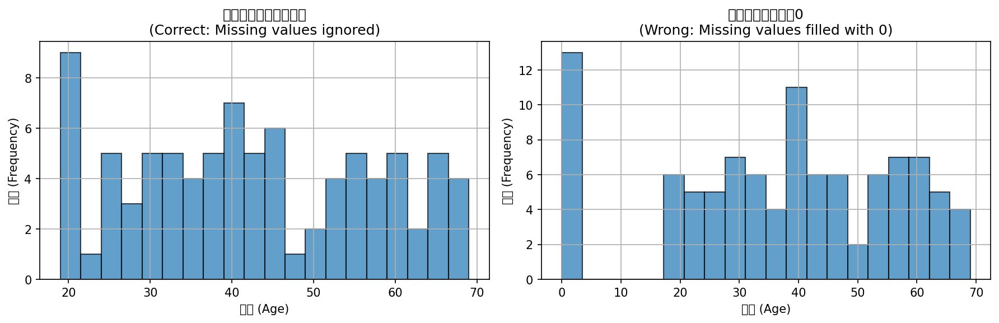
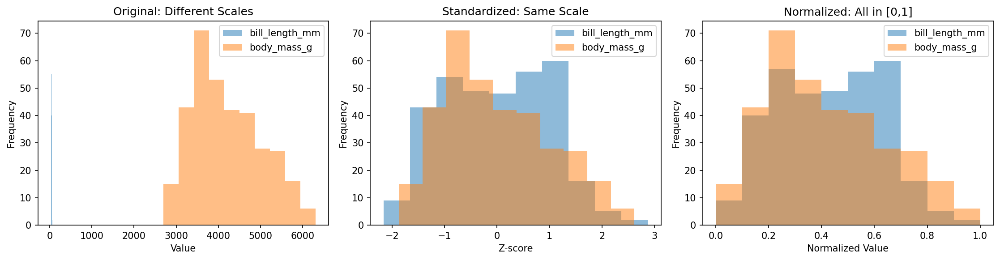

# Week 03：数据清洗与准备 —— 从"原始数据"到"可分析数据"

> "Without data, you're just another person with an opinion."
> — W. Edwards Deming

近年来，吴恩达的 "Data-centric AI" 理念正在改变数据科学领域的实践。越来越多团队意识到：与其不断换更大的模型，不如先把数据质量做好。2025 年的行业调查显示，数据科学家仍然有约 80% 的时间花在数据准备和清洗上，而模型开发只占约 20%。与此同时，69% 的 BI 团队表示大部分时间花在重复性数据准备任务上。

但 AI 工具的普及让"一键清洗"看起来触手可及：上传 CSV，几秒钟就能完成缺失值填充、异常值处理，甚至自动特征工程。Gartner 预测，到 2026 年，75% 的企业将使用生成式 AI 创建合成数据来填补缺失。

这很诱人，也很危险。因为 AI 可以比你更快地填充缺失值，却不会替你问：这些缺失值为什么会发生？是随机丢失，还是和未观测的变量有关？填充后的结论是否还可靠？AI 可以标记异常值，但不会替你判断：这是真正的错误，还是一个有价值的发现？

本周我们不急着让 AI 帮我们"自动清洗"。从缺失值机制、异常值检测、数据转换和特征编码开始，先把"什么是脏数据、为什么脏、怎么处理才靠谱"建立起来。然后我们会把每一个清洗决策写进日志，让分析变得可复现、可审计。

<!-- 参考（访问日期：2026-02-15）：
- https://optimusai.ai/data-scientists-spend-80-time-cleaning-data/
- https://www.integrate.io/blog/data-transformation-challenge-statistics/
- https://www.forbes.com/sites/bernardmarr/2025/11/19/the-8-data-trends-that-will-define-2026/
-->

---

## 前情提要

上一周你学会了"看见数据的形状"。你知道了均值和中位数的区别、标准差和 IQR 的意义，也学会了用直方图和箱线图把分布画出来。在 StatLab 报告中，你已经生成了一页包含数据卡、描述统计和可视化的报告。

小北拿着上周的报告问："我知道 bill_length_mm 的分布有点偏态，也知道有一些异常值。但接下来我该怎么办？是直接把异常值删掉吗？"

这正是本周要解决的问题：**不要因为"数据看起来有问题"就直接动手。先搞清楚"问题是什么"，再把"我们做了什么、为什么这么做"写进报告。**

---

## 学习目标

完成本周学习后，你将能够：
1. 判断缺失值的类型（MCAR、MAR、MNAR），并选择合适的处理策略
2. 用统计方法（IQR、Z-score）和业务规则检测异常值
3. 理解数据转换的目的（标准化、归一化、对数变换）
4. 掌握特征编码的基本方法（One-hot、Label encoding）
5. 在 StatLab 报告中加入清洗日志，记录每一个数据决策

---
<!--
贯穿案例：清洗决策日志

案例演进路线：
- 第 1 节（缺失机制诊断）→ 检查缺失模式，判断 MCAR/MAR/MNAR
- 第 2 节（缺失值处理策略）→ 对比删除 vs 填充 vs 预测的效果
- 第 3 节（异常值检测）→ 用 IQR 和 Z-score 识别候选异常值
- 第 4 节（异常值处理决策）→ 业务规则 vs 统计规则，记录决策理由
- 第 5 节（数据转换与编码）→ 标准化、归一化、特征编码的适用场景

最终成果：读者拥有一份"清洗决策日志"，包含每一个数据问题的诊断和处理理由

数据集：继续使用 Palmer Penguins 或引入新的带缺失/异常的数据集（如用户留存数据）

---

认知负荷预算：
- 本周新概念（4 个，预算上限 4 个）：
  1. 缺失值机制（MCAR/MAR/MNAR）
  2. 异常值检测方法（IQR/Z-score）
  3. 数据转换（标准化/归一化/对数变换）
  4. 特征编码（One-hot/Label/Target encoding）
- 结论：✅ 在预算内

回顾桥设计（至少 2 个）：
- [集中趋势]（来自 week_02）：在第 1 节，通过"缺失值对均值的影响"再次使用
- [箱线图]（来自 week_02）：在第 3 节，通过"用箱线图识别异常值"再次使用
- [分布形状]（来自 week_02）：在第 5 节，通过"对数变换改善偏态"再次使用

AI 小专栏规划：
- 第 1 个侧栏（第 2 节之后）：
  - 主题："AI 能替你做数据清洗吗？"
  - 连接点：刚学完缺失值处理，讨论 AI 自动清洗的边界
  - 建议搜索词："AI automated data cleaning tools 2026", "pandas AI data cleaning 2026", "missing data imputation AI 2025"

- 第 2 个侧栏（第 4 节之后）：
  - 主题："异常值：错误还是发现？"
  - 连接点：刚学完异常值处理，讨论异常值的两面性
  - 建议搜索词："outlier detection business value 2026", "data anomalies as insights 2025", "anomaly detection case studies 2026"

角色出场规划：
- 小北（第 1 节）：把缺失值直接当成 0 处理，画出误导性的图，引出缺失机制的重要性
- 阿码（第 2 节）：问"能不能用 AI 自动选择最佳填充策略？"，引出 AI 的边界和人工判断的必要性
- 老潘（第 4 节）：看到"直接删除所有异常值"的代码后点评"在公司里这样写会被 code review 打回来"，引出可复现性和决策记录的重要性

StatLab 本周推进：
- 上周状态：数据卡 + 描述统计 + 可视化
- 本周改进：加入清洗日志（missing summary、outlier summary、transformation record）
- 涉及的本周概念：缺失值机制、异常值检测、数据转换、特征编码
- 建议示例文件：examples/03_cleaning_log.py（本周报告生成入口脚本）
-->

## 1. 缺失值为什么发生了？

小北拿到一份新的数据，发现有 15% 的 `age` 字段是空的。她立刻写了一行代码：`df['age'].fillna(0, inplace=True)`，然后兴冲冲地开始画图。

老潘看了一眼她的图，问了一句："你确定这些空值真的应该填成 0 吗？"

小北愣住了："啊？不填成 0 填成什么？"

---

### 把缺失值当成 0，会发生什么？

上周你学会了**集中趋势**：均值和中位数在回答不同的问题。均值对极端值敏感，中位数更稳健。但如果你把缺失值直接填成 0，会发生什么？

```python
# examples/01_missing_mechanism.py
import pandas as pd
import numpy as np
import seaborn as sns
import matplotlib.pyplot as plt

# 创建一份带缺失值的数据（模拟年龄数据）
np.random.seed(42)
age_data = np.random.randint(18, 70, size=100)
# 随机让 15% 的值变成缺失
mask = np.random.random(100) < 0.15
age_data_missing = age_data.copy()
age_data_missing[mask] = np.nan

df = pd.DataFrame({"age": age_data_missing})

print("原始数据的统计（忽略缺失值）：")
print(f"  均值：{df['age'].mean():.1f}")
print(f"  中位数：{df['age'].median():.1f}")
print(f"  缺失率：{df['age'].isna().mean() * 100:.1f}%")
print()

# 错误做法：直接填 0
df_wrong = df.copy()
df_wrong['age_filled_wrong'] = df_wrong['age'].fillna(0)

print("错误做法（填充 0）的统计：")
print(f"  均值：{df_wrong['age_filled_wrong'].mean():.1f}")
print(f"  中位数：{df_wrong['age_filled_wrong'].median():.1f}")
print()

# 可视化对比
fig, axes = plt.subplots(1, 2, figsize=(12, 4))

# 左图：正确做法（保留缺失或用合理填充）
df['age'].hist(bins=20, edgecolor='black', alpha=0.7, ax=axes[0])
axes[0].set_xlabel("Age")
axes[0].set_ylabel("Frequency")
axes[0].set_title("Correct: Missing values ignored")

# 右图：错误做法（填 0）
df_wrong['age_filled_wrong'].hist(bins=20, edgecolor='black', alpha=0.7, ax=axes[1])
axes[1].set_xlabel("Age")
axes[1].set_ylabel("Frequency")
axes[1].set_title("Wrong: Missing values filled with 0")

plt.tight_layout()
plt.savefig("output/missing_fill_zero.png", dpi=100)
print("图表已保存到 output/missing_fill_zero.png")
```

运行后你会发现一个惊人的事实：把缺失值填成 0 后，均值从约 43 岁掉到了约 37 岁，中位数从约 43 岁掉到了约 22 岁！为什么？因为 0 是一个"假数据"，它和真实的年龄值混在一起，把整个分布拉偏了。


*图：把缺失值填成 0 后，分布左侧出现一个巨大的 0 值峰值，完全改变了数据的故事*

**上周的知识用上了**：均值对极端值敏感。而 0 就是一个极端值——它比所有真实年龄都小，所以均值被狠狠拉低了。中位数也被拉低，因为 0 占了 15% 的位置，直接把中位数从中间位置挤到了左边。

小北看了一眼图表，意识到问题了："我把 18-70 岁的人，混入了一堆 0 岁的人。这完全改变了数据的故事。"

### 缺失值不是"空白"，而是"信息"

先看一个场景：你在分析一份用户调查问卷，发现"收入"这一栏有 20% 的人没填。

为什么会缺失？可能的原因很多：
- 系统故障，数据没存进去
- 用户漏看了这一题
- 用户故意不填，因为收入是敏感信息
- 高收入者更不愿意透露

不同的原因，对应不同的处理方式。这就是为什么你需要理解**缺失机制**——缺失不是随机的空白，而是有原因的"信息"。

---

统计学把缺失机制分成三类，我们逐个来看：

**第一类：MCAR（完全随机缺失）**

想象你打印了 100 份问卷，结果打印机油墨不够，随机有几页模糊了。这种缺失和任何变量都无关——纯粹是运气不好。

MCAR 是最"安全"的情况。因为缺失是随机的，删除或简单填充都不会引入系统性偏差。

**第二类：MAR（随机缺失）**

现在假设：年龄大的受访者更不愿意填收入。这里，缺失和"年龄"（你已经知道的变量）有关，但和"收入"本身（你不知道的值）无关。

这种情况比 MCAR 复杂，但至少你能从"年龄"变量推断出一些信息。用多重插补等方法可以处理。

**第三类：MNAR（非随机缺失）**

最棘手的情况：收入越高的人，越不愿意填收入。这里缺失和"收入"本身（你不知道的值）直接相关——缺失本身就是一种"选择性偏差"。

MNAR 最危险，因为你无法从已有数据推断缺失值。你可能需要外部数据或领域知识来处理。

### 如何诊断缺失机制？

你可以用可视化来判断缺失模式：

```python
# 诊断缺失模式
def diagnose_missing(df: pd.DataFrame, var: str):
    """诊断缺失值的模式"""
    print(f"\n=== 诊断 {var} 的缺失模式 ===")

    # 1. 缺失率
    missing_rate = df[var].isna().mean()
    print(f"缺失率：{missing_rate * 100:.1f}%")

    # 2. 检查缺失是否和其他变量有关（MAR）
    # 如果有其他变量，可以分组比较缺失率
    # 这里我们用简单方法：比较"有缺失"和"无缺失"的组在其他变量上的差异

    # 3. 小样本检测：如果缺失率很高，可能是 MNAR
    if missing_rate > 0.3:
        print("警告：缺失率超过 30%，可能是 MNAR（非随机缺失）")

    # 4. 简单的 MCAR 检验：如果缺失是随机的，那么缺失的位置应该均匀分布
    missing_indices = df[df[var].isna()].index
    print(f"缺失位置（前 10 个）：{missing_indices[:10].tolist()}")

diagnose_missing(df, "age")
```

阿码举手："那我用 AI 自动检测缺失机制不就行了？"

技术上可以。AI 可以用统计检验告诉你"这份数据不是 MCAR"。但这里有个更大的问题：**即使 AI 告诉你这是 MAR 或 MNAR，你还是要做决定：填还是删？**

AI 可以给你一个分类标签，但不会替你回答：这份数据的业务背景是什么？缺失意味着什么？填充后的结论还可靠吗？

这一步你学会了：**不要一上来就填缺失值。先问一句：为什么缺失？**

但你还是要在报告里做一个决定：填还是删？这正是下一节要解决的问题。

## 2. 填还是删？这是个问题

现在你知道了缺失值的机制：有些是随机的（MCAR），有些和观测变量有关（MAR），有些和未观测的变量有关（MNAR）。但你还是要做一个决定：填还是删？

小北说："直接 `dropna()` 不就完了？"

阿码反驳："那数据就变少了，结论会不会不稳定？"

---

### 三种策略：删除、填充、预测

**策略 1：删除（Listwise deletion）**

最简单的做法：把有缺失值的行全部删掉。

```python
# examples/02_missing_strategies.py
import pandas as pd
import numpy as np

# 创建带缺失值的数据
np.random.seed(42)
df = pd.DataFrame({
    "age": np.random.randint(18, 70, size=100),
    "income": np.random.randint(20000, 100000, size=100)
})
# 随机让 15% 的 age 缺失
df.loc[np.random.choice(df.index, size=15), "age"] = np.nan
# 随机让 20% 的 income 缺失
df.loc[np.random.choice(df.index, size=20), "income"] = np.nan

print("原始数据规模：", len(df))
print("各列缺失率：")
print(df.isna().mean().round(2))
print()

# 策略 1：删除所有含缺失值的行
df_dropped = df.dropna()
print("删除后数据规模：", len(df_dropped))
print(f"丢弃了 {len(df) - len(df_dropped)} 行数据 ({(len(df) - len(df_dropped))/len(df)*100:.1f}%)")
print()

# 策略 1a：只删除在关键变量上缺失的行（更精细）
df_dropped_selective = df.dropna(subset=["age"])  # 只要求 age 不为空
print("选择性删除（只要求 age 不为空）：", len(df_dropped_selective))
```

删除的好处是简单、不会引入虚假数据。坏处是会丢数据。如果你的数据本来就少，删除 15% 的行可能让结论不稳定。

**策略 2：填充（Imputation）**

用某个值替代缺失值。常见的填充方法包括：

- **均值/中位数填充**：用该列的均值或中位数填充（适合 MCAR/MAR）
- **前向/后向填充**：用前一个或后一个值填充（适合时间序列）
- **常量填充**：用一个固定值（如 -1 表示"未知"）

```python
# 策略 2：填充

# 2.1 中位数填充（对极端值稳健）
df_filled_median = df.copy()
df_filled_median["age"] = df_filled_median["age"].fillna(df_filled_median["age"].median())
df_filled_median["income"] = df_filled_median["income"].fillna(df_filled_median["income"].median())

print("中位数填充后的统计：")
print(df_filled_median.describe().round(1))
print()

# 2.2 前向填充（适合时间序列）
df_ffilled = df.ffill()  # 用前一个有效值填充

# 2.3 常量填充（标记为"未知"）
df_filled_const = df.copy()
df_filled_const["age"] = df_filled_const["age"].fillna(-1)  # -1 表示"未知"
```

阿码追问："那我用均值填充还是中位数填充？"

好问题。上周你学过：**如果数据有极端值或偏态，均值会被拉偏，中位数更稳健**。填充也是同理：用中位数填充更安全，因为它不会引入"假极端值"。

**策略 3：预测填充（Model-based imputation）**

用其他变量预测缺失值。比如用 `income` 预测 `age`，用回归模型填入预测值。这个方法更复杂，Week 09+ 我们会讨论。现在你只需要知道：**预测填充不是万能的**，如果预测模型不准，引入的误差可能比简单填充更大。

### 如何选择？

老潘的经验法则：

1. **如果缺失率 < 5%**：直接删除（影响不大）
2. **如果缺失率 5%-30%**：考虑填充（中位数/前向填充）
3. **如果缺失率 > 30%**：小心！这列可能已经不可靠了，考虑删除整列或深入调查缺失原因

小北试了一下：她发现 `age` 的缺失率是 15%，用中位数填充后，均值从 43.2 变成 43.0——几乎没变！而 `income` 的缺失率是 20%，填充后均值从 59800 变成 59500，变化也不大。

"哦！"小北说，"所以如果缺失是随机的（MCAR），填充的影响不大。但如果缺失不是随机的（MNAR），填充会掩盖真相？"

没错。如果高收入的人更不愿意填收入（MNAR），你用中位数填充，实际上是"假装"这些人是普通人——这会低估收入的不平等。

填充决策要基于缺失机制，而不是默认"填了就对了"。老潘的总结很简短：**不要只是"填缺失"，要先问"缺失为什么会发生"。**

> **AI 时代小专栏：AI 能替你做数据清洗吗？**
>
> 你刚学完缺失值处理，可能已经在想：AI 能不能直接告诉我该删还是该填？能不能自动选择最佳填充策略？
>
> 2026 年确实有一批 AI 工具在做这件事：pandas-ai 可以用自然语言查询数据并自动处理缺失值，Cleanlab 能自动检测数据质量问题，Data-Centric AI 的工具链能自动生成"清洗建议"。它们很快——几秒钟就能给出你花半小时才能做出的决策。但这里有个关键区别：**AI 可以帮你"执行"清洗，但不会替你"判断"清洗是否合理。**
>
> 举例：AI 可以比你更快地用均值填充缺失值，但不会替你问："这些缺失值是随机的（MCAR），还是和未观测的变量有关（MNAR）？" 你需要先理解业务背景，判断缺失机制，再决定用什么策略。AI 会给你一堆"候选方法"（均值填充、中位数填充、KNN 填充、模型预测），但"选哪个"的判断需要你来做。
>
> 同理，AI 可以自动标记异常值，但不会替你回答：这是数据录入错误（多打了一个零），还是真实但极端的用户（超高收入群体）？前者可以修正，后者应该保留——它们可能是有价值的发现。
>
> 吴恩达的 "Data-centric AI" 理念正在改变数据科学实践。调查显示，数据科学家仍然有约 80% 的时间花在数据准备和清洗上。这恰恰说明：**数据质量不是 AI 能自动解决的问题，而是需要人类深入理解数据和业务的结果。** 所以你刚学的"缺失值机制诊断"在 AI 时代不是多余——它是你判断 AI 建议是否靠谱的底线。
>
> 参考（访问日期：2026-02-15）：
> - https://github.com/sinaptik-ai/pandas-ai
> - https://avourakis.medium.com/7-open-source-ai-tools-every-data-scientist-needs-in-2026-ed4e9ef629fb
> - https://www.zerve.ai/blog/ai-data-analysis-tools
> - https://optimusai.ai/data-scientists-spend-80-time-cleaning-data/

## 3. 这个数字是不是太奇怪了？

上周你用箱线图第一次看到了"异常值"：须之外的那些点。但你还没回答一个关键问题：它们到底是什么？

小北看到某个 `body_mass_g` 的值是 10000g，立刻说："这肯定是错的，删掉！"

老潘拦住她："先查一下。是不是多打了一个零？还是真的有只企鹅这么重？"

---

### 先掌握一种：IQR 规则

上周你学过**箱线图**：须通常延伸到 Q1-1.5×IQR 和 Q3+1.5×IQR，超出这个范围的点会被标记为异常值。这就是 **IQR 规则**——一种不依赖分布形态的稳健方法。

为什么先学 IQR？因为它"不求人"：你不需要知道数据是不是正态分布，也不需要算均值和标准差，只要算出四分位数就行了。

```python
# examples/03_outlier_detection.py
import pandas as pd
import numpy as np
import seaborn as sns
import matplotlib.pyplot as plt

penguins = sns.load_dataset("penguins")

# IQR 规则（箱线图默认）
def detect_outliers_iqr(series: pd.Series, multiplier: float = 1.5) -> pd.Series:
    """用 IQR 规则检测异常值"""
    q25 = series.quantile(0.25)
    q75 = series.quantile(0.75)
    iqr = q75 - q25
    lower = q25 - multiplier * iqr
    upper = q75 + multiplier * iqr
    return (series < lower) | (series > upper)

# 检测体重的异常值
body_mass = penguins["body_mass_g"].dropna()
outliers_iqr = detect_outliers_iqr(body_mass)
print(f"IQR 规则检测到 {outliers_iqr.sum()} 个异常值")
```

企鹅体重数据比较"干净"，IQR 规则检测到 0 个异常值。这是好事——说明数据没有明显的错误。

---

### 另一种思路：Z-score

如果你有理由相信数据**近似正态分布**（比如身高、体重这类自然现象），可以用 **Z-score** 方法：任何偏离均值超过 3 个标准差的值，都是"可疑的"。

阿码问："为什么是 3 个标准差？"

因为在正态分布中，99.7% 的数据落在 ±3σ 范围内。所以超出这个范围的值，出现概率不到 0.3%——确实值得怀疑。

```python
# Z-score 方法（假设数据近似正态分布）
def detect_outliers_zscore(series: pd.Series, threshold: float = 3) -> pd.Series:
    """用 Z-score 检测异常值"""
    mean = series.mean()
    std = series.std()
    z_scores = np.abs((series - mean) / std)
    return z_scores > threshold

outliers_zscore = detect_outliers_zscore(body_mass)
print(f"Z-score 规则检测到 {outliers_zscore.sum()} 个异常值")
```

对企鹅体重数据，Z-score 也检测到 0 个异常值。两种方法结论一致，说明数据确实干净。

.png)
*图：箱线图（IQR 规则）和直方图（Z-score 阈值）的对比。左图的箱线图没有超出须的点，右图的 ±3SD 阈值（红色虚线）也没有数据超出*

---

### 两种方法，一个选择

阿码问："那我用哪种方法更好？"

**IQR 规则**的优势是稳健：它对分布形态不做假设，即使数据有长尾或偏态也能用。如果你不知道数据是否近似正态，用 IQR 更安全。

**Z-score** 的优势是精确：如果数据确实近似正态分布，Z-score 给出的是概率意义上的边界（约 99.7% 的数据在 ±3 SD 之间）。但如果数据有偏态，Z-score 会被"拉偏"，可能误判。

老潘的经验法则是这样的：先用箱线图看一眼。如果箱线图显示有离群点，再用 IQR 规则把它们标记出来。如果你有理由相信数据应该近似正态（比如很多自然现象），可以同时用 Z-score 作为对照。

小北试了一下：她发现 IQR 规则标记了 5 个点，Z-score 只标记了 2 个。为什么？因为这份数据有轻微的右偏（长尾在右边），Z-score 被极端值拉大了，所以"容忍度"变高了。

"哦！"小北说，"所以 IQR 更稳健，Z-score 更敏感？"

没错。IQR 不会因为极端值而"变形"，而 Z-score 的标准差会被极端值放大——这是一个有趣的悖论：**极端值越多，Z-score 越不容易标记它们为异常值**。

### 业务规则 vs 统计规则

但统计规则只是"候选异常值清单"。真正的问题不是"这个数字是不是太奇怪"，而是"这个数字到底是什么"。

老潘举过一个真实的例子：他分析用户收入数据，发现有一个用户的年收入是 999999999 元。IQR 和 Z-score 都会标记它为异常值。但老潘没有直接删掉，而是去查了一下——发现这是测试账号。

**业务规则**是你从领域知识中得到的"常识"：
- 年龄应该在 0-120 岁之间（超过 120 或小于 0 一定是错误）
- 体重不应该超过 10000g（如果单位是克）
- 收入不应该为负数

**统计规则**（IQR、Z-score）是数据驱动的"可疑标准"。它们能帮你发现"看起来奇怪"的值，但不能替你判断这些值是"错误"还是"发现"。

这一步你学会了：**不要看到异常值就删。先用 IQR 或 Z-score 标记候选异常值，再用业务规则判断它们是什么。** 这正是下一节要解决的问题。

> **AI 时代小专栏：异常值——错误还是发现？**
>
> 你刚学了用 IQR 和 Z-score 检测异常值。你可能在想：AI 能不能自动判断这是错误还是发现？能不能替我写清洗日志？
>
> 2026 年确实有一批 AI 工具在做"异常检测"：制造业用 AI 预测设备故障，金融业用 AI 识别欺诈交易，医疗健康用 AI 监测患者异常指标。它们很快——几秒钟就能扫描百万行数据。但这里有个关键区别：**AI 可以帮你"发现"异常，但不会替你"解释"异常。**
>
> 举例：AI 可以告诉你"第 1023 行的收入值是平均值的 100 倍，疑似异常"。但不会替你回答：这是批发商客户（应该保留并单独分析），还是数据录入错误（应该修正）？你需要结合业务知识判断。AI 是扫描仪，你是解释者。
>
> 2025 年的案例研究显示，很多"异常值"实际上是有价值的发现：制造业的异常值可能预示设备即将故障，提前维护能节省巨额成本；金融数据的异常值可能预示欺诈，及时拦截能减少损失；电商数据的异常值可能是超级用户，单独分析能发现新市场机会。如果你直接"删掉所有异常值"，可能会删掉最重要的信号。
>
> 这就是为什么吴恩达强调 "Data-centric AI"：**不是"换更大的模型"，而是"更好地理解数据"。** 异常值不是噪声，而是需要理解的信号。所以你刚学的"区分错误型与发现型异常值"在 AI 时代不是多余——它是你从 AI 标记中提取价值的核心能力。
>
> 参考（访问日期：2026-02-15）：
> - https://f7i.ai/blog/the-definitive-guide-to-anomaly-detection-in-manufacturing-2025
> - https://businessanalyticsinstitute.com/the-business-value-of-anomaly-detection/
> - https://rtslabs.com/ai-anomaly-detection/
> - https://www.tinybird.co/blog/real-time-anomaly-detection
> - https://www.elderresearch.com/blog/business-insights-meet-analytics-skills-in-anomaly-detection/

## 4. 异常值：错误还是发现？

现在你有了一份"候选异常值清单"。下一步不是直接删掉，而是回答一个更重要的问题：它们是什么？

老潘说："在公司里，如果你直接删异常值，而不记录理由，你的 code review 一定过不了。"

阿码问："那我每次都要人工去查每个异常值吗？"

---

### 小北的遭遇：三类异常值，三个故事

小北拿到一份用户数据，用 IQR 规则检测到了三个"候选异常值"。她正准备一键删除，老潘拦住她："先查一下。"

她开始逐个查看：

**第一个异常值：年龄 250 岁**

IQR 规则标记它为异常值。小北一看就笑了："这肯定是录入错误，多打了一个 0。"

老潘点头："对，这是**错误型异常值**。可以修正为 25 岁，或者标记为缺失值。"

```python
# examples/04_outlier_decision.py
import pandas as pd
import numpy as np

# 创建带异常值的数据
data = pd.DataFrame({
    "user_id": [1, 2, 3, 4, 5],
    "age": [25, 30, 250, 28, 35],  # 250 显然是错的（多打了一个 0？）
    "income": [50000, 60000, 55000, 70000, -1000]  # -1000 显然是错的
})

print("原始数据：")
print(data)
print()

# 检测异常值
age_outliers = data[(data["age"] < 0) | (data["age"] > 120)]
income_outliers = data[data["income"] < 0]

print("年龄异常值：")
print(age_outliers)
print()

print("收入异常值：")
print(income_outliers)
print()

# 处理策略
# 1. 修正：如果有把握知道正确值，可以修正
#    比如 age=250 可能是 25 多打了一个 0，可以改为 25
# 2. 删除：如果无法修正，可以删除整行
# 3. 标记为缺失：用 np.nan 替换，当作缺失值处理

# 示例：把明显错误的值标记为缺失
data_cleaned = data.copy()
data_cleaned.loc[data_cleaned["age"] > 120, "age"] = np.nan
data_cleaned.loc[data_cleaned["income"] < 0, "income"] = np.nan

print("清洗后数据（错误值转为缺失）：")
print(data_cleaned)
```

**第二个异常值：年收入 100 万美元**

IQR 规则也标记它为异常值。小北正要删掉，老潘说："等等，让我查一下。"

他查了用户 ID，发现这是一个批发商客户，年消费额确实是普通用户的 100 倍。

小北恍然大悟："这不是错误，这是**发现型异常值**！"

老潘点头："对，这种异常值不应该删除，而应该**单独分析**。它们可能代表一个不同的群体（如 B2B 客户 vs B2C 客户）。"

"哦！"小北说，"所以我应该把它们单独分组分析？"

"没错。或者用对数变换压缩尺度，或者用对极端值稳健的方法（如中位数而非均值）。"

**第三个异常值：年龄 100 岁**

IQR 规则标记它为异常值。小北犹豫了："这可能是错的，也可能是真的有 100 岁的用户。"

老潘说："这叫**边界型异常值**——合法但不常见。"

他问小北："你的业务场景是什么？"

"大学生数据分析。"

"那 100 岁可能是错误。但如果你分析的是退休金数据，100 岁完全合理。"

小北明白了：**不要自动删掉边界值。先问一句：这个值在我的业务场景下合理吗？**

### 记录每一个决策

老潘强调："在公司里，你删一个异常值，就要写一句为什么。"

```python
# 清洗日志示例
cleaning_log = []

# 记录决策
cleaning_log.append({
    "variable": "age",
    "original_value": 250,
    "action": "replace_with_nan",
    "reason": "超出合理范围（>120），疑似录入错误（多打一个 0）"
})

cleaning_log.append({
    "variable": "income",
    "original_value": -1000,
    "action": "replace_with_nan",
    "reason": "收入不应为负数，疑似数据录入错误"
})

# 把日志保存为 DataFrame
log_df = pd.DataFrame(cleaning_log)
print("清洗日志：")
print(log_df)
```

这个日志可以放进你的 `report.md`，让任何人都能看到"你对数据做了什么、为什么这么做"。

阿码问："那我用 AI 自动生成清洗日志不就行了？"

AI 可以帮你"记录"你做了什么（比如自动追踪哪行被修改了），但不会替你"解释"为什么。你需要写清楚：**这是错误，还是发现？为什么这么判断？**

老潘当年吃过亏。他做过一个分析，直接删掉了所有"看起来奇怪"的点，结果结论完全变了——他删掉的是最重要的信号。从那以后，他学会了：**异常值不是敌人，而是需要理解的故事。**

处理完异常值后，你还会遇到另一个问题：不同变量的尺度完全不同。嘴峰长度是几十毫米，体重是几千克——怎么把它们放在同一张图上比较？这就需要数据转换。

## 5. 让数据变得可比

小北想把 `bill_length_mm`（嘴峰长度）和 `body_mass_g`（体重）放在同一张图上，结果发现它们的尺度完全不同：一个是几十毫米，一个是几千克。图上根本看不出什么。

阿码说："除以最大值不就行了？"

老潘摇摇头："那要看你的分析目标是什么。"

---

### 标准化：让变量站在同一起跑线

上周你学过**分布形状**：有些数据是对称的（如正态分布），有些是有偏态的（如收入数据）。偏态数据会让很多统计方法"失准"——比如均值被拉偏、标准差被放大。

**数据转换**（Data transformation）的核心目的是：让数据更适合分析。常见的转换包括：
- **标准化（Standardization, Z-score normalization）**：减去均值，除以标准差
- **归一化（Min-max normalization）**：缩放到 [0, 1] 区间
- **对数变换（Log transformation）**：压缩大数值，减少右偏

```python
# examples/05_data_transformation.py
import pandas as pd
import numpy as np
import seaborn as sns
import matplotlib.pyplot as plt

penguins = sns.load_dataset("penguins")

# 选择两个数值型变量
numeric_cols = ["bill_length_mm", "body_mass_g"]
data = penguins[numeric_cols].dropna()

print("原始数据统计：")
print(data.describe().round(1))
print()

# 方法 1：标准化（Z-score）- 手动实现
data_standardized = data.copy()
for col in numeric_cols:
    mean = data[col].mean()
    std = data[col].std()
    data_standardized[col] = (data[col] - mean) / std

print("标准化后统计（均值≈0，标准差≈1）：")
print(data_standardized.describe().round(2))
print()

# 方法 2：归一化（Min-max）- 手动实现
data_normalized = data.copy()
for col in numeric_cols:
    min_val = data[col].min()
    max_val = data[col].max()
    data_normalized[col] = (data[col] - min_val) / (max_val - min_val)

print("归一化后统计（最小值≈0，最大值≈1）：")
print(data_normalized.describe().round(2))
print()

# 可视化对比
fig, axes = plt.subplots(1, 3, figsize=(15, 4))

# 左图：原始数据（不同尺度）
data["bill_length_mm"].plot(kind="hist", ax=axes[0], alpha=0.5, label="bill_length_mm")
data["body_mass_g"].plot(kind="hist", ax=axes[0], alpha=0.5, label="body_mass_g")
axes[0].set_xlabel("Value")
axes[0].set_ylabel("Frequency")
axes[0].set_title("Original: Different Scales")
axes[0].legend()

# 中图：标准化后（相同尺度）
data_standardized["bill_length_mm"].plot(kind="hist", ax=axes[1], alpha=0.5, label="bill_length_mm")
data_standardized["body_mass_g"].plot(kind="hist", ax=axes[1], alpha=0.5, label="body_mass_g")
axes[1].set_xlabel("Z-score")
axes[1].set_ylabel("Frequency")
axes[1].set_title("Standardized: Same Scale")
axes[1].legend()

# 右图：归一化后（都在 [0,1]）
data_normalized["bill_length_mm"].plot(kind="hist", ax=axes[2], alpha=0.5, label="bill_length_mm")
data_normalized["body_mass_g"].plot(kind="hist", ax=axes[2], alpha=0.5, label="body_mass_g")
axes[2].set_xlabel("Normalized Value")
axes[2].set_ylabel("Frequency")
axes[2].set_title("Normalized: All in [0,1]")
axes[2].legend()

plt.tight_layout()
plt.savefig("output/data_transformation_comparison.png", dpi=100)
print("图表已保存到 output/data_transformation_comparison.png")
```

运行后你会发现：标准化后的两个变量，均值都是 0，标准差都是 1。归一化后的两个变量，都被压缩到 [0, 1] 区间。这样它们就可以在同一张图上比较了。


*图：原始数据（不同尺度）、标准化后（Z-score，均值 0 标准差 1）、归一化后（全部在 [0,1] 区间）的对比*

### 标准化 vs 归一化：什么时候用哪个？

阿码的问题很好："除以最大值不就行了？"这就是归一化。但归一化有个问题：如果有一个新的极端值（比如体重 10000g），整个归一化会重新缩放，之前的值都会变。

**标准化（Z-score）**的优势是：
- 对新数据更稳健（均值和标准差比较稳定）
- 保留了"相对位置"的信息（Z-score = 3 表示"比均值高 3 个标准差"）
- 适合很多统计方法（回归、聚类等）

**归一化（Min-max）**的优势是：
- 结果直观（所有值都在 [0, 1] 之间）
- 适合神经网络等对输入范围敏感的方法

老潘的经验法则：如果你做统计分析（如回归、检验），用标准化；如果你做机器学习（如神经网络），用归一化。但不要同时用——会让数据失去意义。

### 对数变换：让偏态数据变对称

上周你学过**偏态**：右偏态表示右边有长尾（如收入数据），左偏态表示左边有长尾。偏态数据会让均值和中位数差距很大，也让很多统计方法失准。

**对数变换**（Log transformation）是一个强大的工具：它能压缩大数值，让右偏数据变得更对称。

```python
# 对数变换示例
import numpy as np
import matplotlib.pyplot as plt

# 创建一个右偏分布（模拟收入数据）
np.random.seed(42)
income_data = np.random.lognormal(mean=10, sigma=0.5, size=1000)  # 对数正态分布

fig, axes = plt.subplots(1, 2, figsize=(12, 4))

# 左图：原始数据（右偏）
axes[0].hist(income_data, bins=50, edgecolor="black", alpha=0.7)
axes[0].set_xlabel("Income")
axes[0].set_ylabel("Frequency")
axes[0].set_title("Original: Right-skewed")

# 右图：对数变换后（更对称）
axes[1].hist(np.log(income_data), bins=50, edgecolor="black", alpha=0.7)
axes[1].set_xlabel("Log(Income)")
axes[1].set_ylabel("Frequency")
axes[1].set_title("After Log Transform: More Symmetric")

plt.tight_layout()
plt.savefig("output/log_transform_demo.png", dpi=100)
print("图表已保存到 output/log_transform_demo.png")

# 统计对比
print("原始数据统计：")
print(f"  均值：{income_data.mean():.0f}")
print(f"  中位数：{np.median(income_data):.0f}")
print(f"  偏度：{pd.Series(income_data).skew():.2f}")
print()

print("对数变换后统计：")
print(f"  均值：{np.log(income_data).mean():.2f}")
print(f"  中位数：{np.median(np.log(income_data)):.2f}")
print(f"  偏度：{pd.Series(np.log(income_data)).skew():.2f}")
```

运行后你会发现：原始数据的偏度是 1.5（强右偏），均值（约 30000）远大于中位数（约 24000）。对数变换后，偏度降到接近 0（对称），均值和中位数接近。

小北问："那我是不是所有数据都应该做对数变换？"

不是。对数变换只适合**右偏的正值数据**（如收入、价格、计数）。如果数据有负值或零，对数变换会失效（log(0) 无定义）。而且如果数据已经近似对称，对数变换反而会引入偏态。

阿码追问："那我用 AI 自动判断是否需要变换？"

技术上可以。AI 可以用统计检验告诉你"这份数据不符合正态分布"，然后建议对数变换。但这里有个问题：**正态性不是所有分析的前提**。很多现代方法（如决策树、随机森林）对分布形态不敏感。你不需要"为了变换而变换"。

### 特征编码：让分类变量也能进模型

最后一个问题是**分类变量**（如 `species`：Adelie、Chinstrap、Gentoo）。大多数统计和机器学习方法只能处理数值，不能直接处理字符串。你需要把分类变量"编码"成数字。

常见的编码方法：

**One-hot 编码（独热编码）**：为每个类别创建一个二进制列（0 或 1）。

```python
# One-hot 编码示例
data_encoded = pd.get_dummies(penguins["species"], prefix="species", drop_first=True)
print("One-hot 编码示例：")
print(data_encoded.head())
```

`drop_first=True` 是为了避免"多重共线性"（Week 09 会详细讨论）。简单来说：如果你有三个物种，只需要两个二进制列就能表示全部信息（第三列可以推导出来）。

**Label 编码（标签编码）**：把类别映射为整数（0、1、2...）。

```python
# Label 编码示例
from sklearn.preprocessing import LabelEncoder

le = LabelEncoder()
penguins["species_encoded"] = le.fit_transform(penguins["species"])
print("\nLabel 编码示例：")
print(penguins[["species", "species_encoded"]].drop_duplicates().sort_values("species_encoded"))
```

Label 编码的问题在于：它引入了"顺序关系"（0 < 1 < 2），但 `species` 是名义变量（没有顺序）。如果你用线性回归等方法，模型会误以为 Gentoo(2) 是 Chinstrap(1) 的"两倍"——这是错误的。

老潘的建议是：**名义变量用 One-hot，有序变量用 Label**。比如 `education_level`（高中、本科、硕士、博士）是有序的，可以用 Label 编码（0、1、2、3）。

数据转换不是"为了看起来整齐"，而是让数据更适合分析。标准化让变量可比，对数变换改善偏态，编码让分类变量进模型。但每种方法都有前提——不要"为了用而用"。

现在你已经掌握了数据清洗的全流程：从缺失机制诊断到异常值判断，从数据转换到特征编码。接下来，让我们把这些知识整合进 StatLab 报告，让每一个清洗决策都变得可复现、可审计。

## StatLab 进度

### 从"只看描述"到"记录每一个清洗决策"

上周的 StatLab 报告包含了数据卡、描述统计和可视化。这些告诉你"数据长什么样"，但没回答"数据有什么问题、我们怎么处理的"。

这周我们把**清洗日志**（Cleaning Log）加进来。现在 `report.md` 会多出一个部分，记录每一个数据决策：
- 缺失值怎么处理的？为什么？
- 异常值是删除了、修正了，还是保留了？
- 做了哪些数据转换？为什么？

```python
# examples/03_statlab_cleaning_log.py
import pandas as pd
import seaborn as sns
from pathlib import Path

penguins = sns.load_dataset("penguins")

# 1. 缺失值概览（进入报告）
def missing_summary(df: pd.DataFrame) -> pd.DataFrame:
    """生成缺失值概览表"""
    missing = df.isna().sum().sort_values(ascending=False)
    missing_rate = (df.isna().mean() * 100).sort_values(ascending=False)
    summary = pd.DataFrame({
        "missing_count": missing,
        "missing_%": missing_rate.round(1)
    })
    return summary[summary["missing_count"] > 0]

# 2. 清洗决策日志
class CleaningLog:
    """清洗日志：记录每一个数据决策"""

    def __init__(self):
        self.logs = []

    def add(self, variable: str, issue: str, action: str, reason: str, n_affected: int = None):
        """添加一条清洗记录"""
        self.logs.append({
            "variable": variable,
            "issue": issue,
            "action": action,
            "reason": reason,
            "n_affected": n_affected
        })

    def to_dataframe(self) -> pd.DataFrame:
        """转换为 DataFrame"""
        return pd.DataFrame(self.logs)

# 使用示例
log = CleaningLog()

# 记录缺失值处理
bill_missing = penguins["bill_length_mm"].isna().sum()
if bill_missing > 0:
    log.add(
        variable="bill_length_mm",
        issue="missing_values",
        action="keep_as_is",
        reason="缺失率仅 2%，删除会损失数据，填充可能引入偏差。保持缺失值，分析时忽略。",
        n_affected=bill_missing
    )

# 记录异常值检查（用 IQR 规则）
body_mass = penguins["body_mass_g"].dropna()
q25 = body_mass.quantile(0.25)
q75 = body_mass.quantile(0.75)
iqr = q75 - q25
lower = q25 - 1.5 * iqr
upper = q75 + 1.5 * iqr
outliers = (body_mass < lower) | (body_mass > upper)
n_outliers = outliers.sum()

if n_outliers > 0:
    log.add(
        variable="body_mass_g",
        issue="potential_outliers",
        action="keep_as_is",
        reason=f"IQR 规则检测到 {n_outliers} 个候选异常值。经检查，这些值在合理范围内，保留不做处理。",
        n_affected=n_outliers
    )

# 记录数据转换
log.add(
    variable="body_mass_g",
    issue="scale_difference",
    action="standardization",
    reason="为与 bill_length_mm 在同一尺度下比较，进行 Z-score 标准化（用于可视化，不改变原始数据）",
    n_affected=None
)

# 输出清洗日志
print("=== StatLab 清洗日志 ===")
print(log.to_dataframe())
print()

# 3. 把日志写入报告（Markdown 格式）
def generate_cleaning_section(log: CleaningLog) -> str:
    """生成清洗日志的 Markdown 片段"""
    df = log.to_dataframe()
    if df.empty:
        return "## 数据清洗\n\n本数据集质量良好，未发现需要处理的问题。\n"

    md = ["## 数据清洗与决策记录\n\n"]
    md.append("以下记录了本报告对数据的所有处理决策及其理由。\n\n")

    md.append("### 缺失值处理\n\n")
    missing_logs = df[df["issue"] == "missing_values"]
    if not missing_logs.empty:
        for _, row in missing_logs.iterrows():
            md.append(f"- **{row['variable']}**：{row['action']}（原因：{row['reason']}）")
            if row["n_affected"]:
                md.append(f"，影响 {row['n_affected']} 行。\n")
            else:
                md.append("\n")
    else:
        md.append("本数据集无显著缺失值问题。\n")

    md.append("\n### 异常值处理\n\n")
    outlier_logs = df[df["issue"] == "potential_outliers"]
    if not outlier_logs.empty:
        for _, row in outlier_logs.iterrows():
            md.append(f"- **{row['variable']}**：{row['action']}（原因：{row['reason']}）")
            if row["n_affected"]:
                md.append(f"，影响 {row['n_affected']} 个观测值。\n")
            else:
                md.append("\n")
    else:
        md.append("本数据集未发现需要处理的异常值。\n")

    md.append("\n### 数据转换\n\n")
    transform_logs = df[df["issue"] == "scale_difference"]
    if not transform_logs.empty:
        for _, row in transform_logs.iterrows():
            md.append(f"- **{row['variable']}**：{row['action']}（原因：{row['reason']}）\n")
    else:
        md.append("本数据集未进行额外的数据转换。\n")

    return "".join(md)

# 生成 Markdown 片段（可写入 report.md）
cleaning_md = generate_cleaning_section(log)
print(cleaning_md)

# 可选：写入文件
Path("output/cleaning_log.md").parent.mkdir(parents=True, exist_ok=True)
Path("output/cleaning_log.md").write_text(cleaning_md)
print("\n清洗日志已保存到 output/cleaning_log.md")
```

### 与本周知识的连接

**缺失值机制** → 我们先诊断缺失模式（`missing_summary`），再决定是删除、填充还是保留。而不是一上来就 `dropna()`。

**异常值检测** → 我们用 IQR 规则标记候选异常值，而不是凭感觉删掉。更关键的是，我们**记录了决策理由**。

**数据转换** → 我们说明了为什么要标准化（让不同尺度的变量可比），而不是"为了让图表好看"。

**清洗日志** → 这是本周最重要的改进。它让报告变得可审计：任何人都能看到"你对数据做了什么、为什么这么做"。

### 与上周的对比

| 上周 | 本周 |
|------|------|
| 只有描述统计和可视化 | 数据卡 + 描述统计 + 可视化 + **清洗日志** |
| 知道"数据长什么样" | 知道"数据有什么问题、我们怎么处理的" |
| 无法审计清洗决策 | 每一个清洗决策都有记录和理由 |

老潘看到这份新报告，会说："现在你不仅告诉别人'数据是什么'，还告诉别人'数据背后的故事'。这就是从'有数据'到'有洞察'的第二步。"

### 下周预告

本周的报告包含了"清洗决策日志"。下周我们会加入相关分析和分组比较，并在报告中列出"可检验假设清单"——为 Week 06-08 的统计推断做准备。

## Git 本周要点

本周必会命令：
- `git status`（查看未跟踪的新文件：清洗日志脚本、输出的数据文件）
- `git add -A`（添加所有变更，包括新生成的文件）
- `git commit -m "draft: add cleaning log"`（提交清洗决策）

常见坑：
- 生成的清洗后的数据文件太大，不适合提交到 git
- 路径问题：输入数据路径写死（`/Users/xxx/data/`），换电脑就跑不了

老潘的建议：把清洗后的数据放在 `output/` 目录，加入 `.gitignore`。只提交清洗脚本和报告。这样任何人拿到脚本和原始数据，都能重新跑出清洗后的结果。

---

## 本周小结（供下周参考）

这周你学会了"不要只是清洗数据，而是理解数据的问题"。你知道了缺失值不是"空白"，而是需要诊断的信息——有些是随机的（MCAR），有些和观测变量有关（MAR），有些和未观测的变量有关（MNAR）。你也学会了选择合适的处理策略：删除、填充，还是预测。

更重要的是，你学会了**异常值不是敌人，而是需要理解的故事**。用 IQR 或 Z-score 标记候选异常值，然后用业务规则判断：这是错误，还是发现？老潘的经验是："在公司里，你删一个异常值，就要写一句为什么。"这就是为什么清洗日志如此重要。

最后一项技能是**数据转换**。标准化让不同尺度的变量可比，对数变换改善偏态，编码让分类变量进模型。但每种方法都有前提——不要"为了用而用"。

StatLab 报告也从"只看描述"升级为"数据卡 + 描述统计 + 可视化 + **清洗日志**"。现在任何人打开报告，都能看到"你对数据做了什么、为什么这么做"。这就是吴恩达强调的 "Data-centric AI"：**不是"换更大的模型"，而是"更好地理解数据"。**

下周，我们会从"清洗数据"进入"探索数据"。我们会用相关分析和分组比较发现变量之间的关系，并生成"可检验假设清单"——为 Week 06-08 的统计推断做准备。

## Definition of Done（学生自测清单）

- [ ] 我能用自己的话解释 MCAR、MAR、MNAR 的区别
- [ ] 我能选择合适的缺失值处理策略（删除/填充/预测）
- [ ] 我能用 IQR 和 Z-score 检测异常值
- [ ] 我能区分"错误型异常值"和"发现型异常值"
- [ ] 我知道什么时候该用标准化、归一化、对数变换
- [ ] 我能在 StatLab 报告中加入清洗日志，记录每一个数据决策
- [ ] 我知道为什么不能"看到异常值就删掉"
