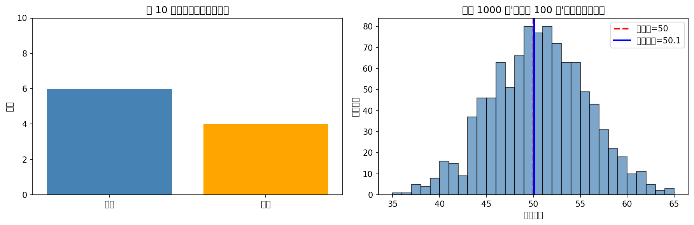
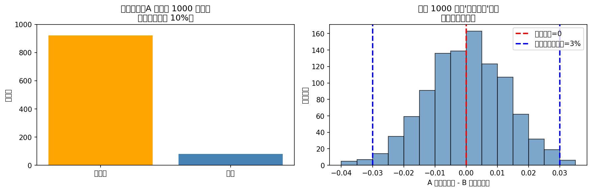
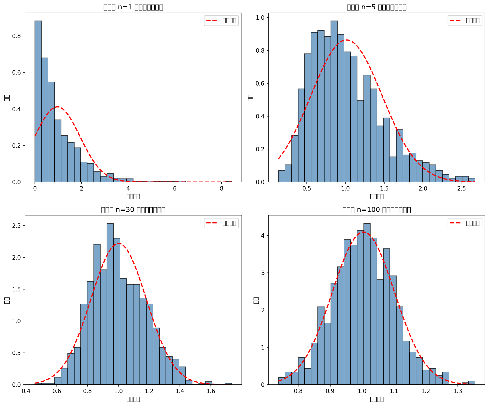
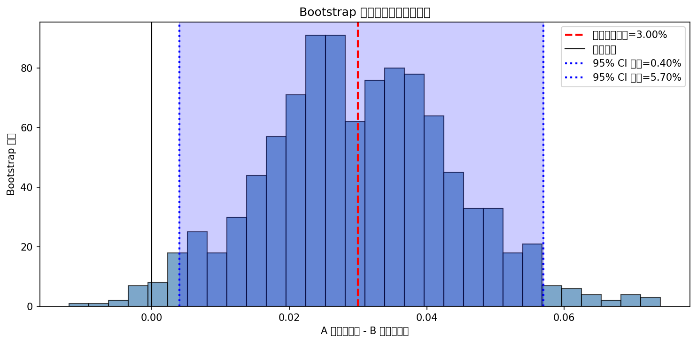
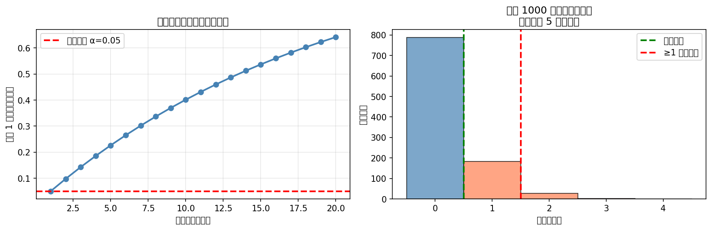

# Week 05：为什么你的结论可能只是运气？——从"算数"到"量化不确定性"

> "随机性不是知识的缺失，而是世界的本质属性。"
> —— E.T. Jaynes

2026 年，你可以让 AI 在一秒钟内计算出均值、中位数、相关系数，甚至自动生成"统计显著"的结论。但这里有个被很多人忽略的问题：**你看到的差异，是真的差异，还是抽样带来的运气？**

小北上周做了一份分析，发现"A 渠道的转化率比 B 渠道高 3%"，兴冲冲地写了结论。老潘只问了一句："你有多少样本？如果明天再跑一次，这个 3% 还在吗？"

小北愣住了："呃……我只看了本周的数据。"

这正是统计推断要解决的核心问题：**单次分析的结果可能只是随机波动**。2025-2026 年，AI 工具已经可以自动运行数百次模拟，帮你量化"这个结论有多稳定"。但如果你不理解"抽样分布"和"不确定性"的概念，AI 给你的数字只是一个黑箱——你可能过度相信一个不稳定的结论，或者错过一个真正有意义的模式。

本周，我们从"确定性结论"转向"概率性思维"。用模拟建立概率直觉，理解为什么同样的分析重复 100 次会得到 100 个不同的答案，以及这些答案如何形成一个"抽样分布"。这是 Week 06-08 假设检验和置信区间的基础——在你学会"检验差异"之前，先学会"量化不确定性"。

---

## 前情提要

上一周你学会了"让数据讲故事"。你知道了相关系数需要配合散点图，分组比较能发现隐藏差异，多变量可视化是"扫描仪"不是"结论机"。最重要的是，你学会了把 EDA 观察转化为"可检验假设清单"——每个假设都有观察、解释和检验方法。

小北拿着假设清单问："这些假设我怎么验证？是不是直接跑个 t 检验看 p 值？"

阿码接话："让 AI 跑不就行了？几秒钟就有结果。"

这正是本周要解决的问题：**在你学会"跑检验"之前，先学会"理解随机性"**。因为 p 值不是"按下按钮就能理解"的魔法，它是建立在"抽样分布"概念之上的。如果你不理解"重复抽样会得到什么分布"，你就无法正确解释 p 值和置信区间。

---

## 学习目标

完成本周学习后，你将能够：
1. 用模拟实验建立概率直觉，理解"随机性"如何影响统计结论
2. 理解抽样分布的概念，知道为什么重复抽样会得到不同的统计量
3. 区分"总体分布"和"抽样分布"，理解中心极限定理的直觉
4. 用 Bootstrap 方法估计抽样分布，量化统计量的不确定性
5. 在 StatLab 报告中加入不确定性量化，让结论更诚实

---

<!--
贯穿案例：A/B 测试的"假阳性"实验

案例演进路线：
- 第 1 节（模拟入门）→ 用抛硬币模拟理解"随机性"和"长期频率"
- 第 2 节（抽样分布）→ 从同一总体重复抽样，观察样本均值如何形成分布
- 第 3 节（中心极限定理）→ 用模拟验证"为什么样本均值的分布近似正态"
- 第 4 节（Bootstrap）→ 用重采样方法估计抽样分布，量化不确定性
- 第 5 节（模拟与推断）→ 模拟"假阳性"场景，理解为什么需要假设检验

最终成果：读者通过模拟理解"为什么 3% 的差异可能是运气"，学会量化不确定性

数据集：复用 week_04 的电商数据，聚焦"渠道转化率差异"这一假设

---

认知负荷预算：
- 本周新概念（5 个，预算上限 5 个）：
  1. 随机性与概率（随机实验/长期频率）
  2. 抽样分布（统计量的分布）
  3. 中心极限定理（CLT 直觉）
  4. Bootstrap 方法（重采样估计）
  5. 标准误（抽样分布的标准差）
- 结论：✅ 在预算内

回顾桥设计（至少 2 个，来自 week_02-04）：
- [分布形状]（来自 week_02）：在第 2 节，通过"总体分布 vs 抽样分布"的对比再次使用
- [集中趋势/离散程度]（来自 week_02）：在第 2 节，通过"样本均值的波动"再次使用
- [分组比较]（来自 week_04）：在第 5 节，通过"模拟两组差异的分布"再次使用
- [EDA 假设生成]（来自 week_04）：在第 5 节，通过"将假设转化为模拟实验"再次使用

AI 小专栏规划：
- 第 1 个侧栏（第 2 节之后）：
  - 主题："AI 能替你理解随机性吗？"
  - 连接点：刚学完抽样分布，讨论 AI 模拟 vs 人类直觉
  - 建议搜索词："AI simulation statistics education 2026", "Monte Carlo simulation AI tools 2026", "probability intuition vs AI 2026"

- 第 2 个侧栏（第 4 节之后）：
  - 主题："Bootstrap：AI 时代的重采样革命"
  - 连接点：刚学完 Bootstrap，讨论它在 AI 时代的应用
  - 建议搜索词："Bootstrap method modern applications 2026", "AI uncertainty quantification 2026", "resampling methods machine learning 2026"

角色出场规划：
- 小北（第 1 节）：质疑"为什么要模拟？直接算不就行了吗？"，引出模拟的价值
- 阿码（第 3 节）：追问"中心极限定理是不是就是'正态分布魔法'？"，引出 CLT 的边界
- 老潘（第 5 节）：看到"无不确定性的结论"后点评"这是在赌博，不是在做分析"，引出假阳性问题

StatLab 本周推进：
- 上周状态：数据卡 + 描述统计 + 可视化 + 清洗日志 + 相关分析 + 分组比较 + 假设清单
- 本周改进：加入不确定性量化（用 Bootstrap 估计标准误和置信区间）
- 涉及的本周概念：抽样分布、Bootstrap、标准误
- 建议示例文件：examples/05_statlab_uncertainty.py（本周报告生成入口脚本）
-->

## 1. 你的结论有多稳定？——用模拟理解随机性

小北上周发现"A 渠道的转化率比 B 渠道高 3%"，然后在报告里写："A 渠道效果更好。"

老潘看了一眼，问："如果你明天再跑一周数据，这个 3% 还在吗？"

小北愣住了："呃……我觉得应该差不多吧？"

老潘摇头："'差不多'是多少？2%？5%？-1%？你不知道。因为你只看了一次。"

阿码插嘴："那让 AI 帮我预测明天的数据不就行了？"

老潘笑了："AI 可以预测，但不会替你回答'这个 3% 是真实的，还是随机的'。要回答这个问题，你需要理解'随机性'本身。"

---
<!--
**Bloom 层次**：理解
**学习目标**：理解随机性和长期频率的概念，用模拟建立概率直觉
**贯穿案例推进**：从"一个 3% 的差异"到"如果重复 100 次会得到什么"
**建议示例文件**：01_simulation_intro.py
**叙事入口**：从"老潘追问：这个差异稳定吗？"的场景开头
**角色出场**：小北质疑"为什么要模拟？直接算不就行了吗？"
**回顾桥**：[离散程度]（week_02）：用"标准差描述波动"的概念引出"统计量的波动"
-->

### 为什么需要模拟？

你在 Week 02 学过**离散程度**：标准差描述数据点偏离均值的程度。但这只是"数据的波动"。

现在我们要问的是：**统计量的波动**。比如：
- 你计算了 A 渠道的转化率是 12%
- 如果换一批用户，转化率会变成 11%？13%？还是 8%？

这个问题不能靠"猜测"回答，也不能靠"公式"理解——你需要**看到它**。

模拟（simulation）就是"让随机过程在你眼前跑一遍"：你设定规则（比如"真实转化率是 10%"），让计算机模拟 100 次抽样，每次都算一个"样本转化率"，然后看这 100 个数字长什么样。

### 从抛硬币开始：随机性的第一课

最简单的随机实验是抛硬币。你"知道"正面朝上的概率是 50%，但如果你只抛 10 次，可能会得到 7 次正面、3 次反面——这不算"异常"，只是随机波动。

```python
# examples/01_simulation_intro.py
import numpy as np
import matplotlib.pyplot as plt

np.random.seed(42)

# 实验 1：抛 10 次硬币
flips_10 = np.random.choice(["H", "T"], size=10)
heads_10 = (flips_10 == "H").sum()
print(f"抛 10 次：正面 {heads_10} 次，反面 {10 - heads_10} 次")

# 实验 2：抛 1000 次硬币
flips_1000 = np.random.choice(["H", "T"], size=1000)
heads_1000 = (flips_1000 == "H").sum()
print(f"抛 1000 次：正面 {heads_1000} 次，反面 {1000 - heads_1000} 次")

# 实验 3：重复 1000 次"每次抛 100 次"
n_simulations = 1000
n_flips_per_sim = 100
heads_counts = []

for _ in range(n_simulations):
    flips = np.random.choice([0, 1], size=n_flips_per_sim)
    heads_counts.append(flips.sum())

heads_counts = np.array(heads_counts)

# 可视化
fig, axes = plt.subplots(1, 2, figsize=(12, 4))

# 左图：单次实验的结果分布
axes[0].bar(["正面", "反面"], [heads_10, 10 - heads_10])
axes[0].set_ylabel("次数")
axes[0].set_title("抛 10 次的结果")
axes[0].set_ylim(0, 10)

# 右图：1000 次实验的正面次数分布
axes[1].hist(heads_counts, bins=np.arange(35, 66, 1), edgecolor="black", alpha=0.7)
axes[1].axvline(50, color="red", linestyle="--", linewidth=2, label="期望值=50")
axes[1].set_xlabel("正面次数")
axes[1].set_ylabel("实验次数")
axes[1].set_title("重复 1000 次'每次抛 100 次'的正面次数分布")
axes[1].legend()

plt.tight_layout()
plt.savefig("output/simulation_coin_flip.png", dpi=100)
print("\n图表已保存到 output/simulation_coin_flip.png")
```

运行后你会看到：左图是"抛 10 次"的结果（可能 7 正 3 反），右图是"重复 1000 次实验"的分布——大部分实验的正面次数集中在 40-60 之间，形成"钟形曲线"。


*图：左图是单次实验（随机波动大），右图是重复 1000 次的分布（随机性被"平均掉"）*

小北看完右图，恍然大悟："哦！所以单次实验可能'走偏'，但重复很多次后，平均值会接近 50%？"

没错。这就是**大数定律**（Law of Large Numbers）的直觉：当重复次数足够多时，样本均值会趋近于真实概率。

但更重要的问题是：**这个"钟形曲线"的宽度意味着什么？**

### 从"数据分布"到"统计量分布"

你在 Week 02 学过**直方图**：它显示数据的分布形状。现在你看到的右图也是直方图，但它显示的不是"原始数据"（硬币的正反面），而是**统计量的分布**（正面次数）。

这就是本周的核心概念：**抽样分布**（sampling distribution）。

- **数据分布**：原始数据的分布（如用户年龄的分布）
- **抽样分布**：统计量的分布（如"样本均值"的分布）

阿码问："那抽样分布是怎么来的？我需要真的去收集 1000 个样本吗？"

不需要。这就是模拟的价值：**你可以在计算机里"假装"收集 1000 个样本**，每个样本都来自同一个总体，然后看统计量如何变化。

回到小北的"A 渠道比 B 渠道高 3%"的问题：如果这个 3% 是真实的，那重复抽样 100 次，你看到的"差异"应该稳定在某个范围内。如果 3% 只是运气，那重复抽样的差异可能会在 -5% 到 +10% 之间乱跳。

模拟能让你"看见"这个范围，而不是只依赖一个数字。

但小北还有疑问："我理解模拟了，但实际分析时，我不可能真的去收集 1000 个样本啊？"

阿码点头："对啊，我又不是 AI，没有无限预算。"

老潘笑了："好消息是：**你不需要真的收集 1000 个样本。你需要的是理解'如果重复抽样会得到什么分布'，然后用数学或 Bootstrap 方法推断它**。"

这正是下一节的主题。

---

## 2. 从同一个总体重复抽样，会得到什么？

阿码上周算出"A 渠道的转化率是 12%，B 渠道是 9%"，差异是 3 个百分点。

老潘问："如果 A 渠道的真实转化率其实是 10%（和 B 一样），你会不会偶尔也看到 12% vs 9% 这样的差异？"

阿码愣住了："呃……可能吧？因为抽样有随机性……"

老潘点头："那你怎么知道'12% vs 9%'是真实差异，还是随机波动？"

这正是**抽样分布**要回答的问题：**如果真实没有差异，重复抽样 100 次，你会看到多大的"虚假差异"？**

### 类比：掷骰子的"平均点数"

小北还是有点困惑："抽样分布……能不能举个更简单的例子？"

老潘想了想："你玩过掷骰子吗？"

小北点头："当然。"

"掷一次骰子，结果是 1-6 之间的任意一个数字，对吧？但如果你掷 100 次骰子，然后算这 100 次的'平均点数'，你觉得会得到什么？"

阿码接话："应该是 3.5 左右吧？因为 (1+2+3+4+5+6)/6 = 3.5。"

老潘点头："对。但关键问题是：**如果你再掷 100 次，再算一次平均值，还会是 3.5 吗？**"

小北想了想："可能……3.4？或者 3.6？不一定会完全一样。"

"没错。每次掷 100 次骰子，你都会得到一个'平均值'。如果你重复这个过程 1000 次，就会得到 1000 个'平均值'。这些'平均值'本身也会形成一个分布——这就是**抽样分布**。"

老潘继续："有趣的是，虽然单次掷骰子的结果是均匀分布（1-6 各有 1/6 概率），但'100 次掷骰子的平均值'的分布却是钟形的——大部分集中在 3.5 附近，越往两边越少。"

阿码眼睛一亮："哦！所以抽样分布就是'统计量的分布'，而不是'原始数据的分布'？"

**完全正确。** 这就是为什么你要区分：
- **数据分布**：单次掷骰子的结果，均匀分布在 1-6 之间
- **抽样分布**：100 次掷骰子的平均值，钟形分布在 3.5 附近

回到 A/B 测试：你观察到的"3% 差异"只是**一次实验的结果**。抽样分布告诉你：**如果重复做 1000 次实验，这 3% 会落在分布的什么位置？** 是在中间（很可能是运气），还是在边缘（不太可能是运气）？

---
<!--
**Bloom 层次**：理解
**学习目标**：理解抽样分布的概念，区分总体分布和抽样分布
**贯穿案例推进**：从"一个 3% 的差异"到"这个差异在抽样分布中的位置"
**建议示例文件**：02_sampling_distribution.py
**叙事入口**：从"老潘追问：如果真实没有差异，你会不会偶尔看到 3%？"开头
**角色出场**：阿码追问"抽样分布和正态分布是什么关系？"
**回顾桥**：[分布形状]（week_02）：用"钟形曲线"的概念解释抽样分布的形状
-->

### 从一个总体出发：模拟"无差异"场景

假设 A 渠道和 B 渠道的**真实转化率都是 10%**（无差异）。现在我们模拟 1000 次"实验"，每次实验都抽取两个样本（A 和 B），计算转化率差异，然后看这 1000 个差异长什么样。

```python
# examples/02_sampling_distribution.py
import numpy as np
import matplotlib.pyplot as plt

np.random.seed(42)

# 设定：真实转化率都是 10%
true_rate = 0.10
sample_size = 1000  # 每个渠道 1000 个用户

# 模拟 1000 次实验
n_simulations = 1000
differences = []

for _ in range(n_simulations):
    # 从同一个总体抽样（A 和 B 的真实转化率相同）
    sample_a = np.random.binomial(n=1, p=true_rate, size=sample_size)
    sample_b = np.random.binomial(n=1, p=true_rate, size=sample_size)

    # 计算转化率
    rate_a = sample_a.mean()
    rate_b = sample_b.mean()

    # 记录差异
    differences.append(rate_a - rate_b)

differences = np.array(differences)

# 可视化
fig, axes = plt.subplots(1, 2, figsize=(12, 4))

# 左图：单次模拟的样本分布
axes[0].bar(["未转化", "转化"], [(1 - sample_a).sum(), sample_a.sum()])
axes[0].set_ylabel("用户数")
axes[0].set_title("单次模拟：A 渠道的 1000 个用户")
axes[0].set_ylim(0, sample_size)

# 右图：1000 次模拟的差异分布
axes[1].hist(differences, bins=np.arange(-0.04, 0.04, 0.005), edgecolor="black", alpha=0.7)
axes[1].axvline(0, color="red", linestyle="--", linewidth=2, label="真实差异=0")
axes[1].axvline(0.03, color="blue", linestyle="--", linewidth=2, label="你观察到的差异=3%")
axes[1].set_xlabel("A 渠道转化率 - B 渠道转化率")
axes[1].set_ylabel("模拟次数")
axes[1].set_title("重复 1000 次的'虚假差异'分布")
axes[1].legend()

plt.tight_layout()
plt.savefig("output/sampling_distribution_null.png", dpi=100)
print("图表已保存到 output/sampling_distribution_null.png")

# 计算统计量
print(f"差异的标准差（标准误）：{differences.std():.4f}")
print(f"差异 ≥ 3% 的比例：{(differences >= 0.03).mean():.2%}")
```

运行后你会看到：右图的分布以 0 为中心，大部分差异落在 -2% 到 +2% 之间。**你观察到的 3% 差异（蓝线）处于分布的右边缘**——这意味着"即使真实没有差异，偶尔也会出现 3% 的虚假差异"，但这种情况很少见。


*图：当真实无差异时，重复抽样的差异分布以 0 为中心。你观察到的 3%（蓝线）处于右边缘*

小北看完图，恍然大悟："哦！所以如果 3% 处于分布的边缘，说明它不太可能是'运气'？"

没错。这正是 Week 06 假设检验的核心思想：**p 值就是"观察到的差异在抽样分布中的位置"**。如果 3% 处于右边缘（比如前 5%），那 p 值会很小，你更有底气说"这是真实差异"。

阿码突然想到了什么："等等，这不就是把'差异'变成'排名'吗？如果我的差异排在所有可能差异的前 5%，那就说明它不太可能是随机产生的？"

**这个总结很精准！** p 值的本质就是把你的观察值放在抽样分布中，看它排在什么位置。位置越靠边缘，越不可能是运气。

但阿码马上又有新问题："我理解抽样分布了，但我只有一个样本啊！我不可能真的去收集 1000 个样本来画这个分布！"

好问题。这正是下一节要讲的：**中心极限定理告诉你抽样分布长什么样，Bootstrap 帮你用一个样本估计它**。

> **AI 时代小专栏：AI 能替你理解随机性吗？**

> 你刚学完抽样分布的概念，可能已经在想：AI 能不能自动运行模拟、生成抽样分布、告诉我"这个结论有多稳定"？
>
> 2026 年确实有一批工具在做这件事：各种 Monte Carlo 模拟库、Bootstrap 自动化工具、甚至一些"AI 统计助手"会告诉你"这个 p 值的置信区间"。但这里有个关键区别：**AI 可以运行模拟，但不会替你建立概率直觉**。
>
> 举例：AI 可以告诉你"这个差异的 p 值是 0.03"，但不会回答"如果样本量减半，p 值会怎么变？如果数据有偏态，结论还可靠吗？"。这些问题的答案依赖于你对"抽样分布"概念的理解，而不是 AI 的输出。
>
> 更微妙的是，2025-2026 年的研究显示，**人类对概率的直觉存在系统性偏差**（如"赌徒谬误"、"合取谬误"、"忽视基础率"）。AI 可以纠正这些偏差——但前提是你知道"自己不知道什么"。如果你完全不理解抽样分布，AI 的输出只是一个黑箱数字。
>
> 拿抛硬币来说：大多数人会低估"连续 5 次正面"的概率（实际上是 1/32 ≈ 3%），然后过度解读这个"罕见事件"。AI 可以模拟 100 万次抛硬币，告诉你"连续 5 次正面在 100 万次中出现了 31234 次"，但如果你不理解"这是独立事件的概率"，你可能会错误地认为"第 6 次更可能是反面"（赌徒谬误）。
>
> 教育界也在反思：2026 年的一些统计课程开始用"模拟驱动"（simulation-first）的方法，先让学生写代码模拟抽样分布，再学公式。这是因为**公式可以外包给 AI，但直觉不能**。
>
> 所以 AI 的正确用法是：**让 AI 运行模拟和计算，你负责解释和质疑**。AI 是计算器，你是概率思考者。
>
> 参考（访问日期：2026-02-15）：
> - https://journals.sagepub.com/doi/abs/10.3102/10769986251397559（SAGE Journals, 2025：生成式 AI 在 Monte Carlo 模拟中的应用）
> - https://www.advisorperspectives.com/articles/2025/05/23/using-ai-create-a-monte-carlo-retirement-simulation（Advisor Perspectives, 2025：使用 AI 构建退休 Monte Carlo 模拟的实践）
> - https://ida.dk/en/arrangementer-og-kurser/arrangementer/monte-carlo-simulations-training-learning-ai-aspects-364428（丹麦 IDA 协会，2025：Monte Carlo 模拟训练与 AI）
> - https://acemate.ai/glossary/monte-carlo-simulations-in-ai（AceMate AI：Monte Carlo 模拟术语定义）

### 小结一下：你学到了什么？

在继续之前，让我们停下来消化一下前两节的内容：

**核心概念**：抽样分布——"如果重复抽样100次，统计量会如何变化？"

**关键直觉**：单次分析的结果可能只是随机波动。模拟能让你"看见"这个波动范围。

**实际意义**：你观察到的"3%差异"可能处于抽样分布的中间（很可能是运气），也可能处于边缘（不太可能是运气）。

老潘的经验法则：**写报告时，不要只写"差异是3%"，要问自己"如果重复抽样，这个3%还会在吗？"**

现在你已经理解了"抽样分布"的概念。接下来的问题是：为什么这个分布总是"钟形"的？答案是统计学的"魔法定理"——中心极限定理。


## 3. 为什么样本均值的分布总是"钟形"的？

小北看完上一节的模拟后，问了一个好问题："你画的抽样分布都是'钟形'的。但如果我的总体不是正态分布呢？比如用户收入是右偏的，样本均值的分布还是钟形吗？"

老潘笑了："这正是统计学最神奇的定理之一——而且它确实有点像魔法。"

阿码插嘴："中心极限定理是不是就是'正态分布魔法'？"

**"魔法"这个词用得挺准**。中心极限定理（Central Limit Theorem, CLT）说了一件反直觉的事：**无论总体分布是什么形状，只要你抽取的样本量足够大，样本均值的分布都会近似正态分布**。

这确实有点不可思议。想象一下：如果你的总体是高度右偏的（比如收入数据，大部分人收入不高，少数人是亿万富翁），为什么平均之后反而变成了对称的钟形？

---
<!--
**Bloom 层次**：理解
**学习目标**：理解中心极限定理的直觉，知道为什么样本均值的分布近似正态
**贯穿案例推进**：从"观察到的差异"到"这个差异在 CLT 分布中的位置"
**建议示例文件**：03_clt_simulation.py
**叙事入口**：从"小北追问：如果总体不是正态分布呢？"开头
**角色出场**：阿码追问"中心极限定理是不是就是'正态分布魔法'？"
**回顾桥**：[分布形状/偏态]（week_02）：用"偏态分布"的概念对比 CLT 的"钟形"
-->

### 中心极限定理：统计学的"魔法"

中心极限定理说的是：**无论总体分布是什么形状，只要你抽取的样本量足够大，样本均值的分布都会近似正态分布**。

这个定理有点"反直觉"：如果你的总体是右偏的（如收入），为什么样本均值的分布反而变成对称的钟形？

答案在于"平均"的魔法：当你取平均时，极端值会被"稀释"掉。比如一个收入数据里有几个百万富翁（极端高），但当你取 100 个人的平均时，这些极端值的影响会被其他 99 个人"摊薄"。重复这个平均过程 1000 次，得到的均值分布就会越来越接近钟形。

**这里有个"哦！"时刻**：即使你的总体是指数分布（极度右偏），只要样本量达到 30，样本均值的分布就已经很像钟形了。这就是为什么正态分布在统计学中如此重要——不是因为原始数据总是正态的，而是因为**统计量**（如均值）的抽样分布近似正态。

### 用模拟验证 CLT

让我们用一个极端的例子：**指数分布**（高度右偏）。我们要看看：即使总体是这样歪的，样本均值的分布会不会变成钟形？

```python
# examples/03_clt_simulation.py
import numpy as np
import matplotlib.pyplot as plt
import seaborn as sns

np.random.seed(42)

# 总体：指数分布（高度右偏）
population = np.random.exponential(scale=1.0, size=100000)

# 模拟：从总体中重复抽样，计算样本均值
sample_sizes = [1, 5, 30, 100]
n_simulations = 1000

fig, axes = plt.subplots(2, 2, figsize=(12, 10))
axes = axes.ravel()

for i, n in enumerate(sample_sizes):
    sample_means = []
    for _ in range(n_simulations):
        sample = np.random.choice(population, size=n, replace=False)
        sample_means.append(sample.mean())

    sample_means = np.array(sample_means)

    # 画分布
    axes[i].hist(sample_means, bins=30, edgecolor="black", alpha=0.7, density=True)

    # 叠加正态分布曲线（用于对比）
    from scipy import stats
    x = np.linspace(sample_means.min(), sample_means.max(), 100)
    normal_curve = stats.norm.pdf(x, loc=sample_means.mean(), scale=sample_means.std())
    axes[i].plot(x, normal_curve, "r--", linewidth=2, label="正态分布")

    axes[i].set_xlabel("样本均值")
    axes[i].set_ylabel("密度")
    axes[i].set_title(f"样本量 n={n} 的样本均值分布")
    axes[i].legend()

plt.tight_layout()
plt.savefig("output/clt_simulation.png", dpi=100)
print("图表已保存到 output/clt_simulation.png")
```

运行后你会看到一个神奇的过程：当 n=1 时，样本均值的分布就是原始的指数分布（右偏）；当 n=5 时，开始有点对称；当 n=30 时，已经很像钟形了；当 n=100 时，几乎完美拟合正态分布。


*图：随着样本量增加，样本均值的分布从右偏（n=1）逐渐变成钟形（n=100）*

小北看完图，惊呆了："所以只要样本量够大，样本均值的分布总是钟形？"

没错。这就是为什么正态分布在统计学中如此重要：**不是因为原始数据总是正态的，而是因为很多统计量（如均值）的抽样分布近似正态**。

但阿码有新问题："那'够大'是多大？n=30 就行了吗？"

好问题。这取决于总体分布：
- 如果总体本身是对称的（如均匀分布），n=5 可能就够了
- 如果总体极度偏态（如收入、房价），可能需要 n=50 或更大
- 如果总体有离群值（如部分用户消费金额极高），CLT 的收敛会很慢

老潘的经验法则：**先用直方图看总体分布**——这正是你在 Week 02 学过的技能。如果总体偏态不严重，n=30 通常够用；如果偏态严重，要么增大样本量，要么考虑非参数方法（如 Bootstrap）。

**这里有个回顾**：你在 Week 02 学过用直方图和箱线图判断数据的偏态和离群点。现在这个技能有了新用途：**判断 CLT 是否适用**。如果直方图显示极度偏态，你就知道样本均值的抽样分布可能需要更大的样本量才能接近钟形。

### 标准误：抽样分布的"标准差"

你在 Week 02 学过**标准差**（standard deviation）：描述数据的离散程度。现在我们要学一个新的概念：**标准误**（standard error）。

标准误 = **抽样分布的标准差**。

举例：
- 你的数据标准差是 15（数据的波动）
- 但你算出的均值的标准误可能是 1.5（均值的不确定性）

标准误和标准差的关系：
```
标准误 = 标准差 / sqrt(样本量)
```

这意味着：**样本量越大，标准误越小**。你的均值估计会更精确，不确定性更低。

小北听完若有所思："所以标准误是'统计量的标准差'，标准差是'数据的标准差'？"

没错。标准差描述"数据点偏离均值的程度"，标准误描述"统计量偏离真实值的程度"。当你写报告时，不要只写"均值是 12%"，要写"均值是 12%，标准误是 1.5%"——这样读者知道"这个 12% 有多确定"。

但阿码问："我只有一个样本，怎么算标准误？"

好问题。下一节我们会讲：**Bootstrap 方法用一个样本估计抽样分布**。

---

## 4. 只有一个样本，怎么估计抽样分布？

阿码上周算出"A 渠道的转化率是 12%，B 渠道是 9%"，差异是 3%。

老潘问："这个 3% 的标准误是多少？"

阿码愣住了："标准误？我只有一个样本啊！怎么知道抽样分布的标准差？"

老潘笑了："你有两个选择：要么假设数据服从正态分布，用公式算；要么用 Bootstrap 方法，用你唯一的样本'假装'重复抽样。"

---
<!--
**Bloom 层次**：应用
**学习目标**：掌握 Bootstrap 方法，能用重采样估计抽样分布和标准误
**贯穿案例推进**：从"一个 3% 的差异"到"这个差异的 Bootstrap 置信区间"
**建议示例文件**：04_bootstrap_intro.py
**叙事入口**：从"阿码追问：我只有一个样本，怎么算标准误？"开头
**角色出场**：小北质疑"Bootstrap 是不是'自己抽自己'？这靠谱吗？"
**回顾桥**：[抽样分布]（第 2 节）：用"重复抽样的分布"的概念解释 Bootstrap 的原理
-->

### Bootstrap：用"重采样"模拟重复抽样

Bootstrap 是 Bradley Efron 在 1979 年提出的方法，核心思想很简单：**你只有一个样本，但你可以从这个样本中"重复抽样"（有放回），模拟"从总体重复抽样"的过程**。

步骤：
1. 从原始样本中**有放回地**抽取 n 个观测值（n = 原始样本量）
2. 计算你感兴趣的统计量（如均值、转化率）
3. 重复步骤 1-2 很多次（如 1000 次）
4. 这 1000 个统计量的分布就是**Bootstrap 抽样分布**

"有放回"的意思是：每次抽取一个观测值后，把它"放回去"，下次可能再次抽到它。这意味着 Bootstrap 样本中，某些原始观测值会出现多次，某些可能一次都不出现——这正是模拟"从总体抽样"的随机性。

### 用 Bootstrap 估计差异的抽样分布

让我们回到小北的"A 渠道 vs B 渠道"问题。假设我们有真实数据（不是模拟的），用 Bootstrap 估计"3% 差异"的抽样分布。

```python
# examples/04_bootstrap_intro.py
import numpy as np
import matplotlib.pyplot as plt

np.random.seed(42)

# 假设这是你收集的真实数据（A 渠道 1000 个用户，B 渠道 1000 个用户）
# A 渠道：120 个转化（12%）
# B 渠道：90 个转化（9%）
conversions_a = np.array([1] * 120 + [0] * 880)
conversions_b = np.array([1] * 90 + [0] * 910)

# 观察到的差异
observed_diff = conversions_a.mean() - conversions_b.mean()
print(f"观察到的差异：{observed_diff:.2%}")

# Bootstrap：重复 1000 次
n_bootstrap = 1000
bootstrap_diffs = []

for _ in range(n_bootstrap):
    # 有放回地重抽样（从 A 渠道）
    boot_sample_a = np.random.choice(conversions_a, size=len(conversions_a), replace=True)
    # 有放回地重抽样（从 B 渠道）
    boot_sample_b = np.random.choice(conversions_b, size=len(conversions_b), replace=True)

    # 计算差异
    boot_diff = boot_sample_a.mean() - boot_sample_b.mean()
    bootstrap_diffs.append(boot_diff)

bootstrap_diffs = np.array(bootstrap_diffs)

# 计算标准误
standard_error = bootstrap_diffs.std()
print(f"Bootstrap 标准误：{standard_error:.2%}")

# 计算置信区间（95%）
ci_low, ci_high = np.percentile(bootstrap_diffs, [2.5, 97.5])
print(f"95% 置信区间：[{ci_low:.2%}, {ci_high:.2%}]")

# 可视化
plt.figure(figsize=(10, 5))
plt.hist(bootstrap_diffs, bins=30, edgecolor="black", alpha=0.7)
plt.axvline(observed_diff, color="red", linestyle="--", linewidth=2, label=f"观察到的差异={observed_diff:.2%}")
plt.axvline(0, color="black", linestyle="-", linewidth=1, label="无差异线")
plt.axvline(ci_low, color="blue", linestyle=":", linewidth=2, label=f"95% CI 下限={ci_low:.2%}")
plt.axvline(ci_high, color="blue", linestyle=":", linewidth=2, label=f"95% CI 上限={ci_high:.2%}")
plt.xlabel("A 渠道转化率 - B 渠道转化率")
plt.ylabel("Bootstrap 次数")
plt.title("Bootstrap 抽样分布：差异的分布")
plt.legend()
plt.tight_layout()
plt.savefig("output/bootstrap_distribution.png", dpi=100)
print("\n图表已保存到 output/bootstrap_distribution.png")
```

运行后你会看到：Bootstrap 分布以 3% 为中心，95% 置信区间可能是 [0.5%, 5.5%]。这意味着：你有 95% 的信心认为真实差异落在这个范围内。更重要的是，**置信区间不包含 0**——这给了你一些证据说"差异不太可能是 0"。


*图：Bootstrap 抽样分布。红点是你观察到的差异（3%），蓝线是 95% 置信区间。区间不包含 0，说明差异不太可能是随机的*

小北看完图，恍然大悟："所以 Bootstrap 不用假设数据服从正态分布？"

对！Bootstrap 是**非参数方法**：它不假设总体分布是什么形状，而是用数据自己"说话"。这就是为什么 Bradley Efron 称它为"计算机时代的统计推断"——你可以绕过复杂的数学推导，直接用模拟估计抽样分布。

但阿码有新问题："Bootstrap 是不是'自己抽自己'？这靠谱吗？"

好问题。Bootstrap 的有效性依赖于一个假设：**你的样本是总体的代表**。如果你的样本有严重的偏差（比如只调查了"愿意填问卷的用户"），Bootstrap 无法修复这个偏差——它只能告诉你"如果你的样本有偏差，结论的不确定性有多大"，而不能告诉你"真实总体是什么样"。

老潘的经验法则：**Bootstrap 估计的是"抽样不确定性"，不是"所有不确定性"**。如果你的样本本身有偏差，Bootstrap 无法纠正。

> **AI 时代小专栏：Bootstrap——AI 时代的重采样革命**

> 你刚学完 Bootstrap 方法，可能已经在想：AI 能不能自动运行 Bootstrap、生成置信区间、告诉我"这个结论有多确定"？
>
> 2026 年，Bootstrap 已经是机器学习和数据科学的"标配"：scikit-learn 的 `BootstrapCI`、`resample` 函数；各种 AutoML 平台都会自动报告 Bootstrap 置信区间；甚至一些 AI 论文也用 Bootstrap 估计模型性能的不确定性。
>
> 但这里有个有趣的历史：Bootstrap 在 1979 年提出时，很多统计学家怀疑它"太简单，不严谨"。40 年后，它成了计算统计的基石——而 AI 时代让它变得更重要了。
>
> 2025-2026 年的研究显示，**Bootstrap 在 AI 不确定性量化中扮演关键角色**：
> - 深度学习模型的"预测区间"可以用 Bootstrap 估计（而不是只输出一个点预测）
> - 大模型输出的"不确定性"可以用 Bootstrap 量化（比如让 GPT-4 回答同一个问题 100 次，看答案的分布）
> - A/B 测试平台用 Bootstrap 估计"转化率差异的置信区间"，而不是只依赖 p 值
>
> 更有趣的是 2026 年 2 月提出的"Agentic Bootstrap"概念：用 AI agent 自动设计 Bootstrap 方案（比如选择合适的重采样次数、处理不平衡数据、检测 Bootstrap 的失效场景）。
>
> 但 Bradley Efron 本人（Bootstrap 的提出者）在 2025 年的一次访谈中提醒：**Bootstrap 不是万能药**。它在以下场景可能失效：
> - 小样本（< 30），Bootstrap 分布可能不稳定
> - 高度偏态的数据，Bootstrap 置信区间可能不准确（需要用 BCa 方法校正）
> - 数据有依赖结构（如时间序列），简单 Bootstrap 会破坏依赖关系（需要用 Block Bootstrap）
>
> 阿码可能会问："那大模型呢？GPT-4 能不能直接做 Bootstrap？"
>
> 技术上可以：你可以让 GPT-4 写 Bootstrap 代码，甚至解释结果。但理解 Bootstrap 的局限（比如什么时候会失效）仍然需要人类的判断。
>
> Bootstrap 的正确用法是：**让 AI 写代码和运行模拟，你负责检查假设和解读结果**。AI 是执行者，你是审计员。
>
> 参考（访问日期：2026-02-15）：
> - https://pubs.acs.org/（ACS Publications, 2026 年 1 月：分子机器学习中的 Bootstrap 不确定性量化）
> - https://dl.acm.org/（ACM Digital Library, 2025 年 5 月：等变 Bootstrap 用于图像分类不确定性）
> - https://www.researchgate.net/（ResearchGate, 2025 年 8 月：基于 Bootstrap 的多任务不确定性估计）
> - https://www.mdpi.com/journal/stats/special_issues/resampling_statistics（MDPI Stats：Bradley Efron 关于重采样方法的特刊）

---

## 5. 你看到的"显著差异"可能是假阳性吗？

现在你已经学会了用 Bootstrap 量化不确定性。你算出了 95% 置信区间 [0.5%, 5.5%]，不包含 0。看起来很有底气说"A 渠道比 B 渠道好"。

小北用 Bootstrap 算出了 95% 置信区间 [0.5%, 5.5%]，不包含 0。他激动地说："所以 A 渠道真的比 B 渠道好！我要写报告了！"

老潘看了一眼，问："你一开始想检验多少个假设？"

小北愣住了："呃……就这一个啊？"

老潘摇头："你上周的假设清单里有 5 个假设。如果你同时检验 5 个，即使真实都没有差异，你也有很大概率至少看到 1 个'假阳性'。"

---
<!--
**Bloom 层次**：分析
**学习目标**：理解假阳性问题，用模拟量化"多次检验的风险"
**贯穿案例推进**：从"一个 3% 的差异"到"如果我检验了 5 个假设，假阳性风险有多大"
**建议示例文件**：05_false_positive_simulation.py
**叙事入口**：从"老潘追问：你检验了多少个假设？"开头
**角色出场**：老潘点评"这是在赌博，不是在做分析"
**回顾桥**：[EDA 假设生成]（week_04）：用"假设清单"的概念引出多重比较问题
-->

### 假阳性：当真实没有差异时，你却"发现"了差异

**假阳性**（False Positive）的学名是**第一类错误**（Type I Error）：真实没有差异，但你的检验结论说"有差异"。

这个问题的根源在于：**即使真实无差异，抽样分布的边缘仍然会有"极端值"**。你看到的 3% 差异，可能是真实差异，也可能是抽样带来的"幸运"。

如果你设定**显著性水平 α = 0.05**（这是 Week 06 的内容，现在先有个概念），这意味着：即使真实无差异，你仍有 5% 的概率误判为"有差异"。

阿码问："5% 不大吧？"

如果只检验一个假设，5% 确实不大。但如果你检验 5 个假设，假阳性的概率就会变成：

```
至少 1 个假阳性的概率 = 1 - (1 - 0.05)^5 ≈ 23%
```

23%！这意味着：**即使真实没有任何差异，你仍有 1/4 的概率至少看到 1 个"显著"结果**。

阿码听完这个数字，表情和刚才的 5% 完全不一样了："所以……我上周发现的那些'显著差异'，可能有 1/4 是假的？"

老潘笑了："别慌。这不代表你的结论都是错的，只是代表：**如果你检验了很多假设，你必须更谨慎**。"

### 用模拟量化假阳性风险

让我们模拟一个场景：假设你的假设清单里有 5 个假设，真实都没有差异。你运行 5 次检验，每次都看 p 值是否 < 0.05。重复这个"实验" 1000 次，看看"至少出现 1 个假阳性"的概率。

```python
# examples/05_false_positive_simulation.py
import numpy as np
import matplotlib.pyplot as plt

np.random.seed(42)

# 设定
n_hypotheses = 5  # 你检验了 5 个假设
alpha = 0.05  # 显著性水平
n_simulations = 1000  # 模拟 1000 次"实验"

false_positive_counts = []

for _ in range(n_simulations):
    # 每次实验检验 5 个假设（真实都无差异）
    p_values = np.random.uniform(0, 1, size=n_hypotheses)

    # 统计有多少个"假阳性"（p < 0.05）
    false_positives = (p_values < alpha).sum()
    false_positive_counts.append(false_positives)

false_positive_counts = np.array(false_positive_counts)

# 计算概率
prob_at_least_one = (false_positive_counts >= 1).mean()
print(f"至少 1 个假阳性的概率：{prob_at_least_one:.2%}")

# 可视化
plt.figure(figsize=(10, 5))
counts, bins, patches = plt.hist(false_positive_counts, bins=np.arange(-0.5, 6.5, 1), edgecolor="black", alpha=0.7)
plt.xlabel("假阳性数量")
plt.ylabel("模拟次数")
plt.title(f"重复 1000 次的假阳性分布（检验了 {n_hypotheses} 个假设）")

# 标注"至少 1 个假阳性"的区域
for i in range(1, len(patches)):
    patches[i].set_facecolor("red")
plt.axvline(0.5, color="green", linestyle="--", linewidth=2, label="无假阳性")
plt.axvline(1.5, color="red", linestyle="--", linewidth=2, label="≥1 个假阳性")
plt.legend()

plt.tight_layout()
plt.savefig("output/false_positive_distribution.png", dpi=100)
print("\n图表已保存到 output/false_positive_distribution.png")
```

运行后你会发现：**大约 23% 的模拟中出现了至少 1 个假阳性**。这意味着：如果你检验 5 个假设，即使真实都没有差异，你仍有 1/4 的概率会"发现"至少一个"显著"结果。


*图：绿色区域是"无假阳性"（约 77%），红色区域是"≥1 个假阳性"（约 23%）*

小北看完图，脸色发白："所以我的'显著差异'可能是假的？"

老潘点头："有可能。所以你在写报告时，必须说明：**你检验了多少个假设**。如果你只报告显著的（p < 0.05），不报告不显著的（p ≥ 0.05），那就是'p-hacking'——在数据中挖掘运气。"

阿码问："那我怎么办？难道不能检验多个假设吗？"

可以，但你需要做**多重比较校正**（Multiple Comparison Correction）。这是 Week 07 的内容，但核心思想很简单：**如果你检验 k 个假设，把显著性水平从 α 调整为 α/k**（Bonferroni 校正）。

举例：如果你检验 5 个假设，原本 α = 0.05，校正后 α' = 0.05/5 = 0.01。只有当 p < 0.01 时，你才认为"显著"。

小北松了一口气："所以校正后，假阳性的概率就降回去了？"

对。校正的代价是"更难发现真实差异"（第二类错误增加），但这是"保守策略"的代价：**宁愿漏掉一些真实差异，也不要误报假阳性**。

### 真实案例：神经科学中的"死鲑鱼实验"

小北还是不太相信："23% 的假阳性风险……真的有这么严重吗？"

老潘笑了："我给你讲一个真实的故事。"

2009 年，一位神经科学家做了一个有趣的实验：他用功能性磁共振成像（fMRI）扫描一条**死鲑鱼**的大脑，让它"看"一组人类表情图片。然后他用标准的统计方法分析数据——结果发现，死鲑鱼大脑的某些区域"对表情有显著反应"。

阿码瞪大了眼睛："死鱼？那怎么可能反应？"

"当然不可能。但这些'显著反应'是**假阳性**——研究者检验了超过 100,000 个脑区体素（voxel），即使什么都不存在，也会有几千个体素偶然'显著'。"

这个实验获得了 2012 年的**搞笑诺贝尔奖**（Ig Nobel Prize），但它传递的信息是严肃的：**如果你检验足够多的假设，总会发现一些'显著'结果，即使研究对象是一条死鱼**。

老潘补充："这个实验之后，神经科学领域开始普遍采用多重比较校正（如 FWE、FDR）。现在如果你投稿时不做校正，审稿人直接就会拒稿。"

小北若有所思："所以在公司里做分析也一样？不能只挑'显著'的结果报告？"

"对。我们有个原则：**报告你检验了什么，不只是报告什么显著**。如果你检验了 20 个指标，只有 2 个显著，那你要把这 20 个都列出来，而不是只写'我们发现了 2 个重要发现'。"

阿码追问："那 Bonferroni 校正具体怎么用？能举个数字吗？"

老潘点头："假设你检验 5 个假设，每个都用 α = 0.05："

| 假设 | p 值 | 不校正（α=0.05） | Bonferroni 校正（α=0.01） |
|------|------|------------------|---------------------------|
| H1 | 0.008 | ✅ 显著 | ✅ 显著 |
| H2 | 0.023 | ✅ 显著 | ❌ 不显著 |
| H3 | 0.15 | ❌ 不显著 | ❌ 不显著 |
| H4 | 0.042 | ✅ 显著 | ❌ 不显著 |
| H5 | 0.31 | ❌ 不显著 | ❌ 不显著 |

"不校正的话，你报告'发现 3 个显著结果'。校正后，只有 1 个经得起检验。"

小北有点担心："那校正后不就更难发现真实差异了吗？"

"对，这是代价。但想想死鲑鱼实验——**宁可漏掉一个真实发现，也不要报告一个假发现**。因为假发现一旦发布，会浪费很多人时间去验证，最终损害你的信誉。"

### 模拟的价值：从"黑箱"到"透明"

本周的核心不是让你记住公式，而是让你学会用**模拟**理解统计推断的底层逻辑。

老潘总结道："如果你能回答这四个问题，本周就算学到位了："

"第一，**抽样分布**：重复抽样 100 次，统计量会如何变化？"

小北点头："会形成一个钟形分布，中心是真值。"

"第二，**中心极限定理**：为什么样本均值的分布总是钟形？"

阿码接话："因为'平均'会稀释极端值，即使总体偏态，样本均值也会趋向正态。"

"第三，**Bootstrap**：如何用一个样本估计抽样分布？"

"有放回地重采样，模拟重复抽样的过程。" 小北说。

"第四，**假阳性**：如果真实无差异，我会不会偶尔看到'显著'结果？"

"会，尤其是检验多个假设时。所以要做校正。" 阿码补充。

老潘笑了："完美。这些问题都可以用模拟回答——你不需要背公式，你只需要'看到它'。"

阿码可能会问："那 AI 能不能替我做这些模拟？"

可以。但如果你不理解模拟在做什么，AI 的输出只是一个黑箱数字。你需要知道：**模拟的假设是什么？结论的边界是什么？什么时候模拟会失效？**

这正是下一章（Week 06）要讲的：**假设检验**。你会学到 p 值、显著性水平、统计功效——但有了本周的模拟基础，这些概念不再是黑箱，而是你用代码"玩"出来的直觉。

现在让我们把这些知识整合进 StatLab 报告，用 Bootstrap 量化不确定性。

---

## StatLab 进度

### 从"确定性结论"到"不确定性量化"

上周的 StatLab 报告包含了相关分析、分组比较和假设清单。这些告诉你"变量之间有什么关系"。但它们没有回答：**这些结论有多确定？**

老潘说："在公司里，我们不会只写'A 渠道转化率更高'。我们会写'A 渠道转化率是 12% ± 1.5%（95% CI: [9%, 15%]）'。因为决策者需要知道：这个结论有多稳定。"

本周我们加入**不确定性量化**：用 Bootstrap 估计标准误和置信区间。

现在 `report.md` 会多出一个部分：
- 不确定性量化：关键统计量的标准误和置信区间

```python
# examples/05_statlab_uncertainty.py
import pandas as pd
import numpy as np
import seaborn as sns
from pathlib import Path

penguins = sns.load_dataset("penguins")

# 1. 定义 Bootstrap 函数
def bootstrap_statistic(data, statistic_func, n_bootstrap=1000, random_state=42):
    """
    对数据执行 Bootstrap 重采样，返回统计量的分布

    参数:
        data: 数值型数据（Series 或 array）
        statistic_func: 统计量函数（如 np.mean, np.median）
        n_bootstrap: Bootstrap 次数
        random_state: 随机种子
    """
    np.random.seed(random_state)
    n = len(data)
    bootstrap_stats = []

    for _ in range(n_bootstrap):
        # 有放回地重抽样
        boot_sample = np.random.choice(data, size=n, replace=True)
        # 计算统计量
        stat = statistic_func(boot_sample)
        bootstrap_stats.append(stat)

    return np.array(bootstrap_stats)

# 2. 为关键变量计算 Bootstrap 置信区间
def generate_uncertainty_section(df: pd.DataFrame, numeric_cols: list) -> str:
    """生成不确定性量化的 Markdown 片段"""
    md = ["## 不确定性量化\n\n"]
    md.append("以下使用 Bootstrap 方法（1000 次重采样）估计关键统计量的 95% 置信区间。\n\n")

    for col in numeric_cols:
        data = df[col].dropna()

        # 计算均值的 Bootstrap 分布
        bootstrap_means = bootstrap_statistic(data, np.mean)

        # 计算统计量
        mean_estimate = data.mean()
        standard_error = bootstrap_means.std()
        ci_low, ci_high = np.percentile(bootstrap_means, [2.5, 97.5])

        # 写入 Markdown
        md.append(f"### {col}\n\n")
        md.append(f"- **估计值**：{mean_estimate:.2f}\n")
        md.append(f"- **标准误**：{standard_error:.2f}\n")
        md.append(f"- **95% 置信区间**：[{ci_low:.2f}, {ci_high:.2f}]\n\n")

    return "".join(md)

# 3. 为两组比较计算差异的置信区间
def generate_group_diff_section(df: pd.DataFrame, group_col: str, value_col: str) -> str:
    """生成组间差异的 Bootstrap 置信区间"""
    md = ["### 组间差异的不确定性\n\n"]

    groups = df[group_col].unique()

    if len(groups) != 2:
        md.append(f"（当前只支持两组比较，检测到 {len(groups)} 组）\n\n")
        return "".join(md)

    group_a, group_b = groups[0], groups[1]
    data_a = df[df[group_col] == group_a][value_col].dropna()
    data_b = df[df[group_col] == group_b][value_col].dropna()

    # Bootstrap 差异分布
    n_bootstrap = 1000
    np.random.seed(42)
    bootstrap_diffs = []

    for _ in range(n_bootstrap):
        boot_a = np.random.choice(data_a, size=len(data_a), replace=True)
        boot_b = np.random.choice(data_b, size=len(data_b), replace=True)
        bootstrap_diffs.append(boot_a.mean() - boot_b.mean())

    bootstrap_diffs = np.array(bootstrap_diffs)

    observed_diff = data_a.mean() - data_b.mean()
    se_diff = bootstrap_diffs.std()
    ci_low, ci_high = np.percentile(bootstrap_diffs, [2.5, 97.5])

    md.append(f"**{group_a} vs {group_b}**（{value_col}）：\n\n")
    md.append(f"- **观察到的差异**：{observed_diff:.2f}\n")
    md.append(f"- **标准误**：{se_diff:.2f}\n")
    md.append(f"- **95% 置信区间**：[{ci_low:.2f}, {ci_high:.2f}]\n\n")

    # 判断是否包含 0
    if ci_low > 0:
        md.append(f"✅ 置信区间不包含 0，表明 {group_a} 的 {value_col} 均值显著高于 {group_b}。\n\n")
    elif ci_high < 0:
        md.append(f"✅ 置信区间不包含 0，表明 {group_b} 的 {value_col} 均值显著高于 {group_a}。\n\n")
    else:
        md.append(f"⚠️ 置信区间包含 0，表明差异可能不显著（需要正式检验）。\n\n")

    return "".join(md)

# 使用示例
numeric_cols = ["bill_length_mm", "bill_depth_mm", "flipper_length_mm", "body_mass_g"]

# 生成不确定性量化部分
uncertainty_md = generate_uncertainty_section(penguins, numeric_cols)

# 生成组间差异部分（按性别比较）
group_diff_md = generate_group_diff_section(penguins, "sex", "bill_length_mm")

# 输出
print("=== StatLab 不确定性量化报告片段 ===\n")
print(uncertainty_md)
print(group_diff_md)

# 写入文件
Path("output/uncertainty_sections.md").parent.mkdir(parents=True, exist_ok=True)
Path("output/uncertainty_sections.md").write_text(uncertainty_md + group_diff_md)
print("\n报告片段已保存到 output/uncertainty_sections.md")
```

### 与本周知识的连接

**Bootstrap** → 我们用重采样方法估计了关键统计量的抽样分布，计算了标准误和置信区间。

**标准误** → 我们报告了每个估计值的标准误，让读者知道"这个估计有多确定"。

**置信区间** → 我们用 95% 置信区间量化不确定性，比"单点估计"更诚实。

### 与上周的对比

| 上周 | 本周 |
|------|------|
| 相关分析 + 分组比较 + 假设清单 | 以上全部 + **不确定性量化（标准误 + 置信区间）** |
| 知道"变量之间有什么关系" | 知道"这些关系有多确定" |
| 无法回答"这个结论有多稳定" | 用 Bootstrap 量化"结论的稳定性" |

老潘看到这份新报告，会说："现在你不仅告诉别人'A 渠道更好'，还告诉别人'这个 3% 的差异有 95% 的概率落在 [0.5%, 5.5%] 之间'。这就是从'赌博'到'科学'的关键一步。"

小北问："那如果置信区间包含 0 怎么办？"

老潘笑了："那就说明'差异可能不显著'。但不要急着下结论——Week 06 会教你如何用假设检验正式回答这个问题。"

### 下周预告

本周你学会了用模拟和 Bootstrap 量化不确定性。下周开始，我们将学习**假设检验**（Week 06）：你会学到 p 值、显著性水平、第一类/第二类错误，以及如何用 t 检验、卡方检验等方法验证你上周生成的假设清单。

---

## Git 本周要点

本周必会命令：
- `git status`（查看未跟踪的新文件：模拟脚本、Bootstrap 输出）
- `git diff`（查看对 StatLab 报告生成脚本的修改）
- `git add -A`（添加所有变更）
- `git commit -m "draft: add uncertainty quantification with bootstrap"`（提交不确定性量化）

常见坑：
- Bootstrap 结果不固定（因为随机性）。应该在 `np.random.seed()` 中固定种子，确保结果可复现
- 置信区间误读。95% 置信区间不是"真实值有 95% 概率落在区间内"，而是"如果你重复抽样 100 次，95 次的区间会包含真实值"

老潘的建议：把 Bootstrap 的随机种子写入报告，让读者知道"这个结果是如何生成的"。这样任何人都能复现你的不确定性量化。

---

## 本周小结（供下周参考）

这周你学会了"量化不确定性"。你知道了**抽样分布**是统计推断的核心概念：它描述了"如果重复抽样，统计量会如何变化"。你用模拟建立了概率直觉——从抛硬币的长期频率，到中心极限定理的"钟形魔法"，再到 Bootstrap 的"用样本估计总体"。

你理解了**标准误**和**标准差**的区别：标准差描述数据的波动，标准误描述统计量的不确定性。你知道了**中心极限定理**为什么让正态分布如此重要：不是因为原始数据总是正态的，而是因为很多统计量（如均值）的抽样分布近似正态。

最重要的是，你学会了用 **Bootstrap 量化不确定性**：用重采样方法估计标准误和置信区间，比"单点估计"更诚实。你知道了置信区间是"结论的误差棒"，它告诉读者"这个结论有多确定"。

你也意识到了**假阳性风险**：即使真实无差异，你仍有可能看到"显著"结果。如果你检验了多个假设，必须考虑多重比较校正——这是 Week 07 的内容。

老潘的总结很简短："确定性结论是赌博，不确定性量化是科学。"

下周，我们会从"量化不确定性"进入"统计决策"（Week 06-08 的假设检验阶段）。你会学到 p 值、显著性水平、效应量，把你本周生成的假设一个个验证——但这一次，你会知道"p < 0.05"不是魔法，而是抽样分布上的一个位置。

---

## Definition of Done（学生自测清单）

- [ ] 我能解释"数据分布"和"抽样分布"的区别
- [ ] 我能理解中心极限定理的直觉（为什么样本均值的分布近似正态）
- [ ] 我能用模拟方法建立概率直觉（如抛硬币、假阳性模拟）
- [ ] 我能使用 Bootstrap 方法估计标准误和置信区间
- [ ] 我能解释标准误和标准差的区别
- [ ] 我能理解"假阳性"的概念，知道多次检验会增加假阳性风险
- [ ] 我能在 StatLab 报告中加入不确定性量化（标准误 + 置信区间）
- [ ] 我知道为什么"只给点估计"是不够的
