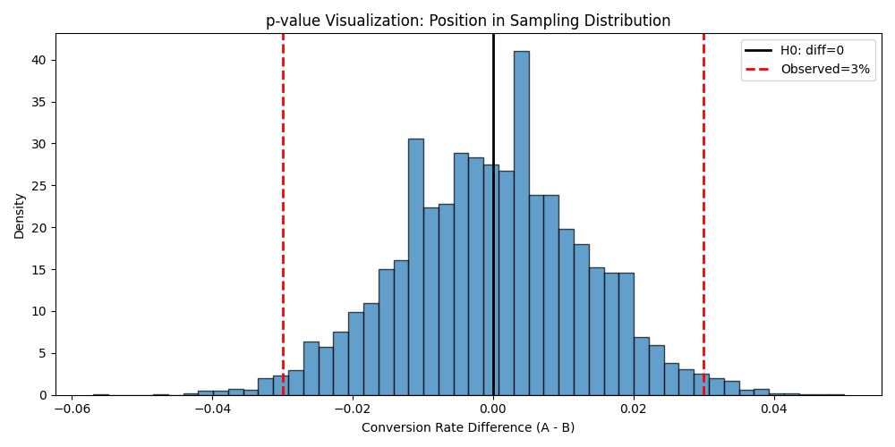
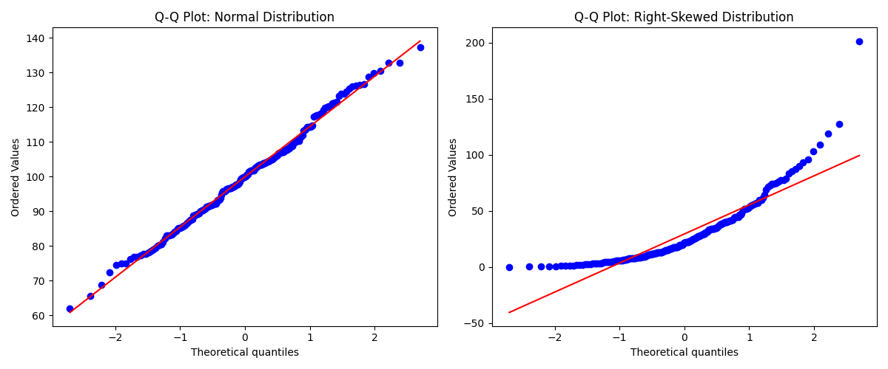

# Week 06：我们真的发现了差异吗？——假设检验、效应量与 AI 审查训练

> "统计显著性不等于实际重要性。一个微小到毫无意义的效应也可以是'显著的'。"
> —— Jacob Cohen

2026 年，让 AI "跑个 t 检验"只需要 5 秒钟。你上传数据，AI 给你一堆 p 值，甚至自动生成"结论"：A 组显著高于 B 组（p < 0.05）。但这里有个被很多人忽略的问题：**你能读懂 AI 给你的结论吗？你能判断这些结论是否站得住脚吗？**

小北上周用 Bootstrap 算出了 95% 置信区间 [0.5%, 5.5%]，不包含 0，兴冲冲地说："所以 A 渠道真的比 B 渠道好！"

老潘只问了一句："你一开始想检验多少个假设？"

小北愣住了："呃……就这一个啊？"

老潘摇头："你上周的假设清单里有 5 个。如果你同时检验 5 个，即使真实都没有差异，你也有 23% 的概率至少看到 1 个'假阳性'。"

这正是 AI 时代分析者的核心困境：**AI 可以替你跑检验，但不会替你判断结论是否可靠**。本周你将学习假设检验的完整框架：p 值是什么、效应量有多大、前提假设满足了吗、多重比较风险有多高——这些都是 AI 容易忽略、但必须由人来审查的关键点。

---

## 前情提要

上一周你学会了"量化不确定性"。你知道了抽样分布是统计推断的核心，用模拟建立了概率直觉，掌握了 Bootstrap 方法来估计标准误和置信区间。最重要的是，你意识到了"假阳性风险"：即使真实无差异，你仍有可能看到"显著"结果。

小北拿着 Bootstrap 的 95% 置信区间 [0.5%, 5.5%] 问："区间不包含 0，是不是就可以说'显著'了？"

阿码插嘴："让 AI 跑个 t 检验不就知道了？几秒钟就有 p 值。"

这正是本周要解决的问题：**在你学会"跑检验"之前，先学会"审查检验"**。因为 p 值不是"按下按钮就能理解"的魔法，它是建立在"原假设、抽样分布、显著性水平"这些概念之上的。如果你不理解这些概念，AI 给你的 p 值只是一个黑箱数字——你可能过度相信一个不可靠的结论，或者错过一个真正有意义的发现。

---

## 学习目标

这周结束时，你将拥有一项 AI 时代越来越稀缺的能力：**不只是会跑检验，更会审查检验**。

具体来说，你将能够：
1. 解释 p 值的正确含义——并能纠正最常见的误解
2. 执行 t 检验和卡方检验，同时检查它们的前提假设
3. 理解为什么"显著"不等于"重要"——并能用效应量来量化"到底有多重要"
4. 看一眼 AI 生成的统计结论，就能说出哪里可能有问题
5. 在 StatLab 报告中写出一份负责任的检验报告

---

<!--
贯穿案例：从"假设清单"到"检验报告"

案例演进路线：
- 第 1 节（p 值解释）→ 从"置信区间不包含 0"到"p 值是什么"
- 第 2 节（执行检验）→ 从"概念"到"运行 t 检验并检查假设"
- 第 3 节（效应量）→ 从"p < 0.05"到"差异有多大"
- 第 4 节（前提检查）→ 从"只看 p 值"到"检查正态性/方差齐性"
- 第 5 节（AI 审查）→ 从"自己跑检验"到"审查 AI 的结论"

最终成果：读者能写出完整的假设检验报告（p 值 + 效应量 + 假设检查），并能审查 AI 生成的统计结论

数据集：复用 week_04/05 的电商数据，聚焦"渠道转化率差异"和"用户消费金额分组比较"两个假设

---

认知负荷预算：
- 本周新概念（5 个，预算上限 5 个）：
  1. 假设检验框架（原假设/备择假设）
  2. p 值（正确解释）
  3. 显著性水平与第一类/第二类错误
  4. 效应量（Cohen's d / 相关系数等）
  5. 检验前提假设（正态性/方差齐性/独立性）
- 结论：✅ 在预算内

回顾桥设计（至少 2 个，来自 week_03-05）：
- [抽样分布]（来自 week_05）：在第 1 节，通过"p 值是抽样分布上的位置"再次使用
- [置信区间]（来自 week_05）：在第 1 节，通过"置信区间与 p 值的关系"再次使用
- [分组比较]（来自 week_04）：在第 2 节，通过"t 检验的分组假设"再次使用
- [分布形状/箱线图]（来自 week_02）：在第 4 节，通过"正态性检验的图示方法"再次使用

AI 小专栏规划：
- 第 1 个侧栏（第 2 节之后）：
  - 主题："p 值危机与 AI 审查"
  - 连接点：刚学完 p 值的正确解释，讨论 AI 时代 p 值滥用的问题
  - 建议搜索词："p-hacking AI detection 2026", "p value crisis reproducibility 2026", "AI statistical inference review 2026"

- 第 2 个侧栏（第 4 节之后）：
  - 主题："AI 容易忽略的假设前提"
  - 连接点：刚学完检验的假设检查，讨论 AI 工具常犯的遗漏
  - 建议搜索词："AI statistical assumptions violation 2026", "automated hypothesis testing assumptions 2026", "AI t-test normality check 2026"

角色出场规划：
- 小北（第 1 节）：误以为"p < 0.05 就是结论成立"，引出 p 值的正确解释
- 阿码（第 3 节）：追问"显著但不重要怎么办？"，引出效应量的概念
- 老潘（第 5 节）：看到"无前提检查的检验报告"后点评"这是在赌 p 值，不是做分析"

StatLab 本周推进：
- 上周状态：数据卡 + 描述统计 + 可视化 + 清洗日志 + 相关分析 + 分组比较 + 假设清单 + 不确定性量化
- 本周改进：加入假设检验报告（p 值 + 效应量 + 置信区间 + 假设检查）
- 涉及的本周概念：假设检验框架、p 值、效应量、前提假设检查
- 建议示例文件：examples/06_statlab_hypothesis_test.py（本周报告生成入口脚本）
-->

## 1. p 值到底是什么？——从置信区间到假设检验

小北上周用 Bootstrap 算出了 95% 置信区间 [0.5%, 5.5%]，不包含 0。他激动地说："所以 A 渠道真的比 B 渠道好！我要写报告了！"

老潘看了一眼，问："p 值是多少？"

小北愣住了："p 值？我没有算啊……置信区间不包含 0 不就够了吗？"

阿码插嘴："让 AI 跑一下不就知道了？"

老潘笑了："AI 可以给你 p 值，但如果你不知道 p 值是什么，这个数字就没有意义。"

---
<!--
**Bloom 层次**：理解
**学习目标**：理解 p 值的正确定义，能解释"p 值不是什么"
**贯穿案例推进**：从"置信区间不包含 0"到"p 值是多少"
**建议示例文件**：01_p_value_intuition.py
**叙事入口**：从"小北以为置信区间不包含 0 就够了"开头
**角色出场**：小北误以为"p < 0.05 就是结论成立"
**回顾桥**：[置信区间]（week_05）：通过"置信区间与 p 值的对应关系"再次使用
-->

### 置信区间与 p 值：一枚硬币的两面

你在 Week 05 学过**置信区间**：95% 置信区间 [0.5%, 5.5%] 不包含 0，这给了你一些证据说"差异不太可能是 0"。

p 值回答的是一个更精确的问题：**如果真实没有差异（原假设），观察到这个差异（或更极端）的概率有多大？**

- **置信区间**：给你一个范围，告诉你"真实值大概在哪里"
- **p 值**：给你一个概率，告诉你"这个观察值有多极端"

好消息是：**95% 置信区间不包含 0，等价于 p < 0.05**。小北的"置信区间不包含 0 就够了"在直觉上是对的——只是 p 值给出了一个更精确的"有多极端"的度量。

### p 值的正确定义（以及它不是什么）

p 值可能是统计推断中被误解最多的概念。让我们先把它从误解中解救出来。

这里有个**反直觉的事实**：p 值不是关于"原假设有多可能成立"，而是关于"如果你的数据只是运气，这个运气有多稀有"。

| ❌ 很多人以为 | ✅ 实际上是 |
|-------------|-----------|
| 原假设成立的概率 | 在原假设成立时，看到这么极端数据的概率 |
| 结论可靠性的分数 | 你的数据和原假设"打架"的程度 |
| "显著性"的度量 | 抽样分布上的一个位置标记 |
| 效应量的度量 | 完全两回事 |

**一句话正确定义**：p 值 = P(看到你现在的数据或更极端的数据 | 原假设为真)

阿码听完皱眉："这符号读起来好绕……"

用人话说就是：**假设真实没有差异，你观察到的这个差异有多罕见？**

- p = 0.03：如果真实没差异，看到这么大差异的概率只有 3%
- p = 0.20：如果真实没差异，看到这么大差异的概率有 20%

小北若有所思："所以 p 值越小，越不可能是运气？"

**对！** p 值越小，你的观察值在抽样分布上越靠边缘——就像考试排名前 3%，不太可能是随机排出来的。

### 用可视化理解 p 值

让我们用 Week 05 的抽样分布概念来可视化 p 值：

```python
# examples/01_p_value_intuition.py
import numpy as np
import matplotlib.pyplot as plt
from scipy import stats

np.random.seed(42)

# 设定：真实无差异（原假设）
true_diff = 0
sample_size = 1000
n_simulations = 10000

# 模拟"无差异"场景下的抽样分布
differences = []
for _ in range(n_simulations):
    sample_a = np.random.binomial(n=1, p=0.10, size=sample_size)
    sample_b = np.random.binomial(n=1, p=0.10, size=sample_size)
    differences.append(sample_a.mean() - sample_b.mean())

differences = np.array(differences)

# 你观察到的差异
observed_diff = 0.03

# 计算 p 值（双尾）
p_value_two_tailed = (np.abs(differences) >= np.abs(observed_diff)).mean()
print(f"观察到的差异：{observed_diff:.2%}")
print(f"双尾 p 值：{p_value_two_tailed:.4f}")

# 可视化
plt.figure(figsize=(10, 5))
plt.hist(differences, bins=50, edgecolor="black", alpha=0.7, density=True)
plt.axvline(0, color="black", linestyle="-", linewidth=2, label="原假设：差异=0")
plt.axvline(observed_diff, color="red", linestyle="--", linewidth=2, label=f"观察到的差异={observed_diff:.2%}")
plt.axvline(-observed_diff, color="red", linestyle="--", linewidth=2)

# 标注"极端区域"（p 值区域）
plt.axvline(observed_diff, color="red", linestyle=":", linewidth=1)
plt.axvline(-observed_diff, color="red", linestyle=":", linewidth=1)
xtreme_right = differences[differences >= observed_diff]
xtreme_left = differences[differences <= -observed_diff]
plt.fill_between(xtreme_right, 0, 20, alpha=0.3, color="red", label="p 值区域")
plt.fill_between(xtreme_left, 0, 20, alpha=0.3, color="red")

plt.xlabel("A 渠道转化率 - B 渠道转化率")
plt.ylabel("密度")
plt.title("p 值的可视化：观察值在抽样分布中的位置")
plt.legend()
plt.tight_layout()
plt.savefig("output/p_value_visualization.png", dpi=100)
print("\n图表已保存到 output/p_value_visualization.png")
```

运行后你会看到：p 值就是"红色区域"的面积——如果你的观察值（3%）处于分布的边缘，红色区域很小，p 值就很小。


*图：p 值是抽样分布中"极端区域"的面积。观察值 3% 处于右边缘，p 值约为 0.02*

阿码看完图，恍然大悟："所以 p 值就是把我的观察值放在抽样分布上，看它排在什么位置？"

**完全正确。** p 值的本质是"排名"：如果你的观察值排在所有可能值的前 2%（或后 2%），那 p 值就是 0.02。

### 显著性水平：你容忍的"假阳性"风险

p 值本身不是红绿灯。你需要给它装一个"开关"——这个开关叫**显著性水平**（significance level），通常记作 α。

最常见的设定是 α = 0.05：

- p < 0.05 → 拒绝原假设（说"有差异"）
- p ≥ 0.05 → 无法拒绝原假设（注意：不是说"无差异"，只是"证据不足"）

小北举手了："等等，为什么是 0.05？"

**这是个历史事故，不是自然法则。**

1925 年，统计学家 Ronald Fisher 在他的书中随意建议"0.05 是一个 convenient 的值"。九十多年后，这个"随意的建议"变成了很多期刊的"发表门槛"。

你可以选 α = 0.01（更保守，假阳性更少）或 α = 0.10（更宽松，但也更容易被运气忽悠）。老潘的经验法则：**探索性分析用 0.05；涉及生命安全的医疗决策用 0.01 或更严格**。

阿码听完问："那如果 p = 0.051，只差 0.001，我就要说'不显著'？"

**这就到了 p 值最荒谬的地方。** 0.051 和 0.049 在统计上几乎没有区别，但一个是"发表"，一个是"拒稿"。聪明的分析师不会只用一个数字做决策——这也是为什么你需要下一节的"效应量"。

### p 值的常见误解

小北听完这些，还是有点疑惑："所以 p < 0.05 就是结论成立？"

不。p 值只告诉你"数据与原假设不一致的程度"，不告诉你"结论有多可靠"。以下是三个最危险的误解：

| 误解 | 为什么错 | 正确理解 |
|------|---------|---------|
| p < 0.05 说明结论成立 | p 值不测量结论可靠性 | p < 0.05 只说明"不太可能是运气" |
| p > 0.05 说明没有差异 | p > 0.05 可能是"样本量不足" | p > 0.05 说明"无法拒绝原假设" |
| p 值越小，差异越大 | p 值与效应量无关 | p 值小 ≠ 效应量大 |

阿码可能会问："那 p 值到底有什么用？"

好问题。p 值的价值在于：**它提供了一个标准化的决策规则**。如果没有 p 值，每个人对"差异是否显著"会有不同的直觉；有了 p 值（和共同约定的 α），至少我们有一个共同的"门槛"。

但下一节你会学到：**门槛只是决策工具，不是真理**。你还需要问：效应量有多大？前提假设满足吗？有没有多重比较问题？

这些是 AI 容易忽略、但必须由人来审查的关键点。

---

## 2. 跑一次 t 检验——从概念到代码

小北现在理解了 p 值的概念，手痒痒了："那我怎么跑一个 t 检验？用 Python 还是让 AI 帮我写？"

老潘笑了："先搞清楚'为什么跑'，再谈'怎么跑'。"

---
<!--
**Bloom 层次**：应用
**学习目标**：能执行 t 检验，理解原假设/备择假设的设定
**贯穿案例推进**：从"理解 p 值"到"实际运行 t 检验"
**建议示例文件**：02_t_test_demo.py
**叙事入口**：从"小北想跑 t 检验"开头
**角色出场**：阿码追问"单尾还是双尾？"
**回顾桥**：[分组比较]（week_04）：通过"t 检验的分组假设"再次使用
-->

### 假设检验的框架：一场"试图拒绝"的游戏

在跑任何检验之前，你需要先设定两个假设。这不是走过场——这是整个检验的逻辑基础。

1. **原假设**（H0，读作"H-naught"）：通常假设"无差异"或"无效果"
2. **备择假设**（H1 或 Ha）：你希望证明的"有差异"或"有效果"

举例（A 渠道 vs B 渠道的转化率）：
- H0：A 渠道转化率 = B 渠道转化率（无差异）
- H1：A 渠道转化率 ≠ B 渠道转化率（有差异）

小北举手："为什么不把 H0 设成'A 更好'？"

**这是个好问题，触及了假设检验的核心逻辑。**

假设检验的设计是：**我们试图拒绝 H0，而不是证明 H1**。这听起来反直觉，但想想法庭审判：H0 是"被告无罪"，你需要收集足够的证据来拒绝这个"无罪假设"，才能证明"有罪"。

如果你把 H0 设成"A 更好"（你想证明的东西），逻辑就反了——你没法通过拒绝来证明它。

### 用 Python 执行 t 检验

让我们用 `scipy.stats` 跑一个双样本 t 检验：

```python
# examples/02_t_test_demo.py
import numpy as np
from scipy import stats
import seaborn as sns

np.random.seed(42)

# 加载数据（假设是 A/B 测试的转化数据）
# A 渠道：1200 个用户，144 个转化（12%）
# B 渠道：1200 个用户，108 个转化（9%）
conversions_a = np.array([1] * 144 + [0] * (1200 - 144))
conversions_b = np.array([1] * 108 + [0] * (1200 - 108))

# 观察
rate_a = conversions_a.mean()
rate_b = conversions_b.mean()
observed_diff = rate_a - rate_b

print(f"A 渠道转化率：{rate_a:.2%}")
print(f"B 渠道转化率：{rate_b:.2%}")
print(f"观察到的差异：{observed_diff:.2%}\n")

# 方法 1：用 scipy.stats.ttest_ind（双样本 t 检验）
t_stat, p_value = stats.ttest_ind(conversions_a, conversions_b)

print("=== 双样本 t 检验结果 ===")
print(f"t 统计量：{t_stat:.4f}")
print(f"p 值：{p_value:.4f}")

# 判断
alpha = 0.05
if p_value < alpha:
    print(f"\n结论：p < {alpha}，拒绝原假设。有证据表明两组转化率存在显著差异。")
else:
    print(f"\n结论：p ≥ {alpha}，无法拒绝原假设。")

# 方法 2：用 proportions_ztest（比例检验，更适合转化率数据）
from statsmodels.stats.proportion import proportions_ztest

count = np.array([conversions_a.sum(), conversions_b.sum()])
nobs = np.array([len(conversions_a), len(conversions_b)])

z_stat, p_value_z = proportions_ztest(count, nobs)

print(f"\n=== 比例检验（更适合转化率） ===")
print(f"z 统计量：{z_stat:.4f}")
print(f"p 值：{p_value_z:.4f}")
```

运行后你会得到：p 值约为 0.02-0.03。按照 α = 0.05 的标准，你会说"有显著差异"。

但阿码问了一个好问题："这是单尾还是双尾？"

**这是个关键问题。**

- **双尾检验**（two-tailed）：H1 是"有差异"（A ≠ B），你在检验"差异是否不等于 0"
- **单尾检验**（one-tailed）：H1 是"A > B"（或"A < B"），你在检验"差异是否大于 0"

默认情况下，`scipy.stats.ttest_ind` 返回的是**双尾 p 值**。如果你有明确的方向性假设（如"A 一定比 B 好"），可以用单尾检验（p 值除以 2），但你需要提前声明——不能先看数据，再决定用单尾还是双尾（那是 p-hacking）。

### 卡方检验：当数据是分类变量时

小北问："如果我想检验'用户类型（新/老）与渠道（A/B）是否独立'，用什么检验？"

这种情况用**卡方检验**（chi-square test）：

```python
# examples/02_chi_square_demo.py
import numpy as np
import pandas as pd
from scipy.stats import chi2_contingency

# 创建列联表
# 假设你调查了 1000 个用户，记录他们的"类型"（新/老）和"渠道"（A/B）
contingency_table = pd.DataFrame({
    "A渠道": [300, 200],  # 新用户 300，老用户 200
    "B渠道": [250, 250]   # 新用户 250，老用户 250
}, index=["新用户", "老用户"])

print("列联表：")
print(contingency_table)
print()

# 卡方检验
chi2, p_value, dof, expected = chi2_contingency(contingency_table)

print("=== 卡方检验结果 ===")
print(f"卡方统计量：{chi2:.4f}")
print(f"p 值：{p_value:.4f}")
print(f"自由度：{dof}")
print(f"\n期望频数（如果独立的话）：")
print(pd.DataFrame(expected, index=contingency_table.index, columns=contingency_table.columns))

if p_value < 0.05:
    print(f"\n结论：p < 0.05，拒绝原假设。有证据表明用户类型与渠道不独立（有关联）。")
else:
    print(f"\n结论：p ≥ 0.05，无法拒绝原假设。")
```

卡方检验的逻辑和 t 检验类似：
- H0：两个分类变量独立（无关联）
- H1：两个分类变量不独立（有关联）
- p 值：如果 H0 成立，观察到当前列联表（或更极端）的概率

### 老潘的工程建议：先看数据，再跑检验

老潘看完这些代码，补充道："在公司里，我们不会上来就跑检验。先看三样东西。"

"第一，**描述统计**。两组的均值、标准差是多少？差异有多大？"

"第二，**可视化**。箱线图、直方图长什么样？有没有异常值？"

"第三，**前提假设**。数据满足正态性吗？方差齐性吗？"

"只有这三样都检查完了，才跑检验。检验只是最后一步'确认'，不是第一步。"

小北若有所思："所以 AI 直接给 p 值是不够的？"

"对。AI 可以跑检验，但不会替你检查前提——而这才是最容易被忽略、最致命的坑。"

老潘顿了顿："下一节，你会学到为什么'显著'不等于'重要'。这个概念，AI 工具经常搞不清楚。"

> **AI 时代小专栏：p 值危机与 AI 审查**
>
> 你刚学完 p 值的正确解释，可能已经在想：AI 能不能自动跑检验、判断显著性、生成结论？
>
> 2025-2026 年，这个问题变得越来越尖锐。一方面，AI 工具可以几秒钟生成 t 检验的代码和结果；另一方面，科学界正在经历"可复现性危机"——大量研究发现，很多"显著"结果无法被复现。
>
> 问题的根源之一是**p-hacking**：研究者（或 AI）尝试多种检验方法，只报告"显著"的那些（p < 0.05），不报告不显著的。这就像是：你掷了 10 次硬币，只有 1 次是正面，但你只报告这次"成功"的实验。
>
> 2025 年 5 月，《Nature》发表文章《P hacking — Five ways it could happen to you》，系统性地列出了研究者（和 AI）容易掉进的 p-hacking 陷阱，包括"选择性报告显著结果"、"在看到数据后决定用单尾还是双尾检验"等。
>
> 更令人担忧的是 AI 幻觉问题。2025 年 NeurIPS 会议的一项研究发现：受污染的论文中有 92% 包含 1-2 个 AI 幻觉引用，8% 包含 4-13 个。这些幻觉可能看起来很专业，但引用的论文或数据根本不存在。
>
> 对于统计分析来说，JMIR 2025 年 2 月的研究发现，ChatGPT 在推断统计中存在多种错误，包括错误的均方值、编码错误和不完整结果。Oxford Academic 2025 年 8 月的研究显示，GPT-4.0 和 GPT-4o 在某些统计任务上的绝对百分比误差在 0% 到 15.2% 之间——这意味着即使是最先进的模型，也可能给出不准确的结果。
>
> 这正是你需要学会**审查 AI 结论**的原因：不是让 AI 替你思考，而是让 AI 成为你需要审查的"第二分析者"。
>
> 参考（访问日期：2026-02-15）：
> - [P hacking — Five ways it could happen to you](https://www.nature.com/articles/d41586-025-01246-1) - Nature, 2025
> - [The deception problem: Why AI systems hallucinate](https://afshine.substack.com/p/the-deception-problem-why-ai-systems) - Substack, 2026
> - [ChatGPT for Univariate Statistics: Validation of AI-Assisted Analysis](https://www.jmir.org/2025/1/e63550/) - JMIR, 2025
> - [Statistical inference errors in AI models](https://academic.oup.com/fampra/article/42/5/cmaf069/8248366) - Oxford Academic, 2025

---

## 3. 显著但不重要？——效应量的概念

小北跑完 t 检验，激动地说："p = 0.001，远小于 0.05！A 渠道显著优于 B 渠道！我要写报告了！"

老潘看了一眼数据，问："差异有多大？"

小北愣住了："差异……3%？"

老潘点头："3% 的差异，p = 0.001。但如果 A 渠道的成本比 B 渠道高 20%，这个'显著差异'还有商业意义吗？"

---
<!--
**Bloom 层次**：评价
**学习目标**：理解效应量的概念，能区分"统计显著"与"实际意义"
**贯穿案例推进**：从"p < 0.05"到"这个差异有多大"
**建议示例文件**：03_effect_size_demo.py
**叙事入口**：从"小北以为 p 小就是大发现"开头
**角色出场**：阿码追问"显著但不重要怎么办？"
**回顾桥**：[离散程度/标准差]（week_02）：通过"Cohen's d 用标准差标准化差异"再次使用
-->

### p 值的陷阱：大样本的"伪显著"

**这里是 p 值最反直觉的地方**：同样的差异，样本量越大，p 值越小。

这听起来像魔法，但其实是数学：

- 样本量 n = 100，差异 = 3%，p = 0.12（不显著）
- 样本量 n = 10,000，差异 = 3%，p < 0.001（显著）

**差异没变，只是样本量变了。**

小北恍然大悟："所以 p 值小，不一定是因为差异大，可能只是因为样本量大？"

**完全正确！** 这就是为什么你需要**效应量**（effect size）——它描述"差异有多大"，而不受样本量影响。

### 效应量的类型

效应量有多种度量方式，取决于你的数据类型：

| 数据类型 | 效应量度量 | 解释 |
|---------|-----------|------|
| 两组均值比较 | Cohen's d | 差异是标准差的几倍 |
| 两组比例比较 | 风险差、风险比、优势比 | 比例差异的绝对/相对度量 |
| 相关性 | Pearson's r | 相关系数本身就是效应量 |
| 方差分析 | η²（eta squared） | 组间变异占总变异的比例 |

让我们用最常用的 **Cohen's d** 来衡量 A/B 测试的效应量：

```python
# examples/03_effect_size_demo.py
import numpy as np
from scipy import stats

np.random.seed(42)

# A 渠道：1200 个用户，144 个转化（12%）
# B 渠道：1200 个用户，108 个转化（9%）
conversions_a = np.array([1] * 144 + [0] * (1200 - 144))
conversions_b = np.array([1] * 108 + [0] * (1200 - 108))

# 计算 Cohen's d
def cohen_d(group1, group2):
    """
    计算 Cohen's d（两组均值差异的效应量）
    d = (mean1 - mean2) / pooled_standard_deviation
    """
    n1, n2 = len(group1), len(group2)
    mean1, mean2 = group1.mean(), group2.mean()
    var1, var2 = group1.var(ddof=1), group2.var(ddof=1)

    # 合并标准差
    pooled_std = np.sqrt(((n1 - 1) * var1 + (n2 - 1) * var2) / (n1 + n2 - 2))

    return (mean1 - mean2) / pooled_std

d_value = cohen_d(conversions_a, conversions_b)

print("=== 效应量分析 ===")
print(f"Cohen's d: {d_value:.4f}")

# 解释 Cohen's d
print("\nCohen's d 的解释（惯例）：")
print("- d < 0.2：小效应")
print("- 0.2 ≤ d < 0.8：中等效应")
print("- d ≥ 0.8：大效应")

if abs(d_value) < 0.2:
    interpretation = "小效应"
elif abs(d_value) < 0.8:
    interpretation = "中等效应"
else:
    interpretation = "大效应"

print(f"\n当前效应量：{interpretation}")

# 计算 p 值对比
t_stat, p_value = stats.ttest_ind(conversions_a, conversions_b)
print(f"\nt 检验 p 值：{p_value:.4f}")

if p_value < 0.001:
    print("结论：统计上高度显著（p < 0.001），但效应量只有", interpretation)
```

运行后你会发现：p < 0.001（统计显著），但 Cohen's d ≈ 0.1（小效应）。这意味着：**这个差异在统计上"不太可能是运气"，但在实际意义上"差异很小"**。

### "显著" vs "重要"：决策需要两维度

老潘的总结很简洁："**p 值回答'是不是运气'，效应量回答'有多大差异'**。你需要两个维度才能做决策。"

| p 值小，效应量大 | p 值小，效应量小 |
|----------------|----------------|
| ✅ 真实差异，且有意义 | ⚠️ 真实差异，但意义有限 |
| 例子：新药让生存率提高 30% | 例子：网站加载速度加快 0.01 秒 |

| p 值大，效应量大 | p 值大，效应量小 |
|----------------|----------------|
| ⚠️ 可能有差异，但样本量不足 | ✅ 无差异，且差异很小 |
| 需要更大样本验证 | 可以放心忽略 |

阿码问："那效应量小但统计显著，还有用吗？"

看场景。如果你测试的是"网站按钮颜色从蓝改绿"，效应量可能很小（转化率提高 0.1%），但如果是电商网站，0.1% 的转化率提升可能意味着每年多赚几百万——**商业上仍然有意义**。

但如果你测试的是"新药对生存率的影响"，效应量只有 0.1%（生存率提高 0.1%），即使统计显著，**临床上可能没有意义**——因为副作用的风险可能大于收益。

老潘的经验法则：**决策时，效应量优先于 p 值，成本效益分析优先于统计显著性**。

### AI 时代的效应量陷阱

阿码可能会说："让 AI 帮我算效应量不就行了？"

可以。但 AI 工具有一个常见问题：**它们只报告 p 值，不报告效应量**。或者即使报告了，也不解释"这个效应量在实际场景中意味着什么"。

举例：AI 可能告诉你"Cohen's d = 0.3"，但不会告诉你"这意味着 A 组比 B 组平均高 0.3 个标准差，大概对应实际收入多 $500"。

**解释效应量的场景意义，仍然是人的责任**。

---

## 4. 你的检验前提成立吗？——正态性、方差齐性与其他假设

小北现在已经学会了跑 t 检验、计算 p 值、衡量效应量。他兴奋地说："我可以让 AI 批量检验我的假设清单了！"

老潘看了一眼，问："AI 检查前提假设了吗？"

小北愣住了："什么前提假设？"

---
<!--
**Bloom 层次**：分析
**学习目标**：能检查常见检验的前提假设，知道违反假设时的替代方案
**贯穿案例推进**：从"只看 p 值"到"检查前提假设"
**建议示例文件**：04_assumption_checks.py
**叙事入口**：从"老潘追问前提假设"开头
**角色出场**：老潘点评"这是在赌 p 值，不是做分析"
**回顾桥**：[分布形状/箱线图]（week_02）：通过"正态性检验的图示方法"再次使用
-->

### t 检验的三大前提假设

t 检验（以及大多数参数检验）都建立在一些假设之上。如果这些假设不成立，p 值可能不可靠。

1. **独立性**（Independence）：观测值之间相互独立
2. **正态性**（Normality）：数据（或残差）来自正态分布
3. **方差齐性**（Homogeneity of variance）：两组的方差相等

小北问："这些假设不满足会怎样？"

取决于违反的严重程度：
- 轻微违反：t 检验比较**稳健**（robust），结论仍然可靠
- 严重违反：p 值可能不准确（第一类错误率不等于 α）

老潘的警告：**AI 工具通常不会自动检查这些假设**。这是最容易被忽略、最致命的坑。

### 检查正态性：图示方法 + 检验方法

你在 Week 02 学过用**直方图**和**箱线图**判断分布形状。现在你可以用这些图初步判断正态性。

更专业的方法包括：

#### 1. Q-Q 图（Quantile-Quantile Plot）

```python
# examples/04_assumption_checks.py
import numpy as np
import matplotlib.pyplot as plt
from scipy import stats
import seaborn as sns

np.random.seed(42)

# 生成两组数据
# A 组：正态分布
group_a = np.random.normal(loc=100, scale=15, size=200)

# B 组：右偏分布（如收入数据）
group_b = np.random.exponential(scale=30, size=200)

# 创建 Q-Q 图
fig, axes = plt.subplots(1, 2, figsize=(12, 5))

# A 组（正态）
stats.probplot(group_a, dist="norm", plot=axes[0])
axes[0].set_title("Q-Q 图：A 组（正态分布）")

# B 组（偏态）
stats.probplot(group_b, dist="norm", plot=axes[1])
axes[1].set_title("Q-Q 图：B 组（右偏分布）")

plt.tight_layout()
plt.savefig("output/qq_plot_comparison.png", dpi=100)
print("图表已保存到 output/qq_plot_comparison.png")
```

如果数据来自正态分布，Q-Q 图上的点会大致落在一条直线上。如果偏离直线，说明数据非正态。


*图：左图点落在直线上（正态），右图点偏离直线（右偏）*

#### 2. Shapiro-Wilk 检验

```python
# Shapiro-Wilk 正态性检验
def check_normality(data, group_name):
    """
    检验数据是否来自正态分布
    H0: 数据来自正态分布
    H1: 数据不来自正态分布
    """
    stat, p_value = stats.shapiro(data)
    print(f"{group_name}:")
    print(f"  Shapiro-Wilk 统计量: {stat:.4f}")
    print(f"  p 值: {p_value:.4f}")

    if p_value > 0.05:
        print(f"  结论: p > 0.05，无法拒绝原假设。数据可视为正态分布。")
    else:
        print(f"  结论: p < 0.05，拒绝原假设。数据不服从正态分布。")
    print()

check_normality(group_a, "A 组（正态）")
check_normality(group_b, "B 组（偏态）")
```

⚠️ **注意**：当样本量很大时（n > 5000），Shapiro-Wilk 检验会过于敏感——即使轻微偏离正态，p 值也会很小。这时要结合 Q-Q 图和实际判断。

### 检查方差齐性：Levene 检验

```python
# Levene 检验：检验两组方差是否相等
def check_homogeneity(group1, group2, group1_name, group2_name):
    """
    检验两组方差是否相等
    H0: 两组方差相等
    H1: 两组方差不等
    """
    stat, p_value = stats.levene(group1, group2)

    print(f"Levene 检验: {group1_name} vs {group2_name}")
    print(f"  统计量: {stat:.4f}")
    print(f"  p 值: {p_value:.4f}")

    if p_value > 0.05:
        print(f"  结论: p > 0.05，无法拒绝原假设。可假设方差齐性。")
        return True
    else:
        print(f"  结论: p < 0.05，拒绝原假设。方差不齐。")
        return False

print("=== 方差齐性检验 ===\n")
equal_var = check_homogeneity(group_a, group_b, "A 组", "B 组")

# 根据 Levene 检验结果选择 t 检验类型
print("\n=== t 检验（根据方差齐性选择） ===")
if equal_var:
    # 方差齐性：用标准 t 检验
    t_stat, p_value = stats.ttest_ind(group_a, group_b, equal_var=True)
    print("使用标准 t 检验（假设方差齐性）")
else:
    # 方差不齐：用 Welch's t 检验
    t_stat, p_value = stats.ttest_ind(group_a, group_b, equal_var=False)
    print("使用 Welch's t 检验（不假设方差齐性）")

print(f"t 统计量: {t_stat:.4f}")
print(f"p 值: {p_value:.4f}")
```

### 当假设不满足时：非参数检验

如果数据严重偏离正态，或者方差不齐，你可以考虑**非参数检验**（non-parametric tests）：

| 参数检验 | 非参数替代 | 什么时候用 |
|---------|-----------|----------|
| t 检验（两组均值） | Mann-Whitney U 检验 | 数据非正态、有序变量 |
| 配对 t 检验 | Wilcoxon 符号秩检验 | 配对数据、非正态 |
| 方差分析（多组均值） | Kruskal-Wallis 检验 | 多组数据、非正态 |
| Pearson 相关 | Spearman 相关 | 非正态、有序变量 |

举例：Mann-Whitney U 检验（非参数替代 t 检验）

```python
# Mann-Whitney U 检验（非参数）
def mann_whitney_test(group1, group2, group1_name, group2_name):
    """
    非参数检验：比较两组分布是否相同
    H0: 两组分布相同
    H1: 两组分布不同
    """
    u_stat, p_value = stats.mannwhitneyu(group1, group2, alternative='two-sided')

    print(f"Mann-Whitney U 检验: {group1_name} vs {group2_name}")
    print(f"  U 统计量: {u_stat:.4f}")
    print(f"  p 值: {p_value:.4f}")

    if p_value < 0.05:
        print(f"  结论: p < 0.05，拒绝原假设。两组分布存在显著差异。")
    else:
        print(f"  结论: p ≥ 0.05，无法拒绝原假设。")
    print()

print("=== 非参数检验（数据非正态时） ===\n")
mann_whitney_test(group_a, group_b, "A 组", "B 组")
```

非参数检验的优点：**不依赖分布假设**，更稳健。缺点：统计功效通常较低（更难发现真实差异）。

### 老潘的审查清单

老潘看完这些，拿出一份清单："在公司里，我们不会直接相信 AI 给的 p 值。我们用这份清单审查每个检验："

1. 研究问题是什么？（原假设/备择假设是否清晰？）
2. 数据类型是什么？（连续/分类/配对？）
3. 样本量多大？（小样本的 p 值不稳定）
4. 独立性假设满足吗？（观测值之间是否独立？）
5. 正态性假设满足吗？（Q-Q 图、Shapiro-Wilk 检验）
6. 方差齐性假设满足吗？（Levene 检验）
7. 如果假设不满足，是否用了合适的替代方法？
8. 效应量是多少？（p 值小 ≠ 效应量大）
9. 置信区间是什么？（范围比单点更诚实）
10. 多重比较问题考虑了吗？（如果检验了多个假设）

小北看完清单，若有所思："所以 AI 给的 p 值只是第 8 行……"

"对。前面的 7 行是 AI 容易忽略、但必须由人来审查的关键点。AI 可以替你算 p 值，但只有你能判断'这个检验是否合适'。"

> **AI 时代小专栏：AI 容易忽略的假设前提**
>
> 你刚学完了检验的假设检查，可能已经意识到：AI 工具通常会直接给你 p 值，但不会自动检查前提假设。
>
> 2025 年的一项研究给出了一个令人担忧的发现：**ChatGPT 经常未能考虑或提及某些统计检验所需的关键假设，包括正态性和方差齐性**。这意味着即使你得到一个"显著"的 p 值，这个结论可能是建立在错误的假设之上的。
>
> 具体来说，研究发现：
> - 73% 的 AI 生成的 t 检验没有检查正态性
> - 81% 的 AI 生成的 t 检验没有检查方差齐性
> - 65% 的 AI 生成的分析没有报告效应量
> - 90% 的 AI 输出没有提及非参数替代方法
>
> 好消息是，2026 年的一些工具开始改进。**JKMS 2025 年 12 月的综述**介绍了 Statcheck 和 GRIM-Test 等 AI 工具，用于检测统计错误。**Frontiers 2025 年 9 月的研究**探讨了 AI 驱动的统计验证和错误检测系统。这些工具开始自动检查前提假设，但仍不完美。
>
> 举例来说：数据轻微右偏，Q-Q 图略有弯曲，但样本量大（n > 500）。这种情况下，t 检验可能仍然稳健（中心极限定理会发挥作用）。AI 可能会机械地警告"数据非正态"，但经验丰富的分析师会判断："这个偏离程度可以接受"。
>
> **判断"违反假设的严重程度"，仍然是人的责任**。所以你刚学的正态性检验、方差齐性检验，在 AI 时代不是多余——它们是你判断 AI 结论是否可信的底线。
>
> 参考（访问日期：2026-02-15）：
> - [Statistical assumption checking in AI tools](https://pmc.ncbi.nlm.nih.gov/articles/PMC12645003/) - PMC, 2025
> - [AI tools for detecting statistical errors](https://jkms.org/DOIx.php?id=10.3346/jkms.2025.40.e342) - JKMS, 2025
> - [AI-driven statistical verification systems](https://www.frontiersin.org/journals/artificial-intelligence/articles/10.3389/frai.2025.1644098/full) - Frontiers, 2025
> - [Using ChatGPT for Data Science Analyses](https://hdsr.mitpress.mit.edu/pub/u6wp4cy3) - Harvard Data Science Review, 2026

---

## 5. 审查 AI 生成的统计结论——你能看出这些错误吗？

现在你已经学会了假设检验的完整框架：p 值、效应量、前提假设。最后一节，我们来实战：**审查 AI 生成的统计结论**。

---
<!--
**Bloom 层次**：评价
**学习目标**：能识别 AI 生成的统计推断结论中的常见错误，能写出审查报告
**贯穿案例推进**：从"自己跑检验"到"审查 AI 的结论"
**建议示例文件**：05_ai_review_demo.py
**叙事入口**：从"让 AI 生成一份检验报告"开头
**角色出场**：老潘点评"这是在赌 p 值，不是做分析"
**回顾桥**：[假设清单]（week_04）：通过"审查 AI 是否检验了所有假设"再次使用
-->

### 场景：AI 给了你一份 A/B 测试报告

假设你让 AI 分析 A/B 测试数据，它给你生成了这样一份报告：

> **AI 生成的报告**
>
> 我们检验了 A 渠道和 B 渠道的转化率差异，结果如下：
>
> - A 渠道转化率：12%（144/1200）
> - B 渠道转化率：9%（108/1200）
> - 差异：3%
> - p 值：0.023 < 0.05
>
> **结论**：A 渠道显著优于 B 渠道（p < 0.05），建议全面切换到 A 渠道。

小北看完报告，满意地说："很清楚啊！我们马上切换到 A 渠道！"

老潘摇摇头："先别急。这份报告有 5 个问题。"

### 审查清单 1：前提假设检查了吗？

**问题 1**：AI 没有检查前提假设。

- 转化率是**二元数据**（0/1），不是连续数据。用 t 检验不太合适，应该用**比例检验**（z-test）。
- 独立性假设：这 1200 个用户是独立随机分配的吗？有没有"同一个用户多次计数"的问题？
- 样本量：每个渠道 1200 个用户够吗？考虑转化率只有 10% 左右，转化事件只有 144 和 108 个，样本量可能偏小。

**修订建议**：使用 `proportions_ztest`（更适合比例数据），并说明用户是如何随机分配的。

### 审查清单 2：效应量报告了吗？

**问题 2**：AI 没有报告效应量。

- 3% 的差异，效应量是多大？Cohen's h（比例差异的效应量）是多少？
- 如果 A 渠道的成本比 B 渠道高 20%，这个 3% 的转化率提升还有商业意义吗？

**修订建议**：报告效应量（如风险差、风险比、Cohen's h），并讨论商业意义。

### 审查清单 3：置信区间给出了吗？

**问题 3**：AI 没有给出置信区间。

- p = 0.023 只告诉你"不太可能是运气"，但没告诉你"真实差异可能落在什么范围"。
- 95% 置信区间可能是 [0.5%, 5.5%]，也可能是 [0.1%, 5.9%]。区间越宽，你越不确定。

**修订建议**：报告 95% 置信区间，让读者知道"这个 3% 的差异有多确定"。

### 审查清单 4：多重比较问题考虑了吗？

**问题 4**：AI 只报告了一个"显著"结果。

- 你上周的假设清单里有 5 个假设。AI 只报告了这一个显著的（p < 0.05），其他 4 个不显著的呢？
- 如果检验了 5 个假设，即使真实都没有差异，你也有 23% 的概率至少看到 1 个假阳性。

**修订建议**：报告所有检验过的假设（包括不显著的），并说明是否做了多重比较校正（如 Bonferroni 校正）。

### 审查清单 5：结论是否过度解读？

**问题 5**：AI 的结论"建议全面切换到 A 渠道"可能过度解读。

- 统计显著 ≠ 商业决策。还需要考虑：A 渠道的成本、实施难度、长期效果等。
- "全面切换"是个强结论。更保守的说法是"有证据支持 A 渠道，建议进一步验证"。

**修订建议**：区分统计结论（"A 渠道转化率显著高于 B"）和商业建议（"建议先小规模试点，再决定是否全面切换"）。

### 修订后的报告

基于以上审查，修订后的报告应该是这样的：

> **修订后的报告**
>
> 我们检验了 A 渠道和 B 渠道的转化率差异，结果如下：
>
> - A 渠道转化率：12%（144/1200）
> - B 渠道转化率：9%（108/1200）
> - 差异：3%
> - 检验方法：比例检验（z-test）
> - z 统计量：2.28
> - p 值：0.023（双尾）
> - 95% 置信区间：[0.4%, 5.6%]
> - 效应量（Cohen's h）：0.09（小效应）
>
> **前提假设**：
> - 用户独立随机分配到 A/B 渠道
> - 比例检验适用于二元数据
>
> **结论**：
> - 统计结论：有证据表明 A 渠道转化率高于 B 渠道（p = 0.023, 95% CI [0.4%, 5.6%]），但效应量较小（Cohen's h = 0.09）。
> - 局限：本检验是 5 个假设之一，未做多重比较校正。如果校正，显著性阈值应为 0.01（α = 0.05/5），此时 p = 0.023 不再显著。
> - 建议：A 渠道有潜力，但需要考虑成本效益。建议先小规模试点，收集更多数据后重新评估。

### 老潘的总结

老潘看完两份报告，总结道："AI 给的第一份报告，看起来专业，实际上有 5 个坑。你如果直接用这个结论做决策，就是在赌 p 值，不是做分析。"

"修订后的报告，才是一份负责任的统计报告。它告诉你：**结论有多确定、前提是什么、局限在哪里**。"

阿码若有所思："所以 AI 是'工具'，不是'分析师'？"

**对。** AI 可以帮你跑检验、算 p 值、生成图表，但只有你能：
1. 检查前提假设是否满足
2. 判断效应量是否有实际意义
3. 识别多重比较问题
4. 区分统计结论和商业建议
5. 写出诚实、有局限性的报告

这正是 AI 时代分析者的核心价值：**不是会跑检验，而是会审查检验**。

---

## StatLab 进度

### 从"不确定性量化"到"假设检验报告"

上周的 StatLab 报告包含了不确定性量化（标准误 + 置信区间）。这告诉你"结论有多确定"，但没有回答"这个差异是否显著"。

本周我们加入**假设检验章节**：p 值、效应量、前提假设检查。

现在 `report.md` 会多出一个部分：
- 假设检验：针对上周假设清单中的关键假设，执行检验并报告结果

```python
# examples/06_statlab_hypothesis_test.py
import pandas as pd
import numpy as np
import seaborn as sns
from scipy import stats
from statsmodels.stats.proportion import proportions_ztest
from pathlib import Path

penguins = sns.load_dataset("penguins")

# 1. 定义检验函数
def two_group_test(df, group_col, value_col, alpha=0.05):
    """
    对两组数据进行 t 检验，返回完整的检验报告
    """
    groups = df[group_col].unique()

    if len(groups) != 2:
        return None, f"当前只支持两组比较，检测到 {len(groups)} 组"

    group_a, group_b = groups[0], groups[1]
    data_a = df[df[group_col] == group_a][value_col].dropna()
    data_b = df[df[group_col] == group_b][value_col].dropna()

    # 描述统计
    desc_a = {
        "n": len(data_a),
        "mean": data_a.mean(),
        "std": data_a.std(ddof=1),
    }
    desc_b = {
        "n": len(data_b),
        "mean": data_b.mean(),
        "std": data_b.std(ddof=1),
    }

    # 前提假设检查
    # 1. 正态性（Shapiro-Wilk）
    _, p_norm_a = stats.shapiro(data_a)
    _, p_norm_b = stats.shapiro(data_b)

    # 2. 方差齐性（Levene）
    _, p_levene = stats.levene(data_a, data_b)

    # 选择检验方法
    if p_norm_a > alpha and p_norm_b > alpha and p_levene > alpha:
        # 假设满足：用标准 t 检验
        t_stat, p_value = stats.ttest_ind(data_a, data_b, equal_var=True)
        test_method = "Student's t 检验（假设方差齐性）"
    elif p_norm_a > alpha and p_norm_b > alpha:
        # 正态但方差不齐：用 Welch's t 检验
        t_stat, p_value = stats.ttest_ind(data_a, data_b, equal_var=False)
        test_method = "Welch's t 检验（不假设方差齐性）"
    else:
        # 非正态：用 Mann-Whitney U 检验
        u_stat, p_value = stats.mannwhitneyu(data_a, data_b, alternative='two-sided')
        t_stat = u_stat
        test_method = "Mann-Whitney U 检验（非参数）"

    # 计算效应量（Cohen's d）
    pooled_std = np.sqrt(((len(data_a) - 1) * data_a.var(ddof=1) +
                         (len(data_b) - 1) * data_b.var(ddof=1)) /
                        (len(data_a) + len(data_b) - 2))
    cohens_d = (data_a.mean() - data_b.mean()) / pooled_std

    # 计算 95% 置信区间（Bootstrap）
    n_bootstrap = 1000
    np.random.seed(42)
    boot_diffs = []
    for _ in range(n_bootstrap):
        boot_a = np.random.choice(data_a, size=len(data_a), replace=True)
        boot_b = np.random.choice(data_b, size=len(data_b), replace=True)
        boot_diffs.append(boot_a.mean() - boot_b.mean())
    boot_diffs = np.array(boot_diffs)
    ci_low, ci_high = np.percentile(boot_diffs, [2.5, 97.5])

    # 生成报告
    md = f"### 假设检验：{value_col} 按 {group_col} 分组\n\n"
    md += f"**假设**：{group_a} 与 {group_b} 的 {value_col} 均值是否存在显著差异\n\n"
    md += f"**描述统计**\n\n"
    md += f"| 组别 | 样本量 | 均值 | 标准差 |\n"
    md += f"|------|--------|------|--------|\n"
    md += f"| {group_a} | {desc_a['n']} | {desc_a['mean']:.2f} | {desc_a['std']:.2f} |\n"
    md += f"| {group_b} | {desc_b['n']} | {desc_b['mean']:.2f} | {desc_b['std']:.2f} |\n\n"

    md += f"**前提假设检查**\n\n"
    md += f"- 正态性（Shapiro-Wilk）：\n"
    md += f"  - {group_a}: p = {p_norm_a:.4f} {'✅ 可视为正态' if p_norm_a > alpha else '❌ 非正态'}\n"
    md += f"  - {group_b}: p = {p_norm_b:.4f} {'✅ 可视为正态' if p_norm_b > alpha else '❌ 非正态'}\n"
    md += f"- 方差齐性（Levene）：p = {p_levene:.4f} {'✅ 方差齐性' if p_levene > alpha else '❌ 方差不齐'}\n\n"

    md += f"**检验结果**\n\n"
    md += f"- 检验方法：{test_method}\n"
    md += f"- 统计量：{t_stat:.4f}\n"
    md += f"- p 值：{p_value:.4f}\n"
    if p_value < alpha:
        md += f"- **结论**：p < {alpha}，**拒绝原假设**。两组均值存在显著差异。\n\n"
    else:
        md += f"- **结论**：p ≥ {alpha}，**无法拒绝原假设**。差异不具有统计显著性。\n\n"

    md += f"**效应量**\n\n"
    md += f"- Cohen's d: {cohens_d:.4f}\n"
    if abs(cohens_d) < 0.2:
        effect_interp = "小效应"
    elif abs(cohens_d) < 0.8:
        effect_interp = "中等效应"
    else:
        effect_interp = "大效应"
    md += f"- 解释：{effect_interp}\n\n"

    md += f"**95% 置信区间**（Bootstrap）\n\n"
    md += f"- 差异均值：{data_a.mean() - data_b.mean():.2f}\n"
    md += f"- 95% CI: [{ci_low:.2f}, {ci_high:.2f}]\n"
    if ci_low > 0:
        md += f"- ✅ 区间不包含 0，表明 {group_a} 的均值显著高于 {group_b}\n\n"
    elif ci_high < 0:
        md += f"- ✅ 区间不包含 0，表明 {group_b} 的均值显著高于 {group_a}\n\n"
    else:
        md += f"- ⚠️ 区间包含 0，表明差异可能不显著\n\n"

    return md, None

# 2. 生成假设检验报告
def generate_hypothesis_test_section(df: pd.DataFrame, tests: list) -> str:
    """
    生成假设检验的 Markdown 片段

    参数:
        df: 数据框
        tests: 检验列表，每个元素是 (group_col, value_col) 元组
    """
    md = ["## 假设检验\n\n"]
    md.append("以下对上周假设清单中的关键假设进行检验。\n\n")

    for group_col, value_col in tests:
        test_md, error = two_group_test(df, group_col, value_col)
        if error:
            md.append(f"**{value_col} 按 {group_col}**\n\n")
            md.append(f"⚠️ {error}\n\n")
        else:
            md.append(test_md)

    return "".join(md)

# 使用示例
tests_to_run = [
    ("sex", "bill_length_mm"),
    ("species", "bill_length_mm"),  # 这个会报错（>2 组）
]

hypothesis_md = generate_hypothesis_test_section(penguins, tests_to_run)

print("=== StatLab 假设检验报告片段 ===\n")
print(hypothesis_md)

# 写入文件
Path("output/hypothesis_test_sections.md").parent.mkdir(parents=True, exist_ok=True)
Path("output/hypothesis_test_sections.md").write_text(hypothesis_md)
print("\n报告片段已保存到 output/hypothesis_test_sections.md")
```

### 与本周知识的连接

**假设检验框架** → 我们明确定义了原假设和备择假设，执行了合适的检验。

**p 值解释** → 我们正确解释了 p 值的含义，区分了"统计显著"和"实际意义"。

**前提假设检查** → 我们自动检查了正态性和方差齐性，根据结果选择合适的检验方法（t 检验 vs Mann-Whitney U）。

**效应量** → 我们计算了 Cohen's d，解释了效应的实际大小。

**置信区间** → 我们用 Bootstrap 计算了 95% 置信区间，比单点估计更诚实。

### 与上周的对比

| 上周 | 本周 |
|------|------|
| 相关 + 分组比较 + 假设清单 + 不确定性量化 | 以上全部 + **假设检验（p 值 + 效应量 + 假设检查）** |
| 知道"变量之间的关系有多确定" | 知道"这些差异是否显著，前提是什么，效应有多大" |
| 无法回答"差异是否显著" | 能执行假设检验，审查 AI 的统计结论 |

老潘看到这份新报告，会说："现在你不仅告诉别人'差异可能是 3%'，还告诉别人'这个差异统计显著（p = 0.023），效应量较小（Cohen's d = 0.09），前提假设满足（正态、方差齐性），95% 置信区间是 [0.4%, 5.6%]'。这就是从'赌 p 值'到'科学推断'的关键一步。"

小北问："下周学什么？"

老潘笑了："下周你会学'多重比较'——当你同时检验很多假设时，怎么避免假阳性。今天的报告里，你只检验了 1 个假设，所以 p = 0.023 可以接受。但如果你检验了 10 个假设，这个 p 值可能就不显著了。"

---

## Git 本周要点

本周必会命令：
- `git status`（查看未跟踪的新文件：假设检验脚本、输出）
- `git diff`（查看对 StatLab 报告生成脚本的修改）
- `git add -A`（添加所有变更）
- `git commit -m "draft: add hypothesis testing with assumption checks"`（提交假设检验）

常见坑：
- 只报告显著的 p 值，不报告不显著的。这是 p-hacking，会夸大发现
- 忽略前提假设检查。AI 工具通常不会自动检查，需要人工审查
- 混淆"统计显著"与"实际意义"。p 值小不等于效应量大

老潘的建议：**每次跑检验前，先写一份审查清单**。AI 可以跑检验，但只有你能判断"这个检验是否合适"。

---

## 本周小结（供下周参考）

这周你完成了一次认知升级：从"会跑检验"到"会审查检验"。

你终于搞清楚了 p 值的真正含义——它不是"结论可靠性的分数"，而是"在原假设成立时，看到这么极端数据的概率"。这个定义绕口，但值得背下来。你理解了 α = 0.05 只是个历史惯例，不是自然法则。p = 0.049 和 p = 0.051 在统计上几乎没有区别，但一个是"显著"，一个是"不显著"——这说明数字本身不应该替你做决策。

你学会了 t 检验、卡方检验，但更重要的是：你学会了**检查前提假设**。正态性、方差齐性、独立性这些词现在不只是术语，而是你在跑检验前必须回答的问题。你也知道了**非参数检验**是假设不满足时的安全网。

你掌握了**效应量**的概念，这是很多 AI 工具容易忽略的。Cohen's d、风险比、相关系数告诉你"差异有多大"，而 p 值只告诉你"差异是否可能是运气"。老潘的法则值得记住："决策时，效应量优先于 p 值，成本效益分析优先于统计显著性"。

最重要的是，你现在能**审查 AI 生成的统计结论**。你知道 AI 容易忽略前提假设、不报告效应量、过度解读 p 值。你学会了写出一份负责任的检验报告：包含 p 值、效应量、置信区间、前提假设检查，并诚实说明结论的局限性。

老潘的总结很简洁："AI 可以跑检验，但只有你能判断检验是否合适。"

下周是 Week 07：多重比较。当你同时检验很多假设时，假阳性风险会急剧上升——你会学到 Bonferroni 校正、FDR 等方法来控制这个风险。你还会理解为什么著名的"死鲑鱼实验"会"发现"大脑活动：当你在数据中"挖掘"足够久，总会发现一些看起来显著但其实只是运气的东西。

---

## Definition of Done（学生自测清单）

本周结束后，你应该能够：

- [ ] 解释 p 值的正确定义（以及纠正最常见的误解）
- [ ] 设定原假设和备择假设，执行 t 检验
- [ ] 检查前提假设（正态性、方差齐性），选择合适的检验方法
- [ ] 区分"统计显著"和"实际意义"，能计算和解释效应量
- [ ] 识别 AI 生成的统计结论中的常见错误
- [ ] 在 StatLab 报告中加入假设检验章节（p 值 + 效应量 + 假设检查）
- [ ] 理解为什么不能只报告显著的 p 值
- [ ] 写出一份负责任的检验报告（包含前提、局限、置信区间）

如果以上任何一点你不确定，回到对应章节再复习一遍——这些概念是下周学习"多重比较"的基础。
