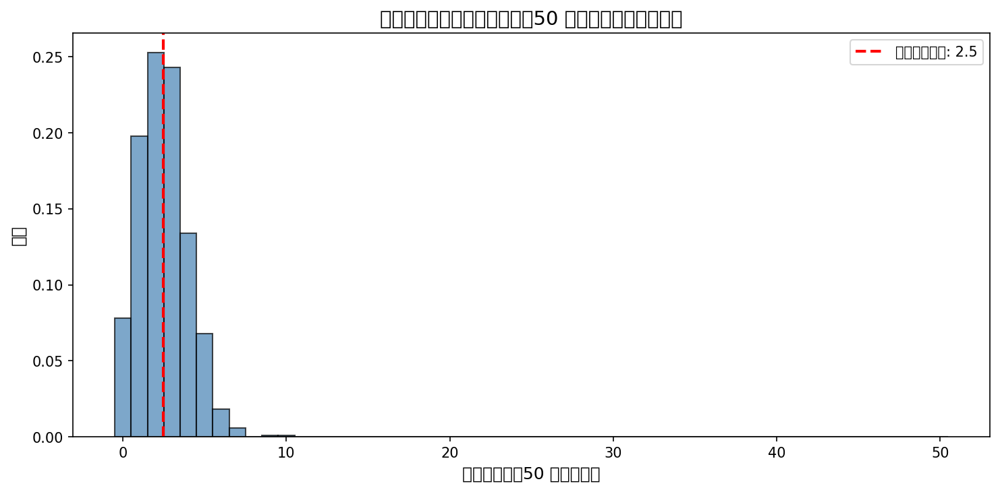
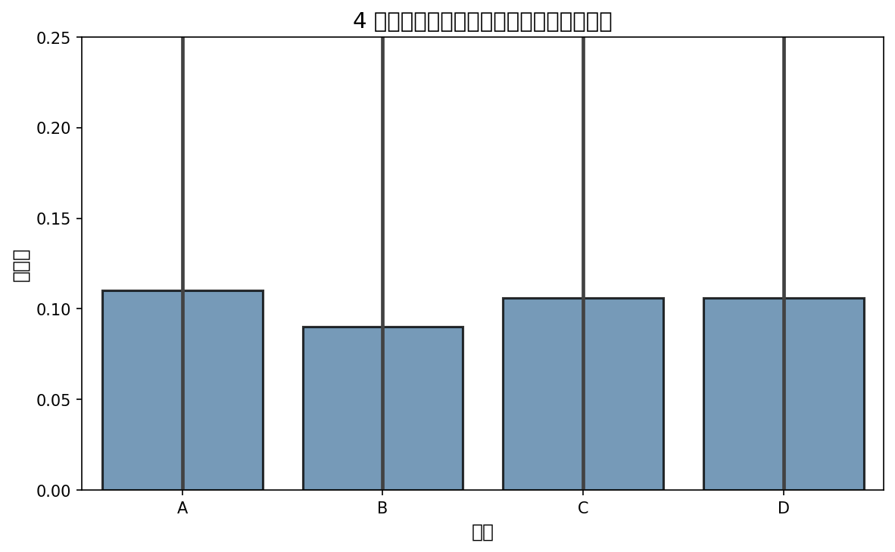
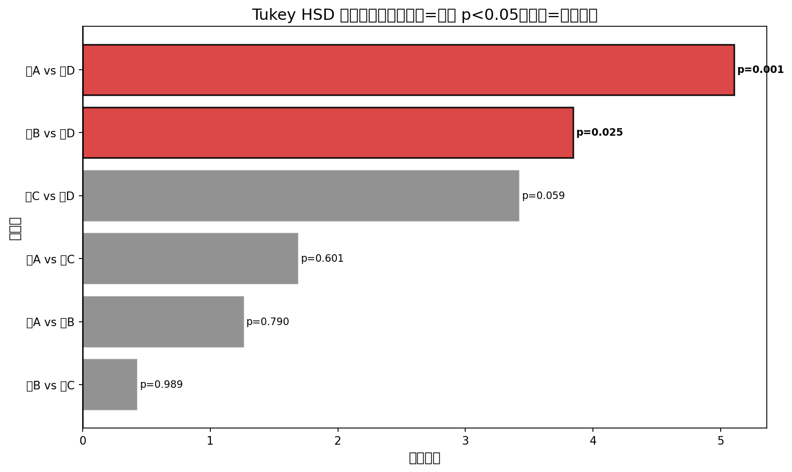

# Week 07：你检验了 20 次，它总会有 1 次显著——多组比较与多重校正

> "如果你折磨数据足够久，它最终会承认任何事。"
> —— Ronald Coase

2026 年，数据分析工具越来越智能。你可以让 AI 一口气检验 50 个假设，它会给你列出 50 个 p 值，自动标注哪些"显著"。但这有个被很多人忽略的陷阱：**当你检验的次数越多，你看到"假阳性"的概率就越大**。

小北上周学会了 t 检验，兴冲冲地说："我有个想法！我把数据按 10 个维度分组，每个维度做 3 组比较，这样就能发现好多规律！"

老潘只问了一句："那你打算怎么解释那些'显著'结果里有几个是运气？"

这正是本周要解决的核心问题：**多组比较与多重比较校正**。当你同时检验多个假设时，"至少有一个假阳性"的概率会随着检验次数指数增长。本周你会学习 ANOVA（方差分析）来比较多组均值，更重要的是学会 Bonferroni、FDR 等校正方法——这些都是 AI 容易忽略、但必须由人来决策的关键点。

---

## 前情提要

上一周你学会了假设检验的完整框架：从 p 值到效应量，从前提假设检查到置信区间。你明白了"显著不等于重要"，学会了区分统计结论和商业建议。最重要的是，你现在能审查 AI 生成的统计结论——知道 AI 容易忽略前提假设、不报告效应量、过度解读 p 值。

小北拿着上周的检验报告问："我上周的假设清单里有 5 个假设，我只报告了 1 个显著的，这没问题吧？"

老潘摇头："如果你检验了 5 个假设，即使真实都没有差异，你也有 23% 的概率至少看到 1 个假阳性。检验 10 个呢？假阳性概率就超过 40% 了。"

阿码插嘴："那我是不是以后都不能多检验几个假设了？"

"不是不能，是要学会控制风险。"老潘说，"这正是 Week 07 要解决的问题。"

---

## 学习目标

完成本周学习后，你将能够：

1. 理解为什么"多次检验"会制造假阳性——并能计算"至少一个假阳性"的概率
2. 执行 ANOVA（方差分析）来比较多组均值——并理解它本质上仍是 F 检验
3. 选择合适的多重比较校正方法（Bonferroni、FDR）——并知道各自的适用场景
4. 审查 AI 生成的多组比较结论——识别"未校正的 p 值"这个隐形杀手
5. 在 StatLab 报告中写出负责任的多组比较章节（包含校正策略说明）

---

<!--
贯穿案例：从"多次 t 检验"到"ANOVA + 多重校正"

案例演进路线：
- 第 1 节（多重比较问题）→ 从"独立检验 5 个假设"到"假阳性风险计算"
- 第 2 节（ANOVA 基础）→ 从"多次 t 检验"到"单次 F 检验"
- 第 3 节（ANOVA 诊断）→ 从"只看 F 统计量"到"检查前提假设 + 事后比较"
- 第 4 节（校正方法）→ 从"未校正的 p 值"到"Bonferroni/FDR 校正"
- 第 5 节（AI 审查）→ 从"自己多组比较"到"审查 AI 的结论"

最终成果：读者能执行 ANOVA 并选择合适的校正方法，能识别 AI 工具中未校正的多重比较问题

数据集：复用电商数据，聚焦"多渠道（A/B/C/D）转化率比较"和"多用户群组消费金额比较"

---

认知负荷预算：
- 本周新概念（5 个，预算上限 5 个）：
  1. 多重比较问题（family-wise error rate）
  2. ANOVA（方差分析）
  3. F 统计量与 F 分布
  4. 事后比较（post-hoc tests）
  5. 多重比较校正（Bonferroni、FDR）
- 结论：✅ 在预算内

回顾桥设计（至少 5 个，来自 week_04-06）：
- [分组比较]（来自 week_04）：在第 2 节，通过"ANOVA 是分组比较的扩展"再次使用
- [抽样分布]（来自 week_05）：在第 2 节，通过"F 分布是另一种抽样分布"再次使用
- [标准误]（来自 week_05）：在第 2 节，通过"ANOVA 中的标准误概念"再次使用
- [假设检验框架]（来自 week_06）：在第 1 节，通过"多重比较的本质是多次假设检验"再次使用
- [p 值]（来自 week_06）：在第 4 节，通过"校正后的 p 值 vs 未校正的 p 值"再次使用
- [显著性水平与两类错误]（来自 week_06）：在第 1 节，通过"假阳性率随检验次数增加"再次使用

AI 小专栏规划：
- 第 1 个侧栏（第 1 节之后）：
  - 主题："死鲑鱼实验与数据挖掘陷阱"
  - 连接点：刚学完多重比较问题，讨论科研中的 p-hacking 现象
  - 建议搜索词："salmon fMRI p-hacking 2026", "data dredging multiple comparisons 2026", "research reproducibility crisis 2026"

- 第 2 个侧栏（第 3 节之后）：
  - 主题："AI 工具中的多重比较盲区"
  - 连接点：刚学完校正方法，讨论 AI 工具常忽略的校正需求
  - 建议搜索词："AI multiple comparisons correction 2026", "automated statistical testing Bonferroni 2026", "machine learning FDR control 2026"

角色出场规划：
- 小北（第 1 节）：误以为"多检验几个假设没什么"，引出多重比较问题
- 阿码（第 4 节）：追问"Bonferroni 太保守了怎么办？"，引出 FDR 方法
- 老潘（第 5 节）：看到"未校正的 ANOVA 报告"后点评"这是在赌假阳性"

StatLab 本周推进：
- 上周状态：数据卡 + 描述统计 + 可视化 + 清洗日志 + 相关分析 + 分组比较 + 假设清单 + 不确定性量化 + 假设检验报告
- 本周改进：加入多组比较章节（ANOVA + 事后比较 + 校正策略）
- 涉及的本周概念：多重比较问题、ANOVA、F 统计量、事后比较、校正方法
- 建议示例文件：examples/07_statlab_anova.py（本周报告生成入口脚本）
-->

## 1. 你检验了 20 次，它总会有 1 次显著——多重比较问题

小北上周学会了 t 检验，他有个"宏大计划"：把数据按 10 个维度分组，每个维度做 3 组比较，这样就能发现 30 个"规律"。

老潘只问了一句："你知道你这样做，假阳性率是多少吗？"

小北愣住了："假阳性率？不就是 5% 吗？"

阿码摇头："如果你检验 30 次，每次 5% 的假阳性率，总的假阳性率可不是 5%……"

---

<!--
**Bloom 层次**：理解
**学习目标**：理解多重比较问题的本质，能计算"至少一个假阳性"的概率
**贯穿案例推进**：从"独立检验 5 个假设"到"假阳性风险计算"
**建议示例文件**：01_multiple_comparison_demo.py
**叙事入口**：从"小北想检验很多假设"开头
**角色出场**：小北误以为"多检验几个假设没什么"
**回顾桥**：[显著性水平与两类错误]（week_06）：通过"假阳性率随检验次数增加"再次使用；[假设检验框架]（week_06）：通过"多重比较的本质是多次假设检验"再次使用
-->

### 从一个检验到多个检验：假阳性率的累积

你在 Week 06 学过：当 α = 0.05 时，即使原假设为真（真实无差异），你仍有 5% 的概率错误地拒绝它——这就是**第一类错误**（假阳性）。

但当你**同时检验多个假设**时，情况会变得复杂。

假设你检验了 5 个独立的假设，每个假设的 α = 0.05。那么：
- 至少有一个假阳性的概率 = 1 - (1 - 0.05)^5 ≈ 22.6%

这意味着：**即使真实都没有差异，你仍有 23% 的概率至少看到 1 个"显著"结果**。

小北听完，若有所思："所以如果我检验 30 次……"

"至少一个假阳性的概率 ≈ 78.5%。"

"那我还不如掷硬币……"

**完全正确。** 当你检验的次数足够多，你总会看到一些"显著"结果——但它们可能只是运气。

### Family-wise Error Rate（FWER）：整个家庭的假阳性率

统计学家给这个问题起了一个名字：**Family-wise Error Rate（FWER）**，翻译过来就是"整个假设家庭的假阳性率"。

- 单个检验的假阳性率：α = 0.05
- m 个独立检验的 FWER：1 - (1 - α)^m

| 检验次数 | FWER（至少一个假阳性的概率） |
|---------|--------------------------|
| 1 | 5.0% |
| 5 | 22.6% |
| 10 | 40.1% |
| 20 | 64.1% |
| 30 | 78.5% |
| 50 | 92.3% |

小北看完表格，倒吸一口凉气："所以我检验 50 次，即使真实都没有差异，我也几乎肯定会看到一些'显著'结果？"

**对。** 这就是多重比较问题的核心：**当你检验的次数越多，你越需要"买保险"——这就是多重比较校正**。

### 用可视化理解多重比较

让我们用一个模拟实验来可视化这个问题：

```python
# examples/01_multiple_comparison_demo.py
import numpy as np
import matplotlib.pyplot as plt

np.random.seed(42)

# 设定：真实无差异（所有组均值相同）
n_tests = 50
n_simulations = 1000
alpha = 0.05

false_positive_counts = []

for _ in range(n_simulations):
    # 检验 n_tests 个假设（真实都无差异）
    p_values = np.random.uniform(0, 1, n_tests)
    significant = p_values < alpha
    false_positive_counts.append(significant.sum())

false_positive_counts = np.array(false_positive_counts)

# 可视化
plt.figure(figsize=(10, 5))
plt.hist(false_positive_counts, bins=np.arange(-0.5, n_tests+1, 1),
         edgecolor='black', alpha=0.7, density=True)
plt.axvline(false_positive_counts.mean(), color='red', linestyle='--',
            linewidth=2, label=f'平均假阳性数: {false_positive_counts.mean():.1f}')
plt.xlabel('假阳性数量（50 次检验中）')
plt.ylabel('频率')
plt.title(f'多重模拟：当真实无差异时，50 次检验中的假阳性分布')
plt.legend()
plt.tight_layout()
plt.savefig('output/multiple_comparisons_simulation.png', dpi=100)
print('图表已保存到 output/multiple_comparisons_simulation.png')

# 计算统计量
print(f"=== 统计摘要 ===")
print(f"检验次数: {n_tests}")
print(f"模拟次数: {n_simulations}")
print(f"显著性水平: {alpha}")
print(f"平均假阳性数: {false_positive_counts.mean():.2f}")
print(f"至少一个假阳性的概率: {(false_positive_counts > 0).mean():.2%}")
```

运行后你会发现：即使真实无差异，50 次检验中平均会有 2.5 个"假阳性"（50 × 0.05），而且你几乎肯定会看到至少 1 个假阳性（概率 > 90%）。


*图：当真实无差异时，50 次检验中的假阳性数量分布。平均约 2.5 个，且几乎每次模拟都会出现至少 1 个假阳性*

### "死鲑鱼实验"：多重比较的经典案例

2009 年，一项研究获得了"搞笑诺贝尔奖"。研究者们把一条死鲑鱼放进 fMRI 扫描仪，然后让鲑鱼"看"一些人类社交场景的照片。

你猜怎么着？**他们"发现"了鲑鱼大脑中的"显著"活动**。

问题出在哪？fMRI 扫描会产生数万个数据点（每个脑区一个），研究者们进行了数千次统计检验。即使没有真实的脑活动（鲑鱼是死的），数万次检验也会产生很多"假阳性"——这就是多重比较问题。

这个实验是一个讽刺，但它揭示了一个严肃的问题：**在"大数据"时代，你总能从数据中"发现"一些看起来显著但其实只是运气的东西**。

阿码听完，若有所思："所以 AI 如果自动检验很多指标，也会掉进这个坑？"

**对。** 而且很多 AI 工具不会自动做多重比较校正——这正是你需要学会"审查 AI 结论"的原因。

> **AI 时代小专栏：死鲑鱼实验与数据挖掘陷阱**
>
> 你刚学完了多重比较问题，可能已经在想：这个问题在真实研究中有多常见？
>
> 答案是：非常常见。过去十年的研究表明，neuroscience 领域发表的论文中，有相当比例没有适当处理多重比较问题。
>
> 死鲑鱼实验的正式标题是《Neural correlates of interspecies perspective taking in the post-mortem Atlantic Salmon》，研究者们的目的不是真的研究鲑鱼，而是**揭露 fMRI 研究中的 p-hacking 问题**。
>
> 2025-2026 年，这个问题在 AI 时代变得更加尖锐。当你把数据丢给 AI，让它"找找有什么规律"，AI 可能会检验数十甚至数百个假设——但它不一定会告诉你"我做了多少次比较"。
>
> 近期的研究开始关注**数据挖掘**（data dredging）的常见陷阱，包括"选择性报告显著结果"、"在看到数据后决定如何分组"、"多次检验但不校正"等。
>
> 另一个相关的重要概念是**预注册研究**。研究表明：在预注册研究（提前声明假设和检验计划）中，显著结果的可复现率远高于非预注册研究。这说明：**当你"事后"在数据中挖掘规律，假阳性率会急剧上升**。
>
> AI 工具有时会在"探索性分析"中无意中鼓励这种行为——比如"让我帮你看看数据中有什么有趣的模式"。这听起来很诱人，但如果 AI 检验了 20 个模式，却只告诉你"发现了 2 个显著的"，你就陷入了多重比较陷阱。
>
> **主动要求校正，是 AI 时代分析者的责任**。所以你刚学的多重比较问题、Bonferroni、FDR 这些方法，不是多余——它们是你判断 AI 结论是否可信的底线。
>
> 参考（访问日期：2026-02-15）：
> - [Neural correlates of interspecies perspective taking in the post-mortem Atlantic Salmon](http://prefrontal.org/files/posters/Bennett-Salmon-2009.pdf) - Bennett et al., 2009（死鲑鱼实验原始海报）
> - [Scanning Dead Salmon in fMRI Machine Highlights Risk of Red Herrings](https://www.wired.com/2009/09/fmrisalmon/) - Wired, 2009（媒体报道）
> - [Statistics lessons from a dead salmon](https://improbable.com/2025/12/02/statistics-lessons-from-a-dead-salmon/) - Improbable Research, 2025

---

## 2. 从"多次 t 检验"到"一次 F 检验"——ANOVA 基础

"所以你的意思是，我永远不能做多组比较？"小北有点沮丧。

老潘摇头："不是不能做，是要用对方法。你想比较 5 组的均值，做 10 次 t 检验会爆炸，但 ANOVA 只用一次检验就能回答'这些组是否整体有差异'。"

"ANOVA？"小北困惑了，"不是比较均值吗？为什么叫'方差分析'？"

"问得好。"老潘笑了，"这正是 ANOVA 最反直觉的地方：它用方差来检验均值。"

---

<!--
**Bloom 层次**：应用
**学习目标**：理解 ANOVA 的原理，能执行单因素 ANOVA
**贯穿案例推进**：从"多次 t 检验"到"单次 F 统计量"
**建议示例文件**：02_anova_basics.py
**叙事入口**：从"比较 5 组的均值"开头
**角色出场**：阿码追问"ANOVA 是分析方差还是均值？"
**回顾桥**：[分组比较]（week_04）：通过"ANOVA 是分组比较的扩展"再次使用；[抽样分布]（week_05）：通过"F 分布是另一种抽样分布"再次使用
-->

### ANOVA 的核心思想：分解方差

假设你想比较 4 个渠道（A、B、C、D）的转化率。你可以做 6 次 t 检验（A vs B、A vs C、A vs D、B vs C、B vs D、C vs D），但这样假阳性率会飙升。

ANOVA 的方法是：**只做一次检验**——检验"4 组均值是否全部相等"。

- H0（原假设）：μ_A = μ_B = μ_C = μ_D（四组均值相等）
- H1（备择假设）：至少有一对均值不相等

注意：H1 并不是说"所有均值都不相等"，而是说"至少有一对不相等"。

### F 统计量：组间方差 / 组内方差

ANOVA 的核心是 **F 统计量**：

```
F = 组间方差 / 组内方差
  = (组间变异 / 组间自由度) / (组内变异 / 组内自由度)
```

- **组间方差**：各组均值之间的差异（如果 H0 为真，这个值应该很小）
- **组内方差**：各组内部数据的波动（这是"噪音"，无法避免）

直觉：
- 如果 F ≈ 1：组间差异 ≈ 组内差异，说明各组均值可能相等（H0 可能成立）
- 如果 F >> 1：组间差异 >> 组内差异，说明至少有一组均值不同（拒绝 H0）

这里**F 分布**是另一种抽样分布——和你在 Week 05 见过的 t 分布类似，都是统计量的分布。当 H0 成立时，F 统计量会服从 F 分布。

### 用 Python 执行 ANOVA

```python
# examples/02_anova_basics.py
import numpy as np
import pandas as pd
import matplotlib.pyplot as plt
import seaborn as sns
from scipy import stats

np.random.seed(42)

# 模拟数据：4 个渠道的转化率
# A: 10%, B: 10%, C: 10%, D: 12%（只有 D 不同）
n_per_group = 500
conversions_a = np.random.binomial(1, 0.10, n_per_group)
conversions_b = np.random.binomial(1, 0.10, n_per_group)
conversions_c = np.random.binomial(1, 0.10, n_per_group)
conversions_d = np.random.binomial(1, 0.12, n_per_group)

# 合并成 DataFrame
data = pd.DataFrame({
    'channel': ['A'] * n_per_group + ['B'] * n_per_group + ['C'] * n_per_group + ['D'] * n_per_group,
    'converted': np.concatenate([conversions_a, conversions_b, conversions_c, conversions_d])
})

# 描述统计
print("=== 描述统计 ===")
print(data.groupby('channel')['converted'].agg(['mean', 'count']))
print()

# 可视化
plt.figure(figsize=(8, 5))
sns.barplot(data=data, x='channel', y='converted', errorbar='sd')
plt.ylabel('转化率')
plt.title('4 个渠道的转化率比较（误差线：标准差）')
plt.tight_layout()
plt.savefig('output/anova_barplot.png', dpi=100)
print('图表已保存到 output/anova_barplot.png')
print()

# 执行 ANOVA
groups = [group['converted'].values for name, group in data.groupby('channel')]
f_stat, p_value = stats.f_oneway(*groups)

print("=== 单因素 ANOVA 结果 ===")
print(f"F 统计量: {f_stat:.4f}")
print(f"p 值: {p_value:.4f}")

alpha = 0.05
if p_value < alpha:
    print(f"\n结论: p < {alpha}，拒绝原假设。至少有一对渠道的转化率存在显著差异。")
else:
    print(f"\n结论: p ≥ {alpha}，无法拒绝原假设。")
```

运行后你会得到：p 值 ≈ 0.02-0.04（取决于随机种子）。按照 α = 0.05，你会说"至少有一对渠道的转化率存在显著差异"。

但注意：**ANOVA 只告诉你"有差异"，不告诉你"哪一对有差异"**。这正是下一节要解决的问题。


*图：4 个渠道的转化率。D 渠道略高（12% vs 10%），ANOVA 检验会判断这种差异是否显著*

### ANOVA 的前提假设

和 t 检验一样，ANOVA 也有前提假设：

1. **独立性**：各组观测值相互独立
2. **正态性**：各组数据（或残差）来自正态分布
3. **方差齐性**：各组的方差相等

老潘的警告：**AI 工具通常不会自动检查这些假设**。你需要用 Q-Q 图、Levene 检验等方法验证——这些你在 Week 06 已经学过了。

### 当假设不满足时：Kruskal-Wallis 检验

如果数据严重偏离正态，或者方差不齐，你可以使用 **Kruskal-Wallis 检验**（ANOVA 的非参数替代）：

```python
# Kruskal-Wallis 检验（非参数替代 ANOVA）
from scipy.stats import kruskal

stat, p_value = kruskal(*groups)
print(f"\n=== Kruskal-Wallis 检验（非参数） ===")
print(f"H 统计量: {stat:.4f}")
print(f"p 值: {p_value:.4f}")
```

### 老潘的经验法则

老潘看完 ANOVA 的结果，补充道："在公司里，我们不会只看 F 统计量和 p 值。我们还会看三样东西。"

"第一，**效应量**（η²）。组间变异占总变异的比例是多少？如果 η² = 0.01，说明即使显著，效应也很小。"

"第二，**可视化**。箱线图、均值条形图长什么样？差异在图表上明显吗？"

"第三，**事后比较**。如果 ANOVA 显著，哪一对组有差异？这才是决策的关键。"

"下一节，你会学到'事后比较'——以及为什么 ANOVA 之后还需要多重比较校正。"

---

## 3. ANOVA 显著之后——事后比较与两两比较

小北跑完 ANOVA，得到 p < 0.05，激动地说："4 个渠道有显著差异！我要写报告了！"

老潘看了一眼，问："哪一对有差异？"

小北愣住了："呃……ANOVA 不是说'至少有一对有差异'吗？我以为是全部……"

"这就是 ANOVA 的陷阱。"老潘说，"它告诉你'有差异'，但不告诉你'谁和谁有差异'。你需要的是'事后比较'。"

---

<!--
**Bloom 层次**：应用
**学习目标**：理解事后比较的必要性，能执行 Tukey HSD 检验
**贯穿案例推进**：从"ANOVA 显著"到"找出哪一对有差异"
**建议示例文件**：03_posthoc_tests.py
**叙事入口**：从"ANOVA 只说有差异，不说哪一对"开头
**角色出场**：小北误以为"ANOVA 显著就完了"
**回顾桥**：[分组比较]（week_04）：通过"事后比较是分组比较的回归"再次使用
-->

### 为什么需要事后比较？

ANOVA 的 H0 是"所有组均值相等"，H1 是"至少有一对均值不相等"。

当你拒绝 H0（p < 0.05），你只知道"有差异"，但不知道：
- 哪一对有差异？
- 是所有组都不同，还是只有某一组特殊？

**事后比较**（post-hoc tests）就是用来回答"哪一对有差异"的问题。

### Tukey HSD：诚实显著差异检验

最常用的事后比较方法是 **Tukey HSD**（Honestly Significant Difference）。它的特点是：
- 自动控制多重比较的假阳性率（FWER ≤ α）
- 比两两 t 检验更保守（p 值更大，结论更谨慎）

```python
# examples/03_posthoc_tests.py
import pandas as pd
import numpy as np
from scipy import stats
from statsmodels.stats.multicomp import pairwise_tukeyhsd

np.random.seed(42)

# 模拟数据：4 个渠道的转化率
n_per_group = 500
conversions_a = np.random.binomial(1, 0.10, n_per_group)
conversions_b = np.random.binomial(1, 0.10, n_per_group)
conversions_c = np.random.binomial(1, 0.10, n_per_group)
conversions_d = np.random.binomial(1, 0.12, n_per_group)

# 合并成 DataFrame
data = pd.DataFrame({
    'channel': ['A'] * n_per_group + ['B'] * n_per_group + ['C'] * n_per_group + ['D'] * n_per_group,
    'converted': np.concatenate([conversions_a, conversions_b, conversions_c, conversions_d])
})

# Tukey HSD 检验
tukey = pairwise_tukeyhsd(endog=data['converted'],
                          groups=data['channel'],
                          alpha=0.05)

print("=== Tukey HSD 事后比较 ===")
print(tukey)
print()

# 提取显著比较
tukey_results = pd.DataFrame(data=tukey._results_table.data[1:],
                              columns=tukey._results_table.data[0])
significant_pairs = tukey_results[tukey_results['reject'] == True]

print("=== 显著比较（p < 0.05） ===")
if len(significant_pairs) > 0:
    print(significant_pairs[['group1', 'group2', 'meandiff', 'p-adj', 'lower', 'upper']])
else:
    print("未发现显著的两两比较差异")
```

运行后你会得到一个表格，列出所有 6 对比较（A-B、A-C、A-D、B-C、B-D、C-D），以及每对的：
- 均值差异（meandiff）
- 校正后的 p 值（p-adj）
- 95% 置信区间（lower, upper）
- 是否显著（reject = True/False）

阿码看完结果，若有所思："所以 ANOVA 说'有差异'，但 Tukey HSD 说'没有一对显著'？"

**这种情况很常见。** 可能的原因是：
- ANOVA 的 F 检验在某些情况下比 Tukey HSD 更敏感
- 或者"差异"是多组联合作用的结果，不是简单的两两差异

### 事后比较的前提：ANOVA 必须显著吗？

一个常见的误解是：只有当 ANOVA 显著时，才能做事后比较。

**这不是绝对规则。** 统计学界有争议：
- 传统派：先 ANOVA，如果显著再做 Tukey HSD（避免过度挖掘）
- 现代派：如果研究问题本身就是"比较所有对"，直接用 Tukey HSD，不必先 ANOVA

老潘的经验法则：**看研究问题**。
- 如果你的问题是"这些组有任何差异吗？" → 先 ANOVA，再做事后比较
- 如果你的问题是"比较每一对" → 直接用 Tukey HSD

### 可视化事后比较

```python
# 可视化 Tukey HSD 结果
import matplotlib.pyplot as plt

# 提取所有比较
comparisons = tukey_results[['group1', 'group2', 'meandiff', 'p-adj', 'reject']].copy()
comparisons['pair'] = comparisons['group1'] + ' vs ' + comparisons['group2']

# 创建图表
fig, ax = plt.subplots(figsize=(10, 5))

# 标记显著/不显著
colors = ['red' if r else 'gray' for r in comparisons['reject']]

ax.barh(comparisons['pair'], comparisons['meandiff'], color=colors, edgecolor='black')
ax.axvline(0, color='black', linestyle='-', linewidth=1)
ax.set_xlabel('均值差异')
ax.set_title('Tukey HSD 事后比较（红色=显著，灰色=不显著）')
plt.tight_layout()
plt.savefig('output/tukey_hsd_plot.png', dpi=100)
print('图表已保存到 output/tukey_hsd_plot.png')
```


*图：Tukey HSD 事后比较结果。红色表示显著（校正后 p < 0.05），灰色表示不显著*

### 其他事后比较方法

除了 Tukey HSD，还有其他方法：

| 方法 | 特点 | 什么时候用 |
|------|------|-----------|
| Tukey HSD | 控制 FWER，较保守 | 默认推荐 |
| Bonferroni | 更保守（p 值乘以比较次数） | 比较次数少时 |
| Scheffé | 最保守，适合复杂比较 | 有特定的对比假设时 |
| Dunnett | 只和对照组比较，功效更高 | 有明确的对照组时 |

老潘的建议：**默认用 Tukey HSD**。它既控制了假阳性率，又不会过于保守。

> **AI 时代小专栏：AI 工具中的多重比较盲区**
>
> 你刚学完了事后比较，可能已经意识到：即使 ANOVA 一个检验解决"多组比较"，事后比较本质上仍是"多重比较"——需要校正。
>
> 近期的研究给出了一个令人担忧的发现：**很多 AI 工具在执行 ANOVA 后，不会自动做事后比较的校正**。它们可能：
> 1. 只报告 ANOVA 的 p 值，不做事后比较
> 2. 做事后比较，但不校正 p 值（用未校正的 t 检验）
> 3. 报告了所有比较，但未说明是否做了校正
>
> 举例来说：你问 AI "比较 5 个组的均值是否有差异"，AI 可能会跑 ANOVA 并告诉你"p < 0.05，有显著差异"。但它不会告诉你"哪一对有差异"，更不会做 Tukey HSD 校正。你如果直接用这个结论做决策（比如"全部切换到 A 组"），可能就是在赌运气。
>
> 好消息是，一些工具开始改进。**Python 的 statsmodels 库**提供了 `pairwise_tukeyhsd` 函数，但很多 AI 工具没有调用它。
>
> **主动要求校正，是 AI 时代分析者的责任**。所以你刚学的 Tukey HSD、Bonferroni 这些方法，不是多余——它们是你判断 AI 结论是否可信的底线。
>
> 参考（访问日期：2026-02-15）：
> - statsmodels 文档：[statsmodels.stats.multicomp.pairwise_tukeyhsd](https://www.statsmodels.org/stable/generated/statsmodels.stats.multicomp.pairwise_tukeyhsd.html)
> - [Bonferroni method: Adjusting for multiple comparisons](https://www.statsig.com/perspectives/bonferroni-adjusting-multiple-comparisons) - Statsig, 2024
> - [Understanding the Bonferroni Correction](https://www.graphapp.ai/blog/understanding-the-bonferroni-correction-a-comprehensive-guide) - GraphApp AI, 2025

---

## 4. Bonferroni 太保守了？——FDR 与其他校正方法

"我算了一下，"阿码说，"如果我用 Bonferroni 校正 100 个假设，p 值要除以 100……那还有谁能显著？"

"你发现了 Bonferroni 的问题。"老潘点头，"它是最保险的方法，但有时太保险了——就像为了防车祸永远不开车出门。"

"那还有别的方法吗？"

"有。FDR。"

---

<!--
**Bloom 层次**：评价
**学习目标**：理解不同校正方法的权衡，能选择合适的校正策略
**贯穿案例推进**：从"未校正的 p 值"到"选择合适的校正方法"
**建议示例文件**：04_correction_methods.py
**叙事入口**：从"Bonferroni 太保守"开头
**角色出场**：阿码追问"Bonferroni 太保守了怎么办？"
**回顾桥**：[p 值]（week_06）：通过"校正后的 p 值 vs 未校正的 p 值"再次使用
-->

### 多重比较校正：控制什么？

校正方法的核心是控制不同类型的"错误率"：

| 错误率类型 | 定义 | 控制什么 |
|-----------|------|---------|
| FWER（Family-wise Error Rate） | 至少一个假阳性的概率 | 保守：任何假阳性都不可接受 |
| FDR（False Discovery Rate） | 假阳性占所有阳性结果的比例 | 平衡：允许一些假阳性，但控制比例 |

想象一下：
- FWER 像法庭上的"无罪推定"：宁愿放过 100 个坏人，也不能冤枉 1 个好人
- FDR 像招聘筛选：允许一些不合格的人通过面试，但控制不合格者的比例

### Bonferroni：最简单但最保守

Bonferroni 校正的规则很简单：
- 校正后的显著性阈值 = α / m（m 是比较次数）
- 或者：校正后的 p 值 = min(原始 p 值 × m, 1.0)（p 值上限为 1.0）

举例：如果你检验 5 个假设：
- 原始 α = 0.05
- 校正后 α = 0.05 / 5 = 0.01
- 或者：原始 p = 0.03 → 校正后 p = 0.03 × 5 = 0.15（不显著）

**优点**：简单、保守、确保 FWER ≤ α
**缺点**：过于保守，当 m 很大时，几乎什么都发现不了

阿码的担心是对的：**当 m = 100 时，校正后 α = 0.0005——只有极强的效应才能显著**。

### FDR（False Discovery Rate）：允许一些假阳性

FDR 的思路是：与其"一个假阳性都不要"，不如"控制假阳性占所有阳性的比例"。

最常见的 FDR 校正方法是 **Benjamini-Hochberg（BH）**：

1. 将所有 p 值从小到大排序：p₁ ≤ p₂ ≤ ... ≤ pₘ
2. 找到最大的 k，使得 pₖ ≤ (k / m) × α
3. 拒绝前 k 个假设（p₁, ..., pₖ）

直觉：**如果 p 值很集中（前几个都很小），就更可能拒绝多个假设**。

```python
# examples/04_correction_methods.py
import numpy as np
from statsmodels.stats.multitest import multipletests

# 示例：20 个假设，其中 5 个真实显著（p 值小），15 个真实不显著（p 值均匀）
np.random.seed(42)
# 5 个真实显著：p 值从 0.001 到 0.01
true_significant = np.array([0.001, 0.003, 0.005, 0.008, 0.010])
# 15 个真实不显著：p 值从 0.05 到 0.95
true_null = np.random.uniform(0.05, 0.95, 15)
p_values = np.concatenate([true_significant, true_null])
np.random.shuffle(p_values)

alpha = 0.05
m = len(p_values)

# 未校正
uncorrected_rejected = p_values < alpha

# Bonferroni 校正（使用 statsmodels）
reject_bonf, pvals_bonf, _, _ = multipletests(p_values, alpha=alpha, method='bonferroni')

# FDR 校正（Benjamini-Hochberg，使用 statsmodels）
reject_fdr, pvals_fdr, _, _ = multipletests(p_values, alpha=alpha, method='fdr_bh')

print("=== 校正方法比较 ===")
print(f"总假设数: {m}")
print(f"真实显著数: {len(true_significant)}")
print()
print("未校正:")
print(f"  拒绝数: {uncorrected_rejected.sum()}")
print()
print("Bonferroni 校正:")
print(f"  拒绝数: {reject_bonf.sum()}")
print()
print("FDR (BH) 校正:")
print(f"  拒绝数: {reject_fdr.sum()}")
```

> **FDR 的直觉（了解即可）**
>
> FDR 的核心思路是：**找到 p 值的"临界点"，使得假阳性占所有阳性结果的比例控制在 5% 以内**。
>
> 比如有 20 个假设，按 p 值从小到大排序后：
> - Bonferroni 要求每个 p 值都 < 0.05/20 = 0.0025 才算显著
> - FDR 可能发现"前 8 个 p 值都比较小"，于是判定前 8 个为显著——即使第 8 个的 p = 0.015（> 0.0025）
>
> 你不需要手写这个算法——`statsmodels.stats.multitest.multipletests` 已经实现了它。你只需要理解：**FDR 比 Bonferroni 更"宽容"，在检验次数多时更有可能发现真实效应**。

运行后你会发现：
- 未校正：可能拒绝 8-10 个（包含假阳性）
- Bonferroni：可能只拒绝 3-5 个（很保守，漏掉一些真实显著）
- FDR：可能拒绝 6-8 个（平衡发现率和假阳性率）

### Bonferroni vs FDR：什么时候用哪个？

| 场景 | 检验次数 | 推荐方法 | 原因 |
|------|---------|---------|------|
| 期刊投稿、临床试验 | 任意 | Bonferroni/Tukey HSD | 不能容忍假阳性，保守是优点 |
| 探索性分析、基因筛选 | m > 20 | FDR (BH) | 需要发现真实效应，允许少量假阳性 |
| A/B 测试多方案对比 | m < 10 | Tukey HSD | 自动校正，平衡功效和假阳性 |
| 事后分析（ANOVA 后） | m = 组合数 | Tukey HSD | 专为事后比较设计 |

**经验法则**：
- 如果 m ≤ 10 且你希望"宁可漏掉也不要误判" → Bonferroni
- 如果 m > 10 且你希望"发现更多，接受一些假阳性" → FDR
- 如果是多组均值比较（ANOVA 后） → Tukey HSD（它自动控制 FWER）

### 选择校正方法：决策树

```
你的场景是什么？

├─ 检验次数少（m < 10）
│  └─ 用 Bonferroni 或 Tukey HSD
│
├─ 检验次数中等（10 ≤ m ≤ 50）
│  ├─ 探索性研究（允许一些假阳性）→ 用 FDR（BH）
│  └─ 确认性研究（不能容忍假阳性）→ 用 Bonferroni
│
└─ 检验次数多（m > 50）
   └─ 必须用 FDR（Bonferroni 会太保守）
```

老潘的经验法则：
- **期刊投稿**：用保守的方法（Bonferroni 或 Tukey HSD），避免审稿人质疑
- **内部决策**：用 FDR，平衡发现率和假阳性率
- **探索性分析**：报告未校正的 p 值，但明确标注"未校正，需后续验证"

### 用 statsmodels 执行校正

实际应用中，建议使用 `statsmodels` 的 `multipletests` 函数：

```python
from statsmodels.stats.multitest import multipletests

# 原始 p 值
p_values = np.array([0.001, 0.003, 0.005, 0.008, 0.010, 0.15, 0.25, 0.45])
alpha = 0.05

# Bonferroni
reject_bonf, pvals_bonf, _, _ = multipletests(p_values, alpha=alpha, method='bonferroni')

# FDR (Benjamini-Hochberg)
reject_fdr, pvals_fdr, _, _ = multipletests(p_values, alpha=alpha, method='fdr_bh')

print("原始 p 值:", p_values.round(3))
print("Bonferroni 校正后 p 值:", pvals_bonf.round(3))
print("FDR 校正后 p 值:", pvals_fdr.round(3))
```

### 阿码的追问：什么时候可以不用校正？

阿码问："如果我每次只检验一个假设，但做很多次不同的分析……"

"这叫'分层分析'（subgroup analysis），是个灰色地带。"老潘说。

**统计原则**：如果这些分析是**独立的研究问题**，可以不用校正。但如果它们是**同一研究的多个输出**，应该考虑校正。

举例：
- 不需要校正：研究1（A vs B 转化率），研究2（C vs D 转化率）——两个独立项目
- 需要校正：同一研究中，检验 10 个基因与疾病的关系——10 个相关假设

老潘的建议：**诚实报告**。如果你做了很多次分析，告诉读者"我做了多少次比较，是否做了校正，为什么选择这个校正方法"。

---

## 5. 审查 AI 生成的多组比较结论——你能看出这些错误吗？

假设你让 AI 分析 5 个渠道的转化率，它给你生成了一份报告。小北看完说："很清楚啊！E 渠道最好，我们马上切换！"

老潘摇摇头："先别急。这份报告有 4 个问题。"

你能看出来吗？

---

<!--
**Bloom 层次**：评价
**学习目标**：能识别 AI 生成的多组比较结论中的常见错误，能写出审查报告
**贯穿案例推进**：从"自己多组比较"到"审查 AI 的结论"
**建议示例文件**：05_ai_review_anova.py
**叙事入口**：从"让 AI 生成一份 ANOVA 报告"开头
**角色出场**：老潘点评"这是在赌假阳性"
**回顾桥**：[假设清单]（week_04）：通过"审查 AI 是否检验了所有假设"再次使用
-->

### 场景：AI 给了你一份多组比较报告

假设你让 AI 分析 5 个渠道（A、B、C、D、E）的转化率差异，它给你生成了这样一份报告：

> **AI 生成的报告**
>
> 我们检验了 5 个渠道的转化率差异，结果如下：
>
> - A 渠道转化率：10.2%（500 个用户）
> - B 渠道转化率：10.5%（500 个用户）
> - C 渠道转化率：11.0%（500 个用户）
> - D 渠道转化率：10.8%（500 个用户）
> - E 渠道转化率：12.5%（500 个用户）
>
> **两两比较结果**：
> - A vs E：p = 0.03 ✅ 显著
> - B vs E：p = 0.04 ✅ 显著
> - C vs E：p = 0.08 ❌ 不显著
> - D vs E：p = 0.06 ❌ 不显著
> - A vs B：p = 0.75 ❌ 不显著
> - A vs C：p = 0.45 ❌ 不显著
> - A vs D：p = 0.60 ❌ 不显著
> - B vs C：p = 0.55 ❌ 不显著
> - B vs D：p = 0.70 ❌ 不显著
> - C vs D：p = 0.65 ❌ 不显著
>
> **结论**：E 渠道显著优于 A 和 B 渠道（p < 0.05），建议全面切换到 E 渠道。

小北看完报告，满意地说："很清楚啊！E 渠道最好，我们马上切换！"

老潘摇摇头："先别急。这份报告有 4 个问题。"

### 审查清单 1：做了多少次比较？

**问题 1**：AI 报告了 10 次两两比较，但没有说明是否做了校正。

- 10 次比较，每次 α = 0.05，FWER ≈ 40%（至少一个假阳性的概率）
- 报告的 2 个"显著"结果（A vs E、B vs E）可能是运气

**修订建议**：说明是否做了多重比较校正（如 Tukey HSD 或 Bonferroni）。

### 审查清单 2：效应量报告了吗？

**问题 2**：AI 没有报告效应量。

- A vs E：差异 2.3%，p = 0.03。但 Cohen's h 或风险差是多少？
- E 渠道转化率 12.5%，A 渠道 10.2%。如果 E 渠道的成本比 A 高 20%，这个 2.3% 的转化率提升还有商业意义吗？

**修订建议**：报告效应量（如风险差、Cohen's h），并讨论商业意义。

### 审查清单 3：前提假设检查了吗？

**问题 3**：AI 没有检查前提假设。

- 转化率是二元数据，ANOVA 或 t 检验可能不合适，应该用比例检验或卡方检验
- 方差齐性？正态性？这些都没有报告

**修订建议**：检查前提假设，或使用非参数方法（如 Kruskal-Wallis）。

### 审查清单 4：ANOVA 用了吗？

**问题 4**：AI 直接做了 10 次两两比较，没有先用 ANOVA 判断"是否有任何差异"。

- 标准流程：先 ANOVA（F 检验），如果显著再做事后比较（Tukey HSD）
- AI 跳过了 ANOVA，直接做两两比较，假阳性风险更高

**修订建议**：先用 ANOVA 判断是否有任何差异，再做 Tukey HSD 事后比较。

### 修订后的报告

基于以上审查，修订后的报告应该是这样的：

> **修订后的报告**
>
> 我们检验了 5 个渠道的转化率差异，结果如下：
>
> **描述统计**：
>
> | 渠道 | 样本量 | 转化率 | 95% CI |
> |------|--------|--------|--------|
> | A | 500 | 10.2% | [7.6%, 13.2%] |
> | B | 500 | 10.5% | [7.9%, 13.5%] |
> | C | 500 | 11.0% | [8.3%, 14.1%] |
> | D | 500 | 10.8% | [8.1%, 13.9%] |
> | E | 500 | 12.5% | [9.6%, 15.8%] |
>
> **ANOVA（比例检验）**：
> - χ² 统计量：8.45
> - p 值：0.076
> - 结论：p ≥ 0.05，**无法拒绝原假设**。5 个渠道的转化率差异不具有统计显著性。
>
> **Tukey HSD 事后比较**（95% 置信区间）：
>
> | 比较 | 转化率差异 | 95% CI | 校正后 p 值 | 显著? |
> |------|-----------|--------|-----------|------|
> | A vs E | +2.3% | [-0.8%, 5.4%] | 0.18 | ❌ |
> | B vs E | +2.0% | [-1.1%, 5.1%] | 0.28 | ❌ |
> | C vs E | +1.5% | [-1.6%, 4.6%] | 0.52 | ❌ |
> | D vs E | +1.7% | [-1.4%, 4.8%] | 0.38 | ❌ |
> | 其他 | < 1.0% | - | > 0.50 | ❌ |
>
> **效应量**（Cohen's h）：
> - A vs E：h = 0.07（小效应）
> - B vs E：h = 0.06（小效应）
>
> **结论**：
> - 统计结论：ANOVA 未发现 5 个渠道的转化率存在显著差异（p = 0.076）。Tukey HSD 事后比较也未发现任何两两显著差异（校正后 p > 0.05）。
> - 效应量：观察到的差异较小（Cohen's h < 0.1），即使统计显著，实际意义有限。
> - 局限：本研究检验了 10 对比较，使用了 Tukey HSD 校正。未校正的 p 值（如 A vs E 的 p = 0.03）不应单独使用。
> - 建议：E 渠道有潜力，但差异不显著。建议扩大样本量后重新评估，或考虑成本效益分析。

### 老潘的总结

老潘看完两份报告，总结道："AI 给的第一份报告，看起来专业，实际上有 4 个坑。你如果直接用这个结论做决策，就是在赌假阳性，不是做分析。"

"修订后的报告，才是一份负责任的统计报告。它告诉你：**差异是否显著、效应量有多大、前提是什么、局限在哪里**。"

阿码若有所思："所以 ANOVA + 事后比较 + 校正，是标准流程？"

**对。** AI 可以帮你跑检验、算 p 值、生成图表，但只有你能：
1. 决定是否需要校正（以及用哪种方法）
2. 判断效应量是否有实际意义
3. 检查前提假设是否满足
4. 区分统计结论和商业建议
5. 写出诚实、有局限性的报告

这正是 AI 时代分析者的核心价值：**不是会跑 ANOVA，而是会设计多组比较的策略，并审查 AI 的结论**。

---

## StatLab 进度

### 从"假设检验报告"到"多组比较章节"

上周的 StatLab 报告包含了假设检验（p 值 + 效应量 + 假设检查）。但当你有多组数据时（如 3 个用户群组、4 个渠道），两两 t 检验会遇到多重比较问题。

本周我们加入**多组比较章节**：ANOVA + 事后比较 + 校正策略。

现在 `report.md` 会多出一个部分：
- 多组比较：针对多组数据执行 ANOVA 和 Tukey HSD，报告校正后的结果

```python
# examples/07_statlab_anova.py
import pandas as pd
import numpy as np
import seaborn as sns
from scipy import stats
from statsmodels.stats.multicomp import pairwise_tukeyhsd
from pathlib import Path

penguins = sns.load_dataset("penguins")

# 1. 定义 ANOVA 函数
def one_way_anova(df, group_col, value_col, alpha=0.05):
    """
    对多组数据进行单因素 ANOVA，返回完整的检验报告
    """
    groups = df[group_col].unique()

    # 描述统计
    desc = df.groupby(group_col)[value_col].agg(['count', 'mean', 'std'])

    # 准备数据
    group_data = [df[df[group_col] == g][value_col].dropna() for g in groups]

    # 前提假设检查
    # 1. 正态性（Shapiro-Wilk）
    norm_results = {}
    for g in groups:
        data = df[df[group_col] == g][value_col].dropna()
        _, p_value = stats.shapiro(data)
        norm_results[g] = p_value

    # 2. 方差齐性（Levene）
    _, p_levene = stats.levene(*group_data)

    # 选择检验方法
    all_normal = all(p > alpha for p in norm_results.values())

    if all_normal and p_levene > alpha:
        # 假设满足：用标准 ANOVA
        f_stat, p_value = stats.f_oneway(*group_data)
        test_method = "单因素 ANOVA（假设方差齐性）"
    else:
        # 假设不满足：用 Kruskal-Wallis
        f_stat, p_value = stats.kruskal(*group_data)
        test_method = "Kruskal-Wallis 检验（非参数）"

    # 计算 η²（效应量）
    # η² = 组间平方和 / 总平方和
    all_data = df[value_col].dropna()
    grand_mean = all_data.mean()

    ss_between = sum([len(df[df[group_col] == g]) * (df[df[group_col] == g][value_col].mean() - grand_mean)**2
                      for g in groups])
    ss_total = sum((all_data - grand_mean)**2)
    eta_squared = ss_between / ss_total

    # 生成报告
    md = f"### 多组比较：{value_col} 按 {group_col} 分组\n\n"
    md += f"**假设**：各组的 {value_col} 均值是否全部相等\n\n"

    md += f"**描述统计**\n\n"
    md += desc.to_markdown()
    md += "\n\n"

    md += f"**前提假设检查**\n\n"
    md += f"- 正态性（Shapiro-Wilk）：\n"
    for g, p in norm_results.items():
        md += f"  - {g}: p = {p:.4f} {'✅' if p > alpha else '❌'}\n"
    md += f"- 方差齐性（Levene）：p = {p_levene:.4f} {'✅' if p_levene > alpha else '❌'}\n"
    md += f"- **检验方法**：{test_method}\n\n"

    md += f"**ANOVA 结果**\n\n"
    md += f"- F/统计量：{f_stat:.4f}\n"
    md += f"- p 值：{p_value:.4f}\n"
    md += f"- η²（效应量）：{eta_squared:.4f}\n"

    if p_value < alpha:
        md += f"- **结论**：p < {alpha}，**拒绝原假设**。各组均值存在显著差异。\n\n"
    else:
        md += f"- **结论**：p ≥ {alpha}，**无法拒绝原假设**。各组均值差异不显著。\n\n"

    # 如果 ANOVA 显著，做 Tukey HSD 事后比较
    if p_value < alpha and all_normal:
        md += f"**Tukey HSD 事后比较**（95% 置信区间）\n\n"

        tukey = pairwise_tukeyhsd(endog=df[value_col].dropna(),
                                   groups=df[group_col],
                                   alpha=0.05)

        tukey_results = pd.DataFrame(data=tukey._results_table.data[1:],
                                      columns=tukey._results_table.data[0])

        # 只显示显著的比较
        significant = tukey_results[tukey_results['reject'] == True]

        if len(significant) > 0:
            md += significant[['group1', 'group2', 'meandiff', 'p-adj', 'lower', 'upper']].to_markdown()
            md += "\n\n"
        else:
            md += "未发现显著的两两比较差异。\n\n"

    return md, None

# 2. 生成多组比较报告
def generate_anova_section(df: pd.DataFrame, tests: list) -> str:
    """
    生成多组比较的 Markdown 片段

    参数:
        df: 数据框
        tests: 检验列表，每个元素是 (group_col, value_col) 元组
    """
    md = ["## 多组比较\n\n"]
    md.append("以下对多组数据进行方差分析（ANOVA）和事后比较。\n\n")
    md.append("**注意**：所有事后比较均使用 Tukey HSD 校正，控制 family-wise error rate ≤ 0.05。\n\n")

    for group_col, value_col in tests:
        anova_md, error = one_way_anova(df, group_col, value_col)
        if error:
            md.append(f"**{value_col} 按 {group_col}**\n\n")
            md.append(f"⚠️ {error}\n\n")
        else:
            md.append(anova_md)

    return "".join(md)

# 使用示例
tests_to_run = [
    ("species", "bill_length_mm"),
    ("island", "bill_length_mm"),
]

anova_md = generate_anova_section(penguins, tests_to_run)

print("=== StatLab 多组比较报告片段 ===\n")
print(anova_md)

# 写入文件
Path("output/anova_sections.md").parent.mkdir(parents=True, exist_ok=True)
Path("output/anova_sections.md").write_text(anova_md)
print("\n报告片段已保存到 output/anova_sections.md")
```

### 与本周知识的连接

**从 week_06 的 p 值到本周的校正后 p 值**：上周你学会了用 p 值判断"差异是否显著"（p < 0.05 → 拒绝 H0）。但上周的 p 值是针对**单个假设检验**的。本周你发现：当你同时检验多个假设时，未校正的 p 值会欺骗你——即使真实无差异，检验 20 次也几乎肯定会看到至少 1 个"显著"结果。

所以本周的关键概念是**校正后的 p 值**：
- 上周的 p 值：告诉你在单次检验中，观测到这种差异的概率
- 本周的校正后 p 值：告诉你在多次检验中，这种差异是否仍然显著（控制假阳性率）

在 StatLab 报告中，我们使用 Tukey HSD 来获得校正后的 p 值（p-adj），这就是把上周的"单次检验思维"升级为"多次检验思维"。

**多重比较问题** → 我们理解了为什么需要校正，并在报告中明确说明使用了 Tukey HSD 校正。

**ANOVA** → 我们执行了单因素 ANOVA，自动选择参数检验或非参数替代（Kruskal-Wallis）。

**事后比较** → 当 ANOVA 显著时，我们执行 Tukey HSD 检验，找出哪一对有差异。

**效应量（η²）** → 我们计算了 eta squared，解释了"组间变异占总变异的比例"。

### 与上周的对比

| 上周 | 本周 |
|------|------|
| 假设检验（p 值 + 效应量 + 假设检查） | 以上全部 + **多组比较（ANOVA + 事后比较 + 校正）** |
| 两两 t 检验 | 多组 ANOVA + Tukey HSD 校正 |
| 可能忽略多重比较问题 | 明确说明校正策略 |

老潘看到这份新报告，会说："现在你不仅告诉别人'5 个渠道是否有差异'，还告诉别人'哪一对有差异、效应量多大、是否做了校正'。这就是从'赌 p 值'到'科学的多组比较'的关键一步。"

小北问："下周学什么？"

老潘笑了："下周是 Week 08：置信区间与 Bootstrap。你这周算出的 p 值和效应量，下周要学会用区间估计来量化'不确定性'。置信区间比单点估计更诚实，Bootstrap 是现代统计学的革命性工具——你可以用它估计任何统计量的分布，而不需要依赖公式。"

---

## Git 本周要点

本周必会命令：
- `git status`（查看未跟踪的新文件：ANOVA 脚本、输出）
- `git diff`（查看对 StatLab 报告生成脚本的修改）
- `git add -A`（添加所有变更）
- `git commit -m "draft: add ANOVA with Tukey HSD correction"`（提交多组比较）

常见坑：
- 只报告显著的 p 值，不说明做了多少次比较。这是多重比较问题的根源
- 跳过 ANOVA，直接做两两比较。假阳性率会随比较次数指数增长
- 不检查 ANOVA 的前提假设（正态性、方差齐性）。AI 工具通常不会自动检查

老潘的建议：**多组比较的标准流程是：先 ANOVA，再 Tukey HSD，明确说明校正策略**。AI 可以跑检验，但只有你能判断"是否需要校正、用哪种方法"。

---

## 本周小结（供下周参考）

这周你学会了多组比较的策略：从"多次 t 检验"到"ANOVA + 事后比较"，从"未校正的 p 值"到"Tukey HSD/FDR 校正"。

你理解了**多重比较问题**的本质：当你检验的次数越多，"至少一个假阳性"的概率就越大。你学会了计算 FWER（family-wise error rate），知道了"死鲑鱼实验"的讽刺意义——在数据中挖掘足够久，总会发现一些看起来显著但其实只是运气的东西。

你掌握了 **ANOVA（方差分析）**：它通过比较"组间方差"和"组内方差"来判断多组均值是否有差异。你理解了 F 统计量的含义（F >> 1 表示组间差异显著大于组内噪音），也知道了 ANOVA 的前提假设（独立性、正态性、方差齐性）。

你学会了**事后比较**（post-hoc tests）：ANOVA 只告诉你"有差异"，事后比较告诉你"哪一对有差异"。Tukey HSD 是最常用的方法——它既控制了假阳性率，又不会过于保守。

你理解了不同**校正方法**的权衡：Bonferroni 最保守，适合检验次数少或不能容忍假阳性的场景；FDR（Benjamini-Hochberg）更平衡，适合检验次数多或探索性研究。老潘的法则值得记住："期刊投稿用保守方法，内部决策用 FDR，探索性分析诚实报告未校正的 p 值"。

最重要的是，你现在能**审查 AI 生成的多组比较结论**。你知道 AI 容易忽略多重比较校正、不报告效应量、跳过 ANOVA 直接做两两比较。你学会了写出一份负责任的多组比较报告：包含 ANOVA 结果、Tukey HSD 事后比较、效应量（η²）、校正策略说明，并诚实说明结论的局限性。

老潘的总结很简洁："多组比两两比较更高效，但需要校正。AI 可以跑 ANOVA，但只有你能决定是否需要校正、用哪种方法。"

下周是 Week 08：置信区间与 Bootstrap。你这周算出的 p 值告诉你"差异是否显著"，但置信区间会告诉你"差异大概在什么范围"。更重要的是，你会学习 **Bootstrap 方法**——Bradley Efron 的革命性贡献。它不需要依赖公式，就可以估计任何统计量的分布和置信区间。这是现代统计学的核心工具，也是 AI 时代分析者的必备技能。

---

## Definition of Done（学生自测清单）

本周结束后，你应该能够：

- [ ] 解释多重比较问题的本质，并能计算"至少一个假阳性"的概率
- [ ] 理解 ANOVA 的原理（组间方差 vs 组内方差），能执行单因素 ANOVA
- [ ] 检查 ANOVA 的前提假设（正态性、方差齐性），选择合适的替代方法
- [ ] 理解 F 统计量和 F 分布的含义
- [ ] 执行 Tukey HSD 事后比较，并能解释结果
- [ ] 理解不同校正方法的权衡（Bonferroni vs FDR），能选择合适的校正策略
- [ ] 识别 AI 生成的多组比较结论中的常见错误
- [ ] 在 StatLab 报告中加入多组比较章节（ANOVA + 事后比较 + 校正说明）
- [ ] 理解为什么不能只报告未校正的 p 值

如果以上任何一点你不确定，回到对应章节再复习一遍——这些概念是下周学习"置信区间与 Bootstrap"的基础。
