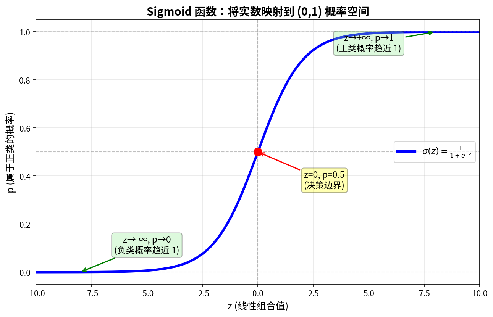

# Week 10：预测的艺术——分类模型与逻辑回归入门

> "预测很难，尤其是关于未来的预测。"
> —— 尼尔斯·玻尔（Niels Bohr）

---

2026 年，AI 已经能帮你写出准确率 99% 的图像识别模型，但当你问它"为什么这个客户会流失"时，它可能给出一堆看似合理却无法验证的解释。分类预测——从"预测连续值"转向"预测类别"——是数据科学最常见的任务之一：邮件是不是垃圾邮件？客户会不会流失？肿瘤是良性还是恶性？

但这里有一个被忽略的问题：**准确率高就是好模型吗？**

小北拿着一份 AI 生成的分类报告来找老潘："准确率 95%，模型很棒！"

老潘扫了一眼报告，只说了一句话："这个准确率毫无意义。"

小北愣住了。"准确率还有真假？"

"准确率是真的，但它掩盖了问题。"老潘继续说，"分类评估远不止一个数字。等会儿我会详细解释——为什么在不平衡数据上，准确率会骗人。"

这正是本周的核心问题：**分类模型与评估**。你将学习如何将回归的思路延伸到分类问题，理解逻辑回归的本质，更重要的是——你将学会如何正确评估分类模型：混淆矩阵、精确率、查全率、F1、ROC 曲线、AUC。在 AI 时代，AI 可以帮你拟合模型，但只有你能判断"这个模型是否公平、是否可用"。

---

## 前情提要

上一周你学会了回归分析与模型诊断：从"描述关系"到"量化关系"，从"只看 R²"到"检查 LINE 假设"。你掌握了回归系数解释、残差诊断、多重共线性检测，能写出"带诊断检查"的回归报告。

阿码拿着上周的回归报告问："我可以用回归预测客户流失吗？比如流失=1，不流失=0？"

老潘摇头："技术上可以，但逻辑上很危险。回归的预测值可能超出 0-1 范围，而且误差假设也不对。"

"那怎么办？"

"这正是 Week 10 要讲的：分类模型与逻辑回归。"

---

## 学习目标

完成本周学习后，你将能够：

1. 理解分类问题与回归问题的本质区别，能判断何时用分类、何时用回归
2. 解释逻辑回归的核心思想：从"线性预测"到"概率预测"
3. 解读混淆矩阵，计算并比较精确率、查全率、F1 分数
4. 绘制并解读 ROC 曲线，计算 AUC 并解释其含义
5. 识别类别不平衡问题，并用恰当的策略和评估指标应对
6. 在 StatLab 报告中写出"带完整评估"的分类分析结论

---

<!--
贯穿案例：从"预测连续值（销售额）"到"预测类别（高价值/低价值客户）"

案例演进路线：
- 第 1 节（分类是什么）→ 从"回归预测销售额"到"分类预测客户等级"的业务场景转换
- 第 2 节（为什么不能直接用回归）→ 用"客户等级预测"案例展示回归在分类问题中的局限
- 第 3 节（逻辑回归）→ 从 sigmoid 函数到概率预测，从线性到非线性决策边界
- 第 4 节（混淆矩阵与指标）→ 用客户分层案例学习精确率、查全率、F1 的计算与权衡
- 第 5 节（ROC 与 AUC）→ 用阈值调整展示模型在不同业务目标下的表现
- 第 6 节（类别不平衡）→ 识别 1:20 的正负样本比例，学习重采样与成本敏感学习

最终成果：读者能拟合逻辑回归模型、解释系数、计算分类评估指标，并能写出"带完整评估"的分类报告

数据集：复用电商数据，从"广告投入 vs 销售额"转变为"客户特征 vs 高价值客户分类"

---

认知负荷预算：
- 本周新概念（5 个，预算上限 5 个）：
  1. 分类问题（classification）：预测离散类别而非连续值
  2. 逻辑回归（logistic regression）：用 sigmoid 将线性输出映射到概率
  3. 混淆矩阵（confusion matrix）：TP/FP/TN/FN 的四格表
  4. 精确率与查全率（precision & recall）：分类模型的核心评估指标
  5. ROC 曲线与 AUC（ROC curve & AUC）：权衡不同阈值下的模型表现
- 结论：✅ 在预算内

回顾桥设计（至少 2 个，来自 week_01-09）：
- [简单线性回归]（来自 week_09）：在第 2 节，通过"为什么回归不适合分类"再次使用——展示回归预测值可能超出 [0,1] 范围
- [回归系数解释]（来自 week_09）：在第 3 节，通过"逻辑回归系数的对数几率解释"再次使用
- [Bootstrap]（来自 week_08）：在第 5 节，通过"Bootstrap 估计 AUC 置信区间"再次使用
- [假设检验]（来自 week_06）：在第 3 节，通过"逻辑回归系数的显著性检验"再次使用
- [特征编码]（来自 week_03）：在第 6 节，通过"类别特征编码对逻辑回归的影响"再次使用
- [数据转换]（来自 week_03）：在第 6 节，通过"处理类别不平衡的数据采样"再次使用

AI 小专栏规划：
- 第 1 个侧栏（第 2-3 节之后）：
  - 主题："AI 分类模型中的'准确率陷阱'"
  - 连接点：刚学完混淆矩阵，讨论为什么高准确率可能是误导性的（尤其在类别不平衡时）
  - 建议搜索词："AI classification accuracy paradox 2026", "class imbalance machine learning 2026", "precision recall trade-off AI"

- 第 2 个侧栏（第 4-5 节之后）：
  - 主题："AI 时代的公平性评估——从 AUC 到公平性指标"
  - 连接点：刚学完 ROC/AUC，讨论现代 AI 系统的公平性问题（不同群体的模型表现差异）
  - 建议搜索词："AI fairness metrics 2026", "algorithmic bias detection", "demographic parity equal opportunity machine learning"

角色出场规划：
- 小北（第 2 节）：误以为"准确率 95% 就是好模型"，引出准确率陷阱和类别不平衡问题
- 阿码（第 4 节）：追问"精确率和查全率哪个更重要？能不能两个都要？"，引出 F1 和权衡思路
- 老潘（第 5 节）：看到"没有 ROC 曲线的分类报告"后点评"这不是预测，是盲目乐观"

StatLab 本周推进：
- 上周状态：数据卡 + 描述统计 + 可视化 + 清洗日志 + 相关分析 + 分组比较 + 假设清单 + 多组比较 + 区间估计 + Bootstrap + 置换检验 + 回归分析与诊断
- 本周改进：添加分类分析模块，包括逻辑回归拟合、混淆矩阵、分类评估指标、ROC 曲线
- 涉及的本周概念：逻辑回归、混淆矩阵、精确率/查全率/F1、ROC 曲线与 AUC
- 建议示例文件：examples/10_statlab_classification.py（本周报告生成入口脚本）
-->

## 1. 从回归到分类——预测问题的另一扇门

小北在整理上周的客户数据时，业务方提了一个新问题："能不能预测哪些客户会成为高价值客户？"

"能啊。"小北说，"用上周学的回归，预测客户未来 3 个月的消费金额就行。"

"但我不需要知道具体金额。"业务方摇头，"我只需要名单——下个月要重点运营哪些客户。"

小北愣住了。这是一个不同的问题：不是"预测多少"，而是"预测是否"。

---

<!--
**Bloom 层次**：理解
**学习目标**：理解分类问题与回归问题的本质区别，能判断何时用分类、何时用回归
**贯穿案例推进**：从"回归预测销售额"到"分类预测客户等级"的业务场景转换
**建议示例文件**：01_regression_vs_classification.py
**叙事入口**：从"业务方的新需求"开头——要名单而不是数字
**回顾桥**：[简单线性回归]（week_09）：通过"为什么回归不是万能"再次使用——展示回归预测值可能超出 [0,1] 范围，且误差假设不符
-->

### 预测问题的两种面孔

你在 Week 09 学了**回归分析**（regression）：预测连续值。比如：
- 预测客户未来消费金额（0 到 10000 元之间的任何数）
- 预测房屋价格（300 万到 500 万之间的任何数）
- 预测广告点击率（0% 到 100% 之间的任何数）

但很多时候，你需要的是**分类预测**（classification）：预测离散类别。比如：
- 客户是高价值还是低价值？（是/否）
- 邮件是不是垃圾邮件？（是/否）
- 肿瘤是良性还是恶性？（良性/恶性）

| 问题类型 | 输出 | 例子 |
|---------|------|------|
| **回归** | 连续数值 | 销售额 = 15.3 万元 |
| **分类** | 离散类别 | 客户等级 = 高价值 |

阿码问："那我能不能把回归结果四舍五入，当成分类用？"

"技术上可以，但有两个问题。"老潘说。

### 为什么分类不能用"回归+四舍五入"

分类问题有三个核心特征，决定了它不能用简单的"回归+四舍五入"来解决：

**输出是离散的**。回归的输出是连续的（-∞ 到 +∞），分类的输出是离散的（有限的几个类别）。你不能对一个客户预测"0.7 个高价值"——他要么是高价值，要么不是。

**概率解释更重要**。分类模型通常输出"属于某类的概率"。比如："这个客户有 0.85 的概率是高价值客户"。这让你能根据业务需求调整决策阈值——是保守一点（概率 > 0.9 才算高价值），还是激进一点（概率 > 0.3 就算）？

**错误代价不对称**。在分类问题中，不同类型的错误代价往往不同：把高价值客户错判为低价值（漏报），损失了一个重要客户；把低价值客户错判为高价值（误报），浪费了一些营销资源。哪个代价更高？这取决于业务场景。分类模型的评估需要考虑这种不对称性。

小北若有所思："所以需要一种专门处理分类的方法？"

"对。"老潘说，"但在学新方法之前，你得先明白：为什么回归不适合分类？这样才能理解新方法的必要性。"

---

## 2. 为什么不能直接用回归——用"流失预测"展示回归局限

小北决定先用回归试试。他定义了一个目标变量：高价值客户 = 1，低价值客户 = 0。然后用客户的历史消费金额、注册时长、浏览次数等特征做回归。

模型跑出来了，R² = 0.42。小北看着预测结果，发现了一件怪事：

"这个客户的预测值是 1.3？那是高价值还是低价值？"

---

<!--
**Bloom 层次**：理解→应用
**学习目标**：理解为什么回归不适合分类，能识别回归在分类问题中的局限
**贯穿案例推进**：从"回归越界问题"到"理解为什么需要 sigmoid 函数"
**建议示例文件**：02_regression_limitations.py
**叙事入口**：从"小北发现回归预测值越界"开头
**角色出场**：小北误以为"准确率 95% 就是好模型"
**回顾桥**：[简单线性回归]（week_09）：通过"回归预测值可能超出 [0,1]"再次使用；[回归假设]（week_09）：通过"分类问题的误差分布不满足正态假设"再次使用
-->

### 陷阱一：预测值越界

假设你用回归预测"客户是否高价值"（高价值=1，低价值=0）。回归方程可能给出：
- 客户 A：预测值 = 1.3（> 1，不合理）
- 客户 B：预测值 = -0.2（< 0，不合理）

回归的预测值范围是 (-∞, +∞)，但分类问题的概率必须在 [0, 1] 之间。

你可能会说："那把小于 0 的当成 0，大于 1 的当成 1，不就行了？"

这样处理有几个问题。首先是**信息损失**：1.3 和 2.5 都被截断为 1，但它们代表的"高价值程度"显然不同。其次是**梯度问题**：在边界处（0 和 1），回归的优化目标不再合理。最重要的是**概率解释缺失**：你无法回答"这个客户有多大概率是高价值"。

### 陷阱二：误差假设不匹配

Week 09 讲过，回归假设误差服从**正态分布**（LINE 假设中的 N）。但分类问题的误差是**二元的**（对/错），不服从正态分布。

这会导致：系数的 p 值不可靠，置信区间不准确，残差图无法解释。

老潘说："用回归做分类，就像用尺子量体重——工具本身没错，但用错了场景。"

### 陷阱三：准确率幻觉

小北换了个思路。他决定：回归预测值 > 0.5 就预测为高价值，≤ 0.5 就预测为低价值。然后计算"准确率"（预测正确的比例）。

模型显示：准确率 95%！

小北兴奋地拿着报告去找老潘："准确率 95%，模型很棒！"

老潘扫了一眼数据分布，只说了一句话："你的正负样本比例是多少？"

"呃……高价值客户占 5%，低价值占 95%。"

"那这个准确率毫无意义。"老潘说，"如果你把**所有客户都预测为低价值**，准确率也能达到 95%！"

小北愣住了。这正是**准确率陷阱**——在类别不平衡的数据集上，高准确率可能是误导性的。

老潘继续说："分类问题的核心不是'准确率有多高'，而是'模型在每一类上的表现如何'。95% 的准确率可能意味着：你把所有高价值客户都漏掉了，只是因为你猜对了占大多数的低价值客户。"

小北问："那我该怎么评估？"

"先看混淆矩阵。"老潘说，"但首先，你需要一个真正适合分类的模型——逻辑回归。"

> **AI 时代小专栏：准确率陷阱的致命诱惑**
>
> 想象你在设计一个垃圾邮件过滤器。数据里有 900 封正常邮件，100 封垃圾邮件。你的同事 Bob 写了一个"智能"模型——它把所有邮件都标记为正常。
>
> Bob 骄傲地宣布："准确率 90%！"
>
> Alice 的模型准确率"只有"88.5%，但它能正确识别 75% 的垃圾邮件。
>
> 谁的模型更好？答案显然是 Alice。但在 KPI 压力下，很多团队会选择 Bob 的"高准确率"模型——直到用户抱怨收件箱被垃圾邮件淹没。
>
> 这就是著名的**准确率悖论**（Accuracy Paradox）：当数据类别不平衡时，准确率是一个糟糕的评估指标。
>
> 更极端的例子是癌症筛查。假设恶性病例仅占 5.6%，一个"把所有病例都预测为良性"的模型能达到 94.4% 的准确率，但代价是**所有真正患癌的患者都被漏诊**。2025-2026 年的研究显示，这种"高准确率幻觉"已成为 FDA 召回医疗 AI 设备的主要原因之一。
>
> Kaggle 竞赛数据显示，超过 60% 的参赛者在类别不平衡数据集上首先关注准确率——这是一个危险的习惯。
>
> **该怎么办？** 忘掉准确率，先看混淆矩阵。精确率（Precision）告诉你"预测为正的样本中，有多少是真的正样本"；查全率（Recall）告诉你"真正的正样本中，有多少被找到了"。在垃圾邮件过滤中，宁可放过一些垃圾邮件（低查全率），也别把正常邮件当成垃圾（高精确率）。在癌症筛查中，宁可误报（低精确率），也别漏诊（高查全率）。
>
> 没有放之四海而皆准的指标，只有适合你业务目标的指标。
>
> 参考链接：
> - [How to Check the Accuracy of Your Machine Learning Model - Deepchecks](https://www.deepchecks.com/how-to-check-the-accuracy-of-your-machine-learning-model/)
> - [The Idea Behind Accuracy Paradox - Stat Digest](https://digestize.medium.com/stat-digest-the-idea-behind-accuracy-paradox-e79daa9fd917)
> - [Accuracy vs Precision and Recall - Evidently AI](https://www.evidentlyai.com/classification-metrics/accuracy-precision-recall)

---

## 3. 逻辑回归——从 sigmoid 到概率预测

小北理解了回归在分类中的局限，但他还有一个疑问："如果不能直接用回归，那逻辑回归是怎么工作的？"

老潘在黑板上画了一条 S 型曲线。"先看这个形状。"

---

<!--
**Bloom 层次**：理解→应用
**学习目标**：解释逻辑回归的核心思想，能拟合逻辑回归并解释系数
**贯穿案例推进**：从"回归越界问题"到"sigmoid 函数将输出压缩到 [0,1]"
**建议示例文件**：03_logistic_regression.py
**叙事入口**：从"小北好奇逻辑回归如何实现分类"开头
**回顾桥**：[回归系数解释]（week_09）：通过"逻辑回归系数的对数几率解释"再次使用——对比线性系数与对数几率系数的区别；[假设检验]（week_06）：通过"逻辑回归系数的显著性检验"再次使用
-->

### Sigmoid 函数：把任何数变成概率

逻辑回归的核心是 **sigmoid 函数**（也叫 logistic 函数）：

$$
p = \frac{1}{1 + e^{-z}}
$$

其中 z 是线性组合（和回归一样：z = a + b₁x₁ + b₂x₂ + ...），e 是自然对数的底（约 2.718）。

**sigmoid 的魔法**：无论 z 是多大或多小的数，sigmoid 的输出都在 (0, 1) 之间。当 z = 0 时，p = 0.5；当 z → +∞ 时，p → 1；当 z → -∞ 时，p → 0。

```python
import numpy as np
import matplotlib.pyplot as plt

def sigmoid(z):
    return 1 / (1 + np.exp(-z))

# 画图
z = np.linspace(-10, 10, 100)
p = sigmoid(z)

plt.figure(figsize=(8, 6))
plt.plot(z, p, 'b-', linewidth=2)
plt.axhline(y=0.5, color='r', linestyle='--', alpha=0.5)
plt.axvline(x=0, color='r', linestyle='--', alpha=0.5)
plt.xlabel('z (线性组合)')
plt.ylabel('p (概率)')
plt.title('Sigmoid 函数')
plt.grid(True, alpha=0.3)
plt.show()
```

老潘说："想象 sigmoid 是一个'压缩器'——把线性回归的无限输出压缩成 0 到 1 之间的概率。"



*图：Sigmoid 函数将线性输出 z 映射到 (0,1) 概率区间。当 z=0 时 p=0.5；z 越大 p 越接近 1；z 越小 p 越接近 0。*

### 从概率到分类

逻辑回归输出的是概率 p，但分类需要的是类别（是/否）。怎么办？

**设定阈值**：通常用 0.5 作为分界线。如果 p ≥ 0.5，预测为"正类"（如：高价值客户）；如果 p < 0.5，预测为"负类"（如：低价值客户）。

阿码追问："阈值必须是 0.5 吗？"

"不一定。"老潘说，"0.5 只是默认值。根据业务需求，你可以调整阈值。这在后面讲 ROC 曲线时会详细说。"

### 用 scikit-learn 拟合逻辑回归

```python
from sklearn.linear_model import LogisticRegression
from sklearn.model_selection import train_test_split
from sklearn.preprocessing import StandardScaler
import pandas as pd
import numpy as np

# 假设我们有一个电商客户数据集
# features: ['历史消费金额', '注册月数', '月均浏览次数', '购物车添加次数']
# target: '是否高价值' (0=低价值, 1=高价值)

# 准备数据
X = df[['历史消费金额', '注册月数', '月均浏览次数', '购物车添加次数']]
y = df['是否高价值']

# 划分训练集和测试集（分层抽样保持类别比例）
X_train, X_test, y_train, y_test = train_test_split(
    X, y, test_size=0.2, random_state=42, stratify=y
)

# 特征缩放（逻辑回归对特征尺度敏感）
scaler = StandardScaler()
X_train_scaled = scaler.fit_transform(X_train)
X_test_scaled = scaler.transform(X_test)

# 拟合逻辑回归模型
model = LogisticRegression(solver='lbfgs', max_iter=1000, random_state=42)
model.fit(X_train_scaled, y_train)

# 预测概率和类别
y_prob = model.predict_proba(X_test_scaled)[:, 1]  # 正类概率
y_pred = model.predict(X_test_scaled)  # 预测类别

print("系数:", model.coef_)
print("截距:", model.intercept_)
```

### 逻辑回归系数的解读

逻辑回归的系数和线性回归不同，它解释的是**对数几率**（log odds）：

- 系数为正：该特征增加"正类"的概率
- 系数为负：该特征减少"正类"的概率
- 系数的绝对值越大，影响越大

**对数几率的具体含义**：

假设"历史消费金额"的系数是 0.5，这意味着：
- 历史消费每增加 1 个单位，**对数几率**增加 0.5
- 换算成**几率**（odds）：$e^{0.5} \approx 1.65$ 倍
- 也就是说，历史消费每增加 1 单位，成为高价值客户的 odds 增加 1.65 倍

```python
import numpy as np

# 系数解释示例
coef = 0.5
odds_ratio = np.exp(coef)
print(f"系数 {coef} 意味着 odds 变为原来的 {odds_ratio:.2f} 倍")
# 输出：系数 0.5 意味着 odds 变为原来的 1.65 倍

# 如果系数是 -0.3
coef_neg = -0.3
odds_ratio_neg = np.exp(coef_neg)
print(f"系数 {coef_neg} 意味着 odds 变为原来的 {odds_ratio_neg:.2f} 倍")
# 输出：系数 -0.3 意味着 odds 变为原来的 0.74 倍（即下降 26%）
```

老潘的简化版解释："如果你记不住对数几率，就记住两点——**正负号**告诉你方向（正=增加概率，负=减少概率），**相对大小**告诉你哪个特征更重要。"

```python
# 创建特征重要性表格
feature_importance = pd.DataFrame({
    'feature': X.columns,
    'coefficient': model.coef_[0],
    'abs_coefficient': np.abs(model.coef_[0])
}).sort_values('abs_coefficient', ascending=False)

print(feature_importance)
```

老潘给了直观解释："逻辑回归不直接告诉你'历史消费每增加 1 元，价值增加多少'，而是告诉你'历史消费每增加 1 元，成为高价值客户的对数几率增加多少'。"

"对数几率是什么？"

"你可以暂时理解为'概率的另一种表达方式'。重要的是系数的**正负**和**相对大小**，而不是具体数值。"

### 系数的统计显著性

Week 06 你学过假设检验。逻辑回归的系数也可以用类似的方法检验显著性：

```python
import statsmodels.api as sm

# 使用 statsmodels 获取详细的统计信息
X_with_const = sm.add_constant(X_train_scaled)
logit_model = sm.Logit(y_train, X_with_const)
result = logit_model.fit()

print(result.summary())
```

输出中的关键信息：
- **coef**：系数的估计值
- **std err**：标准误
- **z**：z 统计量（类似于 t 统计量）
- **P>|z|**：p 值，< 0.05 表示显著
- **[0.025 0.975]**：95% 置信区间

老潘提醒："系数的 p 值告诉你'这个特征是否真的有用'。如果 p 值很大（> 0.05），即使系数看起来不小，也可能是随机波动造成的。"

### 逻辑回归 vs 线性回归

| 维度 | 线性回归 | 逻辑回归 |
|------|---------|---------|
| **输出** | 连续值 (-∞, +∞) | 概率 (0, 1) |
| **问题类型** | 回归 | 分类 |
| **误差假设** | 正态分布 | 二项分布 |
| **系数解释** | "x 每增加 1 单位，y 变化多少" | "x 每增加 1 单位，对数几率变化多少" |
| **诊断工具** | 残差图、QQ 图 | 混淆矩阵、ROC 曲线 |

小北总结道："所以逻辑回归不是'回归的变种'，而是'用回归思路解决分类问题'的方法？"

"对。"老潘点头，"它借用了回归的线性结构，但通过 sigmoid 把输出变成了概率。这就是'预测的艺术'——同样的数学工具，换个角度就能解决新问题。"

---

## 4. 混淆矩阵与指标——精确率、查全率、F1

小北学会了逻辑回归，但他拿着模型预测结果，不知道该报告什么指标。

"准确率 85%，够吗？"小北问。

老潘反问："你的测试集里，正负样本各占多少？"

"高价值客户占 15%，低价值占 85%。"

"那你这 85% 的准确率可能毫无意义。"老潘说，"先看混淆矩阵。"

---

<!--
**Bloom 层次**：应用
**学习目标**：能构建混淆矩阵，计算并解释精确率、查全率、F1 分数
**贯穿案例推进**：从"只看准确率"到"混淆矩阵揭示真相"
**建议示例文件**：04_confusion_matrix.py
**叙事入口**：从"小北想报告准确率"开头，引出准确率陷阱
**角色出场**：阿码追问"精确率和查全率哪个更重要？"
**回顾桥**：[假设检验]（week_06）：通过"分类错误的代价类比假设检验的两类错误"再次使用
-->

### 混淆矩阵的四个象限

**混淆矩阵**（Confusion Matrix）是分类结果的"体检报告"，它把预测结果分为四类：

|                | 预测为正类 | 预测为负类 |
|----------------|-----------|-----------|
| **实际为正类** | TP (真正例) | FN (假反例) |
| **实际为负类** | FP (假正例) | TN (真反例) |

- **TP**（True Positive）：实际是正类，预测也是正类 ✅
- **FN**（False Negative）：实际是正类，预测为负类 ❌（漏报）
- **FP**（False Positive）：实际是负类，预测为正类 ❌（误报）
- **TN**（True Negative）：实际是负类，预测也是负类 ✅

```python
from sklearn.metrics import confusion_matrix, ConfusionMatrixDisplay
import matplotlib.pyplot as plt

# 计算混淆矩阵
cm = confusion_matrix(y_test, y_pred)
print("混淆矩阵:")
print(cm)
# [[TN, FP]
#  [FN, TP]]

# 可视化混淆矩阵
disp = ConfusionMatrixDisplay(confusion_matrix=cm, display_labels=['低价值', '高价值'])
disp.plot(cmap='Blues')
plt.title('混淆矩阵')
plt.show()

# 提取四个值
tn, fp, fn, tp = cm.ravel()
print(f"TP={tp}, FP={fp}, TN={tn}, FN={fn}")
```

老潘说："混淆矩阵不会说谎。它告诉你：模型在哪些类型的样本上容易犯错。"

### 三个核心指标

从混淆矩阵可以计算三个核心指标：

**精确率**（Precision）：预测为正类的样本中，真正是正类的比例

$$
\text{Precision} = \frac{TP}{TP + FP}
$$

**查全率**（Recall）：实际为正类的样本中，被正确预测的比例

$$
\text{Recall} = \frac{TP}{TP + FN}
$$

**F1 分数**：精确率和查全率的调和平均

$$
\text{F1} = 2 \times \frac{\text{Precision} \times \text{Recall}}{\text{Precision} + \text{Recall}}
$$

阿码追问："精确率和查全率哪个更重要？"

"取决于业务场景。"老潘说。

| 场景 | 优先考虑 | 原因 |
|------|---------|------|
| **垃圾邮件过滤** | 精确率 | 宁可放过垃圾邮件，也别把正常邮件当垃圾 |
| **疾病筛查** | 查全率 | 宁可误报，也别漏掉真正患病的人 |
| **客户流失预警** | 查全率 | 宁可多给优惠，也别漏掉即将流失的客户 |
| **广告推荐** | 精确率 | 宁可少推荐，也别推荐不相关的广告 |

"那能不能两个都要？"阿码问。

"F1 分数就是平衡两者的指标。"老潘说，"当你不确定业务优先级时，用 F1 作为默认指标。"

### 代码实战：计算分类指标

```python
from sklearn.metrics import (
    precision_score, recall_score, f1_score, 
    accuracy_score, classification_report
)

# 计算各项指标
accuracy = accuracy_score(y_test, y_pred)
precision = precision_score(y_test, y_pred)
recall = recall_score(y_test, y_pred)
f1 = f1_score(y_test, y_pred)

print(f"准确率 (Accuracy): {accuracy:.2%}")
print(f"精确率 (Precision): {precision:.2%}")
print(f"查全率 (Recall): {recall:.2%}")
print(f"F1 分数: {f1:.2%}")

# 完整的分类报告
print("\n分类报告:")
print(classification_report(y_test, y_pred, target_names=['低价值', '高价值']))
```

**输出示例**：
```
准确率 (Accuracy): 85.00%
精确率 (Precision): 45.45%
查全率 (Recall): 62.50%
F1 分数: 52.63%

分类报告:
              precision    recall  f1-score   support

     低价值       0.91      0.87      0.89       850
     高价值       0.45      0.62      0.53       150

    accuracy                           0.85      1000
   macro avg       0.68      0.75      0.71      1000
weighted avg       0.84      0.85      0.84      1000
```

小北惊讶地发现："准确率 85%，但精确率只有 45%！"

"对。"老潘说，"这就是类别不平衡的陷阱。模型可以靠'全猜负类'拿到高准确率，但在正类上的表现很差。这就是为什么不能只看准确率。"

### 精确率与查全率的权衡

精确率和查全率往往此消彼长：
- 提高阈值（如从 0.5 调到 0.7）：精确率 ↑，查全率 ↓
- 降低阈值（如从 0.5 调到 0.3）：精确率 ↓，查全率 ↑

阿码若有所思："所以没有完美的模型，只有适合业务的模型？"

"对。"老潘说，"关键问题是：漏报和误报，哪个代价更高？想清楚这个问题，你就知道该优先哪个指标。"

> **AI 时代小专栏：从 AUC 到公平性指标——AI 系统的另一面**
>
> 你即将学习 ROC 曲线和 AUC，但在那之前，还有一个重要问题：模型对所有人都公平吗？
>
> 2016 年，ProPublica 调查了一款名为 COMPAS 的再犯风险评估工具。这款被美国多个州法院使用的 AI 系统，被曝出**将黑人被告错误标记为"高风险"的可能性是白人的两倍**。但开发商 Northpointe 反驳说，COMPAS 满足**预测均等**（Predictive Parity）——如果系统预测某人再犯概率为 70%，那么无论黑人还是白人，实际再犯的比例都接近 70%。
>
> 问题出在哪里？研究表明，当不同群体的基础犯罪率不同时，**没有任何模型能同时满足所有公平性定义**。这就是著名的**公平性不可能定理**。
>
> 那么，什么是"公平"？目前主流的定义包括：
>
> **人口统计均等**（Demographic Parity）：不同群体的正向预测率应该相同。例如，男女贷款批准率应该相等。
>
> **机会均等**（Equal Opportunity）：有资格获得正向结果的群体中，批准率应相等。例如，在信用评分相同的男女中，贷款批准率应该相等。
>
> **均等几率**（Equalized Odds）：不同群体的假阳性率和假阴性率都应该相等。这在医疗诊断工具中尤其重要——黑人患者和白人患者应该有相同的误诊率。
>
> 2025 年的研究显示，65% 的美国抵押贷款机构已将 AI 整合到信贷评分模型中，但"女性借款人尽管违约率更低，却系统性地获得更低的信用评分"。弱势群体在数据中的预测准确率比平均水平低 5-10%。
>
> **这对你的意义是什么？** 当你部署一个分类模型时，不要只看整体的 AUC。按不同群体（性别、年龄、地域）拆分数据，检查每个群体的精确率和查全率。如果某个群体的表现明显更差，你可能需要重新审视训练数据或调整模型。
>
> AI 的公平性不是一个技术问题，而是一个**价值选择问题**。你选择哪种公平性定义，决定了谁会受益、谁会受损。
>
> 参考链接：
> - [Bias & Fairness in AI - Contrary Research](https://research.contrary.com/report/bias-fairness)
> - [AI Evaluation Metrics: Bias & Fairness - Francesca Tabor](https://www.francescatabor.com/articles/2025/7/10/ai-evaluation-metrics-bias-amp-fairness)
> - [Fairness in Machine Learning - Microsoft Azure](https://docs.azure.cn/en-us/machine-learning/concept-fairness-ml)

---

## 5. ROC 曲线与 AUC——阈值调整的权衡

小北学会了混淆矩阵，但他还有一个困惑："阈值影响精确率和查全率，那我该怎么选阈值？"

老潘在黑板上画了两条曲线。"先看 ROC 曲线。没有 ROC 曲线的分类报告，是在自欺欺人。"

---

<!--
**Bloom 层次**：分析→评估
**学习目标**：能绘制并解读 ROC 曲线，计算 AUC 并解释其含义
**贯穿案例推进**：从"固定阈值"到"动态权衡不同阈值下的表现"
**建议示例文件**：05_roc_auc.py
**叙事入口**：从"小北困惑于阈值选择"开头
**角色出场**：老潘点评"没有 ROC 曲线的分类报告是盲目乐观"
**回顾桥**：[Bootstrap 置信区间]（week_08）：通过"Bootstrap 估计 AUC 置信区间"再次使用
-->

### 真正率 vs 假正率

**ROC 曲线**（Receiver Operating Characteristic）展示了模型在所有可能阈值下的权衡：

- **真正率**（True Positive Rate, TPR）= TP / (TP + FN) = 查全率
- **假正率**（False Positive Rate, FPR）= FP / (FP + TN)

ROC 曲线的横轴是 FPR，纵轴是 TPR。曲线上的每个点对应一个阈值。

```python
from sklearn.metrics import roc_curve, auc, RocCurveDisplay
import matplotlib.pyplot as plt

# 计算 ROC 曲线（需要预测概率，不是类别）
y_prob = model.predict_proba(X_test_scaled)[:, 1]
fpr, tpr, thresholds = roc_curve(y_test, y_prob)
roc_auc = auc(fpr, tpr)

print(f"AUC: {roc_auc:.4f}")

# 使用 sklearn 的绘图功能
disp = RocCurveDisplay(fpr=fpr, tpr=tpr, roc_auc=roc_auc, estimator_name='逻辑回归')
disp.plot()
plt.plot([0, 1], [0, 1], 'k--', label='随机分类器')
plt.legend()
plt.title('ROC 曲线')
plt.show()
```

老潘的解释："ROC 曲线是模型的'综合能力考'。它告诉你：在所有可能的阈值下，模型的 TPR 和 FPR 如何权衡。"

### AUC：曲线下面积

**AUC**（Area Under the Curve）是 ROC 曲线下方的面积，范围在 0 到 1 之间：

| AUC 范围 | 模型表现 |
|---------|---------|
| 0.5 | 随机猜测（无区分能力）|
| 0.5 - 0.7 | 较差 |
| 0.7 - 0.85 | 尚可 |
| 0.85 - 0.95 | 良好 |
| 0.95 - 1.0 | 优秀 |

老潘的经验法则：
- **AUC < 0.7**：模型可能有问题，需要重新审视特征或算法
- **AUC > 0.95**：小心过拟合，验证集表现是否一致

### 如何用 ROC 曲线选阈值

ROC 曲线不仅用于评估模型，还用于选择阈值：

```python
import numpy as np

# 找到最接近左上角的点（高 TPR，低 FPR）
optimal_idx = np.argmax(tpr - fpr)
optimal_threshold = thresholds[optimal_idx]
print(f"最优阈值: {optimal_threshold:.3f}")

# 或者根据业务目标选择
# 如果 FN 代价高（如疾病筛查）：选高 TPR
high_recall_idx = np.where(tpr >= 0.9)[0][0] if any(tpr >= 0.9) else len(tpr) - 1
high_recall_threshold = thresholds[high_recall_idx]
print(f"高查全率阈值 (TPR≥90%): {high_recall_threshold:.3f}")
```

**根据业务目标选阈值**：
- 如果 FN 代价高（如疾病筛查）：选高 TPR（即使 FPR 也高）
- 如果 FP 代价高（如垃圾邮件过滤）：选低 FPR（即使 TPR 也低）

阿码问："AUC 高就意味着模型好吗？"

"不一定。"老潘说，"AUC 是整体指标，它可能掩盖类别不平衡问题。一个模型在多数类上表现很好，在少数类上表现很差，AUC 也可能很高。这就是为什么还要结合混淆矩阵一起看。"

### Bootstrap 估计 AUC 的置信区间

Week 08 你学了 Bootstrap。现在可以用它来估计 AUC 的置信区间：

```python
from sklearn.metrics import roc_auc_score
from sklearn.utils import resample

# Bootstrap 估计 AUC 置信区间
n_bootstrap = 1000
auc_scores = []

for i in range(n_bootstrap):
    # 重采样
    indices = resample(range(len(y_test)), random_state=i)
    y_test_boot = y_test.iloc[indices]
    y_prob_boot = y_prob[indices]
    
    # 计算 AUC
    if len(np.unique(y_test_boot)) > 1:  # 确保两类都存在
        auc_boot = roc_auc_score(y_test_boot, y_prob_boot)
        auc_scores.append(auc_boot)

# 计算 95% 置信区间
auc_ci_lower = np.percentile(auc_scores, 2.5)
auc_ci_upper = np.percentile(auc_scores, 97.5)

print(f"AUC: {roc_auc:.4f}")
print(f"95% 置信区间: [{auc_ci_lower:.4f}, {auc_ci_upper:.4f}]")
```

老潘点头："Bootstrap 让你不仅知道 AUC 是多少，还知道这个估计有多稳定。如果置信区间很宽，说明你需要更多数据。"

### 多分类问题的 ROC 曲线

如果类别不止两个（如：低价值/中价值/高价值），可以画多条 ROC 曲线：

```python
from sklearn.preprocessing import label_binarize

# 假设有 3 个类别
classes = ['低价值', '中价值', '高价值']
y_test_bin = label_binarize(y_test, classes=[0, 1, 2])

# 计算每个类别的 ROC 曲线
# 注意：y_prob_multi 是模型对每个类别的预测概率，shape 为 (n_samples, n_classes)
# 可以用 model.predict_proba(X_test) 获取
y_prob_multi = model.predict_proba(X_test_scaled)  # 获取所有类别的概率

for i, cls in enumerate(classes):
    fpr_i, tpr_i, _ = roc_curve(y_test_bin[:, i], y_prob_multi[:, i])
    auc_i = auc(fpr_i, tpr_i)
    plt.plot(fpr_i, tpr_i, label=f'{cls} (AUC = {auc_i:.2f})')

plt.plot([0, 1], [0, 1], 'k--')
plt.xlabel('False Positive Rate')
plt.ylabel('True Positive Rate')
plt.legend()
plt.title('多分类 ROC 曲线')
plt.show()
```

---

## 6. 类别不平衡——识别与应对策略

小北在分析客户数据时，发现了一个问题："我的数据里，高价值客户只占 5%，低价值的占 95%。模型预测所有客户都是低价值，准确率也有 95%！"

老潘点头："这就是类别不平衡问题。你需要特殊处理。"

---

<!--
**Bloom 层次**：分析→评估
**学习目标**：能识别类别不平衡问题，并用恰当的策略应对
**贯穿案例推进**：从"发现 1:20 的正负样本比例"到"学习重采样与评估策略"
**建议示例文件**：06_class_imbalance.py
**叙事入口**：从"小北发现客户数据严重不平衡"开头
**回顾桥**：[数据转换]（week_03）：通过"处理类别不平衡的数据采样"再次使用；[特征编码]（week_03）：通过"SMOTE 等采样方法对特征的影响"再次使用
-->

### 识别类别不平衡

**类别不平衡**（Class Imbalance）是指正负样本数量差距悬殊。常见场景：

| 场景 | 正类比例 | 问题 |
|------|---------|------|
| 欺诈检测 | 1% | 绝大多数交易是正常的 |
| 疾病筛查 | 0.1% - 5% | 绝大多数人是健康的 |
| 客户流失 | 5% - 15% | 绝大多数客户是忠诚的 |
| 设备故障 | 0.01% | 绝大多数设备正常运行 |
| 高价值客户 | 5% - 20% | 绝大多数客户消费较少 |

```python
from collections import Counter

# 检查类别分布
class_dist = Counter(y)
print(f"类别分布: {class_dist}")

# 计算不平衡比例
majority = max(class_dist.values())
minority = min(class_dist.values())
imbalance_ratio = majority / minority
print(f"不平衡比例: 1:{imbalance_ratio:.0f}")

# 可视化
plt.bar(class_dist.keys(), class_dist.values())
plt.xlabel('类别')
plt.ylabel('样本数')
plt.title('类别分布')
plt.show()
```

老潘说："当不平衡比例超过 1:10，你就要警惕了。"

### 应对策略一：重采样

**重采样**（Resampling）通过调整样本数量来平衡类别：

**过采样**（Oversampling）：增加少数类样本
- 简单复制：直接复制少数类样本（缺点：容易过拟合）
- **SMOTE**（Synthetic Minority Over-sampling）：生成合成样本

**欠采样**（Undersampling）：减少多数类样本
- 随机欠采样：随机删除多数类样本（缺点：可能丢失信息）

```python
from imblearn.over_sampling import SMOTE
from imblearn.under_sampling import RandomUnderSampler

# ⚠️ 重要：只在训练集上采样！
X_train, X_test, y_train, y_test = train_test_split(
    X, y, test_size=0.2, stratify=y, random_state=42
)

# SMOTE 过采样
smote = SMOTE(random_state=42, k_neighbors=5)
X_train_resampled, y_train_resampled = smote.fit_resample(X_train, y_train)

print(f"原始训练集分布: {Counter(y_train)}")
print(f"SMOTE 后分布: {Counter(y_train_resampled)}")

# 或者欠采样
undersampler = RandomUnderSampler(random_state=42)
X_train_under, y_train_under = undersampler.fit_resample(X_train, y_train)
```

**⚠️ 关键警告**：永远不要在全数据集上使用 SMOTE！正确的流程是：
1. 先划分训练集/测试集
2. 只在训练集上应用 SMOTE
3. 测试集保持原始分布（用于真实评估）

### 应对策略二：调整类别权重

另一种方法是在模型训练时给少数类更高权重：

```python
from sklearn.linear_model import LogisticRegression

# 方式1：自动平衡
model_balanced = LogisticRegression(
    class_weight='balanced',  # 自动根据类别比例调整
    max_iter=1000,
    random_state=42
)

# 方式2：手动设置权重
# 如果正类:负类 = 1:19，可以给正类 19 倍权重
model_custom = LogisticRegression(
    class_weight={0: 1, 1: 19},
    max_iter=1000,
    random_state=42
)

model_balanced.fit(X_train_scaled, y_train)

# class_weight='balanced' 的计算公式：
# weight = n_samples / (n_classes * np.bincount(y))
```

### 应对策略三：调整决策阈值

即使不重新训练模型，你也可以通过调整决策阈值来优化表现：

```python
from sklearn.metrics import precision_recall_curve

# 获取预测概率
y_prob = model.predict_proba(X_test_scaled)[:, 1]

# 计算不同阈值下的精确率和查全率
precision, recall, thresholds = precision_recall_curve(y_test, y_prob)

# 找到 F1 最大的阈值
f1_scores = 2 * (precision * recall) / (precision + recall)
optimal_idx = np.argmax(f1_scores[:-1])  # 排除最后一个 NaN
optimal_threshold = thresholds[optimal_idx]

print(f"最优阈值 (F1): {optimal_threshold:.3f}")
print(f"该阈值下: 精确率={precision[optimal_idx]:.2%}, 查全率={recall[optimal_idx]:.2%}")

# 应用新阈值做预测
y_pred_new_threshold = (y_prob >= optimal_threshold).astype(int)
```

### 评估策略：用正确的指标

类别不平衡时，不要用准确率！推荐指标：

| 指标 | 适用场景 |
|------|---------|
| **查全率** | 漏报代价高（如疾病筛查）|
| **精确率** | 误报代价高（如垃圾邮件过滤）|
| **F1 分数** | 需要平衡两者 |
| **AUC-ROC** | 不受类别比例影响 |
| **AUC-PR** | 类别不平衡时比 ROC 更敏感 |
| **平衡准确率** | (TPR + TNR) / 2，考虑类别不平衡 |

```python
from sklearn.metrics import balanced_accuracy_score, average_precision_score

# 平衡准确率
balanced_acc = balanced_accuracy_score(y_test, y_pred)
print(f"平衡准确率: {balanced_acc:.2%}")

# AUC-PR（Precision-Recall 曲线下面积）
auc_pr = average_precision_score(y_test, y_prob)
print(f"AUC-PR: {auc_pr:.4f}")
```

老潘总结道："类别不平衡不是技术问题，是业务问题。先想清楚：漏报和误报哪个代价更高？然后用对应的指标和策略。"

### 完整处理流程示例

```python
from sklearn.model_selection import StratifiedKFold, cross_validate
from imblearn.pipeline import Pipeline as ImbPipeline
from imblearn.over_sampling import SMOTE

# 构建完整 Pipeline
pipeline = ImbPipeline([
    ('scaler', StandardScaler()),
    ('smote', SMOTE(random_state=42)),
    ('classifier', LogisticRegression(max_iter=1000, random_state=42))
])

# 分层交叉验证
cv = StratifiedKFold(n_splits=5, shuffle=True, random_state=42)
scoring = ['accuracy', 'precision', 'recall', 'f1', 'roc_auc']

cv_results = cross_validate(pipeline, X, y, cv=cv, scoring=scoring)

for metric in scoring:
    scores = cv_results[f'test_{metric}']
    print(f"{metric}: {scores.mean():.3f} (+/- {scores.std()*2:.3f})")
```

小北问："这么多策略，我该用哪个？"

老潘说："先试试 `class_weight='balanced'`，它最简单，往往效果也不错。如果不行，再考虑 SMOTE。记住：没有银弹，只有适合你数据和业务的方法。"

---

## StatLab 进度

到目前为止，StatLab 已经有了一个"带诊断检查的回归分析"报告：数据卡 + 描述统计 + 可视化 + 清洗日志 + 相关分析 + 分组比较 + 假设清单 + 多组比较 + 区间估计 + Bootstrap + 置换检验 + 回归分析 + 模型诊断。但这里有一个"看不见的坑"：我们的报告只能处理"预测连续值"的问题，无法应对"预测类别"的业务场景。

这正是本周"分类模型与逻辑回归"派上用场的地方。让我们来写一个函数，做分类分析并输出完整评估报告：

```python
# examples/10_statlab_classification.py
import numpy as np
import pandas as pd
import matplotlib.pyplot as plt
import seaborn as sns
from sklearn.linear_model import LogisticRegression
from sklearn.metrics import (
    confusion_matrix, classification_report,
    roc_curve, auc, precision_recall_curve, f1_score,
    precision_score, recall_score, accuracy_score,
    RocCurveDisplay, ConfusionMatrixDisplay
)
from sklearn.model_selection import train_test_split, cross_val_score, StratifiedKFold
from sklearn.preprocessing import StandardScaler
from collections import Counter


def classification_with_evaluation(X, y, var_names=None, test_size=0.2, random_state=42):
    """
    拟合逻辑回归模型并输出完整评估报告
    
    参数:
    - X: 特征矩阵
    - y: 目标变量（0/1）
    - var_names: 特征名称列表
    - test_size: 测试集比例
    - random_state: 随机种子
    
    返回:
    - dict: 包含模型、评估结果、图表数据的字典
    """
    # 划分训练集和测试集（分层抽样）
    X_train, X_test, y_train, y_test = train_test_split(
        X, y, test_size=test_size, random_state=random_state, stratify=y
    )
    
    # 检查类别分布
    class_dist = pd.Series(y).value_counts().sort_index()
    imbalance_ratio = class_dist.max() / class_dist.min()
    
    # 特征缩放
    scaler = StandardScaler()
    X_train_scaled = scaler.fit_transform(X_train)
    X_test_scaled = scaler.transform(X_test)
    
    # 拟合模型（如果类别不平衡，使用 balanced 权重）
    if imbalance_ratio > 5:
        model = LogisticRegression(
            solver='lbfgs',
            class_weight='balanced', 
            max_iter=1000, 
            random_state=random_state
        )
    else:
        model = LogisticRegression(
            solver='lbfgs',
            max_iter=1000, 
            random_state=random_state
        )
    
    model.fit(X_train_scaled, y_train)
    
    # 预测
    y_pred = model.predict(X_test_scaled)
    y_prob = model.predict_proba(X_test_scaled)[:, 1]
    
    # 1. 基础评估指标
    cm = confusion_matrix(y_test, y_pred)
    tn, fp, fn, tp = cm.ravel()
    
    accuracy = (tp + tn) / (tp + tn + fp + fn)
    precision = tp / (tp + fp) if (tp + fp) > 0 else 0
    recall = tp / (tp + fn) if (tp + fn) > 0 else 0
    f1 = 2 * (precision * recall) / (precision + recall) if (precision + recall) > 0 else 0
    
    # 2. ROC 曲线
    fpr, tpr, roc_thresholds = roc_curve(y_test, y_prob)
    roc_auc = auc(fpr, tpr)
    
    # 3. 交叉验证
    cv = StratifiedKFold(n_splits=5, shuffle=True, random_state=random_state)
    cv_scores = cross_val_score(model, X_train_scaled, y_train, cv=cv, scoring='f1')
    
    # 4. 特征重要性（系数）
    if var_names is None:
        var_names = [f"feature_{i}" for i in range(X.shape[1])]
    
    feature_importance = pd.DataFrame({
        'feature': var_names,
        'coefficient': model.coef_[0],
        'abs_coefficient': np.abs(model.coef_[0])
    }).sort_values('abs_coefficient', ascending=False)
    
    results = {
        'model': model,
        'scaler': scaler,
        'class_distribution': class_dist.to_dict(),
        'imbalance_ratio': imbalance_ratio,
        'confusion_matrix': {
            'tn': int(tn), 'fp': int(fp), 'fn': int(fn), 'tp': int(tp)
        },
        'metrics': {
            'accuracy': accuracy,
            'precision': precision,
            'recall': recall,
            'f1': f1
        },
        'roc_auc': roc_auc,
        'cv_f1_mean': cv_scores.mean(),
        'cv_f1_std': cv_scores.std(),
        'feature_importance': feature_importance.to_dict('records'),
        'plots': {
            'roc': {'fpr': fpr.tolist(), 'tpr': tpr.tolist(), 'auc': roc_auc},
            'confusion_matrix': cm.tolist()
        },
        'test_data': {
            'y_test': y_test.tolist(),
            'y_pred': y_pred.tolist(),
            'y_prob': y_prob.tolist()
        }
    }
    
    return results


def plot_classification_results(results, figsize=(15, 5)):
    """画分类评估图表"""
    fig, axes = plt.subplots(1, 3, figsize=figsize)
    
    # 1. 混淆矩阵热力图
    cm = np.array(results['plots']['confusion_matrix'])
    sns.heatmap(cm, annot=True, fmt='d', cmap='Blues', ax=axes[0])
    axes[0].set_xlabel('预测')
    axes[0].set_ylabel('实际')
    axes[0].set_title('混淆矩阵')
    
    # 2. ROC 曲线
    roc_data = results['plots']['roc']
    axes[1].plot(roc_data['fpr'], roc_data['tpr'], 
                 label=f"ROC (AUC = {roc_data['auc']:.2f})")
    axes[1].plot([0, 1], [0, 1], 'k--', label='随机')
    axes[1].set_xlabel('假正率 (FPR)')
    axes[1].set_ylabel('真正率 (TPR)')
    axes[1].set_title('ROC 曲线')
    axes[1].legend()
    axes[1].grid(True, alpha=0.3)
    
    # 3. 特征重要性
    importance = pd.DataFrame(results['feature_importance'])
    importance.plot(x='feature', y='abs_coefficient', kind='barh', ax=axes[2])
    axes[2].set_xlabel('|系数|')
    axes[2].set_title('特征重要性')
    axes[2].legend().set_visible(False)
    
    plt.tight_layout()
    return fig


def format_classification_report(results):
    """格式化分类结果为 Markdown 报告"""
    md = ["## 分类分析\n\n"]
    
    # 1. 数据概况
    md.append("### 数据概况\n\n")
    md.append(f"- 类别分布: {results['class_distribution']}\n")
    md.append(f"- 不平衡比例: 1:{results['imbalance_ratio']:.1f}\n")
    if results['imbalance_ratio'] > 5:
        md.append("- ⚠️ 检测到类别不平衡，已使用 class_weight='balanced'\n")
    md.append("\n")
    
    # 2. 混淆矩阵
    cm = results['confusion_matrix']
    md.append("### 混淆矩阵\n\n")
    md.append("|  | 预测负类 | 预测正类 |\n")
    md.append("|--|---------|---------|\n")
    md.append(f"| 实际负类 | {cm['tn']} | {cm['fp']} |\n")
    md.append(f"| 实际正类 | {cm['fn']} | {cm['tp']} |\n\n")
    
    # 3. 评估指标
    md.append("### 评估指标\n\n")
    md.append("| 指标 | 值 |\n")
    md.append("|------|-----|\n")
    m = results['metrics']
    md.append(f"| 准确率 (Accuracy) | {m['accuracy']:.2%} |\n")
    md.append(f"| 精确率 (Precision) | {m['precision']:.2%} |\n")
    md.append(f"| 查全率 (Recall) | {m['recall']:.2%} |\n")
    md.append(f"| F1 分数 | {m['f1']:.2%} |\n")
    md.append(f"| AUC-ROC | {results['roc_auc']:.4f} |\n")
    md.append(f"| CV F1 (mean±std) | {results['cv_f1_mean']:.2%} ± {results['cv_f1_std']:.2%} |\n\n")
    
    # 4. 特征重要性
    md.append("### 特征重要性\n\n")
    md.append("| 特征 | 系数 | 绝对值 |\n")
    md.append("|------|------|--------|\n")
    for feat in results['feature_importance']:
        md.append(f"| {feat['feature']} | {feat['coefficient']:.4f} | {feat['abs_coefficient']:.4f} |\n")
    md.append("\n")
    
    # 5. 诊断结论
    md.append("### 诊断结论\n\n")
    if results['roc_auc'] < 0.7:
        md.append("- ⚠️ AUC < 0.7，模型区分能力较弱\n")
    elif results['roc_auc'] > 0.9:
        md.append("- ✅ AUC > 0.9，模型区分能力优秀（但需检查是否过拟合）\n")
    else:
        md.append("- ✅ 模型区分能力尚可\n")
    
    if m['precision'] < 0.5 and m['recall'] < 0.5:
        md.append("- ⚠️ 精确率和查全率均较低，建议重新审视特征或尝试其他模型\n")
    
    if results['imbalance_ratio'] > 10:
        md.append("- ⚠️ 类别严重不平衡，建议关注查全率而非准确率\n")
    
    md.append(f"- 交叉验证 F1: {results['cv_f1_mean']:.2%} ± {results['cv_f1_std']:.2%}\n")
    
    return "".join(md)


# 使用示例
if __name__ == "__main__":
    from sklearn.datasets import make_classification
    from pathlib import Path
    
    # 生成示例数据（类别不平衡）
    X, y = make_classification(
        n_samples=1000, n_features=4, n_redundant=0,
        n_clusters_per_class=1, weights=[0.9, 0.1],
        flip_y=0, random_state=42
    )
    
    # 运行分类分析
    results = classification_with_evaluation(
        X, y, var_names=['历史消费', '注册时长', '月均浏览', '购物车添加']
    )
    
    # 生成报告
    report = format_classification_report(results)
    print(report)
    
    # 画图
    fig = plot_classification_results(results)
    
    # 保存
    Path("output").mkdir(exist_ok=True)
    plt.savefig('output/classification_report.png', dpi=150, bbox_inches='tight')
    Path("output/classification_report.md").write_text(report)
    print("\n报告已保存到 output/classification_report.md")
```

现在 `report.md` 会多出一个"分类分析"章节，包括：
- 数据概况（类别分布、不平衡比例警告）
- 混淆矩阵表格
- 分类评估指标（准确率、精确率、查全率、F1、AUC-ROC、交叉验证 F1）
- 特征重要性排序
- 诊断结论（AUC 评估、过拟合检查建议、不平衡数据警告）

### 与本周知识的连接

**分类问题识别** → 我们学会了判断何时用分类、何时用回归。

**回归的局限** → 我们理解了为什么回归不适合分类（预测值越界、误差假设不匹配、准确率幻觉）。

**逻辑回归** → 我们用 sigmoid 函数将线性输出映射到概率，解决了回归越界问题。

**混淆矩阵与指标** → 我们不只看准确率，而是报告精确率、查全率、F1，避免准确率陷阱。

**ROC 与 AUC** → 我们评估了模型在不同阈值下的表现，用 AUC 衡量整体区分能力。

**类别不平衡** → 我们检测了类别分布，对不平衡数据使用 class_weight='balanced' 策略。

### 与上周的对比

| 上周 | 本周 |
|------|------|
| 预测连续值（回归） | 预测离散类别（分类） |
| 诊断：残差图、QQ 图 | 诊断：混淆矩阵、ROC 曲线 |
| 指标：R²、调整 R² | 指标：精确率、查全率、F1、AUC |
| 假设：LINE | 问题：类别不平衡 |

老潘看到这段改动会说什么？"这才是完整的预测分析。你不仅学会了'预测多少'，还学会了'预测是否'。更重要的是，你学会了用正确的指标评估分类模型——准确率只是开始，混淆矩阵才是真相。没有 ROC 曲线的分类报告，是在自欺欺人。"

---

## Git 本周要点

本周必会命令：
- `git status`（查看未跟踪的新文件：分类分析脚本、ROC 曲线图）
- `git diff`（查看对 StatLab 报告生成脚本的修改）
- `git add -A`（添加所有变更）
- `git commit -m "draft: add classification analysis with ROC and confusion matrix"`（提交分类分析）

常见坑：
- 只报告准确率，不看混淆矩阵。这是 2026 年的"不合格分类分析"；
- 在类别不平衡时盲目相信高准确率；
- 在全数据集上使用 SMOTE，导致数据泄漏；
- 忽略精确率和查全率的权衡，不知道业务上该优先哪个。

老潘的建议：**混淆矩阵是底线**。AI 可以拟合模型，但只有你能判断"这个模型在每一类上的表现如何"。

---

## Definition of Done（学生自测清单）

本周结束后，你应该能够：

- [ ] 解释分类问题和回归问题的本质区别，能判断何时用分类、何时用回归
- [ ] 说明为什么回归不适合分类（预测值越界、误差假设不匹配）
- [ ] 解释 sigmoid 函数的作用，理解逻辑回归如何将线性输出映射到概率
- [ ] 解读逻辑回归系数（正负号、相对大小）
- [ ] 构建混淆矩阵，计算并解释精确率、查全率、F1 分数
- [ ] 绘制并解读 ROC 曲线，计算 AUC 并解释其含义
- [ ] 识别类别不平衡问题，并用恰当的策略（class_weight、SMOTE）应对
- [ ] 写出"带完整评估"的分类报告（混淆矩阵 + 多个指标 + ROC 曲线）

---

## 本周小结（供下周参考）

老潘最后给了一个比喻："分类分析就像医生诊断。准确率是你的第一印象——'这个病人看起来健康'。混淆矩阵是详细检查——'哪些器官有问题'。ROC 曲线是综合评估——'在各种情况下，诊断的可靠性如何'。"

"只看准确率不看混淆矩阵，就像只看病人的脸色不做检查。只看混淆矩阵不看 ROC 曲线，就像做了检查但不评估整体可靠性。"

这周你学会了**分类模型与逻辑回归**：从"回归预测连续值"到"分类预测离散类别"，从"只看准确率"到"全面评估分类指标"。

你理解了**分类问题的本质**：它不仅告诉你"是否"，还告诉你"有多确定"。你学会了**逻辑回归**：用 sigmoid 函数将线性输出压缩成概率，解决了回归在分类中的越界问题。

你掌握了**混淆矩阵和分类指标**：精确率、查全率、F1 分数。你理解了精确率和查全率的权衡——没有完美的模型，只有适合业务的模型。你知道了准确率陷阱——在类别不平衡时，高准确率可能毫无意义。

更重要的是，你学会了**ROC 曲线和 AUC**：评估模型在所有阈值下的表现，用 AUC 衡量整体区分能力。你学会了识别和处理**类别不平衡**问题——用 class_weight、SMOTE 等策略让模型更关注少数类。

最后，你现在能**写出"带完整评估"的分类报告**。你知道"没有 ROC 曲线的分类报告是在自欺欺人"，学会了用混淆矩阵、精确率、查全率、F1、AUC 等工具来全面评估分类模型。这正是 AI 时代分析者的核心能力：AI 可以帮你拟合模型，但只有你能判断"这个模型是否公平、是否可用"。

老潘的总结很简洁："分类模型不是猜谜游戏。好的分类分析不仅要准，还要公平——对每一类都公平。"

下周，我们将继续深入**预测建模**：机器学习入门与模型选择。你本周学的分类评估、ROC-AUC、类别不平衡处理，在下周都会用到。下周的核心问题是："如何从多个模型中选择最好的？"
