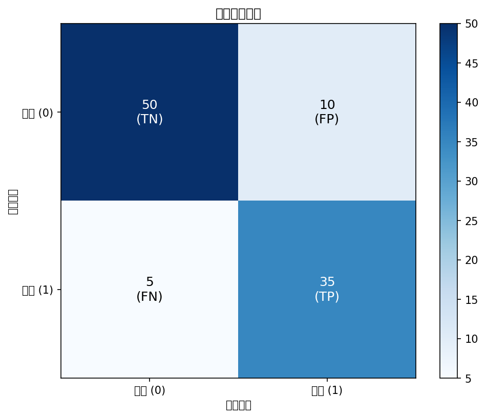
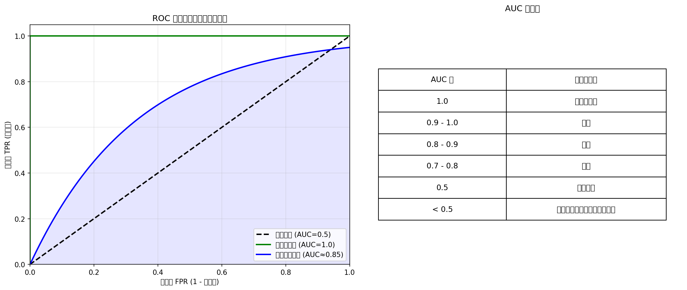

# Week 10：准确率陷阱——分类模型与评估

> "不是所有能算出来的都有意义，不是所有看起来准确的都是准确的。"
> — 统计学格言

2026 年，你可以在几秒钟内把数据丢给 AI 工具（如 ChatGPT、GitHub Copilot），得到一份"看起来很专业"的分类报告：准确率 95%、混淆矩阵、甚至"结论"一应俱全。但这里有一个被很多人忽略的问题：**准确率高不等于模型好，类别不平衡时准确率会骗人**。

小北上周学会了回归分析与模型诊断，兴冲冲地拿着一份分类结果去找老潘："准确率 85%，模型很棒！"

老潘看完数据，只说了一句话："你的数据里 80% 没流失，20% 流失。如果你的模型永远预测'不流失'，准确率也是 80%。你的模型比'永远猜不流失'好多少？"

小北愣住了。"准确率还有真假？"

"准确率是真的，但它基于的前提可能是假的。"老潘继续说，"你有没有看混淆矩阵？有没有计算精确率和召回率？有没有检查数据泄漏？"

这正是本周的核心问题：**分类模型与评估**。你将学习逻辑回归的原理，更重要的是，你将学会如何评估分类模型——混淆矩阵、精确率、召回率、F1、ROC-AUC，以及如何用 Pipeline 防止数据泄漏。

Andrew Ng 说过："在分类问题中，选择正确的评估指标比选择复杂的模型更重要。"在 AI 时代，AI 可以帮你训练模型，但只有你能判断"这个评估是否诚实"。

---

## 前情提要

上周你学会了回归分析与模型诊断：从"画散点图看相关性"到"拟合回归模型量化关系"，从"只看 R²"到"检查 LINE 假设"。

老潘总结道："模型是错的，但有些是有用的。关键是要知道：你的模型在哪些地方是错的。"

小北若有所思："那如果我要预测的不是连续值（比如销售额），而是类别（比如'会不会流失'）呢？"

"这就是本周要讲的：分类模型与评估。"

---

## 学习目标

完成本周学习后，你将能够：

1. 理解分类与回归的区别，知道何时使用逻辑回归
2. 解读混淆矩阵，计算精确率、召回率、F1 分数
3. 理解 ROC 曲线和 AUC，知道为什么准确率不够用
4. 识别数据泄漏，用 Pipeline/ColumnTransformer 防止交叉验证中的泄漏
5. 在 StatLab 报告中写出"带评估指标选择理由"的分类结论

---

<!--
贯穿案例：从"预测流失概率"到"完整分类评估报告"

案例演进路线：
- 第 1 节（分类 vs 回归）→ 从"预测销售额"到"预测是否会流失"：分类问题引入
- 第 2 节（逻辑回归）→ 从"线性回归硬套分类"到"逻辑回归与概率预测"
- 第 3 节（混淆矩阵与指标）→ 从"准确率"到"精确率/召回率/F1：当类别不平衡时"
- 第 4 节（ROC 与 AUC）→ 从"单一阈值"到"ROC-AUC：全面评估分类器"
- 第 5 节（数据泄漏与防御）→ 从"数据泄漏导致虚假高准确率"到"Pipeline + 交叉验证"

最终成果：读者能训练逻辑回归模型、选择合适的评估指标、识别并防御数据泄漏、写出"带评估指标选择理由"的分类报告

数据集建议：
- 复用电商数据，新增二分类目标变量：is_churned（是否流失）
- 特征：购买次数、平均消费金额、注册时长、最近一次购买距今天数等
- 类别比例：约 20% 流失，80% 未流失（制造类别不平衡场景）

---

认知负荷预算：
- 本周新概念（5 个，预算上限 5 个）：
  1. 分类 vs 回归（classification vs regression）：预测类别 vs 预测连续值
  2. 逻辑回归（logistic regression）：从回归到分类的桥梁，Sigmoid 函数
  3. 混淆矩阵与评估指标（confusion matrix and metrics）：准确率、精确率、召回率、F1
  4. ROC 与 AUC（ROC curve and AUC）：阈值变化下的分类器表现
  5. 数据泄漏与防御（data leakage and prevention）：训练-测试边界、Pipeline、ColumnTransformer
- 结论：✅ 在预算内

回顾桥设计（至少 2 个，来自 week_05-09）：
- [回归假设]（来自 week_09）：在第 2 节，通过"逻辑回归也有假设（线性、独立性）"再次使用
- [置信区间]（来自 week_08）：在第 2 节，通过"逻辑回归系数的 CI"再次使用
- [假设检验]（来自 week_06）：在第 2 节，通过"逻辑回归系数的显著性检验"再次使用
- [Bootstrap]（来自 week_08）：在第 4 节，通过"Bootstrap 估计 AUC 的 CI"再次使用
- [模型诊断]（来自 week_09）：在第 5 节，通过"交叉验证诊断过拟合"再次使用
- [R² 与拟合优度]（来自 week_09）：在第 3 节，通过"分类没有 R²，用其他指标评估"再次对比使用

AI 小专栏规划：
- 第 1 个侧栏（第 1-2 节之后）：
  - 主题："AI 时代的分类评估——为什么准确率不够用"
  - 连接点：刚学完逻辑回归和混淆矩阵，讨论 AI/ML 中常见的类别不平衡问题
  - 建议搜索词："imbalanced classification AI", "precision recall vs accuracy", "class imbalance machine learning evaluation"

- 第 2 个侧栏（第 3-4 节之后）：
  - 主题："数据泄漏：AI 模型的隐形杀手"
  - 连接点：刚学完 ROC-AUC 和评估指标，讨论数据泄漏在 AI 项目中的普遍性和危害
  - 建议搜索词："data leakage machine learning", "cross-validation data leakage prevention", "target leakage AI models"

角色出场规划：
- 小北（第 3 节）：误以为"准确率 85% 就是好模型"，引出类别不平衡时准确率的陷阱
- 阿码（第 4 节）：追问"ROC 曲线和 AUC 到底怎么读？"，引出阈值选择和分类器比较
- 老潘（第 5 节）：看到"没有 Pipeline 的交叉验证"后点评"这是数据泄漏，不是评估"

StatLab 本周推进：
- 上周状态：数据卡 + 描述统计 + 可视化 + 清洗日志 + 相关分析 + 分组比较 + 假设清单 + 多组比较 + 区间估计 + Bootstrap + 置换检验 + 回归分析 + 模型诊断
- 本周改进：添加分类评估模块，包括混淆矩阵、精确率/召回率/F1、ROC-AUC、数据泄漏防护（Pipeline）
- 涉及的本周概念：分类 vs 回归、逻辑回归、混淆矩阵与评估指标、ROC 与 AUC、数据泄漏与防御
- 建议示例文件：examples/10_statlab_classification.py（本周报告生成入口脚本）
-->

## 1. 从"预测多少"到"预测哪一类"——分类 vs 回归

小北上周学会了用回归预测销售额，这周他遇到了一个新问题。

"老潘，老板问的是'这个客户会不会流失'，不是'他会花多少钱'。"

老潘笑了。"你刚才问的，正好区分了统计学中两类最基础的预测任务：**回归和分类**。"

上周你学的**回归（Regression）**，预测的是**连续值**：
- 例：预测销售额（0-100 万）、预测房价、预测温度
- 输出：一个数字（如"销售额 35.6 万"）
- 评估：MSE、RMSE、R²

这周我们要学的**分类（Classification）**，预测的是**类别**：
- 例：预测是否会流失（是/否）、预测邮件类型（垃圾/正常）、预测手写数字（0-9）
- 输出：一个类别标签（如"会流失"、"不会流失"）
- 评估：准确率、精确率、召回率、F1、ROC-AUC

小北问："我能不能用回归做分类？比如预测 0/1？"

"可以试试，但会出问题。"老潘说，"你可以用回归预测一个概率，然后设定阈值（比如 >0.5 算 1）。但如果你直接用回归预测 0 或 1，会遇到三个问题：第一，预测值可能超出 [0, 1] 范围（如 -0.3、1.2）；第二，回归假设残差正态，但 0/1 数据的残差不可能是正态的；第三，对异常值敏感。"

阿码问："那二分类和多分类有什么区别？"

"二分类是最基础的。"老潘说，"理解了二分类，多分类自然就懂了。二分类只有两个类别（流失/不流失），多分类有三个或以上（0-9 数字识别）。多分类可以分解为多个二分类问题。"

### 为什么不直接用线性回归？

假设你想预测客户是否会流失（0 = 不流失，1 = 流失），用线性回归：

```python
# 线性回归预测流失（错误示范）
from sklearn.linear_model import LinearRegression

X = customer_data[['purchase_count', 'avg_spend']]
y = customer_data['is_churned']  # 0 或 1

model = LinearRegression()
model.fit(X, y)
prediction = model.predict([[10, 500]])  # 可能得到 0.7, 1.2, -0.3...（超出 [0,1] 范围）
```

**问题**：
1. 预测值可能超出 [0, 1] 范围（如 -0.3、1.2）
2. 假设残差正态，但 0/1 数据的残差不可能正态
3. 对异常值敏感

**解决方案**：逻辑回归（Logistic Regression）——它预测的是**概率**，且保证输出在 [0, 1] 之间。

老潘说："逻辑回归不是'回归'，而是分类。它的名字有误导性——它用回归的方法（拟合系数）来解决分类问题（预测概率）。"

这正好引出下一节的内容：逻辑回归是如何工作的？

> **AI 时代小专栏：AI 时代的分类评估——为什么准确率不够用**

> 2026 年，很多 AI 工具可以一键训练分类器，输出"准确率 95%"。但这里有一个被广泛忽略的问题：**类别不平衡（Class Imbalance）时，准确率会误导你**。
>
> **什么是类别不平衡？**
>
> 类别不平衡是指正负样本数量差异巨大。比如：
> - 流失预测：20 个流失，80 个不流失（1:4）
> - 欺诈检测：10 个欺诈，9990 个正常（1:999）
> - 罕见病诊断：5 个患病，9995 个健康（1:1999）
>
> 在现实应用中，如欺诈检测场景，类别不平衡比例可能达到 1:1000 到 1:5000。这意味着如果模型简单预测"所有交易都正常"，准确率可以达到 99.9% 以上，但完全无法识别真正的欺诈行为。这正是**"准确率悖论"（Accuracy Paradox）** 的核心问题。
>
> **准确率的陷阱**：
>
> 假设你有 100 个客户，其中 20 个流失、80 个不流失。如果你训练一个"永远预测不流失"的模型：
>
> | 预测 | 实际流失 (20) | 实际不流失 (80) |
> |------|-------------|---------------|
> | 预测流失 | 0 | 0 |
> | 预测不流失 | 20 | 80 |
>
> 准确率 = (0 + 80) / 100 = 80%
>
> 看起来"不错"，但这个模型毫无价值——它连一个流失客户都抓不到。
>
> **行业实践**：
>
> - **医疗 AI**：癌症筛查、罕见病诊断中，F1 分数和召回率比准确率更重要——漏诊的代价远大于误诊
> - **风控系统**：欺诈检测中，精确率很重要——误判正常用户为欺诈会导致客户流失
> - **推荐系统**：点击率预测中，AUC 是标准指标——它衡量"排序能力"，不是单一阈值的准确率
>
> **更多真实案例**：
>
> 1. **信用卡欺诈检测**：某银行发现他们的欺诈检测模型"准确率 99.7%"，但实际上该模型只预测"所有交易都正常"。真正的欺诈交易只占 0.1%，所以模型什么都没抓到，但准确率看起来很漂亮。
>
> 2. **制造业缺陷检测**：某工厂的产品缺陷率只有 0.5%，质检模型如果永远预测"无缺陷"，准确率高达 99.5%。但漏掉的 0.5% 缺陷产品可能导致大规模召回，损失远超"误判"的成本。
>
> 3. **网络入侵检测**：某公司的安全系统每天处理上亿次请求，其中只有几百次是真正的攻击。如果模型只看准确率，会倾向于"放过所有流量"——因为这样准确率最高，但公司会被入侵。
>
> 4. **罕见病筛查**：某些罕见病的发病率只有万分之一。如果筛查模型永远预测"健康"，准确率高达 99.99%。但漏诊的患者可能错过最佳治疗时机。
>
> **对你的启示**：
>
> 你本周学的准确率只是第一步。更重要的是：理解**你的业务场景最关心什么**？是"抓到所有流失客户"（高召回率），还是"不要误判正常客户"（高精确率）？不同的业务目标需要不同的评估指标。
>
> 参考（访问日期：2026-02-17）：
> - [Scikit-learn: Common Pitfalls of Predictive Modeling](https://scikit-learn.org/stable/common_pitfalls.html)
> - [Machine Learning Mastery: What is Imbalanced Classification?](https://machinelearningmastery.com/what-is-imbalanced-classification/)
> - [imbalanced-learn: User Guide](https://imbalanced-learn.org/stable/introduction.html)

---

## 2. 逻辑回归——从"预测数值"到"预测概率"

小北现在知道不能用线性回归硬套分类问题。那用什么？

老潘给出了答案：**逻辑回归（Logistic Regression）**。

"逻辑回归不是'回归'，而是分类。它的名字有误导性。"老潘说。

### Sigmoid 函数：把任何数压缩到 [0, 1]

逻辑回归的核心是 **Sigmoid 函数**：

$$
\sigma(z) = \frac{1}{1 + e^{-z}}
$$

**它做什么？**
- 输入：任何实数（-∞ 到 +∞）
- 输出：0 到 1 之间的概率
- 形状：S 型曲线

| 输入 z | 输出 σ(z) |
|--------|----------|
| -5 | ≈ 0.007 |
| -2 | ≈ 0.12 |
| 0 | 0.5 |
| 2 | ≈ 0.88 |
| 5 | ≈ 0.993 |

**Sigmoid 函数可视化**：

![Sigmoid 函数：将任意实数压缩到 [0,1] 区间](images/sigmoid_function.png)

图中可以看到：当 z → -∞ 时，σ(z) → 0；当 z → +∞ 时，σ(z) → 1；在 z=0 处，σ(0) = 0.5。这个 S 型曲线把任何线性组合"挤压"成一个概率值。

**逻辑回归方程**：

$$
P(y=1|x) = \sigma(a + b_1 x_1 + b_2 x_2 + ... + b_k x_k)
$$

- y=1：正类（如"流失"）
- P(y=1|x)：给定特征 x，y=1 的概率
- a, b₁, b₂, ...：逻辑回归系数

阿码问："什么是对数几率（log-odds）？"

"好问题。"老潘说，"这需要理解几率（odds）的概念。"

### 几率与对数几率

**几率（Odds）**：

$$
\text{几率} = \frac{P(\text{发生})}{P(\text{不发生})} = \frac{p}{1-p}
$$

| 概率 p | 几率 |
|--------|------|
| 0.1 | 0.1/0.9 = 0.111 |
| 0.5 | 0.5/0.5 = 1 |
| 0.8 | 0.8/0.2 = 4 |
| 0.9 | 0.9/0.1 = 9 |

**数值例子**：概率 0.8 → 几率 0.8/0.2 = 4 → 对数几率 log(4) ≈ 1.39

**对数几率（Log-odds, Logit）**：

$$
\text{对数几率} = \log(\text{几率}) = \log\left(\frac{p}{1-p}\right)
$$

**逻辑回归的本质**：

$$
\text{对数几率} = a + b_1 x_1 + b_2 x_2 + ... + b_k x_k
$$

也就是说：**逻辑回归假设特征与对数几率之间是线性关系**。这和上周学的线性回归（假设特征与 y 之间是线性关系）不同，但它们都检查"线性"假设——只是线性的对象不同。

这正好呼应了 Week 09 学的回归假设：线性回归检查"特征与 y 之间是否线性"，逻辑回归检查"特征与对数几率之间是否线性"。两者都要求你验证前提假设，只是假设的对象不同。

### 逻辑回归实战

让我们用逻辑回归预测客户流失：

```python
import pandas as pd
import numpy as np
from sklearn.linear_model import LogisticRegression
from sklearn.model_selection import train_test_split
from sklearn.metrics import accuracy_score, confusion_matrix
import seaborn as sns

# 加载数据
customer_data = pd.read_csv("data/customer_churn.csv")

# 特征和目标
X = customer_data[['purchase_count', 'avg_spend', 'days_since_last_purchase']]
y = customer_data['is_churned']  # 0 或 1

# 划分训练集和测试集
X_train, X_test, y_train, y_test = train_test_split(X, y, test_size=0.3, random_state=42)

# 训练逻辑回归模型
model = LogisticRegression()
model.fit(X_train, y_train)

# 预测概率
y_prob = model.predict_proba(X_test)[:, 1]  # P(y=1|x)

# 预测类别（默认阈值 0.5）
y_pred = model.predict(X_test)

# 准确率
accuracy = accuracy_score(y_test, y_pred)
print(f"准确率: {accuracy:.4f}")

# 混淆矩阵
cm = confusion_matrix(y_test, y_pred)
print("混淆矩阵:")
print(cm)
```

### 逻辑回归系数的解读

逻辑回归的系数和线性回归不同：

| 系数 | 含义 |
|------|------|
| **截距（a）** | 所有特征为 0 时，对数几率的基准值 |
| **斜率（b）** | x 每增加 1，对数几率增加 b；几率乘以 e^b |

**经验法则**：
- **b > 0**：x 增加会提高流失概率
- **b < 0**：x 增加会降低流失概率
- **|b| > 1**：强影响
- **|b| < 0.5**：弱影响

**一个具体例子**：

假设你的流失预测模型输出如下：

```
特征: purchase_count（购买次数）
系数: -0.35
P值: 0.002（显著）
```

**解读**：
1. **方向**：系数为负（-0.35），说明购买次数越多，流失概率越低（符合直觉）
2. **强度**：|b| = 0.35，属于中等偏弱的影响
3. **几率比（Odds Ratio）**：e^(-0.35) ≈ 0.70
   - 意思是：购买次数每增加 1 次，流失的几率变为原来的 70%（即几率乘以 0.70）
   - 注意：这是"几率"的变化，不是"概率"的变化。如果原流失概率是 20%（几率 0.25），新几率变为 0.25 × 0.70 = 0.175，对应概率约为 15%（0.175/(1+0.175)）
4. **显著性**：P值 0.002 < 0.05，系数显著不为 0

如果另一个特征 `days_since_last_purchase`（距上次购买天数）的系数是 0.52：
- 系数为正，距上次购买越久，流失概率越高
- 几率比：e^0.52 ≈ 1.68
- 意思是：距上次购买每增加 1 天，流失的几率变为原来的 1.68 倍（注意：这是几率的相对变化，不是概率的绝对变化）

小北问："那怎么知道系数是否显著？"

"逻辑回归也有假设检验。"老潘说，"你可以用 statsmodels 查看系数的 p 值和置信区间——这和你 Week 06 学的**假设检验**是同一回事。"

实际上，逻辑回归也有自己的"前提假设检查"——这呼应了 Week 06 学的**检验前提假设**。逻辑回归假设：特征与对数几率之间是线性关系（可以用 Box-Tidwell 检验）、观测之间相互独立、没有严重的多重共线性。这些检查和你在 Week 09 学的回归诊断一脉相承。

**查看系数显著性**（完整代码见 `examples/02_logistic_regression.py`）：

statsmodels 的输出包含：
- **coef**：系数估计值
- **std err**：标准误
- **z**：z 统计量
- **P>|z|**：p 值（< 0.05 表示显著）
- **[0.025 0.975]**：95% 置信区间

注意：statsmodels 的 API 和 scikit-learn 不同。statsmodels 需要手动添加常数项（截距），而 scikit-learn 会自动处理。statsmodels 更适合统计推断（p 值、置信区间），scikit-learn 更适合预测。

这里你看到了 Week 06 学的假设检验和 Week 08 学的置信区间在逻辑回归中的再次应用：p 值告诉你系数是否显著不为 0，置信区间告诉你系数的不确定性范围。

这正是下一节要讲的内容：如何评估分类模型的性能？

---

## 3. 混淆矩阵与评估指标——当准确率骗了你时

小北训练了一个流失预测模型，准确率 85%。他很高兴。

老潘看了一眼数据："你的数据里 80% 没流失，20% 流失。如果你的模型永远预测'不流失'，准确率也是 80%。你的模型比'永远猜不流失'好多少？"

小北愣住了。"准确率还不够？"

### 混淆矩阵：分类的"体检报告"

**混淆矩阵（Confusion Matrix）**是一个 2×2 的表格，告诉你模型在哪些地方预测对了、哪些地方预测错了。

| | 预测负类（0） | 预测正类（1） |
|---|-------------|-------------|
| **实际负类（0）** | TN（真负类） | FP（假正类） |
| **实际正类（1）** | FN（假负类） | TP（真正类） |

**术语解释**：
- **TP（True Positive）**：预测流失，实际流失（抓对了）
- **TN（True Negative）**：预测不流失，实际不流失（拒对了）
- **FP（False Positive）**：预测流失，实际不流失（误判）
- **FN（False Negative）**：预测不流失，实际流失（漏判）

**混淆矩阵可视化**：



图中颜色深浅代表数值大小。理想情况下，你希望对角线（TN 和 TP）颜色深，非对角线（FP 和 FN）颜色浅。

阿码问："为什么叫'混淆'矩阵？"

"因为它告诉你模型'混淆'了哪些样本。"老潘说，"比如模型把 5 个实际流失的客户误判为不流失——这些就是'被混淆'的样本。"

混淆矩阵的每个格子里都是一个数字，但如果你想让它更直观，可以用热力图可视化。混淆矩阵热力图中，颜色深浅表示数值大小——类似于 Week 02 的直方图用高度表示频率。但要注意：不要用过于鲜艳的配色误导读者，也不要截断颜色范围。就像当时学的"截断 Y 轴会误导"一样，可视化混淆矩阵也要诚实地展示完整信息。

### 从混淆矩阵到评估指标

**1. 准确率（Accuracy）**

$$
\text{准确率} = \frac{TP + TN}{TP + TN + FP + FN}
$$

所有预测中，预测正确的比例。

**问题**：类别不平衡时会误导（如 80% 不流失，永远猜不流失也有 80% 准确率）

小北若有所思："所以准确率和上周学的 R² 一样，只是第一步？"

"对。"老潘说，"R² 告诉你'模型解释了多少方差'，但不告诉你'假设是否满足'。准确率告诉你'整体预测正确的比例'，但不告诉你'在正类和负类上分别表现如何'。"

**2. 精确率（Precision）**

$$
\text{精确率} = \frac{TP}{TP + FP}
$$

预测为正类的样本中，真正为正类的比例。回答："模型说'会流失'的客户，有多少真的流失了？"

**3. 召回率（Recall，也叫 Sensitivity 或 TPR）**

$$
\text{召回率} = \frac{TP}{TP + FN}
$$

实际为正类的样本中，被正确预测为正类的比例。回答："所有流失的客户中，模型抓到了多少？"

**4. 特异度（Specificity，TNR）**

$$
\text{特异度} = \frac{TN}{TN + FP}
$$

实际为负类的样本中，被正确预测为负类的比例。

**5. F1 分数（F1 Score）**

$$
F1 = 2 \times \frac{\text{精确率} \times \text{召回率}}{\text{精确率} + \text{召回率}}
$$

精确率和召回率的调和平均数。在两者之间找平衡。

### 指标选择：业务场景决定指标

| 业务场景 | 关心什么 | 优先指标 |
|---------|---------|---------|
| **流失预测** | 不要漏掉流失客户 | 召回率 |
| **欺诈检测** | 不要误判正常用户 | 精确率 |
| **垃圾邮件过滤** | 不要误判正常邮件为垃圾 | 精确率 |
| **医疗诊断** | 不要漏诊 | 召回率 |
| **推荐系统** | 点击排序能力 | AUC |

**注**：推荐系统的优先指标是 AUC（排序能力），因为推荐系统不需要单一阈值决策（如"推荐/不推荐"），而是需要把用户最可能点击的内容排在前面。AUC 衡量的是"排序能力"——正类样本是否比负类样本有更高的预测概率。

小北问："那我该用哪个？"

"看业务。"老潘说，"如果你的老板说'流失一个客户损失很大'，你就优先召回率。如果他说'误判流失会导致客户不满'，你就优先精确率。如果他说'都要'，你就看 F1。"

### 评估指标实战

**计算评估指标**（完整示例见 `examples/03_confusion_matrix_metrics.py`）：

```python
from sklearn.metrics import accuracy_score, precision_score, recall_score, f1_score, confusion_matrix

# 预测
y_pred = model.predict(X_test)

# 计算指标
accuracy = accuracy_score(y_test, y_pred)
precision = precision_score(y_test, y_pred)
recall = recall_score(y_test, y_pred)
f1 = f1_score(y_test, y_pred)

print(f"准确率: {accuracy:.4f}")
print(f"精确率: {precision:.4f}")
print(f"召回率: {recall:.4f}")
print(f"F1 分数: {f1:.4f}")

# 混淆矩阵
cm = confusion_matrix(y_test, y_pred)
print("混淆矩阵:")
print(cm)
```

### 精确率-召回率权衡

小北发现一个奇怪的现象："当我把阈值从 0.5 降到 0.3，召回率上升了，但精确率下降了。"

"这是精确率-召回率权衡。"老潘说，"你放宽标准（降低阈值），会抓到更多正类（召回率上升），但也会抓到更多负类（精确率下降）。"

阿码问："那怎么选阈值？"

"看业务。"老潘说，"医疗诊断中，宁愿误诊也不要漏诊（低阈值）。风控中，宁可漏掉也要减少误判（高阈值）。"

下一节，我们将学习 ROC 曲线和 AUC——它们不依赖单一阈值，能全面评估分类器。

---

## 4. ROC 曲线与 AUC——全面评估分类器

如果让你用一个词概括本周到目前为止学的内容，你会选什么？小北选的是"阈值"。

他发现一个奇怪的现象：每次都是阈值 0.5，如果阈值变了怎么办？如果阈值变了，所有的评估指标都会变——准确率、精确率、召回率、F1，统统都不一样了。

"那问题来了，"阿码说，"如果我换了一个阈值，模型变了吗？"

老潘笑了。"好问题。模型没变，只是决策边界变了。你本周学的 ROC 曲线和 AUC，正是为了解决这个'阈值依赖'的问题。"

### 阈值变化：从"一个决策"到"一系列决策"

逻辑回归输出的是一个概率（0-1），但最终需要做一个二元决策（0 或 1）。这个决策由**阈值（threshold）**决定：

```
如果 P(y=1|x) >= 阈值：预测为 1
如果 P(y=1|x) < 阈值：预测为 0
```

阈值不同，预测结果不同，评估指标也不同：

| 阈值 | 策略 | 召回率 | 精确率 |
|------|------|--------|--------|
| 0.1 | 宽松（预测更多 1） | 高 | 低 |
| 0.5 | 平衡 | 中等 | 中等 |
| 0.9 | 严格（预测更少 1） | 低 | 高 |

**问题**：如何选择阈值？如何全面评估分类器（而不是依赖一个阈值）？

### ROC 曲线：阈值变化下的表现

**ROC 曲线（Receiver Operating Characteristic Curve）**描述的是：**在不同阈值下，召回率（TPR）和 1-特异度（FPR）的权衡**。

- **X 轴**：FPR = FP / (FP + TN) = 1 - 特异度
- **Y 轴**：TPR = TP / (TP + FN) = 召回率

**如何绘制 ROC 曲线？**
1. 从阈值 0 开始（所有样本预测为 1）
2. 逐渐提高阈值
3. 在每个阈值下计算 TPR 和 FPR
4. 连接所有点（TPR, FPR）

**理想分类器**：ROC 曲线靠近左上角（高 TPR，低 FPR）
**随机猜测**：ROC 曲线是对角线（TPR = FPR）

下面这张图展示了 ROC 曲线的形状（见 `images/roc_curve_explanation.png`）：

- **左下角**：阈值 → 1.0，所有样本预测为负类（TPR=0, FPR=0）
- **右上角**：阈值 → 0.0，所有样本预测为正类（TPR=1, FPR=1）
- **对角线**：随机猜测（TPR = FPR，模型没有区分能力）
- **左上角**：理想状态（TPR=1, FPR=0，完美分类）

好的模型会向左上角弯曲（高 TPR，低 FPR）。AUC 就是曲线下方的面积——面积越大，曲线越弯曲，模型越好。

### AUC：ROC 曲线下的面积

**AUC（Area Under Curve）**是 ROC 曲线下的面积，范围 [0, 1]。

| AUC 值 | 含义 |
|--------|------|
| 1.0 | 完美分类器 |
| 0.9-1.0 | 优秀 |
| 0.8-0.9 | 良好 |
| 0.7-0.8 | 一般 |
| 0.5 | 随机猜测 |
| < 0.5 | 比随机还差（可能预测反了）|

**什么是"排序能力"？——一个直观的例子**

假设你有 5 个客户，其中 2 个流失（正类）、3 个不流失（负类）。假设模型给这 5 个客户预测的流失概率如下：

| 客户 | 实际 | 预测概率 |
|------|------|---------|
| A | 流失 | 0.85 |
| B | 流失 | 0.72 |
| C | 不流失 | 0.45 |
| D | 不流失 | 0.30 |
| E | 不流失 | 0.15 |

如果按预测概率从高到低排序：A(流失) > B(流失) > C(不流失) > D(不流失) > E(不流失)

**完美排序**：所有正类排在所有负类之前！这意味着：
- 如果你只联系预测概率最高的 2 个人，你正好抓到了 2 个流失客户
- 无论你选什么阈值（0.5、0.6、0.7...），正类总是比负类有更高的预测概率

这就是 **AUC = 1.0** 的情况。

**如果排序混乱**：假设 B 的预测概率变成 0.35（低于 C 的 0.45）

排序变成：A(流失) > C(不流失) > B(流失) > D(不流失) > E(不流失)

这时正类和负类"混在一起"了——AUC 会下降（可能 0.67 左右）。

**AUC 的直观理解**：如果你随机选一个正类样本和一个负类样本，AUC 告诉你"模型会给正类样本更高预测概率"的可能性。
- AUC = 0.9：随机选一个正类样本和一个负类样本，90% 的可能，模型会给正类样本更高的预测概率
- AUC = 0.5：和随机猜测一样（抛硬币）
- AUC = 1.0：100% 的情况下，正类样本的预测概率都高于负类样本（完美排序）

**AUC 的优点**：
- 不依赖阈值选择
- 衡量"排序能力"：正类样本是否比负类样本有更高的预测概率
- 适用于类别不平衡的数据

你可以用 Week 08 学的 Bootstrap 方法来估计 AUC 的置信区间，就像你估计回归系数的置信区间一样。这让你的评估更加严谨。

### ROC 曲线实战

ROC 曲线是分类评估的核心可视化工具。你可能会想起 Week 04 学的**多变量可视化**——当时你用散点图、热力图来展示多个变量之间的关系。ROC 曲线也是多变量可视化的一种：它同时展示了 FPR 和 TPR 两个变量在不同阈值下的变化轨迹。不同的是，散点图展示的是原始数据点，而 ROC 曲线展示的是模型性能随阈值变化的轨迹。

**ROC 曲线可视化**：



图中蓝色曲线是模型的 ROC 曲线，灰色虚线是随机猜测的基线（AUC = 0.5）。曲线越靠近左上角，模型越好。

**ROC 曲线绘制代码**（完整示例见 `examples/04_roc_auc.py`）：

```python
from sklearn.metrics import roc_curve, roc_auc_score
import matplotlib.pyplot as plt

# 获取预测概率（ROC 曲线需要概率，不是类别标签）
y_prob = model.predict_proba(X_test)[:, 1]  # P(y=1|x)

# 计算 ROC 曲线：FPR（X 轴）、TPR（Y 轴）、阈值
fpr, tpr, thresholds = roc_curve(y_test, y_prob)

# 计算 AUC
auc = roc_auc_score(y_test, y_prob)
print(f"AUC: {auc:.4f}")

# 绘制 ROC 曲线
plt.figure(figsize=(8, 6))
plt.plot(fpr, tpr, label=f'ROC Curve (AUC = {auc:.4f})')
plt.plot([0, 1], [0, 1], 'k--', label='Random Guess')
plt.xlabel('False Positive Rate (1 - Specificity)')
plt.ylabel('True Positive Rate (Recall)')
plt.title('ROC Curve')
plt.legend()
plt.show()
```

### AUC vs 准确率：哪个更重要？

阿码问："AUC 和准确率，哪个更重要？"

"它们回答不同问题。"老潘说。

| 指标 | 回答的问题 | 适用场景 |
|------|-----------|---------|
| **准确率** | "整体预测正确的比例" | 类别平衡、需要单一阈值决策 |
| **AUC** | "模型排序正负样本的能力" | 类别不平衡、需要全面评估 |

**经验法则**：
- 如果你的业务需要**单一阈值决策**（如"是否批准贷款"），看精确率和召回率
- 如果你的业务需要**排序能力**（如"优先联系哪些客户"），看 AUC
- 如果数据**类别不平衡**，AUC 通常比准确率更可靠

但这里有一个更隐蔽的问题：**数据泄漏**。如果数据泄漏了，你的 AUC 会虚高，模型上线后会崩。这正是下一节要讲的内容。

> **AI 时代小专栏：数据泄漏——AI 模型的隐形杀手**

> 2026 年，很多 AI 项目在实验室里表现优异（AUC > 0.9），但上线后崩溃（AUC < 0.6）。其中一个最常见的原因是：**数据泄漏（Data Leakage）**。
>
> **什么是数据泄漏？**
>
> 数据泄漏是指**训练数据包含了"不该知道"的信息**——这些信息在实际预测时无法获得，导致模型在测试集上表现虚高。
>
> **数据泄漏有多普遍？**
>
> scikit-learn 官方文档展示了一个经典的数据泄漏案例：如果在划分训练/测试集之前进行特征选择（如 SelectKBest），从 10,000 个随机特征中选 25 个，会得到约 0.76 的虚高准确率；而正确做法是先划分数据再进行特征选择，准确率会降到约 0.5（接近随机猜测的真实水平）。
>
> **常见泄漏场景**：
>
> 1. **目标泄漏（Target Leakage）**：特征包含了目标的信息
>    - 例：用"退款金额"预测"是否退货"——退款金额本身就是退货的结果
>    - 例：用"最后购买时间"预测"下月是否会购买"——如果最后购买时间就是"下月"，模型就作弊了
>
> 2. **训练-测试泄漏**：测试集的信息泄露到训练集
>    - 例：在做缺失值填充时，用全部数据的均值填充（包括测试集）
>    - 例：在做特征选择时，用全部数据的统计量
>
> 3. **时间泄漏**：用未来的数据预测过去
>    - 例：用"下月销售额"预测"本月流失"
>
> **防止数据泄漏的黄金法则**："永远不要在测试数据上调用 fit()"。scikit-learn 的 Pipeline 机制可以自动确保数据变换只基于训练数据学习参数，然后正确地应用到测试数据。
>
> **行业最佳实践**：
>
> - Kaggle 竞赛中，数据泄漏是最常见的争议原因之一
> - Google、Microsoft 等公司的 AI 开发指南强调"数据泄漏审计"是模型开发的标准流程
> - **Pipeline + 交叉验证**成为防止数据泄漏的标准工程实践
>
> **对你的启示**：
>
> 你本周学的逻辑回归、ROC-AUC 只是第一步。更重要的是：确保你的评估是"诚实"的——测试集的信息绝不能泄漏到训练集。下一节我们会讲如何用 Pipeline 和 ColumnTransformer 防止数据泄漏。
>
> 参考（访问日期：2026-02-17）：
> - [Scikit-learn: Common Pitfalls of Predictive Modeling](https://scikit-learn.org/stable/common_pitfalls.html)

---

## 5. 数据泄漏与防御——用 Pipeline 守住训练-测试边界

小北这周学了很多，他兴冲冲地训练了一个模型，AUC 0.92。

老潘看了一眼代码，眉头皱了起来。

"你的缺失值填充用的什么？"

"均值填充。"小北说。

"你在哪里计算均值？"老潘问。

"在划分训练集和测试集之前。"小北说。

老潘叹了口气。"你的测试集信息泄漏到训练集了。"

### 数据泄漏：训练集"偷看"了测试集

**数据泄漏（Data Leakage）**是指**测试集的信息（直接或间接）进入了训练集**。

**为什么这很糟糕？**
- 模型在测试集上表现虚高（AUC 0.92，上线后 0.65）
- 模型无法泛化到新数据
- 基于"虚假高指标"做业务决策，导致损失
- 导致模型选择错误的特征或超参数（因为模型"作弊"了）

### 常见泄漏场景

**场景 1：预处理在划分之前**

❌ **错误示范**（在划分之前填充缺失值）：
```python
X_filled = X.fillna(X.mean())  # 测试集的信息泄漏到训练集！
X_train, X_test, y_train, y_test = train_test_split(X_filled, y, test_size=0.3)
```

✅ **正确做法**（先划分，再分别填充）：
```python
# 先划分
X_train, X_test, y_train, y_test = train_test_split(X, y, test_size=0.3)

# 用训练集的统计量填充
train_mean = X_train.mean()
X_train_filled = X_train.fillna(train_mean)
X_test_filled = X_test.fillna(train_mean)  # 用训练集的均值填充测试集
```

老潘说："这就像考试前偷看了答案——你在训练时用了测试集的信息，所以测试成绩虚高。"

**场景 2：交叉验证中的泄漏**

同样的问题也会出现在交叉验证中。如果你在交叉验证之前填充缺失值（`X.fillna(X.mean())`），在每一折中，验证集的信息会参与均值计算——这也是数据泄漏。

### Pipeline：把预处理和模型绑在一起

**Pipeline**是 scikit-learn 的核心工具，它把多个步骤（预处理、特征选择、模型）绑定在一起，确保：
1. 预处理只在训练集上学习（fit）
2. 预处理应用到测试集时，只用训练集的统计量（transform）
3. 交叉验证时，每一折的预处理都是独立的

**Pipeline 示例代码**（完整代码见 `examples/05_pipeline_data_leakage.py`）：

```python
from sklearn.pipeline import Pipeline
from sklearn.compose import ColumnTransformer
from sklearn.impute import SimpleImputer
from sklearn.preprocessing import StandardScaler, OneHotEncoder
from sklearn.linear_model import LogisticRegression
from sklearn.model_selection import cross_val_score

# 基础 Pipeline：预处理 + 模型
pipeline = Pipeline([
    ('imputer', SimpleImputer(strategy='mean')),
    ('scaler', StandardScaler()),
    ('model', LogisticRegression())
])

# 划分数据
X_train, X_test, y_train, y_test = train_test_split(X, y, test_size=0.3)

# 训练（所有步骤只在训练集上 fit）
pipeline.fit(X_train, y_train)

# 预测（测试集只用训练集的统计量 transform）
y_pred = pipeline.predict(X_test)
auc = roc_auc_score(y_test, pipeline.predict_proba(X_test)[:, 1])
```

**Pipeline 的工作原理**：
- `fit()` 时：每个步骤依次 fit，后面步骤用前面步骤的输出
- `predict()` 时：前几步只 transform，最后一步 predict

阿码问："如果我有数值型和分类型特征，需要不同的预处理怎么办？"

"用 ColumnTransformer。"老潘说。

### ColumnTransformer：不同列用不同预处理

如果你的数据有数值型和分类型特征，需要对它们做不同的预处理：

**数值型特征**：填充缺失值 + 标准化
**分类型特征**：填充缺失值 + One-hot 编码

这里用到了 Week 03 学的两个概念：**数据转换**（标准化是将数据转换为均值为 0、标准差为 1 的分布）和**特征编码**（One-hot 编码将分类变量转换为 0/1 数值）。当时你学习这些是为了让数据"准备好"用于分析，现在你看到它们在 Pipeline 中的正确用法——必须在训练集上学习参数，然后应用到测试集，否则就是数据泄漏。

**ColumnTransformer + Pipeline 示例**（完整代码见 `examples/05_pipeline_data_leakage.py`）：

```python
# 定义特征
numeric_features = ['purchase_count', 'avg_spend', 'days_since_last_purchase']
categorical_features = ['city', 'membership_level']

# 数值型预处理
numeric_transformer = Pipeline([
    ('imputer', SimpleImputer(strategy='mean')),
    ('scaler', StandardScaler())
])

# 分类型预处理
categorical_transformer = Pipeline([
    ('imputer', SimpleImputer(strategy='most_frequent')),
    ('onehot', OneHotEncoder(handle_unknown='ignore'))
])

# 组合
preprocessor = ColumnTransformer([
    ('num', numeric_transformer, numeric_features),
    ('cat', categorical_transformer, categorical_features)
])

# 完整 Pipeline
pipeline = Pipeline([
    ('preprocessor', preprocessor),
    ('model', LogisticRegression())
])

# 交叉验证（无泄漏）
from sklearn.model_selection import cross_val_score
scores = cross_val_score(pipeline, X, y, cv=5, scoring='roc_auc')
print(f"交叉验证 AUC: {scores.mean():.4f} (+/- {scores.std():.4f})")
```

### 交叉验证 + Pipeline：防止泄漏的双重保险

老潘说："Pipeline 是第一道防线，交叉验证是第二道防线。两者结合，才能确保你的评估是诚实的。"

**工作原理**：
1. 交叉验证把数据分成 k 份
2. 每一折：训练集用于 fit Pipeline，验证集只用于 transform + predict
3. 每一折的预处理都是独立的（没有泄漏）

这正好呼应了 Week 09 学的模型诊断：回归需要残差图检查假设，分类需要 Pipeline 防止泄漏。两者都是"评估要诚实"的具体体现。

### 数据泄漏检查清单

老潘总结了一个检查清单：

| 检查项 | 说明 | 如何验证 |
|--------|------|----------|
| ✅ 预处理在划分之后 | 缺失值填充、标准化在 train_test_split 之后 | 检查代码：确认没有在划分前调用 fit() |
| ✅ 使用 Pipeline | 把预处理和模型绑定在一起 | 确认预处理步骤在 Pipeline 内 |
| ✅ 交叉验证用 Pipeline | 确保每一折的预处理独立 | 确认 cross_val_score 的第一个参数是 Pipeline |
| ✅ 检查特征定义 | 确保特征不包含目标的信息 | 逐个检查特征：是否有"未来信息" |
| ✅ 时间序列注意时序 | 不要用未来数据预测过去 | 确认训练集的时间早于测试集 |

阿码问："如果我怀疑有泄漏，怎么检查？"

"用'傻瓜基线'（dummy baseline）对比。"老潘说，"如果你的模型 AUC 只比随机猜测（0.5）好一点点，或者比'总是预测多数类'的基线差，那可能有泄漏。"

```python
from sklearn.dummy import DummyClassifier

# 傻瓜基线：总是预测多数类
dummy = DummyClassifier(strategy='most_frequent')
dummy_scores = cross_val_score(dummy, X, y, cv=5, scoring='roc_auc')
print(f"傻瓜基线 AUC: {dummy_scores.mean():.4f}")

# 如果你的模型 AUC 和傻瓜基线差不多，那有问题
```

小北若有所思："所以没有 Pipeline 的交叉验证，不是评估，是自欺欺人？"

"对。"老潘说，"就像上周说的：没有残差图的回归不是分析，没有 Pipeline 的分类不是评估。"

这正好引出下一节（StatLab 进度）：如何把这些实践整合到一个可复现的分类报告流水线中。

---

## StatLab 进度

到目前为止，StatLab 已经有了回归分析模块和模型诊断报告。但这里有一个"看不见的坑"：我们在做分类评估时，可能会遇到数据泄漏，导致指标虚高。

这正是本周"分类与评估（避免数据泄漏）"派上用场的地方。**本周的 StatLab 进展，是将"分类评估"升级为"带数据泄漏防护的评估流水线"——从"简单训练-测试"到"Pipeline + 交叉验证"。

**核心函数**：`classification_with_pipeline()` 训练分类模型并输出评估报告（防止数据泄漏）

```python
# 核心函数签名（完整实现见 examples/99_statlab_classification.py）
def classification_with_pipeline(X, y, numeric_features, categorical_features,
                                 test_size=0.3, random_state=42):
    """用 Pipeline 训练分类模型并输出评估报告（防止数据泄漏）"""
    # 1. 定义预处理器（数值型和分类型特征分别处理）
    # 2. 创建完整 Pipeline（预处理 + 模型）
    # 3. 划分数据
    # 4. 训练
    # 5. 预测
    # 6. 计算评估指标（准确率、精确率、召回率、F1、AUC）
    # 7. ROC 曲线数据
    # 8. 交叉验证 AUC（防止泄漏）
    # 9. 特征重要性（逻辑回归系数）
    return results  # dict: 包含模型、评估指标、图表数据
```

现在 `report.md` 会多出一个"分类模型评估"章节，包括：
- 评估指标（准确率、精确率、召回率、F1、AUC）
- 交叉验证 AUC（防止数据泄漏）
- 混淆矩阵
- 特征重要性（逻辑回归系数）
- 指标选择理由
- 评估图表（混淆矩阵热图、ROC 曲线）

### 与本周知识的连接

**分类 vs 回归** → 我们学会了区分预测类别和预测连续值，知道何时使用逻辑回归。这正好呼应了 Week 09 的回归分析：两者都是预测，但预测的目标不同（连续值 vs 类别），评估方法也不同（R² vs 准确率/精确率/召回率）。

**逻辑回归** → 我们学会了用 Sigmoid 函数预测概率，理解了系数和对数几率的关系。这里用到了 Week 06 学的假设检验（系数显著性）和 Week 08 学的置信区间（系数不确定性），同样的统计推断工具，只是应用在分类模型上。

**混淆矩阵与评估指标** → 我们学会了计算精确率、召回率、F1，理解了类别不平衡时准确率的陷阱。这让你在报告里能解释"为什么我选择这些指标"，而不是只给一个数字。

**ROC 与 AUC** → 我们学会了用 ROC 曲线和 AUC 全面评估分类器，不依赖单一阈值。你甚至可以用 Week 08 学的 Bootstrap 来估计 AUC 的置信区间，让评估更加严谨。

**数据泄漏与防御** → 我们学会了用 Pipeline 和 ColumnTransformer 防止交叉验证中的数据泄漏，确保评估是诚实的。这和 Week 09 的模型诊断是一脉相承的：没有诊断的回归不是分析，没有 Pipeline 的分类不是评估。

### 与上周的对比

| 上周 | 本周 |
|------|------|
| 预测连续值（回归） | 预测类别（分类） |
| 用 R²、残差图评估 | 用准确率、精确率、召回率、F1、AUC 评估 |
| 检查 LINE 假设 | 检查类别不平衡、数据泄漏 |
| 模型诊断（残差图、QQ 图） | 模型评估（混淆矩阵、ROC 曲线） |

老潘看到这段改动会说什么？"这才是合格的分类评估。你不仅告诉了读者'模型有多准'，还解释了'为什么用这些指标'，更重要的是——你确保了评估没有数据泄漏。"

小北问："数据泄漏真的那么严重吗？"

"比你想的更严重。"老潘说，"我见过一个项目，实验室 AUC 0.95，上线后 0.6。原因很简单：他们在做特征工程时，用了测试集的统计量。没有 Pipeline 的评估，不是评估，是自欺欺人。"

阿码若有所思："所以 AI 工具如果只给我准确率，不告诉我有没有泄漏……"

"那你就要补上。"老潘说，"AI 可以帮你训练模型，但只有你能确保'这个评估是诚实的'。"

---

## Git 本周要点

本周必会命令：
- `git status`（查看未跟踪的新文件：分类评估脚本、ROC 曲线图）
- `git diff`（查看对 StatLab 报告生成脚本的修改）
- `git add -A`（添加所有变更）
- `git commit -m "draft: add classification evaluation and pipeline"`（提交分类评估）

常见坑：
- 只报告准确率，不考虑类别不平衡；
- 逻辑回归用线性回归硬套，不检查假设；
- 混淆矩阵不会解读，不知道 TP/FP/FN/TN 的含义；
- 交叉验证没有用 Pipeline，导致数据泄漏；
- 混淆精确率和召回率，不知道业务该优先哪个。

老潘的建议：**Pipeline 是底线**。没有 Pipeline 的交叉验证，不是评估，是自欺欺人。

---

## Definition of Done（学生自测清单）

本周结束后，你应该能够：

- [ ] 区分回归和分类，知道何时使用逻辑回归
- [ ] 理解 Sigmoid 函数的作用，解读逻辑回归的系数
- [ ] 解读混淆矩阵，计算精确率、召回率、F1 分数
- [ ] 理解 ROC 曲线和 AUC 的含义
- [ ] 识别数据泄漏场景（预处理泄漏、特征选择泄漏）
- [ ] 使用 Pipeline 和 ColumnTransformer 防止数据泄漏
- [ ] 根据业务场景选择合适的评估指标
- [ ] 写出"带评估指标选择理由"的分类报告

---

## 本周小结（供下周参考）

老潘最后给了一个比喻："回归分析是预测'多少'，分类分析是预测'是或否'。但两者有一个共同点：评估要诚实。残差图告诉你回归模型在哪些地方'没讲真话'，混淆矩阵和 Pipeline 告诉你分类模型在哪些地方'作弊了'。"

"没有诊断的回归不是分析，没有 Pipeline 的分类不是评估。"

这周你学会了**分类模型与评估**：从"预测销售额"到"预测是否会流失"，从"线性回归硬套分类"到"逻辑回归与概率预测"。

你理解了**分类与回归的区别**：回归预测连续值，分类预测类别。你学会了用**逻辑回归**做二分类：Sigmoid 函数把任何数压缩到 [0, 1]，输出的是一个概率。

你掌握了**混淆矩阵与评估指标**：TP、TN、FP、FN 的含义，准确率、精确率、召回率、F1 的计算。你知道**类别不平衡时准确率会误导你**——永远预测"不流失"也有 80% 准确率，但模型毫无价值。

更重要的是，你学会了**ROC 曲线与 AUC**：不依赖单一阈值，全面评估分类器的表现。AUC 告诉你模型的"排序能力"——正类样本是否比负类样本有更高的预测概率。

最后，你学会了**数据泄漏与防御**：识别预处理泄漏、特征选择泄漏，用 Pipeline 和 ColumnTransformer 防止交叉验证中的数据泄漏。你知道"没有 Pipeline 的评估不是评估，是自欺欺人"。

老潘的总结很简洁："准确率只是一个数字。更重要的是：这个数字是怎么算出来的？有没有作弊？能不能泛化到新数据？"

下周，我们将继续深入**预测建模**：从决策树到随机森林。你本周学的评估指标、Pipeline、交叉验证，在下周都会用到。下周的核心问题是："更复杂的模型一定更好吗？"
