# Week 13：从相关到因果——为什么你的模型不会回答"如果……会怎样"

> "No causation without manipulation."
> — Paul Holland

> "Data do not speak for themselves; they speak through the lenses of our assumptions."
> — Judea Pearl, adapted

2025年，一项发表于权威教育期刊的研究引发了广泛讨论：研究者追踪了数万名学生，发现"使用自适应学习App的学生成绩显著更好"，于是建议教育系统推广这类工具。但统计学家很快指出问题：这个结论可能只是相关而非因果——使用App的学生往往来自更富裕的家庭，就读于资源更好的学校，每周学习时间更长。真正驱动"成绩好"的可能正是这些背景因素，而非App本身。

这就是**相关不等于因果**的经典陷阱，在AI时代变得更危险。今天的大型语言模型可以高效地发现"冰淇淋销量和溺水死亡人数高度相关"（相关系数接近0.9），但它不会告诉你这是"夏季高温"这个混杂因素导致的两件事同时上升。业务决策者看到AI报告中醒目的"高相关性"数字就匆忙行动，可能浪费资源甚至造成负面后果。

本周你将学习**因果推断的核心思维**：从关联（Association）到干预（Intervention）再到反事实（Counterfactual）。你将学会画因果图（Causal Diagrams/DAGs）来明确假设，用d-分离识别因果路径，理解为什么随机对照试验（RCT）是"金标准"，以及在无法做RCT时如何用双重差分、工具变量等方法逼近因果答案。

AI可以发现相关性，但只有人类能确定因果。**模型告诉你"是什么"，但不会告诉你"如果做了/没做会怎样"——这是因果推断要解决的问题。**

---

## 前情提要

上周你学习了"解释与伦理"：从特征重要性到SHAP值，从整体指标到分组公平性，从技术报告到业务语言。你学会了如何让模型"说话"——解释单个预测的归因，检测模型中的偏见，评估公平性指标。

老潘当时说了一句话："模型能预测只是第一步，模型能解释、能负责才是部署的前提。"

小北当时觉得"能解释"就够了。现在他开始困惑：**SHAP值告诉了我"这个特征对预测的贡献"，但它回答不了"如果改变了这个特征，结果会怎样"**。比如，SHAP说"VIP身份降低了流失风险"，但"给非会员客户赠送会员身份"会不会真的降低流失率？还是说VIP身份只是一个"信号"——原本忠诚的客户才愿意花钱买会员？

这周，你要做的不是"解释预测"，而是学会"识别因果"：**什么是真正的因果关系，什么只是虚假的相关**。

---

## 学习目标

完成本周学习后，你将能够：

1. 理解因果推断的三层级：关联 → 干预 → 反事实
2. 识别因果图中的三种基本结构：混杂、碰撞、链式
3. 使用d-分离判断变量之间的独立性
4. 理解随机对照试验（RCT）为什么是因果推断的"金标准"
5. 在观察研究中识别混杂因素，理解双重差分和工具变量的基本思路
6. 在StatLab报告中画因果图，明确"你能回答什么，不能回答什么"

---

<!--
贯穿案例：从"预测流失"到"识别流失原因"

案例演进路线：
- 第 1 节（因果推断三层级）→ 从"模型预测流失概率"到"如果做了某项干预，流失率会怎样变化"
- 第 2 节（画因果图）→ 从"特征相关性热图"到"因果图：明确假设和混杂因素"
- 第 3 节（d-分离与后门准则）→ 从"控制所有变量"到"只控制正确的变量——识别因果路径"
- 第 4 节（RCT的金标准）→ 从"观察研究"到"随机对照试验：为什么它是因果推断的黄金标准"
- 第 5 节（观察研究中的因果推断）→ 从"理想RCT不可行"到"双重差分和工具变量：现实中的折中方案"

最终成果：读者能画因果图明确分析假设、识别混杂因素、理解RCT和观察研究中的因果推断方法、在报告中区分"相关性发现"和"因果性结论"

数据集建议：
- 复用电商流失预测数据
- 新增场景：公司考虑"发放优惠券"来降低流失率
- 问题："发放优惠券"真的能降低流失率吗？还是说"收到优惠券的客户"本身就是高价值客户？
- 保持与 Week 10-12 一致的数据集，便于直接对比

---

认知负荷预算：
- 本周新概念（4 个，预算上限 4 个）：
  1. 因果推断三层级（Association, Intervention, Counterfactual）：Judea Pearl的因果层级
  2. 因果图/Causal Diagrams (DAGs)：用有向无环图表示因果假设，包括混杂、碰撞、链式结构
  3. d-分离与后门准则（d-separation and Backdoor criterion）：判断因果路径和控制策略
  4. 观察研究中的因果推断方法（Difference-in-Differences, Instrumental Variables）：双重差分和工具变量的基本思路
- 结论：✅ 在预算内

回顾桥设计（至少 3 个，来自 week_06-08）：
- [p 值]（来自 week_06）：在第 4-5 节，通过"RCT中的假设检验 vs 观察研究中的虚假相关"再次使用
- [多重比较问题]（来自 week_07）：在第 3 节，通过"因果图中控制错误的变量会引入新的混杂"再次连接
- [多重比较校正]（来自 week_07）：在第 5 节，通过"观察研究中多次检验的因果解释需要更谨慎"再次使用
- [回归系数]（来自 week_09）：在第 2 节，通过"回归系数不等于因果效应——混杂问题"再次使用
- [点估计与区间估计]（来自 week_08）：在第 4-5 节，通过"因果效应的点估计和置信区间"再次使用

AI 小专栏规划：
- 第 1 个侧栏（第 1-2 节之后）：
  - 主题："AI 能发现因果吗？因果推断在 AI 时代的重要性"
  - 连接点：刚学完因果推断三层级和因果图，讨论 AI 模型（相关性）与人类判断（因果性）的区别
  - 建议搜索词："causal inference AI 2026", "causal machine learning applications", "Judea Pearl causal AI"

- 第 2 个侧栏（第 3-4 节之后）：
  - 主题："A/B 测试与 RCT：互联网公司的因果推断实践"
  - 连接点：刚学完 d-分离和 RCT 金标准，讨论互联网公司如何用 A/B 测试做因果推断
  - 建议搜索词："A/B testing best practices 2026", "RCT in tech companies", "experimentation platforms"

角色出场规划：
- 小北（第 1 节）：看到"优惠券和流失率负相关"就直接下结论"应该发放优惠券"，被老潘纠正
- 阿码（第 2 节）：追问"为什么不能把所有变量都放进回归，控制一切？"，引出"碰撞变量"的概念
- 老潘（第 3 节）：用"控制了错误的变量会破坏因果识别"的实验结果，说明 d-分离的重要性
- 小北（第 4 节）：认为"RCT太贵太慢，直接用观察数据不行吗？"，引出 RCT 的不可替代性
- 阿码（第 5 节）：好奇"工具变量真的存在吗？怎么找？"，引出工具变量的寻找策略和局限

StatLab 本周推进：
- 上周状态：数据卡 + 描述统计 + 可视化 + 清洗日志 + 相关分析 + 分组比较 + 假设清单 + 多组比较 + 区间估计 + Bootstrap + 置换检验 + 回归分析 + 模型诊断 + 分类评估（逻辑回归、混淆矩阵、ROC-AUC、Pipeline 防泄漏）+ 树模型 + 基线对比 + SHAP 可解释性 + 公平性评估 + 非技术读者解释 + 伦理风险清单
- 本周改进：添加因果图（明确分析假设）、区分"相关性发现"和"因果性结论"、识别混杂因素、讨论因果识别策略
- 涉及的本周概念：因果推断三层级、因果图、d-分离、RCT、观察研究中的因果推断
- 建议示例文件：examples/13_causal_diagram.py（本周因果图绘制与识别策略脚本）
-->

## 1. 模型能回答"如果……会怎样"吗？——因果推断的三层级

小北本周遇到了一个真实的业务问题：公司考虑"向近期未购买的客户发放 20 元优惠券"，希望降低流失率。

他先跑了一个回归模型：

```python
import statsmodels.formula.api as smf

model = smf.logit("churn ~ coupon + days_since_last_purchase + purchase_count + vip_status", data=df).fit()
print(model.summary())
```

结果很漂亮：`coupon` 的系数是 -0.45，p < 0.001。小北兴奋地告诉业务方："发放优惠券能显著降低流失率！"

> ⚠️ **注意**：这只是关联层面（P(churn|coupon)），不是因果效应（P(churn|do(coupon))）。因为可能存在混杂——比如"高价值客户更容易收到优惠券"——这个系数可能高估了优惠券的真实效果。

老潘看了一眼输出，只问了一个问题："**你是怎么知道这是因果效应，而不是混杂？**"

小北愣住了。"什么意思？模型控制了其他变量啊。"

"控制了哪些变量？"老潘继续问，"你怎么知道该控制什么，不该控制什么？如果优惠券本身就是发给'高价值客户'的呢？"

---

你可能会想：那你的模型到底能回答什么？

让我们用三个问题区分一下：

| 你想知道的 | 回答方法 | 你的模型能回答吗？ |
|------|---------|------------------|
| **预测**：给定特征，预测流失概率 | 监督学习（逻辑回归、随机森林） | ✅ 能 |
| **关联**：优惠券和流失率相关吗？ | 相关系数、回归系数 | ✅ 能 |
| **因果**：发放优惠券会降低流失率吗？ | 因果推断（RCT、DID、IV） | ❌ 不能（除非有识别策略） |

小北犯的错误是：**他把第 2 层的"关联"当成了第 3 层的"因果"**。

---

### 这正是统计学家 Judea Pearl 提出因果推断三层级的原因

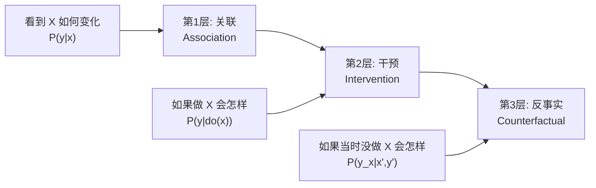

**第 1 层：关联**——你的模型能做什么
- 问题是：看到 X 和 Y 相关
- 逻辑回归告诉你"使用优惠券的客户流失率更低"，这是 P(churn|coupon)
- 陷阱：相关 ≠ 因果

**第 2 层：干预**——因果推断要回答的问题
- 问题是：如果做 X 会怎样？
- 你需要的是 P(churn|do(coupon))——"如果主动发放优惠券，流失率会怎样"
- 这需要因果识别策略（如随机对照试验）

**第 3 层：反事实**——因果推断的最高层级
- 问题是：如果当时没做 X 会怎样？
- 对同一个客户，计算"如果当时没发优惠券，他的流失概率会是多少"

小北的模型停留在第 1 层。他看到 P(churn|coupon) < P(churn|no coupon)，但这可能是混杂导致的——优惠券可能是发给高价值客户的，而这些客户本身就不会流失。

阿码这时插话："**如果我在回归里控制了所有变量，系数不就是因果效应了吗？**"

老潘摇头。"**问题是：你怎么知道该控制什么，不该控制什么？**"

他画了一个图：


"如果'高价值客户'（U）是你没观测到的变量，"老潘解释，"那么优惠券（C）和低流失率（L）相关，不是因为 C 导致 L，而是因为 U 同时影响两者——这是**混杂**。"

"但我在回归里控制了 'purchase_count' 和 'vip_status' 啊？"

"**你控制的是观测变量，但真正的混杂可能是未观测的**——比如客户的'购买意愿'，你没法直接测量。"

阿码突然意识到："**那模型里放了再多的变量，也不能保证因果效应？**"

"对。**因果推断不是'控制越多越好'，而是'控制对的变量'**。"老潘在白板上写下这周的终极问题，"如何在没有随机化的情况下识别因果效应？答案从下一节开始：先画因果图明确假设，再找识别策略。"

这正好呼应了 Week 09 学的**回归系数**：当时你学到回归系数描述的是"在控制其他变量不变的情况下，X 每增加 1 单位，Y 平均变化多少"。但这里有个隐性假设：你已经控制了所有混杂变量。如果存在未观测的混杂（比如"购买意愿"），回归系数就不能被解释为因果效应。

让我们用代码演示这个陷阱：

```python
import numpy as np
import pandas as pd
import statsmodels.formula.api as smf

np.random.seed(42)
n = 1000

# 未观测的混杂：高价值客户（U）
U = np.random.binomial(1, 0.3, n)  # 30% 是高价值客户

# 优惠券发放受 U 影响（高价值客户更容易收到优惠券）
C = np.random.binomial(1, 0.2 + 0.5 * U)  # 高价值客户 70% 概率收到

# 流失率受 U 影响（高价值客户流失率低）
# 假设优惠券真实因果效应是 0（没有效果）
L = np.random.binomial(1, 0.3 - 0.2 * U)  # 高价值客户 10% 流失率

df = pd.DataFrame({'coupon': C, 'churn': L, 'high_value': U})

# 错误的分析：只看 coupon 和 churn 的关系（没有控制 U）
model_naive = smf.logit("churn ~ coupon", data=df).fit()
print(f"【错误分析】coupon 系数: {model_naive.params['coupon']:.3f}")
# 结果可能是负数——看起来优惠券"降低"了流失率

# 正确的分析：控制混杂 U
model_correct = smf.logit("churn ~ coupon + high_value", data=df).fit()
print(f"【正确分析】coupon 系数: {model_correct.params['coupon']:.3f}")
# 结果接近 0——这才是真实的因果效应
```

运行这段代码，你会看到：
- **错误分析**：优惠券系数显著为负，看起来"降低"了流失率
- **正确分析**：控制高价值客户后，优惠券系数接近 0，真实因果效应是"没有效果"

这就是为什么**相关不等于因果**——混杂变量（高价值客户）让"收到优惠券"和"低流失率"产生了虚假关联。

所以这周的起点很清晰：**从"能预测"到"能回答因果问题"，你需要的不只是更大的模型，而是明确的因果假设和识别策略**。

---

## 2. 先画因果图——明确你的假设

小北一开始的做法很典型：直接把所有变量丢进回归，看到系数显著就下结论。

老潘拦住了他。"**在你跑模型之前，先回答一个问题：你觉得哪些变量会影响哪些？**"

小北愣住了。"这不是数据告诉我的吗？"

"**相关性可以来自数据，但因果性必须来自假设**。"老潘说，"你需要先画一张图，把你的假设写下来。"

---

### 用图说清楚"谁影响谁"——DAG 基础

**因果图（DAG，Directed Acyclic Graph）** 是一个有向无环图，节点是变量，箭头表示你认为的因果关系。

三个关键规则：
1. **箭头方向**：A → B 表示"A 导致 B"（这是你的假设，不是数据）
2. **无环**：不能有 A → B → ... → A 的循环（因果不会回到自己）
3. **明确假设**：因果图不是从数据中"发现"的，是你根据领域知识"假设"的

老潘特别强调第 3 点："**数据不会告诉你因果方向，只会告诉你相关性**。你看到 X 和 Y 相关，可能是 X → Y，可能是 Y → X，也可能是 Z → X 和 Z → Y。因果图是你根据领域知识做的假设，不是数据挖掘的结果。"

---

### 三种基本结构：这是本节的核心

老潘画出了因果图的三种基本结构，并说："**理解这三种结构，你就理解了因果推断的一半**。"

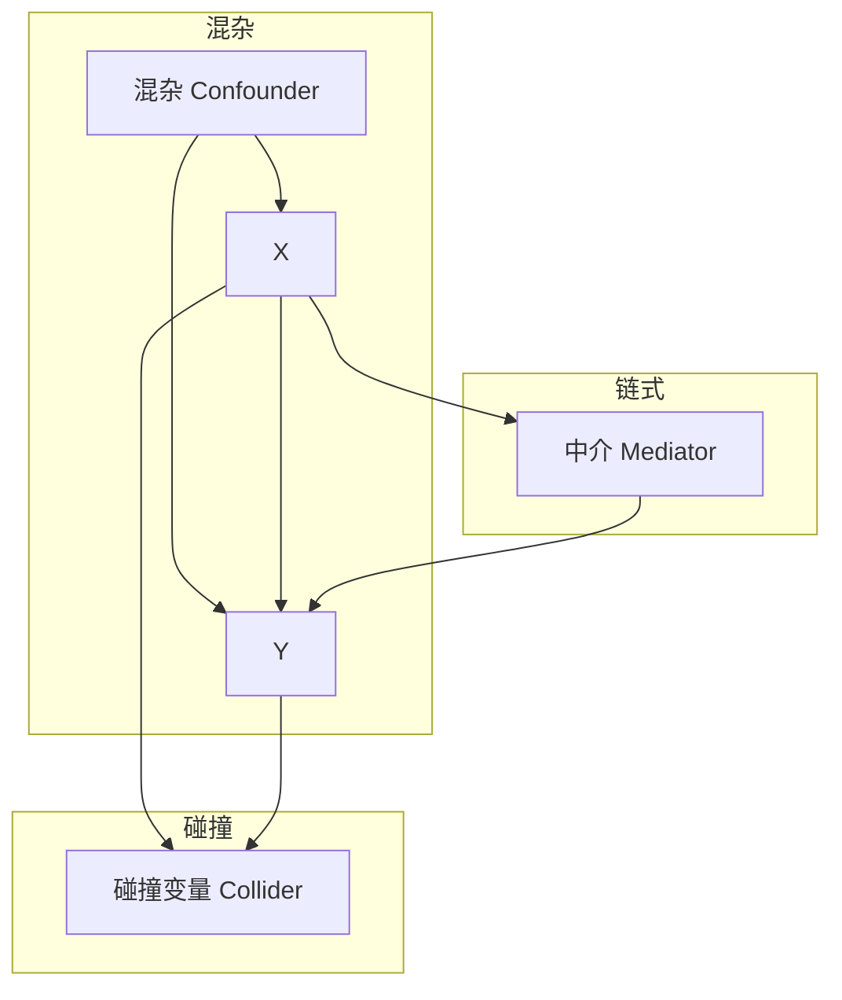

**1. 混杂**——需要控制的
- X 和 Y 的共同原因 Z
- 示例：高价值客户 → 发放优惠券，高价值客户 → 低流失率
- 如果你控制 Z（比如在回归里加入 Z），X 和 Y 的关联会消失（因为原本的"相关"是虚假的）
- **解决方法**：控制混杂变量（如果可观测）

**2. 碰撞**——绝对不要控制的
- X 和 Y 的共同结果 Z
- 示例：优惠券 → 客户满意，高消费 → 客户满意；客户满意是碰撞变量
- 如果你控制 Z，X 和 Y 会产生虚假关联（原本独立的 X 和 Y 变得相关了）
- 阿码问："为什么会这样？"老潘解释："如果你只看'满意的客户'，那么'收到优惠券'和'高消费'会负相关——因为如果你没收到优惠券但很满意，那你一定是高消费客户；如果你收到优惠券但也不满意，那你一定是低消费客户。这个'相关'是控制碰撞变量产生的假象。"

**3. 链式（中介）**——取决于你想回答的问题
- X 通过 M 影响 Y
- 示例：优惠券 → 购买次数增加 → 流失率降低
- **关键区分**：
  - 如果你想估计**总效应**（X 通过所有路径影响 Y），**不要控制 M**
  - 如果你想估计**直接效应**（X 不通过 M 直接影响 Y），**需要控制 M**
- **陷阱**：控制 M 会"屏蔽"掉 X 通过 M 影响 Y 的那部分效应

这三种结构正好对应 Week 07 学的**多重比较问题**的一个关键教训：在因果推断中，"控制更多变量"不等于"更好的因果识别"，反而可能引入新的偏差——特别是当你错误地控制了碰撞变量时。

---

### 画因果图的实践：让我们来试试

让我们为"优惠券降低流失率"这个问题画因果图：

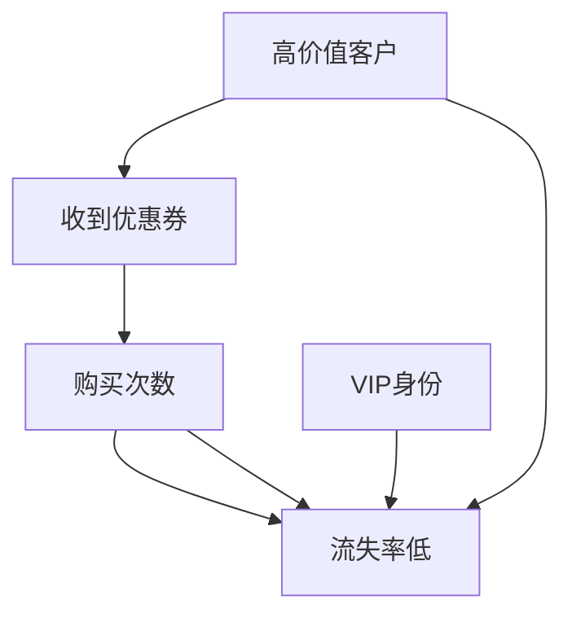

老潘解释："这个图里，'高价值客户'（H）是混杂——它同时影响'是否收到优惠券'（C）和'流失率'（L）。如果你不控制 H，C 和 L 的相关可能是虚假的。"

阿码这时问了一个很好的问题："**那我就把所有能观测的变量都放进因果图，不就解决了吗？**"

老潘笑了。"**问题是：你不知道哪些是混杂，哪些是碰撞，哪些是中介**。如果你把'客户满意'（碰撞变量）放进去并控制它，你会得到完全相反的结论。"

阿码突然来了精神："**等等，这有点像我在游戏里做选择——我以为是'最优策略'，结果发现那是'坏结局'的触发器**。"

小北这时有点紧张："**那我是不是永远无法确定因果？**"

"不是永远无法确定，而是需要**明确你的假设**。"老潘指着因果图，"你画了这个图，就意味着你在假设：'高价值客户'是混杂，'购买次数'是中介。如果这些假设错了，结论也会错。但至少你的假设现在是明确的，读者可以质疑、可以修正。"

"但问题是，**H 可能是不可观测的**——你怎么测量'高价值客户'？"

这引出了下一个问题：**如何在因果图中识别需要控制的变量？** 答案是：用 **d-分离** 和 **后门准则**。

---

> **AI 时代小专栏：AI 能发现因果吗？**

> 2026 年的 AI 圈有个有趣的现象：一边是大型语言模型（LLM）可以秒出"数据分析报告"，另一边是顶级科技公司（微软、Uber、谷歌）在疯狂招揽"因果推断科学家"。为什么？因为**AI 擅长发现相关，但不擅长回答因果**。
>
> **你的 LLM 能做什么，不能做什么？**
>
> 你让 ChatGPT 分析"优惠券和流失率的关系"，它能很快给你跑回归、算相关系数、生成漂亮的可视化。但它不会告诉你一个关键问题：**这个相关是因果，还是混杂导致的假象？**
>
> 就像 Judea Pearl 在《The Book of Why》中说的："相关性是语言的第一步，因果推断是语言的第二步——AI 还在第一步。"
>
> **"因果 AI"正在兴起**
>
> 不过，AI 领域也在追赶。微软的 **DoWhy**、Uber 的 **CausalML**、微软的 **EconML** 等开源库正在把因果推断算法工程化，让你能用代码估计因果效应、做敏感性分析、验证因果假设。
>
> 这些工具能做什么？
> - **自动识别因果路径**：给定因果图，自动判断需要控制哪些变量（d-分离）
> - **估计因果效应**：用倾向得分匹配、工具变量等方法估计因果效应
> - **敏感性分析**：如果存在未观测混杂，结论会如何变化？
>
> 但它们**不能做什么**：
> - **不能自动画因果图**：因果图必须由人类根据领域知识画（AI 可以从数据中发现"候选图"，但无法确定因果方向）
> - **不能验证假设**：因果推断的核心假设（如"工具变量外生性"）永远无法完全验证，只能由人类辩护
>
> **对你的启示**
>
> AI 可以加速因果推断的计算（如自动匹配、估计置信区间），但**因果假设必须由人类设定**。你本周学的因果图、d-分离、RCT 设计，是 AI 时代仍然需要的"人类判断力"。
>
> AI 告诉你"是什么"，但只有因果推断能告诉你"如果做了/没做会怎样"。这就是为什么顶级科技公司的数据科学家岗位描述里，"因果推断"正在成为和"机器学习"并列的核心技能。
>
> 参考（访问日期：2026-02-18）：
> - [DoWhy: Python Library for Causal Inference](https://github.com/py-why/dowhy)
> - [CausalML: Uplift Modeling and Causal Inference](https://github.com/uber/causalml)
> - [EconML by Microsoft Research](https://github.com/microsoft/EconML)

---

## 3. 如何识别因果路径？——d-分离与后门准则

阿码本周最大的困惑是："**我知道混杂需要控制，但怎么知道该控制什么？**"

"有三个变量 A、B、C，我怎么知道 C 是混杂还是碰撞？"

老潘的答案是："**用因果图 + d-分离**。"

### d-分离：判断独立性

**d-分离（d-separation）** 是因果图中的概念，用于判断两个变量是否在给定条件下独立。

这个名字听起来很技术，但直觉很简单：**"d-分离"就是"因果路径被阻断"**。

想象你在走迷宫：
- 如果从 X 到 Y 有一条通畅的路（没被阻断），X 和 Y 就相关
- 如果所有路都被堵死了，X 和 Y 就独立

三个基本规则（对应上一节的三种结构）：

1. **链式结构**（A → B → C）：像一座桥，控制 B（把桥断了），A 和 C 就不连通了
2. **混杂结构**（A ← B → C）：像两条支流汇入同一条河，控制 B（堵住河口），A 和 C 的关联就断了
3. **碰撞结构**（A → B ← C）：这是反直觉的一个！控制 B 反而会"打开"一条假的路——像把两个原本不相关的球队强行放在一起比较，你会看到"负相关"（一个赢了另一个就得输），但这不是因为它们互相影响，而是因为你控制了比赛结果

示例：

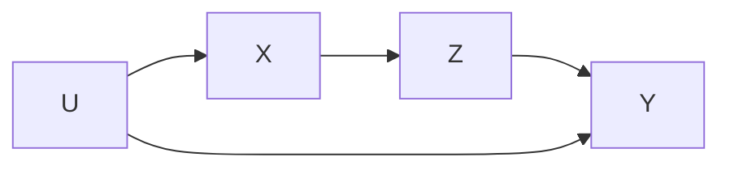

- X 和 Y 之间的"后门路径"：X ← U → Y（通过混杂 U）
- 如果控制 U，X 和 Y 在这条路径上独立（d-分离）
- 前门路径：X → Z → Y（通过中介 Z）

### 后门准则：识别因果效应

**后门准则（Backdoor Criterion）** 是 Judea Pearl 提出的方法，用于判断"控制哪些变量可以识别因果效应"。

**定义**：对于 X → Y，如果满足以下条件，则控制变量集 Z 可以识别因果效应：
1. Z 没有包含 X 的后代（不是中介或碰撞变量）
2. 控制 Z 后，X 和 Y 之间的所有"后门路径"都被阻断（d-分离）

示例：

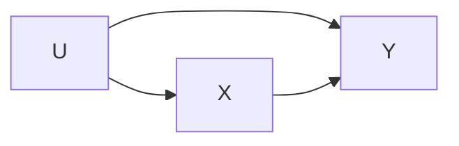

- 后门路径：X ← U → Y
- 如果控制 U，这条路径被阻断
- 因此，控制 U 后，X 和 Y 的关联就是因果效应

---

### 实践：识别"优惠券 → 流失率"的因果路径

让我们用因果图分析：

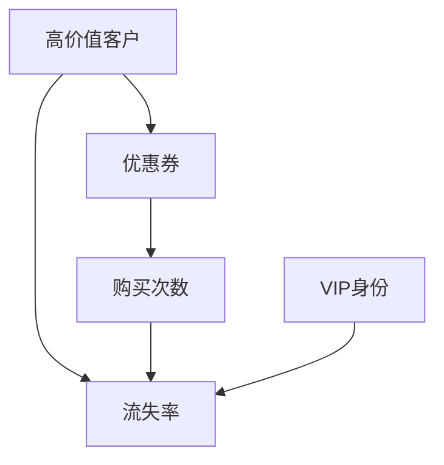

**问题**：估计 C → L 的因果效应，需要控制什么？

**步骤 1：找后门路径**
- 路径 1：C ← H → L（混杂路径，需要控制 H）
- 路径 2：C → P → L（前门路径，不需要控制，这是中介机制）
- 路径 3：C ← H → P → L（如果控制 H，这条路径也会被阻断）

**步骤 2：应用后门准则**
- 需要控制 H（高价值客户）
- 但问题是：H 可能不可观测

**步骤 3：找代理变量**
- 如果 H 不可观测，可以尝试用可观测变量代理（如 'purchase_count', 'vip_status'）
- 但代理不完美——如果代理不能完全捕捉 H，仍然会有剩余混杂

---

### 控制错误的变量：碰撞变量的陷阱

老潘用一个实验说明"控制错误的变量会破坏因果识别"：

```python
import numpy as np
import pandas as pd
import statsmodels.formula.api as smf

# 模拟数据
np.random.seed(42)
n = 1000

X = np.random.binomial(1, 0.5, n)  # 是否收到优惠券
Y_potential_0 = np.random.binomial(1, 0.3, n)  # 未收到优惠券时的流失率
Y_potential_1 = np.random.binomial(1, 0.25, n)  # 收到优惠券时的流失率
Y = np.where(X == 1, Y_potential_1, Y_potential_0)  # 实际流失率

# 碰撞变量：客户满意（受 X 和 Y 影响）
# X=1（收到优惠券）时更可能满意，Y=0（未流失）时也更可能满意
S_prob = 0.2 + 0.3 * X + 0.3 * (1 - Y)
S = np.random.binomial(1, S_prob)

df = pd.DataFrame({'X': X, 'Y': Y, 'S': S})

# 错误：控制碰撞变量 S
model_wrong = smf.logit("Y ~ X + S", data=df).fit()
print(model_wrong.summary())
```

结果：`X` 的系数变正了！

这个结果有点反直觉：我们知道优惠券实际上降低了流失率（从 30% 降到 25%），但控制"客户满意"之后，模型竟然告诉你"优惠券增加了流失率"。

老潘解释："**客户满意（S）的概率由 X 和 Y 共同决定——收到优惠券（X=1）或未流失（Y=0）都会提高满意度。控制 S 之后，X 和 Y 产生了虚假关联：如果你看到某人满意，那么'他收到优惠券但流失了'（不寻常）和'他没收到优惠券但未流失'（也不寻常）会形成负相关，导致系数符号反转**。"

这就是碰撞变量的陷阱：**控制它之后，原本独立的变量产生了虚假关联**。

小北看到这个结果，倒吸一口凉气："**那我之前做的分析，是不是全错了？**"

阿码忍不住插话："等等，这有点像那个'选择性偏差'的例子——如果你只看'成功的企业'，你会发现'冒险的决策'和'失败'负相关，但这只是因为失败的企业根本不在你的样本里。"

"别慌。"老潘安慰道，"**关键不是'我错了'，而是'我知道哪里可能错'**。用因果图的好处是：你能明确地说出'我的假设是什么'，然后让别人来挑战这些假设。"

老潘解释："**客户满意（S）是 X 和 Y 的碰撞变量——受 X 和 Y 共同影响。如果你控制 S，X 和 Y 会产生虚假关联**。这就是为什么'控制一切'是错误策略——你需要用因果图判断该控制什么，不该控制什么。"

这正好呼应了 Week 07 学的**多重比较问题**：在因果推断中，"控制更多变量"不等于"更好的因果识别"，反而可能引入新的偏差——特别是当你错误地控制了碰撞变量时。

---

### d-分离快速练习

老潘在白板上画了三个因果图，让小北判断："X 和 Y 是否独立？如果控制 Z，独立性会改变吗？"

> **💡 先记住这张表**——它是判断 d-分离的"作弊码"：
>
> | 结构 | 不控制 Z | 控制 Z | 口诀 |
> |------|---------|--------|------|
> | 链式 X→Z→Y | 相关（路径通） | **独立**（路断了） | "断桥" |
> | 混杂 X←Z→Y | 相关（后门开） | **独立**（后门关） | "堵后门" |
> | 碰撞 X→Z←Y | **独立**（无路径） | **相关**（假路开） | "开假门" ⚠️ |

**练习 1：链式结构**

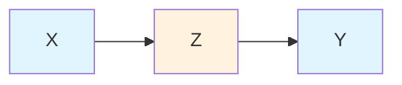

- 不控制 Z：X 和 Y 是否独立？
- 控制 Z 后：X 和 Y 是否独立？

小北想了想："不控制的话，X 可以通过 Z 影响 Y，所以相关。控制 Z 后，路径断了，X 和 Y 独立。"

"对。"老潘说，"这就像打电话——如果你切断中间的电话线，两边就无法沟通。"

> **🔑 关键点**：链式结构中，Z 是"传话人"。控制 Z = 切断信息传递。

**练习 2：混杂结构**

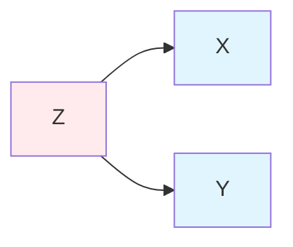

- 不控制 Z：X 和 Y 是否独立？
- 控制 Z 后：X 和 Y 是否独立？

阿码抢答："不控制的话，Z 同时影响 X 和 Y，所以 X 和 Y 会有虚假相关。控制 Z 后，这条'后门路径'被堵住了，X 和 Y 独立。"

"完美。"老潘点头，"这正是我们做'控制变量'的原因——堵住后门路径。"

> **🔑 关键点**：混杂结构中，Z 是"幕后黑手"。控制 Z = 揪出幕后黑手，X 和 Y 的虚假关联就消失了。

**练习 3：碰撞结构（陷阱！）**

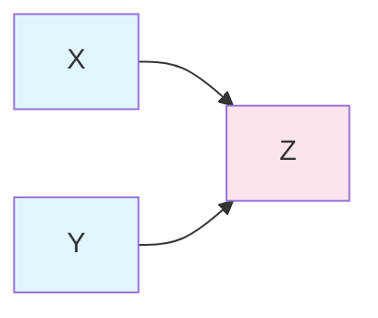

- 不控制 Z：X 和 Y 是否独立？
- 控制 Z 后：X 和 Y 是否独立？

小北刚想说"一样"，突然停住了。"等等……这是碰撞结构。Z 是 X 和 Y 的共同结果。"

"对。"老潘说，"想象 X 是'天气'，Y 是'是否感冒'，Z 是'是否打喷嚏'。天气和感冒本身没有因果关系，但如果你只看'打喷嚏的人'，你会发现天气和感冒负相关——因为打喷嚏要么因为天气不好，要么因为感冒了。"

"**结论**：不控制 Z 时，X 和 Y 独立；控制 Z 后，X 和 Y 反而产生了虚假关联！"

阿码感叹："所以碰撞变量是'反着来'的——控制它反而会出问题。"

> **⚠️ 警告**：碰撞结构是因果推断中最大的陷阱！
> - 原本独立的两个变量，控制碰撞变量后会产生**虚假相关**
> - 这就是为什么"控制一切"是错误的——你可能在不知不觉中控制了碰撞变量

"这就是为什么因果推断必须先画图。"老潘总结，"如果你不知道哪个是混杂、哪个是碰撞，'控制一切'就是给自己挖坑。"

---

> **AI 时代小专栏：A/B 测试——互联网公司的因果推断实践**

> 2026 年，几乎所有大型互联网公司都有"实验平台"（Experimentation Platform）。Google 每年运行超过 10,000 次 A/B 测试，Netflix 和 Meta 也都有专门的实验团队。A/B 测试是因果推断在工业界最成功的应用——它本质上就是把医学 RCT 的思想搬到互联网产品上。
>
> **A/B 测试的本质：把用户随机分组**
>
> | 传统 RCT（医学） | 互联网 A/B 测试 |
> |---------|---------------|
> | 随机分配药物/安慰剂 | 随机分配旧版/新版功能 |
> | 双盲实验 | 用户不知道被分到哪一组 |
> | 临床终点（如生存率） | 点击率、转化率、留存率 |
> | 医学期刊发表 | 内部工具 + 数据驱动决策 |
>
> **为什么 A/B 测试这么流行？**
>
> 因为它**切断了所有混杂路径**。随机化确保实验组和对照组在所有观测和未观测变量上都相似（平均而言）。所以两组的差异只能是 Treatment 导致的——这就是因果效应。
>
> 这比观察研究（如"比较使用优惠券和不使用优惠券的用户"）可靠得多，因为观察研究总是存在"自我选择偏差"（比如使用优惠券的用户可能本身就是高价值客户）。
>
> **A/B 测试不是万能的**
>
> 老潘在公司里经常强调这一点：
>
> 1. **网络效应**：在社交产品中，用户会互相影响。如果 A 组用户看到新功能并告诉 B 组用户，B 组的行为也会变化，这违反了 RCT 的 SUTVA 假设
> 2. **长期效应**：A/B 测试通常只能测短期效应（几天到几周），但某些效应需要几个月才能显现（如"用户疲劳"）
> 3. **伦理问题**：某些实验可能有争议（如"向部分用户展示更贵的定价"）
> 4. **成本**：不是所有公司都有资源做大规模 A/B 测试
>
> **开源工具让 A/B 测试更易实施**
>
> 过去，只有 Google、Amazon 这样的巨头才有成熟的实验平台。现在，开源工具如 **GrowthBook**、**PostHog** 让任何公司都能搭建自己的实验平台。
>
> GrowthBook 提供了：
> - 特性标志（Feature Flags）管理
> - A/B 测试随机化
> - 统计分析（包括 CUPED、Sequential testing、Bayesian 方法）
> - 与现有数据栈集成（BigQuery、Mixpanel 等）
>
> **对你的启示**
>
> A/B 测试是因果推断的"金标准"，但它不是万能的。你本周学的 RCT 设计、混杂控制、观察研究方法，是理解 A/B 测试何时有效、何时失效的基础。
>
> AI 可以加速实验分析（如自动计算样本量、检测 SRM），但**实验设计需要因果推断思维**：你需要知道随机化为什么有效、何时会失效、如何用观察研究方法弥补 A/B 测试的局限。
>
> 参考（访问日期：2026-02-18）：
> - [GrowthBook: Open Source Feature Flagging and A/B Testing Platform](https://github.com/growthbook/growthbook)
> - [PostHog: Open Source Product Analytics](https://github.com/PostHog/posthog)
> - [Netflix Tech Blog - Experimentation](https://netflixtechblog.com/)

---

## 4. 随机对照试验：为什么是"金标准"？

小北问："**为什么要搞这么复杂？直接做实验不行吗？**"

老潘点头："**随机对照试验（RCT）确实是因果推断的'金标准'——如果你能做 RCT，那就做 RCT**。"

为什么？因为**随机化切断了所有混杂路径**。

---

### 随机化的魔法：切断混杂路径

RCT 的核心是**随机化**：

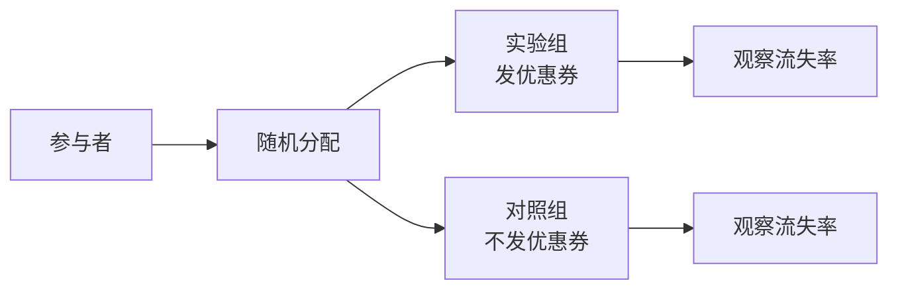

**为什么随机化有效？**

随机化之后，无论观测的还是未观测的混杂变量，在实验组和对照组之间分布相同（平均而言）。因此，两组的差异（平均而言）只能由 Treatment（发优惠券）导致。

用数学语言说：在 RCT 中，**关联 = 因果**（E[Y|X=1] - E[Y|X=0] = E[Y|do(X=1)] - E[Y|do(X=0)]）。这正是上一节我们讲的"干预层"和"关联层"在 RCT 中重合了。

这正好呼应了 Week 08 学的**点估计与区间估计**：当时你学到点估计（如均值差）只是一个数字，区间估计可以告诉你这个数字的不确定性。在 RCT 中，你估计的因果效应也是一个点估计——但它比观察研究的点估计更可信，因为随机化消除了混杂。你同样可以用 Bootstrap 或置换检验来构造置信区间，量化这个因果效应的不确定性。

这正好解决了小北一开始的问题：**如果优惠券是随机发放的，那么"使用优惠券的客户流失率更低"就是因果结论，而不是混杂导致的假象**。

---

### RCT 的假设

RCT 有效需要满足以下假设：

| 假设 | 含义 | 如何检查 |
|------|------|---------|
| **随机化成功** | 实验组和对照组在基线特征上平衡 | 比较两组的基线均值（t检验） |
| **SUTVA** | 个体的 Treatment 不影响其他人 | 在社交产品中很难满足 |
| **依从性（Compliance）** | 实验组真的接受了 Treatment，对照组没有 | 检查"实际接受 Treatment"的比例 |
| **无流失偏差（Attrition Bias）** | 流失（退出实验）在两组间随机 | 比较两组的流失率 |

小北问："如果随机化失败了怎么办？"

"那就用**协变量调整**（Covariate Adjustment）——在分析时控制基线特征不平等的变量。"老潘解释，"但注意：**随机化后控制变量是为了提高精度，不是为了消除混杂**（因为随机化已经切断了混杂）。"

这呼应了 Week 06 学的**假设检验**：你可以用 t 检验检查实验组和对照组的基线特征是否平衡。如果 p 值很小，说明随机化可能失败了，需要在分析时控制这些变量。

---

### RCT 的局限

阿码问："**既然 RCT 这么好，为什么不什么都用 RCT？**"

老潘列举了 RCT 的局限：

| 局限 | 示例 |
|------|------|
| **成本高** | 医学 RCT 可能需要数百万美元 |
| **伦理问题** | 不能随机让人"吸烟"来测试吸烟是否致癌 |
| **时间限制** | 教育干预的长期效应需要数年追踪 |
| **外部有效性** | 实验室的结论可能推广不到真实世界 |
| **SUTVA 违反** | 社交产品中，用户行为会互相影响（网络效应） |

"所以，**RCT 是金标准，但不是万能的**。"老潘总结，"当你不能做 RCT 时，你需要用观察研究中的因果推断方法——双重差分、工具变量、倾向得分匹配等。这些方法是我们下一节的主题。"

---

## 5. 观察研究中的因果推断——当 RCT 不可行时

小北本周最后的问题是："**公司不可能对所有决策都做 A/B 测试，有些决策已经实施了，怎么事后评估因果效应？**"

老潘的答案是："**观察研究中的因果推断**——用统计方法逼近因果答案。"

这节我们介绍两个最常用的方法：双重差分（DID）和工具变量（IV）。

---

### 方法 1：双重差分（DID）

**双重差分** 是公共政策评估中最常用的方法，其思想是：比较"实验组的前后变化"和"对照组的前后变化"之差。

示例：公司在某城市试点"发放优惠券"政策，其他城市没有试点。你想评估这个政策的因果效应。

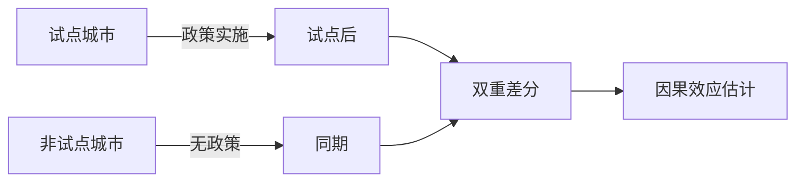

**DID 的直觉**：假设试点城市和非试点城市在政策前的趋势相同（平行趋势假设），那么政策后的差异就可以归因于政策。

**DID 的公式**：
```
因果效应 = (实验组_后 - 实验组_前) - (对照组_后 - 对照组_前)
```

**具体例子**：假设你想评估"优惠券政策"对流失率的影响。
- 实验组（试点城市）：政策前流失率 30%，政策后 20%（变化 = -10%）
- 对照组（非试点城市）：政策前流失率 30%，政策后 25%（变化 = -5%）
- **DID 估计的因果效应** = (-10%) - (-5%) = **-5%**

解释：试点城市的流失率比非试点城市**多降了 5%**，这个"额外的下降"可以归因于优惠券政策（前提是平行趋势假设成立）。

小北皱了皱眉："**这样做可靠吗？万一试点城市和非试点城市本来就不一样呢？**"

"敏锐！"老潘赞许道，"这正是 DID 方法的核心假设——**平行趋势**。如果政策前试点城市流失率已经在快速下降，而非试点城市保持稳定，那'额外的 5%'可能只是延续之前的趋势，和优惠券无关。"

阿码接过话："所以我们必须先检查政策前的趋势是否平行？"

```python
# DID 的简化实现（用回归更稳健）
import statsmodels.formula.api as smf

# 数据格式：每个观测包含城市、时间（前/后）、是否试点、流失率
model_did = smf.ols("churn_rate ~ is_treated * after_policy + city_fixed_effects + time_fixed_effects", data=df).fit()

# is_treated * after_policy 的系数就是 DID 估计的因果效应
print(model_did.summary())
```

小北问："**怎么检查平行趋势假设？**"

"**画图**。"老潘说，"把实验组和对照组在政策前的时间序列画出来，看它们的趋势是否平行。如果政策前趋势就不平行，DID 会失效。"

---

### 真实世界案例：疫情期间的政策评估

老潘打开了一个真实案例："2020 年，很多国家实施了封锁政策来控制疫情。经济学家们用 DID 来评估这些政策的因果效应。"

**研究问题**：封锁政策真的减少了新冠传播吗？

**DID 设计**：
- **实验组**：瑞典（没有实施严格封锁）
- **对照组**：邻国挪威、丹麦（实施了严格封锁）

等等——这里有个问题。"谁是谁的对照组？"阿码问。

"好问题。"老潘说，"这个例子其实是'反向 DID'——我们比较'没做干预的'和'做了干预的'。关键假设是：如果没有政策差异，这些北欧国家的疫情趋势应该相同。"

**结果**：研究发现瑞典的死亡率明显高于邻国——这被解释为"封锁政策有效"的证据。

**但老潘指出了局限性**：
1. **平行趋势假设可能不满足**：瑞典的医疗体系、人口密度、社交习惯与邻国本来就不同
2. **其他混杂因素**：瑞典可能实施了其他非封锁措施（如建议居家、限制集会规模）
3. **溢出效应**：邻国的封锁可能减少了跨境传播，间接保护了瑞典

"这就是因果推断的现实——**没有完美的 RCT，只能在假设下做最好的估计**。"老潘说，"关键是：你在报告里必须写清楚你的假设是什么，让读者自己判断。"

小北若有所思："所以因果推断不只是技术，也是'诚实地表达不确定性'？"

"对。"老潘说，"**最好的因果推断不是'确定的答案'，而是'明确的假设 + 透明的估计'**。"

---

### 方法 2：工具变量（IV）

**工具变量** 是另一种观察研究中的因果推断方法，用于解决"未观测混杂"的问题。

**工具变量（Z）需要满足三个条件**：
1. **相关性**：Z 和 Treatment（X）相关
2. **外生性**：Z 和 Outcome（Y）的混杂不相关
3. **排他性**：Z 只能通过 X 影响 Y（没有直接路径）

示例：你想研究"教育（X）对收入（Y）的因果效应"，但存在"能力（U）"这个未观测混杂（能力强的人教育水平高，收入也高）。

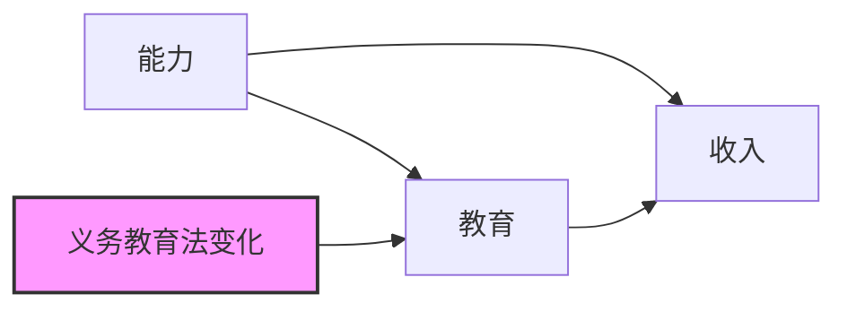

**工具变量 Z**："义务教育法变化"（如从 9 年延长到 12 年）
- 相关性：义务教育法变化影响了教育水平
- 外生性：法律变化和个人能力无关
- 排他性：法律变化只能通过教育影响收入（假设成立）

**IV 估计**：
```python
# 两阶段最小二乘法（2SLS）
# 第一阶段：用 Z 预测 X
first_stage = smf.ols("education ~ compulsory_law_change + controls", data=df).fit()
df['education_pred'] = first_stage.predict(df)

# 第二阶段：用预测的 X 预测 Y
second_stage = smf.ols("income ~ education_pred + controls", data=df).fit()
print(second_stage.summary())
```

阿码问："**怎么找工具变量？**"

"**这是 IV 方法最大的难点**。"老潘说，"好的工具变量通常来自'自然实验'（Natural Experiment）——如政策变化、地理差异、历史事件等。但'外生性'和'排他性'永远无法完全验证，只能辩护。"

---

### 观察研究的局限：永远只是"近似"

老潘最后总结了观察研究中因果推断的局限：

| 方法 | 核心假设 | 如何验证 | 局限 |
|------|---------|---------|------|
| **DID** | 平行趋势 | 画前政策趋势图 | 如果趋势不平行，失效 |
| **IV** | 工具变量外生 + 排他性 | 无法完全验证，只能辩护 | 好的工具变量很难找 |
| **PSM（倾向得分匹配）** | 倾向得分模型正确 | 检查匹配后平衡性 | 只控制观测变量，未观测混杂仍存在 |

"**观察研究的因果推断永远是'近似'，不是'精确'**。"老潘总结，"你需要明确报告：你的假设是什么，这些假设是否合理，结果的稳健性如何。"

这正好呼应了本周的核心主题：**因果推断不是"发现真相"，而是"明确假设"**。你用因果图把假设写下来，用 DID/IV 等方法逼近因果答案，但永远要记得：这些结论依赖于你假设的正确性。

---

## StatLab 进度

到目前为止，StatLab 已经有完整的建模流程和可解释性报告。但老潘指出一个"隐性假设"：我们只报告了"相关性发现"（如"使用优惠券的客户流失率更低"），没有区分这是相关还是因果。

这正是本周"因果推断"派上用场的地方。**本周的 StatLab 进展，是将"相关性报告"升级为"因果性报告"——从"我们发现了什么"到"我们能回答什么"**。

### 第一步：画因果图，明确假设

首先，我们用 NetworkX 创建因果图的核心骨架：

```python
# examples/13_causal_diagram.py
import matplotlib.pyplot as plt
import networkx as nx
from pathlib import Path

def build_causal_dag():
    """构建因果图的基础结构"""
    G = nx.DiGraph()

    # 添加节点和边（基于领域知识，不是从数据中"发现"）
    edges = [
        ('high_value_customer', 'coupon'),      # 混杂：高价值客户更容易收到优惠券
        ('high_value_customer', 'churn'),       # 混杂：高价值客户流失率更低
        ('coupon', 'purchase_count'),           # 中介：优惠券增加购买次数
        ('purchase_count', 'churn'),            # 中介：购买次数降低流失率
        ('vip_status', 'churn'),                # 直接效应：VIP 流失率更低
        ('days_since_last_purchase', 'churn'),  # 直接效应：越久没买越可能流失
    ]
    G.add_edges_from(edges)
    return G
```

然后，添加可视化并标注关键的混杂变量：

```python
def draw_causal_dag():
    """画因果图：优惠券对流失率的影响"""
    G = build_causal_dag()

    plt.figure(figsize=(10, 6))
    pos = nx.spring_layout(G, seed=42)
    nx.draw(G, pos, with_labels=True, node_size=3000,
            node_color='lightblue', arrowsize=20, font_size=10)

    # 标注混杂变量（这是因果识别的关键）
    plt.text(0.05, 0.95, '混杂变量: high_value_customer (可能不可观测)',
             transform=plt.gca().transAxes, fontsize=10,
             bbox=dict(boxstyle='round', facecolor='wheat', alpha=0.5))

    plt.title('因果图：优惠券对流失率的影响', fontsize=14)
    plt.tight_layout()
    Path('output').mkdir(exist_ok=True)
    plt.savefig('output/causal_dag.png', dpi=150, bbox_inches='tight')
    plt.close()
    return 'output/causal_dag.png'
```

老潘看到这段代码会说："**这才是因果推断的正确起手式**。不是跑模型，而是先画图明确假设。"

### 第二步：识别因果路径和混杂

```python
def identify_backdoor_paths(treatment, outcome, dag_edges):
    """
    识别后门路径（需要控制的混杂路径）

    这是一个简化示例，实际应使用因果推断库如 dowhy
    """
    # 手动分析（基于上面的 DAG）
    backdoor_paths = {
        'coupon -> churn': [
            'coupon <- high_value_customer -> churn',  # 混杂路径
        ]
    }

    confounders_to_control = ['high_value_customer']  # 需要控制，但可能不可观测

    # 代理变量（如果混杂不可观测）
    proxy_variables = ['purchase_count', 'vip_status']

    return {
        'backdoor_paths': backdoor_paths,
        'confounders': confounders_to_control,
        'proxies': proxy_variables,
        'note': 'high_value_customer 可能不可观测，使用代理变量不完美'
    }
```

### 第三步：估计因果效应（倾向得分匹配示例）

倾向得分匹配分三步走。首先是估计倾向得分：

```python
from sklearn.linear_model import LogisticRegression
from sklearn.neighbors import NearestNeighbors

def estimate_propensity_scores(df, treatment_col, covariates):
    """
    第一步：估计倾向得分 P(T=1|X)
    即"给定特征下，收到优惠券的概率"

    注意：
    - 需要满足 positivity 假设：每个样本都有非零概率接受处理
    - 如果某些协变量组合下违反 positivity（如所有高价值客户都收到优惠券），
      需要检查数据或考虑其他方法
    """
    ps_model = LogisticRegression(max_iter=1000, random_state=42)
    ps_model.fit(df[covariates], df[treatment_col])
    df['propensity_score'] = ps_model.predict_proba(df[covariates])[:, 1]
    return df, ps_model
```

然后用倾向得分进行匹配：

```python
def match_by_propensity_score(df, treatment_col='coupon'):
    """
    第二步：1:1 最近邻匹配
    为每个处理组个体找一个倾向得分最接近的对照组个体
    """
    treated = df[df[treatment_col] == 1]
    control = df[df[treatment_col] == 0]

    nn = NearestNeighbors(n_neighbors=1)
    nn.fit(control[['propensity_score']])
    distances, indices = nn.kneighbors(treated[['propensity_score']])

    matched_control = control.iloc[indices.flatten()]
    return treated, matched_control
```

最后计算因果效应：

```python
def compute_average_treatment_effect(treated, matched_control, outcome_col='churn'):
    """
    第三步：计算平均处理效应（ATE）
    """
    treated_outcome = treated[outcome_col].mean()
    matched_control_outcome = matched_control[outcome_col].mean()
    ate = treated_outcome - matched_control_outcome

    return {
        'ATE': ate,
        'treated_outcome': treated_outcome,
        'control_outcome': matched_control_outcome,
        'matched_pairs': len(treated)
    }

def propensity_score_matching(df, treatment_col='coupon', outcome_col='churn',
                               covariates=None):
    """完整的倾向得分匹配流程"""
    if covariates is None:
        covariates = ['purchase_count', 'vip_status', 'days_since_last_purchase']

    df, ps_model = estimate_propensity_scores(df, treatment_col, covariates)
    treated, matched_control = match_by_propensity_score(df, treatment_col)
    results = compute_average_treatment_effect(treated, matched_control, outcome_col)
    results['propensity_score_model'] = ps_model
    return results
```

### 第四步：区分"相关性发现"和"因果性结论"

```python
def generate_causal_inference_report(df, treatment, outcome, causal_dag_img,
                                     psm_results, output_file='output/causal_report.md'):
    """
    生成因果推断报告：区分相关和因果
    """
    md = ["## 因果推断分析\n\n"]

    # 1. 因果图
    md.append("### 因果图（假设）\n\n")
    md.append(f"\n\n")
    md.append("**假设说明**:\n")
    md.append("- 箭头表示我们认为的因果关系\n")
    md.append("- '高价值客户' 是混杂变量（同时影响'是否收到优惠券'和'流失率'）\n")
    md.append("- 如果'高价值客户'不可观测，因果效应识别存在局限\n\n")

    # 2. 相关性发现
    md.append("### 相关性发现（观察数据）\n\n")
    correlation = df[[treatment, outcome]].corr().iloc[0, 1]
    md.append(f"- {treatment} 和 {outcome} 的相关系数: {correlation:.3f}\n")

    from scipy.stats import chi2_contingency
    contingency = pd.crosstab(df[treatment], df[outcome])
    chi2, p_value, _, _ = chi2_contingency(contingency)
    md.append(f"- 卡方检验 p 值: {p_value:.4f}\n")
    md.append(f"- **结论**: {treatment} 和 {outcome} 在观察数据中显著相关\n\n")

    # 3. 因果性结论（如果可用）
    md.append("### 因果性结论（需谨慎）\n\n")
    md.append("**方法**: 倾向得分匹配（PSM）\n\n")

    if psm_results:
        md.append(f"- **平均处理效应（ATE）**: {psm_results['ATE']:.3f}\n")
        md.append(f"- 处理组（收到优惠券）的{outcome}率: {psm_results['treated_outcome']:.3f}\n")
        md.append(f"- 对照组（匹配后）的{outcome}率: {psm_results['control_outcome']:.3f}\n\n")

        md.append("**局限性**:\n")
        md.append("- 倾向得分匹配只能控制观测变量，未观测混杂（如'购买意愿'）仍存在\n")
        md.append("- 匹配质量依赖于倾向得分模型的正确性\n")
        md.append("- **最优方法**: 随机对照试验（RCT/A/B 测试）\n\n")

    # 4. 你能回答什么，不能回答什么
    md.append("### 我们能回答什么，不能回答什么\n\n")
    md.append("| 问题 | 能回答吗？ | 原因 |\n")
    md.append("|------|-----------|------|\n")
    md.append(f"| {treatment} 和 {outcome} 相关吗？ | ✅ 能 | 观察数据可以回答 |\n")
    md.append(f"| 发放{treatment}会降低{outcome}吗？ | ⚠️ 部分能 | 需要更强的因果识别策略（如 RCT） |\n")
    md.append(f"| 如果不发放{treatment}，{outcome}会怎样？ | ❌ 不能 | 需要反事实推断（更高层级） |\n\n")

    # 5. 建议的因果识别策略
    md.append("### 建议的因果识别策略\n\n")
    md.append("**1. 随机对照试验（RCT）——金标准**\n")
    md.append("- 随机分配客户是否收到优惠券\n")
    md.append("- 比较实验组和对照组的流失率\n")
    md.append("- 成本较高，但因果识别最可靠\n\n")

    md.append("**2. 准实验（Quasi-Experiment）——次优选择**\n")
    md.append("- 利用自然实验（如政策变化、地理差异）\n")
    md.append("- 双重差分（DID）、断点回归（RDD）、工具变量（IV）\n")
    md.append("- 需要更强的假设，但比纯观察研究可靠\n\n")

    md.append("**3. 观察研究 + 敏感性分析**\n")
    md.append("- 倾向得分匹配（PSM）、分层调整\n")
    md.append("- 必须报告局限性：未观测混杂可能存在\n")
    md.append("- 敏感性分析：如果存在未观测混杂，结论会如何变化？\n\n")

    Path('output').mkdir(exist_ok=True)
    report = "".join(md)
    Path(output_file).write_text(report)

    return report
```

### 使用示例

```python
import pandas as pd
import pickle

# 加载数据（假设从之前的周加载）
df = pd.read_csv('data/customer_churn.csv')

# 1. 画因果图
dag_img = draw_causal_dag()

# 2. 识别因果路径
identification = identify_backdoor_paths('coupon', 'churn', None)

# 3. 估计因果效应（PSM）
psm_results = propensity_score_matching(
    df,
    treatment_col='coupon',
    outcome_col='churn',
    covariates=['purchase_count', 'vip_status', 'days_since_last_purchase']
)

# 4. 生成报告
report = generate_causal_inference_report(
    df,
    treatment='coupon',
    outcome='churn',
    causal_dag_img=dag_img,
    psm_results=psm_results
)

print("因果推断报告已保存到 output/causal_report.md")
```

---

### 与本周知识的连接

**因果推断三层级** → 你学会了区分"关联"、"干预"、"反事实"。你知道模型能回答 P(y|x)（关联），但因果问题需要 P(y|do(x))（干预）。

**因果图** → 你学会了画 DAG 明确假设，识别混杂、碰撞、链式结构。你知道因果图不是从数据中发现的，而是根据领域知识假设的。

**d-分离与后门准则** → 你学会了判断需要控制哪些变量。你理解了"控制一切"是错误策略——控制碰撞变量会引入虚假相关。

**RCT 金标准** → 你理解了为什么随机化是因果推断的金标准：它切断了所有混杂路径。你也理解了 RCT 的局限：成本、伦理、时间限制。

**观察研究中的因果推断** → 你学会了 DID、IV、PSM 等方法。你理解了这些方法都是"近似"，需要更强的假设，结果需要谨慎解释。

### 与上周的对比

| 上周 | 本周 |
|------|------|
| 模型可解释性（SHAP 值） | 因果推断（因果图、RCT） |
| 解释"为什么这个预测" | 回答"如果做了/没做会怎样" |
| 整体指标 + 分组公平性 | 相关性发现 vs 因果性结论 |
| 技术报告 | 因果假设明确化 |
| "模型能预测" | "模型能回答因果问题吗" |

老潘看到这段改动会说什么？"**这才是完整的分析报告**。你不仅告诉了读者'发现了什么'，还解释了'这是相关还是因果'、'因果识别的假设是什么'、'结果的局限是什么'。"

阿码插话："**但业务方可能不想看这么多'局限性'，他们只想要一个明确的数字**。"

老潘笑了："**那就给他们两个数字：一个是'相关性的发现'，一个是'因果性的估计（如果假设成立）'。让他们自己决定敢不敢用**。"

小北问："真的要画因果图吗？"

"**如果你要回答因果问题，因果图是必须的**。"老潘说，"它不是'可选的附加功能'，而是'因果推断的前提'——没有因果图，你的因果假设就是黑盒，读者（和你自己）都不知道假设是什么。"

---

## Git 本周要点

本周必会命令：
- `git status`（查看新增的因果图、因果推断报告）
- `git diff`（对比上周的"相关性报告"和本周的"因果性报告"）
- `git add -A`（添加所有变更）
- `git commit -m "feat: add causal inference analysis and DAG"`（提交因果推断模块）

常见坑：
- 把"回归系数"直接当成"因果效应"，忽略混杂问题
- 在回归中控制了碰撞变量，引入虚假相关
- 认为控制了观测变量就等于消除了一切混杂（未观测混杂仍存在）
- 在报告中不区分"相关性发现"和"因果性结论"
- 画因果图时混淆了混杂和碰撞，导致错误的控制策略

老潘的建议：**因果推断的核心不是"跑模型"，而是"明确假设"——先用因果图把假设写下来，再讨论识别策略**。

---

## Definition of Done（学生自测清单）

本周结束后，你应该能够：

- [ ] 理解因果推断的三层级：关联、干预、反事实
- [ ] 画因果图（DAG），明确你的因果假设
- [ ] 识别因果图中的三种基本结构：混杂、碰撞、链式
- [ ] 使用 d-分离判断变量之间的独立性
- [ ] 理解后门准则，知道如何识别需要控制的混杂
- [ ] 理解为什么 RCT 是因果推断的"金标准"
- [ ] 了解观察研究中的因果推断方法（DID、IV、PSM）
- [ ] 在 StatLab 报告中区分"相关性发现"和"因果性结论"
- [ ] 在报告中明确"你能回答什么，不能回答什么"

---

## 因果推断速查卡（建议保存）

老潘说："这周概念多，我给你一张'速查卡'，以后遇到因果问题时可以快速查阅。"

```
┌─────────────────────────────────────────────────────────────┐
│                    因果推断速查卡                            │
├─────────────────────────────────────────────────────────────┤
│ ❓ 你的模型能回答什么？                                       │
│ ├─ P(y|x) 关联层：看到 X 时 Y 的概率 → 模型能回答            │
│ ├─ P(y|do(x)) 干预层：做 X 后 Y 的概率 → 需要因果识别        │
│ └─ 反事实层：如果当时没做 X → 需要更强假设                   │
├─────────────────────────────────────────────────────────────┤
│ 🔍 识别因果路径的三个问题：                                   │
│ 1. 画因果图：你的假设是什么？                                 │
│ 2. 找混杂：哪些变量同时影响 X 和 Y？（需要控制）             │
│ 3. 避碰撞：哪些变量是 X 和 Y 的共同结果？（不要控制！）      │
├─────────────────────────────────────────────────────────────┤
│ 🎯 控制变量的决策规则：                                       │
│ • 混杂结构 X←Z→Y：控制 Z ✅                                   │
│ • 链式结构 X→Z→Y：控制 Z 会屏蔽中介效应                      │
│ • 碰撞结构 X→Z←Y：控制 Z 会产生虚假相关 ❌                    │
├─────────────────────────────────────────────────────────────┤
│ 🧪 因果效应估计方法：                                         │
│ • 金标准：RCT（随机对照实验）                                 │
│ • 观察研究：DID（双重差分）、IV（工具变量）、PSM（倾向得分） │
└─────────────────────────────────────────────────────────────┘
```

小北把这张卡保存到了笔记里。"这下心里有底了，遇到问题知道从哪入手。"

---

## 本周小结（供下周参考）

老潘最后给了一个总结："**因果推断的核心是明确假设**。"

这周你学会了**从相关到因果**：从 Judea Pearl 的因果推断三层级，到画因果图明确假设，再到 d-分离与后门准则识别因果路径。你理解了为什么 RCT 是"金标准"——随机化切断了所有混杂路径。

你掌握了**因果图的三种基本结构**：混杂（需要控制）、碰撞（不要控制）、链式（中介）。你知道"控制一切"是错误策略——控制错误的变量会破坏因果识别。

你理解了**观察研究中的因果推断**：DID、IV、PSM 等方法都是"近似"，需要更强的假设。你知道因果推断报告必须明确："你的假设是什么"，"这些假设是否合理"，"结果的稳健性如何"。

最重要的是，你学会了**区分"相关性发现"和"因果性结论"**：模型告诉你"使用优惠券的客户流失率更低"，但这只是关联；要回答"发放优惠券会降低流失率吗"，你需要因果识别策略（如 RCT）。

老潘的总结很简洁："**模型能预测只是第一步，模型能回答因果问题才是决策的基础**。"

下周，我们将进入**贝叶斯视角**（Week 14）：从"p 值游戏"到"信念更新"。你将学习频率学派和贝叶斯学派的核心区别，贝叶斯定理如何用于推断，先验分布如何选择，以及 MCMC 如何计算后验分布。

下周的核心问题是："如何用'更新信念'的方式做统计推断？"
